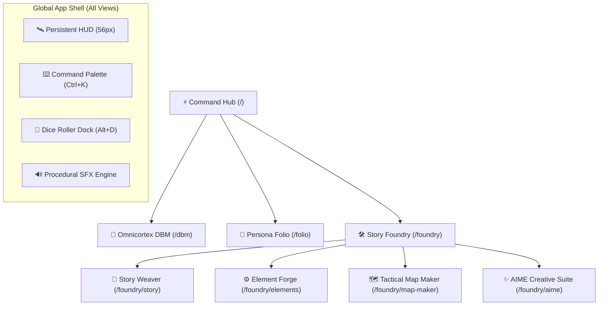

# 🌌 Tangent Science Fantasy Role Play (TANGENT SFF RP)

[](https://reactjs.org/)
[](https://vitejs.dev/)
[](https://tailwindcss.com/)
[](https://firebase.google.com/)
[]()

**TANGENT SFF RP** is an advanced, cyberpunk/science-fantasy Virtual Tabletop (VTT), character manager, rules codex, and narrative creation suite built for fast-paced tabletop roleplaying sessions.

---

## ⚡ Key Highlights & Global Ergonomics

- 🔍 **Spotlight Command Palette (`Ctrl+K`)**: Unified omni-search indexing compendium rules, species, hero roster sheets, scenarios, tactical maps, and executing instant `/roll 2d10+4` slash commands.
- 🎲 **Polyhedral Mathematical Dice Engine (`Alt+D`)**: Floating collapsible dice dock supporting complex dice notation (`2d10+4`, `d100`, `4d6kh3`, exploding dice, TN margins) with persistent roll history.
- 🔊 **Procedural Web Audio Engine**: Zero-dependency Web Audio API synthesizer providing real-time sci-fi tactile feedback, dice tumbling acoustics, and critical fanfares.
- 💾 **Hybrid Offline-First Persistence**: High-capacity IndexedDB storage engine combined with 1.5s debounced cloud synchronization to Firebase Firestore.
- 🖥️ **Persistent Global HUD**: Unified 56px top bar with dynamic breadcrumbs, user profile identity, mute controls, and quick-access tool triggers across all routes.

---

## 🧭 System Modules



### 1. ⚡ Command Center Hub (`/`)
- Dynamic operational dashboard with **Active Campaign Tracker**, **Party at a Glance** carousel, live telemetry badges, and the **Transmission Feed**.

### 2. 🧠 Omnicortex Compendium & DBM (`/dbm`)
- Searchable, relational codex containing rules, equipment, species traits, weapon statistics, and cybernetics with interactive item modals and wiki views.

### 3. 📜 Persona Folio (`/folio`)
- Point-buy Character Point (CP) economy engine, automated derived stats (Health, Vitality, Reflex, Defense), inventory gear manager, and printable character folios.

### 4. 🛠️ Story Foundry & Virtual Tabletop (`/foundry`)
- **Story Weaver (`/foundry/story`)**: Scenario and encounter builder with three-phase narrative drafting (Brainstorm, Outline, Draft) and AI Guidance Gems.
- **Element Forge (`/foundry/elements`)**: Custom worldbuilding asset creator for species, lore elements, and factions.
- **Tactical Map Maker (`/foundry/map-maker`)**: High-performance grid canvas (Square/Hex), fog-of-war, token summoning from Folio roster, and combat tracker.
- **AIME Creative Suite (`/foundry/aime`)**: Artificial Intellect Master Entity integration for guided scenario generation.

---

## ⌨️ Global Keyboard Shortcuts

| Shortcut | Action | Scope |
| :--- | :--- | :--- |
| <kbd>Ctrl</kbd> + <kbd>K</kbd> / <kbd>Cmd</kbd> + <kbd>K</kbd> | Toggle Omni-Search & Command Palette | Global |
| <kbd>Alt</kbd> + <kbd>D</kbd> | Toggle Floating Polyhedral Dice Roller Dock | Global |
| <kbd>Esc</kbd> | Close active modal, palette, or drawer | Global |
| <kbd>↑</kbd> / <kbd>↓</kbd> | Navigate items in Command Palette | In Command Palette |
| <kbd>Enter</kbd> | Execute selected action / jump to record | In Command Palette |

---

## 🛠️ Tech Stack & Architecture

- **UI Framework**: React 18 with Functional Components & React Hooks
- **Build System**: Vite with Hot Module Replacement (HMR)
- **Styling**: Tailwind CSS & centralized Design Tokens (`src/css/design-tokens.css`)
- **Icons**: Lucide React
- **Cloud Backend**: Google Firebase (Authentication & Cloud Firestore)
- **Client Cache**: IndexedDB via `StorageService` (`idb-keyval` async engine)
- **Audio Synthesizer**: Web Audio API (OscillatorNode / BiquadFilter / Gain envelope)

---

## 📑 13-Plan Architectural Roadmap

The project is structured around 13 modular technical implementation plans located in [`docs/plans/`](./docs/plans/):

| Phase | Plan | Description | Status |
| :---: | :--- | :--- | :---: |
| **Phase 1** | [Plan 01](./docs/plans/PLAN_01_FIRESTORE_WRITE_THROTTLING_AND_DEBOUNCING.md) | Firestore Write Throttling & 1.5s Debounce Saver | ✅ Ready |
| **Phase 1** | [Plan 02](./docs/plans/PLAN_02_CHUNKED_BATCH_WRITES_AND_SECURITY_RULES.md) | 450-Op Chunked Batch Writes & Security Rules | ✅ Ready |
| **Phase 1** | [Plan 03](./docs/plans/PLAN_03_DBM_STATE_ROLLBACK_AND_SCHEMA_VALIDATION.md) | DBM State Rollback & Runtime Schema Validation | ✅ Ready |
| **Phase 1** | [Plan 04](./docs/plans/PLAN_04_INDEXEDDB_STORAGE_ENGINE_AND_OFFLINE_CACHE.md) | IndexedDB Storage Engine (`StorageService`) | ✅ Ready |
| **Phase 1** | [Plan 05](./docs/plans/PLAN_05_CSS_DESIGN_TOKENS_AND_RESPONSIVE_NORMALIZATION.md) | Central CSS Design Tokens & Layout Normalization | ✅ Ready |
| **Phase 2** | [Plan 06](./docs/plans/PLAN_06_PERSISTENT_GLOBAL_HUD_AND_APP_SHELL.md) | Persistent 56px Global HUD & App Shell | ✅ Ready |
| **Phase 2** | [Plan 07](./docs/plans/PLAN_07_DYNAMIC_COMMAND_CENTER_HUB_AND_WIDGETS.md) | Dynamic Command Center Hub & Interactive Widgets | ✅ Ready |
| **Phase 2** | [Plan 08](./docs/plans/PLAN_08_GLOBAL_COMMAND_PALETTE_CTRL_K.md) | Global Command Palette (`Ctrl+K` Omni-Search) | ✅ Ready |
| **Phase 2** | [Plan 09](./docs/plans/PLAN_09_MATHEMATICAL_DICE_ENGINE_AND_ROLLER_DOCK.md) | Mathematical Polyhedral Dice Engine & Tray Dock | ✅ Ready |
| **Phase 2** | [Plan 10](./docs/plans/PLAN_10_PROCEDURAL_WEB_AUDIO_AND_SFX_SUITE.md) | Procedural Web Audio API Sound Effects Suite | ✅ Ready |
| **Phase 3** | [Plan 11](./docs/plans/PLAN_11_FOLIO_TO_MAP_TOKEN_SYNC_AND_COMBAT_TRACKER.md) | Folio-to-Map Token Synchronization & Combat Tracker | ✅ Complete |
| **Phase 3** | [Plan 12](./docs/plans/PLAN_12_OMNICORTEX_DBM_ITEM_IMPORTER_AND_EXPORTER.md) | Omnicortex DBM Item Importer & Exporter | ✅ Complete |
| **Phase 3** | [Plan 13](./docs/plans/PLAN_13_AIME_CONSOLIDATION_AND_PLAYER_SPECTATOR_VTT.md) | AIME Consolidation & Player Spectator VTT Screen | ✅ Complete |

---

## 🚀 Getting Started

### Prerequisites
- Node.js (v18.0 or higher recommended)
- npm or yarn

### Installation & Development Run

```bash
# 1. Navigate to the React project directory
cd "TANGENT SF RP react project"

# 2. Install dependencies
npm install

# 3. Launch Vite development server
npm run dev
```

The application will launch on `http://localhost:5173`.

