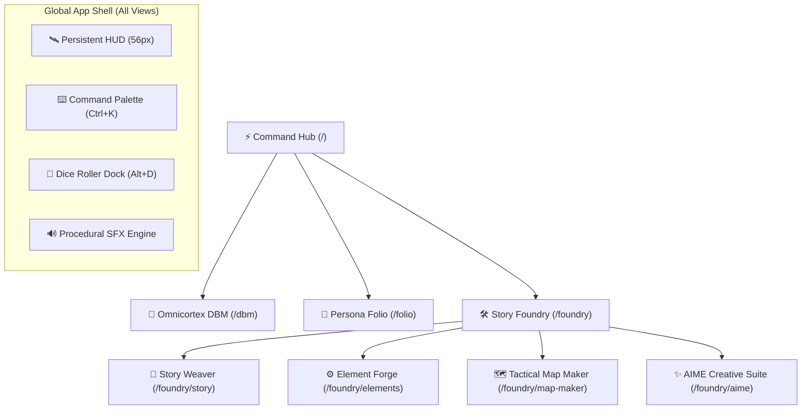

# 🌌 Tangent Science Fantasy Role Play (TANGENT SFF RP)

[](https://reactjs.org/)
[](https://vitejs.dev/)
[](https://tailwindcss.com/)
[](https://firebase.google.com/)
[]()

**TANGENT SFF RP** is an advanced, cyberpunk/science-fantasy Virtual Tabletop (VTT), character manager, rules codex, and narrative creation suite built for fast-paced tabletop roleplaying sessions.

---

## ⚡ Key Highlights & Global Ergonomics

- 🔍 **Spotlight Command Palette (`Ctrl+K`)**: Unified omni-search indexing compendium rules, species, hero roster sheets, scenarios, tactical maps, and executing instant `/roll 2d10+4` slash commands.
- 🎲 **Polyhedral Mathematical Dice Engine (`Alt+D`)**: Floating collapsible dice dock supporting complex dice notation (`2d10+4`, `d100`, `4d6kh3`, exploding dice, TN margins) with persistent roll history.
- 🔊 **Procedural Web Audio Engine**: Zero-dependency Web Audio API synthesizer providing real-time sci-fi tactile feedback, dice tumbling acoustics, and critical fanfares.
- 💾 **Hybrid Offline-First Persistence**: High-capacity IndexedDB storage engine combined with 1.5s debounced cloud synchronization to Firebase Firestore.
- 🖥️ **Persistent Global HUD**: Unified 56px top bar with dynamic breadcrumbs, user profile identity, mute controls, and quick-access tool triggers across all routes.

---

## 🧭 System Modules



### 1. ⚡ Command Center Hub (`/`)
- Dynamic operational dashboard with **Active Campaign Tracker**, **Party at a Glance** carousel, live telemetry badges, and the **Transmission Feed**.

### 2. 🧠 Omnicortex Compendium & DBM (`/dbm`)
- Searchable, relational codex containing rules, equipment, species traits, weapon statistics, and cybernetics with interactive item modals and wiki views.

### 3. 📜 Persona Folio (`/folio`)
- Point-buy Character Point (CP) economy engine, automated derived stats (Health, Vitality, Reflex, Defense), inventory gear manager, and printable character folios.

### 4. 🛠️ Story Foundry & Virtual Tabletop (`/foundry`)
- **Story Weaver (`/foundry/story`)**: Scenario and encounter builder with three-phase narrative drafting (Brainstorm, Outline, Draft) and AI Guidance Gems.
- **Element Forge (`/foundry/elements`)**: Custom worldbuilding asset creator for species, lore elements, and factions.
- **Tactical Map Maker (`/foundry/map-maker`)**: High-performance grid canvas (Square/Hex), fog-of-war, token summoning from Folio roster, and combat tracker.
- **AIME Creative Suite (`/foundry/aime`)**: Artificial Intellect Master Entity integration for guided scenario generation.

---

## ⌨️ Global Keyboard Shortcuts

| Shortcut | Action | Scope |
| :--- | :--- | :--- |
| <kbd>Ctrl</kbd> + <kbd>K</kbd> / <kbd>Cmd</kbd> + <kbd>K</kbd> | Toggle Omni-Search & Command Palette | Global |
| <kbd>Alt</kbd> + <kbd>D</kbd> | Toggle Floating Polyhedral Dice Roller Dock | Global |
| <kbd>Esc</kbd> | Close active modal, palette, or drawer | Global |
| <kbd>↑</kbd> / <kbd>↓</kbd> | Navigate items in Command Palette | In Command Palette |
| <kbd>Enter</kbd> | Execute selected action / jump to record | In Command Palette |

---

## 🛠️ Tech Stack & Architecture

- **UI Framework**: React 18 with Functional Components & React Hooks
- **Build System**: Vite with Hot Module Replacement (HMR)
- **Styling**: Tailwind CSS & centralized Design Tokens (`src/css/design-tokens.css`)
- **Icons**: Lucide React
- **Cloud Backend**: Google Firebase (Authentication & Cloud Firestore)
- **Client Cache**: IndexedDB via `StorageService` (`idb-keyval` async engine)
- **Audio Synthesizer**: Web Audio API (OscillatorNode / BiquadFilter / Gain envelope)

---

## 📑 Multi-Track Implementation Plans & Strategic Roadmap

The ongoing development roadmap is documented in [`IMPLEMENTATION_PLAN.md`](./IMPLEMENTATION_PLAN.md) and modular track specifications in [`docs/plans/`](./docs/plans/):

| Track | Plan Document | Scope & Focus | Status |
| :---: | :--- | :--- | :---: |
| **Track A** | [Option A: Battlemap VTT Canvas Play](./docs/plans/OPTION_A_BATTLEMAP_VTT_PLAY.md) | Interactive Destructible Objects, Hazmat Overlays, Autonomous Turn Resolver, Multi-Spectrum Sensor Vision | 🚀 Ready |
| **Track B** | [Option B: Security & Performance](./docs/plans/OPTION_B_SECURITY_AND_PERFORMANCE.md) | Firestore Rules Catch-All Patch, Secure API Key Routing, Gemini `systemInstruction`, Debounced Save Cascade | 🛡️ Ready |
| **Track C** | [Option C: AI Virtual GM & Social](./docs/plans/OPTION_C_AI_VIRTUAL_GM_AND_SOCIAL.md) | Live Combat Narration HUD, Dynamic Social Disposition Matrix, Tactical Radio Barks, Interrogation Engine | 🧠 Ready |
| **Track D** | [Option D: Architecture & Schemas](./docs/plans/OPTION_D_ARCHITECTURE_AND_SCHEMAS.md) | Context Decomposition, Unified Cross-Module Schemas, Shared UI Component Library, *Void Crash* Modules | 🏗️ Ready |

---

## 🚀 Getting Started

### Prerequisites
- Node.js (v18.0 or higher recommended)
- npm or yarn

### Installation & Development Run

```bash
# 1. Navigate to the React project directory
cd "TANGENT SF RP react project"

# 2. Install dependencies
npm install

# 3. Launch Vite development server
npm run dev
```

The application will launch on `http://localhost:5173`.

