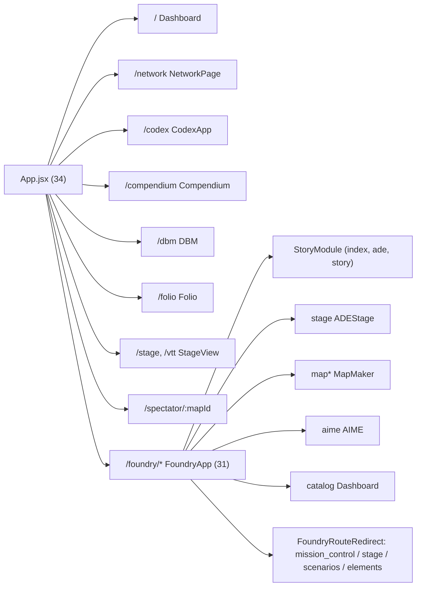

# Tangent SF RP — App Inspector Report

**Generated:** 2026-10-06 22:28 (-05:00)
**Toolset:** `app-inspector` (`get_runtime_diagnostics`, `inspect_routes`, `inspect_models_and_schemas`, `fetch_workspace_diff`)
**App root:** `D:\_ Data\Tangent SF RP\TANGENT SF RP react project`
**Commit:** `ab5b18b` on `main` (2 ahead of `origin/main`), **working tree dirty (15 files)**

> [!NOTE]
> The `app-inspector` MCP server wasn't registered in this agent session, so its four tool handlers were called directly by importing `toolHandlers` from [`scripts/mcp-app-inspector.mjs`](../scripts/mcp-app-inspector.mjs). That gives the same output the MCP calls would return. I checked the tool output against the source files and against test runs. Where the tools reported something wrong, it's listed in [§7](#7-findings--discrepancies).

---

## 1. Summary

| Area | Result | Notes |
| :--- | :--- | :--- |
| Runtime | Node `v24.18.0`, `win32 x64`, ESM | `tangent-sfr` v1.0.0 |
| Git | `main` @ `ab5b18b`, ahead 2, **dirty** | 15 modified, 0 staged, 0 untracked |
| Uncommitted diff | **+2,493 / −1,569** across 15 files | In-progress Folio identity refactor |
| Top-level routes (`App.jsx`) | **34** | 14 render components, 20 redirect |
| Foundry sub-routes (`FoundryApp.jsx`) | **31** | 11 render components, 20 redirect |
| Page modules (`src/pages/**`) | **189** | |
| Schema / model files detected | **22** | 2 canonical, 20 heuristic (several false positives, see §7) |
| Firestore rule blocks | **43 `match` paths** | 31 catalog collections + user/game/story/chat collections |
| Cloud Functions | **1** | `functions/index.js` |
| `npm test` → engine suite | ✅ **298 / 298** (16 suites, ~16 s) | `tests/engine/*.test.mjs` |
| `npm test` → data integrity | ✅ **32 / 32** | `scripts/validateDataIntegrity.mjs` |
| Co-located tests (**not in `npm test`**) | ⚠️ **48 / 49** | 1 failure in `tangentEntityEngines.test.js` |

---

## 2. Runtime Diagnostics (`get_runtime_diagnostics`)

- **App:** `tangent-sfr` v1.0.0, `"type": "module"`
- **Node:** `v24.18.0` on `win32 / x64`. Inspector process RSS 69.7 MB, heap 18.4 MB
- **Last commit:** `ab5b18b - feat(foundry): consolidate Stage compiler workspace and elevate Weaver narrative suite (2026-10-06 10:38:08 -0500)`

### 2.1 npm scripts
`dev`, `build`, `preview`, `deploy`, `sync:species`, `sync:species-traits`, `sync:species-disadvantages`, `build:data`, `test:data`, `test:engine`, `test`

### 2.2 Dependencies

| Layer | Packages |
| :--- | :--- |
| UI core | `react` ^19.2.7, `react-dom` ^19.2.7, `react-router-dom` ^7.18.1 |
| State / sync | `zustand` ^5.0.15, `immer` ^11.1.15, `yjs` ^13.6.32 |
| Validation / content | `zod` ^4.4.3, `gray-matter` ^4.0.3, `marked` ^18.0.9, `react-markdown` ^10.1.0, `remark-gfm` ^4.0.1, `dompurify` ^3.4.13 |
| Canvas / 3D | `pixi.js` ^8.20.1, `konva` ^10.3.0, `react-konva` ^19.2.5, `three` ^0.185.1, `@types/three` ^0.185.4 |
| Backend / realtime | `firebase` ^12.16.0, `livekit-client` ^2.22.2 |
| Embedded DB | `@sqlite.org/sqlite-wasm` ^3.53.0-build1 |
| AI / tooling | `@google/genai` ^2.25.0, `@modelcontextprotocol/sdk` ^1.31.0 |
| UI widgets | `lucide-react` ^1.31.0, `react-quill-new` ^3.8.3, `react-split` ^2.0.14 |
| Misc | `glob` ^13.0.6, `uuid` ^14.0.1 |

**Dev:** `vite` ^8.1.1, `@vitejs/plugin-react` ^6.0.3, `tailwindcss` / `@tailwindcss/vite` ^4.3.3, `typescript` ~6.0.2, `@types/react-dom` ^19.2.5, `firebase-admin` ^14.2.0, `vite-plugin-pwa` ^1.3.0, `workbox-*` ^7.4.1

> [!TIP]
> `@types/three` and `@modelcontextprotocol/sdk` are listed under runtime `dependencies`. `@types/three` is type-only, and the MCP SDK is only used by `scripts/`. Moving both to `devDependencies` would make that clearer. Bundle size shouldn't change, because Vite only bundles what the app imports.

---

## 3. Route Topology (`inspect_routes`)

> [!WARNING]
> `inspect_routes` returned `"element": "unspecified"` for all 65 routes because of a regex bug (see §7.1). The element column below comes from reading [`src/App.jsx`](../src/App.jsx#L130-L162) and [`FoundryApp.jsx`](../src/pages/Foundry/FoundryApp.jsx#L50-L80) directly.

### 3.1 Top-level routes — `src/App.jsx` (L130–162)

| Path | Element | Kind |
| :--- | :--- | :--- |
| `/` | `<Dashboard />` | component |
| `/dashboard` | `SearchPreservingRedirect → /` | redirect |
| `/network`, `/network/*` | `<NetworkPage />` | component |
| `/comms`, `/chat` | `NetworkRedirect defaultView="comms"` | redirect |
| `/teams`, `/groups`, `/squads` | `NetworkRedirect defaultView="teams"` | redirect |
| `/codex`, `/codex/*` | `<CodexApp />` | component |
| `/compendium`, `/compendium/*` | `<Compendium />` | component |
| `/rules`, `/rules/*` | `SearchPreservingRedirect → /compendium` | redirect |
| `/dbm` | `<DBM />` | component |
| `/folio` | `<Folio />` | component |
| `/roster` | `SearchPreservingRedirect → /folio` | redirect |
| `/live-studio`, `/ade-stage` | `SearchPreservingRedirect → /foundry/live` | redirect (2 hops, see §7.5) |
| `/map-maker`, `/mapmaker` | `SearchPreservingRedirect → /foundry/map` | redirect |
| `/vtt-ops` | `<VttOpsRedirect />` | redirect |
| `/stage` | `<StageView defaultRole="architect" />` | component |
| `/vtt` | `<StageView defaultRole="operative" />` | component |
| `/spectator/:mapId` | `<PlayerSpectatorView />` | component |
| `/foundry/*` | `<FoundryApp />` | component (nested router) |
| `/ade`, `/ade/*`, `/ade-studio`, `/ade-studio/*`, `/story-foundry`, `/campaign-builder` | `SearchPreservingRedirect → /foundry` | redirect |

### 3.2 Foundry sub-routes — `src/pages/Foundry/FoundryApp.jsx` (L50–80)

| Sub-path (`/foundry/…`) | Element / target |
| :--- | :--- |
| `/` (index), `ade`, `story` | `<StoryModule />` |
| `stage` | `<ADEStage />` |
| `catalog` | `<Dashboard />` |
| `map`, `map-maker`, `map-maker-legacy` | `<MapMaker />` |
| `aime` | `<AIME />` |
| `view/:mapId`, `spectator/:mapId` | `<PlayerSpectatorView />` |
| `mission-control`, `dashboard`, `hub` | `FoundryRouteRedirect view="mission_control"` |
| `live`, `live-studio`, `ade-stage` | `FoundryRouteRedirect view="stage" tab="run"` |
| `live-studio-standalone` | `SearchPreservingRedirect → /foundry/live` |
| `scripts`, `presets`, `automation` | `FoundryRouteRedirect view="stage" tab="scripts"` |
| `tactical`, `control-panel` | `FoundryRouteRedirect view="stage" tab="encounters"` |
| `interactive` | `FoundryRouteRedirect view="scenarios" tab="play"` |
| `gems` | `FoundryRouteRedirect view="scenarios" tab="gems"` |
| `narrative` | `FoundryRouteRedirect view="scenarios" tab="write"` |
| `graph` | `FoundryRouteRedirect view="scenarios" tab="graph"` |
| `assets`, `elements`, `gallery` | `FoundryRouteRedirect view="elements"` |
| `vtt-options` | `<VttOptionsRedirect />` |

### 3.3 Page modules (189)

| Area | Files | Highlights |
| :--- | ---: | :--- |
| `pages/Codex` | 39 | `CodexApp`, ingestion engine/modal, matrix builder, 22 configurator components, studio workflows |
| `pages/Foundry/MapMaker` | 52 | `MapMaker`, `PlayerSpectatorView`, `VttOptionsPage`, 46 `map/*` modals/panels/nodes, 2 hooks |
| `pages/Foundry/StoryModule` | 43 | `StoryModule`, ADE nav/toolbar, panels, toolbar, workspaces (Weaver, Graph ×9, Interactive Studio, Gallery) |
| `pages/Foundry/PresetsAndScripts` | 11 | 5 workbenches, macro sandbox, constants, aggregator |
| `pages/Foundry/Stage` | 11 | `StageWorkspace`, 7 tabs, `stageStore.ts`, `stageTypes.ts`, `vttModuleCompilerService.js` |
| `pages/Foundry/ElementForge` | 10 | `ElementForge`, `elementSchemas.js`, modals, asset hub, character assembler, NPC script builder |
| `pages/Foundry/Weaver` | 5 | `WeaverWorkspace` + 4 tabs |
| `pages/Foundry` (other) | 9 | `FoundryApp`, `AIME` ×2, `Dashboard` ×3, `assetContracts.js`, `useWaypointEngine.js`, `store/adeStore.ts` |
| `pages/Compendium` + root pages | 9 | `CompendiumApp`, `OmnicortexCatalogView`, `Home`, `NetworkPage`, `CommsPage`, `TeamsPage`, `DBM`, `Folio`, `Compendium` |

### 3.4 Detected route/controller files and backend
- `src/constants/routes.js`: route constants
- `src/services/aimeTierRouter.ts`: AIME model-tier router
- `src/components/VTT/hooks/useCombatController.ts`, `useDesignModeController.ts`
- `functions/index.js`: the only Cloud Functions entry point
- *False positives:* `useMapIngestion.ts`, `data/omnicortex/weaponry/rapier.md`, `data/omnicortex/traits/trait-rapid-response.md` (matched because their names contain "api", see §7.3)

---

## 4. Data Models & Schemas (`inspect_models_and_schemas`)

### 4.1 Canonical: `elementSchemas.js` (33,544 B)
[`src/pages/Foundry/ElementForge/elementSchemas.js`](../src/pages/Foundry/ElementForge/elementSchemas.js)

**Exports:** `AIME_CORE_MODULES`, `AIME_CORE_ELEMENT_TYPES`, `ELEMENT_TYPES`, `getElementFileExtension`, `getTypePillStyle`, `LOREBOOK_TRIGGER_SCHEMA_FIELDS`, `CUSTOM_ELEMENT_SCHEMA`, `ELEMENT_SCHEMAS`, `SCENARIO_GUIDE_MODULES`

**The 7 core AIME modules:**

| Module | Canonical | Ext |
| :--- | :--- | :--- |
| 🌍 World Anvil | World | `.world` |
| 👤 Persona Maker | Persona | `.persona` |
| 🏛️ Setting Architect | Setting | `.setting` |
| 🧬 Species Creator | Species | `.species` |
| ⚙️ Technology Forge | Technology | `.tech` |
| 📜 Philosophy Scribe | Philosophy | `.philosophy` |
| 🎬 Scene Builder | Scene | `.scene` |

**`ELEMENT_TYPES` (23):** the 7 module titles, their 7 single-word aliases, plus `Story Arc`, `Adventure`, `Faction`, `Encounter`, `Item`, `Clue`, `Handout`, `Custom`, `Universe`.

**`ELEMENT_SCHEMAS` keys (26):** the 14 module/alias keys, `Custom Codex` / `Custom` / `Custom Element` (all → `CUSTOM_ELEMENT_SCHEMA`), `Story Arc`, `Adventure`, `Faction`, `Encounter`, `Item`, `Clue`, **`Map`**, `Handout`, `Universe`.

**Relational fields:** `Story Arc.linkedFaction` and `Faction.dbmFactionRef` both point at `dbSource: 'factions'`. A matching rule exists at `firestore.rules` L35 ✅.
**Lorebook triggers:** `LOREBOOK_TRIGGER_SCHEMA_FIELDS` is spread into Custom, Scene, Faction, Encounter, and Item.

### 4.2 Canonical: `firestore.rules` (11,540 B)
- **Catalog collections (L23–143, 31 blocks):** `compendium`, `species`, `origins`, `factions`, `equipment`, `cybernetics`, `psionics`, `disciplines`, `skills`, `features`, `traits`, `flaws`, `attributes`, `prerequisite`, `species_type`, `species_size`, `species_movement`, `trait`, `modifier`, `societies`, `gear_category`, `vehicles`, `gear`, `rules`, `disadvantages`, `occupations`, `invocations`, `synthesis`, `maneuvers`, `conditions`, `damage_types`
- **User / social:** `users/{userId}`, `users/{userId}/personas/{personaId}`, collection-group `{path=**}/personas`, `game_groups`, `group_invites`, `channels/{channelId}` (+ nested `messages`)
- **Content:** `characters`, `user_stories`, `story_elements`, `story_maps`, `universe/{document=**}`
- **Catch-all:** `/{document=**}` at L280

### 4.3 Other detected schema/model files

| File | Size | Role |
| :--- | ---: | :--- |
| `src/components/Folio/schema.js` | 14,060 | Folio character sheet schema |
| `src/schemas/sharedSchemas.js` | 15,879 | Shared entity envelopes |
| `src/schemas/vttWallSchema.js` (+ `.test.mjs`) | 6,082 | VTT wall/portal geometry |
| `src/pages/Foundry/Stage/stageTypes.ts` | 2,731 | Stage TS types |
| `src/engines/tangentEntityEngines.js` | 123,247 | Entity rules engine |
| `src/engines/tangentIdentityEngine.js` | 56,141 | Identity transitions (**modified**) |
| `src/services/entityHydrator.js` | 8,906 | Entity hydration |
| `src/utils/tangentSchemaAdapters.js` | 19,133 | Legacy ↔ current adapters |
| `src/engine/migration/tangentSchemaAdapters.js` | 4,892 | Migration adapters (**same filename as the utils version above**) |
| `src/engine/migration/migrate_omnicortex_schema.mjs` | 4,821 | Omnicortex migration |
| `src/data/speciesTraitsData.js` | 682,353 | Species trait dataset |
| `src/data/archetypesData.js` | 173,722 | Archetype dataset |
| `src/data/speciesTypesData.js` / `speciesTypesRaw.json` | 13,786 / 18,406 | Species taxonomy |
| *False positives:* `IdentityTab.jsx` (215 KB), `IdentityPoolPulldown.jsx` (96 KB), `FolioIdentityContext.jsx` | | Matched because "Id**entity**" contains "entity" |

---

## 5. Active Workspace Changes (`fetch_workspace_diff`)

**Staged:** none. **Untracked:** none. **Unstaged:** 15 files, +2,493 / −1,569.

| File | + | − |
| :--- | ---: | ---: |
| `src/components/Folio/tabs/IdentityTab.jsx` | 1,542 | 942 |
| `src/components/Folio/tabs/CoreStatsTab.jsx` | 323 | 297 |
| `docs/APP_INSPECTOR_STATE_REPORT.md` | 329 | 172 |
| `src/engines/tangentIdentityEngine.js` | 81 | 9 |
| `app_state_manifest.json` | 47 | 14 |
| `src/components/Folio/tabs/SkillsTab.jsx` | 41 | 45 |
| `src/components/Folio/views/PropertyHubView.jsx` | 38 | 34 |
| `src/components/Folio/views/FeaturesHubView.jsx` | 37 | 35 |
| `src/engines/__tests__/tangentIdentityEngine.test.js` | 18 | 2 |
| `src/components/Folio/shared/IdentityPoolPulldown.jsx` | 13 | 3 |
| `src/context/folio/FolioIdentityContext.jsx` | 13 | 1 |
| `app_state_summary.md` | 7 | 11 |
| `src/components/Folio/FolioSidebar.jsx` | 2 | 2 |
| `src/components/Folio/FolioContainer.jsx` | 1 | 1 |
| `src/components/Folio/tabs/FeaturesTab.jsx` | 1 | 1 |

### 5.1 What the in-progress refactor does
1. **Secondary identity cascade** ([`tangentIdentityEngine.js`](../src/engines/tangentIdentityEngine.js)):
   - When the primary occupation is cleared, `applyOccupationTransition` now also clears `char-secondary-occu` and its legacy aliases (`char-background-occu`, `char-occu-secondary`). It also reverts the secondary occupation's traits.
   - `applyOriginTransition` does the same for origins: it clears `char-secondary-origin` / `char-origin-secondary` and reverts the secondary origin's traits and features.
   - If the new primary value equals the current secondary, the secondary is cleared to avoid duplicates.
2. **Wider species inherent pool:** `applySpeciesTransition` now merges `inherent_features`, `inherent_traits`, `species_traits`, and `traits` when it grants inherent features. Before, it only read `inherent_features`.
3. **Event guard** in [`FolioIdentityContext.jsx`](../src/context/folio/FolioIdentityContext.jsx): before using `overrideData` as character data, it now checks whether it's a React synthetic event (`preventDefault`, `nativeEvent`, `_reactName`, …). This fixes handlers passed directly as `onClick`.
4. **Tests:** two new assertions cover the primary→secondary removal cascade for occupations and origins. Both pass.
5. **UI:** a large rework of `IdentityTab.jsx` (+1.5k / −0.9k), plus `CoreStatsTab.jsx` and the Features and Property hub views.

---

## 6. Verification Runs

| Suite | Command | Result |
| :--- | :--- | :--- |
| Engine | `node --test tests/engine/*.test.mjs` | ✅ 298 / 298 (16 suites, 15.98 s) |
| Data integrity | `node scripts/validateDataIntegrity.mjs` | ✅ 32 / 32 (Archetype → Essential Skills 389/390, 99.7%) |
| Identity engine (co-located) | `node --test src/engines/__tests__/tangentIdentityEngine.test.js` | ✅ 12 / 12 |
| Entity engines (co-located) | `node --test src/engines/__tests__/tangentEntityEngines.test.js` | ❌ **35 / 36** |
| VTT wall schema (co-located) | `node --test src/schemas/vttWallSchema.test.mjs` | ✅ 1 / 1 |

**Failure:** [`tangentEntityEngines.test.js:436`](../src/engines/__tests__/tangentEntityEngines.test.js#L431-L441), `getSpeciesComponentDataset().basicTraits.length` expected `42`, actual **`45`**. None of the uncommitted files touch species trait data, so this failure already exists at `HEAD`. Most likely the dataset grew and the hard-coded count wasn't updated.

---

## 7. Findings & Discrepancies

### 7.1 `inspect_routes`: element parsing is broken (inspector bug)
The tag regex `/<Route\b([^>]+)\/?>/g` stops at the first `>`, which is inside `element={<Foo />}`. As a result, `elementMatch` never matches and every route reports `"unspecified"`. **Fix:** match the element separately, e.g. `/element=\{\s*<\s*([A-Za-z0-9_.]+)([^}]*)\}/`, or parse with a JSX-aware tokenizer.

### 7.2 `fetch_workspace_diff`: staged mode returns unstaged stats (inspector bug)
With `stagedOnly: true` and no `statOnly`, the handler still fills `diffStat` from `git diff --stat`, which is the **unstaged** diff. That's why a "staged" call with nothing staged still showed 15 changed files. **Fix:** use `git diff --cached --stat` when `isStaged`.

### 7.3 Heuristic false positives (inspector quality)
- Route-file scan: plain substring checks for `api` / `route` match `useMapIngestion`, `rapier.md`, and `trait-rapid-response.md`. Restricting to code extensions and word boundaries would fix this.
- Schema scan: `entity` matches every `*Identity*` file, and `types` matches `archetypesData.js`. About 4 of the 20 heuristic hits are noise.

### 7.4 Element schema/type registry drift
- `ELEMENT_SCHEMAS['Map']` exists, but `'Map'` is **not** in `ELEMENT_TYPES`, so the forge type picker can't select it.
- `'Custom Codex'` and `'Custom Element'` are schema keys without `ELEMENT_TYPES` entries. They're probably only aliases, but worth confirming.
- `getElementFileExtension` returns the generic `.element` for Story Arc, Adventure, Faction, Encounter, Item, Clue, Handout, Universe, and Map. That's fine if intended. If those should round-trip as typed portable assets, they need their own extensions.

### 7.5 Route topology notes
- **Double redirects:** `/live-studio`, `/ade-stage`, and `/foundry/live-studio-standalone` → `/foundry/live` → `FoundryRouteRedirect(stage, run)`. Pointing them straight at the final URL would save a render cycle.
- `/foundry/map-maker-legacy` renders the same `<MapMaker />` as `map`, so "legacy" is now just an alias.
- The spectator view is reachable from three paths: `/spectator/:mapId`, `/foundry/view/:mapId`, and `/foundry/spectator/:mapId`.
- 40 of the 65 routes are redirects or aliases. A route-normalization table in `src/constants/routes.js` would keep that manageable, and the engine suite already tests route normalization.

### 7.6 Test coverage gap
`npm test` only runs `tests/engine/*.test.mjs` plus the data validator. The co-located suites in `src/engines/__tests__/` and `src/schemas/*.test.mjs` (**49 tests**) **aren't wired into `npm test`**. That's how the `basicTraits` failure in §6 went unnoticed, and it also means the new identity-cascade tests won't run in CI. **Fix:** add these globs to `test:engine`, or move the files under `tests/engine/`.

### 7.7 Uncommitted engine change: minor data-shape issue
In `applyIdentityFieldTransition`, clearing `char-secondary-occu` / `char-secondary-origin` always writes `char-background-occu`, `char-occu-secondary`, and `char-origin-secondary` as `''`, even when those keys weren't there before. `applyOccupationTransition` and `applyOriginTransition` guard the same writes with `'key' in updated`. Using the same guard here would avoid adding legacy keys to new characters.

### 7.8 Duplicate module name
There are two `tangentSchemaAdapters.js` files, in `src/utils/` (19 KB) and `src/engine/migration/` (5 KB). It's easy to import the wrong one. Consider renaming the migration copy.

### 7.9 Repo hygiene
- Git warns about LF→CRLF conversion on 11 of the modified files. A `.gitattributes` (`* text=auto eol=lf`) would stop line endings from showing up as changes.
- `main` is 2 commits ahead of `origin/main` (`965b11f`, `ab5b18b`), so those commits aren't pushed yet.
- The existing [`APP_INSPECTOR_STATE_REPORT.md`](./APP_INSPECTOR_STATE_REPORT.md) is out of date. It reports a clean tree, 35 engine tests, 30 Foundry routes, and a 52,594 B identity engine. Current values are 15 dirty files, 298 tests, 31 routes, and 56,141 B.

### 7.10 Tooling setup
- The workspace `.agents/mcp_config.json` starts `node scripts/mcp-app-inspector.mjs` with `APP_ROOT="."`, which only works if the MCP host's working directory is the repo root. Using an absolute `APP_ROOT`, or resolving it relative to the script, would make the setup robust.
- On this machine, running the inspector inside the agent sandbox fails: Node's ESM resolver does `lstat 'd:\'` and gets `EPERM`. The inspector has to run unsandboxed.

---

## 8. Recommended Actions (priority order)

1. Wire `src/**/__tests__/*.test.js` and `src/**/*.test.mjs` into `npm test`, then fix the `basicTraits` 42 → 45 assertion (§6, §7.6).
2. Fix the inspector bugs in `inspect_routes` (element regex) and `fetch_workspace_diff` (staged stat) (§7.1, §7.2).
3. Before committing the Folio identity refactor, add the `in` guards to `applyIdentityFieldTransition` (§7.7).
4. Reconcile `ELEMENT_TYPES` with `ELEMENT_SCHEMAS` (`Map`, custom aliases) (§7.4).
5. Collapse the double-hop redirects and retire the `map-maker-legacy` alias (§7.5).
6. Add `.gitattributes`, push the 2 local commits, and regenerate or retire the stale state report (§7.9).

---

*Raw tool output (JSON) from this run is in the agent scratch directory: `get_runtime_diagnostics.json`, `inspect_routes.json`, `inspect_models_and_schemas.json`, `fetch_workspace_diff*.json`.*
