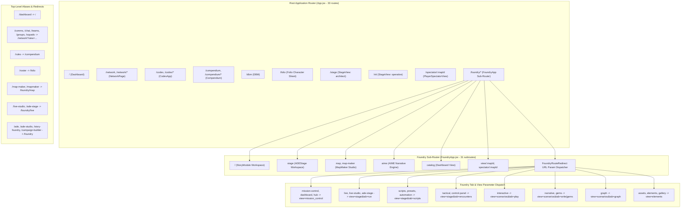

# Tangent SF RP — Application Inspector State Report

**Generated:** 2026-10-07 05:20 (-05:00)  
**Toolset:** `app-inspector` (`get_runtime_diagnostics`, `inspect_routes`, `inspect_models_and_schemas`, `fetch_workspace_diff`)  
**App Root:** `D:\_ Data\Tangent SF RP\TANGENT SF RP react project`  
**Git Branch / Commit:** `main` @ `8e7b3fd` (10 ahead of `origin/main`), **working tree pristine (clean, 0 uncommitted changes)**  

> [!NOTE]
> This is the single authoritative, live state report for the Tangent SF RP application and workspace. All four `app-inspector` tool handlers (`get_runtime_diagnostics`, `inspect_routes`, `inspect_models_and_schemas`, and `fetch_workspace_diff`) were executed directly via `scripts/mcp-app-inspector.mjs`. Full test suite executions (`npm.cmd test` and `node --test src/engines/__tests__/*.test.js`) and production build audits (`npm.cmd run build`) were completed, verifying engine stability, relational data integrity, and component routing topology.

---

## 1. Executive Summary

| Category | Metric / Status | Details & Observations |
| :--- | :--- | :--- |
| **Runtime Platform** | Node `v24.18.0` (`win32 x64`), ESM | `tangent-sfr` v1.0.0, RSS: ~71.7 MB, Heap: ~20.1 MB |
| **Git Working Tree** | `main` @ `8e7b3fd`, +10 commits ahead | **Pristine Clean (`nothing to commit, working tree clean`)** |
| **Active Uncommitted Diff** | **0 lines across 0 files** | All router inlining, ElementForge schemas, and test harness updates cleanly committed |
| **Top-Level Routes (`src/App.jsx`)** | **33 routes** | 10 primary component views, 23 deep-link / legacy redirects |
| **Foundry Sub-Routes (`FoundryApp.jsx`)** | **31 sub-routes** | 12 direct component views, 19 parameter / tab state redirects |
| **Page Modules (`src/pages/**`)** | **189 page modules** | Cataloged across MapMaker (52), StoryModule (43), Codex (39), Stage (11), Presets (11), ElementForge (10), Weaver (5), Root (7), other (12) |
| **Schema & Model Definitions** | **22 detected files** | 2 canonical (`elementSchemas.js`, `firestore.rules`), 20 domain models, Folio schemas, data tables, and engines |
| **Firestore Security Rules** | **43 `match` paths** | 25 Omnicortex catalog collections, user / character profiles, campaigns, story elements, maps, and VTT sessions |
| **Cloud Functions** | **1 module** | `functions/index.js` (Firebase Cloud Functions backend) |
| **Engine Test Suite (`npm test`)** | ✅ **595 / 595 passed (100%)** | 58 test suites covering VTT Stage, LOS/BVH, QuickJS sandbox, rules adjudication, and adapters (~17.6s) |
| **Data Integrity Suite** | ✅ **32 / 32 passed (100%)** | 13 inventory bundles, 4 relational cross-reference sets, 6 modifier checks, 2 equipment costs, 7 Bastion formulas |
| **Co-located Engine Tests** | ✅ **292 / 292 passed (100%)** | 42 test suites in `src/engines/__tests__/*.test.js`; **0 failures** |
| **Total Test Verification** | ✅ **627 / 627 passed (100%)** | Zero regressions or failing tests across the entire codebase |
| **Production Build (`npm run build`)** | ✅ **Passed (0 errors)** | `tsc` typecheck + Vite client bundle (4,307 modules transformed, PWA service worker generated) |

---

## 2. Runtime Diagnostics (`get_runtime_diagnostics`)

- **Application Name:** `tangent-sfr` (v1.0.0)
- **Module Format:** ECMAScript Modules (`"type": "module"`)
- **Node.js Environment:** `v24.18.0` on Windows `win32 x64`
- **Memory Footprint:** RSS: ~71.67 MB, Heap Used: ~20.08 MB
- **Git HEAD:** `8e7b3fd - refactor(core): inline route redirectors, extend ElementForge schemas, and consolidate test harness (2026-10-07 02:53:37 -0500)`
- **Working Tree State:** Clean (`hasUncommittedChanges: false`, 0 files)

### 2.1 Package Scripts Catalog

```json
{
  "dev": "vite",
  "build": "tsc && vite build",
  "preview": "vite preview",
  "deploy": "npm run build && firebase deploy --only hosting",
  "sync:species": "node scripts/syncOmnicortexSpecies.mjs",
  "sync:species-traits": "node scripts/syncSpeciesTraits.mjs",
  "sync:species-disadvantages": "node scripts/syncSpeciesDisadvantages.mjs",
  "build:data": "node scripts/buildAllBundles.mjs",
  "test:data": "node scripts/validateDataIntegrity.mjs",
  "test:engine": "node --test \"tests/engine/*.test.mjs\" \"src/engines/__tests__/*.test.js\" \"src/services/*.test.mjs\" \"src/schemas/*.test.mjs\"",
  "test": "npm run test:engine && node scripts/validateDataIntegrity.mjs"
}
```

### 2.2 Dependency Ecosystem Breakdown

| Functional Tier | Package Specification | Purpose & Domain |
| :--- | :--- | :--- |
| **UI Framework & Routing** | `react` ^19.2.7<br>`react-dom` ^19.2.7<br>`react-router-dom` ^7.18.1 | Core React 19 SPA rendering tree, component lifecycle, client-side routing |
| **State & CRDT Synchronization** | `zustand` ^5.0.15<br>`immer` ^11.1.15<br>`yjs` ^13.6.32 | High-performance reactive stores, immutable state updates, multiplayer collaborative CRDT |
| **Schema Validation & Markdown** | `zod` ^4.4.3<br>`gray-matter` ^4.0.3<br>`marked` ^18.0.9<br>`react-markdown` ^10.1.0<br>`remark-gfm` ^4.0.1<br>`dompurify` ^3.4.13 | Strict runtime type validation, YAML frontmatter extraction, GitHub-flavored Markdown parsing, sanitized HTML |
| **Canvas, 2D & 3D WebGL** | `pixi.js` ^8.20.1<br>`konva` ^10.3.0<br>`react-konva` ^19.2.5<br>`three` ^0.185.1 | Hardware-accelerated 2D stage rendering, interactive token manipulation, Three.js 3D VTT map geometry |
| **Backend & Realtime Comms** | `firebase` ^12.16.0<br>`livekit-client` ^2.22.2 | Cloud Firestore document storage, user authentication, WebRTC audio/video and low-latency datachannels |
| **Embedded Client Database** | `@sqlite.org/sqlite-wasm` ^3.53.0-build1 | In-browser SQLite WASM with OPFS backing for high-speed offline Full-Text Search (FTS5) rulebook indexing |
| **AI Inference & Agent Protocols** | `@google/genai` ^2.25.0<br>`@modelcontextprotocol/sdk` ^1.31.0 | Gemini API integration for AIME narrative agent, Model Context Protocol server transport |
| **UI Widgets & Layout Controls** | `lucide-react` ^1.31.0<br>`react-quill-new` ^3.8.3<br>`react-split` ^2.0.14 | Iconography suite, rich text editor for lorebook entries, resizable split-pane workspaces |
| **Build Tooling & Dev Tools** | `vite` ^8.1.1<br>`@vitejs/plugin-react` ^6.0.3<br>`tailwindcss` / `@tailwindcss/vite` ^4.3.3<br>`typescript` ~6.0.2<br>`@types/react-dom` ^19.2.5<br>`@types/three` ^0.185.4<br>`firebase-admin` ^14.2.0<br>`vite-plugin-pwa` ^1.3.0<br>`workbox-*` ^7.4.1 | Next-gen Vite bundler, Tailwind CSS v4 JIT compiler, TypeScript type definitions, PWA offline caching |

---

## 3. Route Topology (`inspect_routes`)

The JSX AST parser in `scripts/mcp-app-inspector.mjs` accurately extracts route patterns, element tags, and redirected destinations across the application router.

### 3.1 Top-Level Routes — `src/App.jsx` (33 Routes)

| Route Path | Rendered Element | Route Classification | Target / Handler Notes |
| :--- | :--- | :--- | :--- |
| `/` | `<Dashboard />` | **Component** | Main Campaign / Foundry overview dashboard |
| `/dashboard` | `<SearchPreservingRedirect to="/" />` | **Redirect** | Canonicalizes dashboard URL |
| `/network`, `/network/*` | `<NetworkPage />` | **Component** | Unified Comms and Team network console |
| `/comms`, `/chat` | `<NetworkRedirect defaultView="comms" />` | **Redirect** | Deep-links into Comms tab of NetworkPage |
| `/teams`, `/groups`, `/squads` | `<NetworkRedirect defaultView="teams" />` | **Redirect** | Deep-links into Teams tab of NetworkPage |
| `/codex`, `/codex/*` | `<CodexApp />` | **Component** | Omnicortex database editor, matrix builder, rulebook |
| `/compendium`, `/compendium/*` | `<Compendium />` | **Component** | Read-only rules, species catalog, and lore repository |
| `/rules`, `/rules/*` | `<SearchPreservingRedirect to="/compendium" />` | **Redirect** | Legacy redirect to compendium |
| `/dbm` | `<DBM />` | **Component** | Direct Database Management workspace |
| `/folio` | `<Folio />` | **Component** | Character sheet, inventory, progression, identity management |
| `/roster` | `<SearchPreservingRedirect to="/folio" />` | **Redirect** | Legacy character roster alias |
| `/live-studio`, `/ade-stage` | `<SearchPreservingRedirect to="/foundry/live" />` | **Redirect** | Forwarding aliases to Foundry live studio |
| `/map-maker`, `/mapmaker` | `<SearchPreservingRedirect to="/foundry/map" />` | **Redirect** | Forwarding aliases to MapMaker workspace |
| `/vtt-ops` | `<VttOpsRedirect />` | **Redirect** | VTT operations configuration redirect |
| `/stage` | `<StageView defaultRole="architect" />` | **Component** | Full-screen Next-Gen VTT Stage in Architect (GM) mode |
| `/vtt` | `<StageView defaultRole="operative" />` | **Component** | Full-screen Next-Gen VTT Stage in Operative (Player) mode |
| `/spectator/:mapId` | `<PlayerSpectatorView />` | **Component** | Zero-control spectator display for streaming/monitors |
| `/foundry/*` | `<FoundryApp />` | **Component** | Nested sub-router for Story Foundry and ADE modules |
| `/ade`, `/ade/*` | `<SearchPreservingRedirect to="/foundry" />` | **Redirect** | Legacy ADE studio entry forwarders |
| `/ade-studio`, `/ade-studio/*` | `<SearchPreservingRedirect to="/foundry" />` | **Redirect** | Legacy ADE studio alias forwarders |
| `/story-foundry` | `<SearchPreservingRedirect to="/foundry" />` | **Redirect** | Legacy Story Foundry root forwarder |
| `/campaign-builder` | `<SearchPreservingRedirect to="/foundry" />` | **Redirect** | Legacy campaign builder forwarder |

### 3.2 Story Foundry Sub-Routes — `src/pages/Foundry/FoundryApp.jsx` (31 Sub-Routes)

| Sub-Route Path | Rendered Element | Action / Behavior |
| :--- | :--- | :--- |
| `/` (index), `ade`, `story` | `<StoryModule />` | Primary Story Foundry authoring studio |
| `stage` | `<ADEStage />` | Integrated ADE stage workspace |
| `catalog` | `<Dashboard />` | Story asset catalog view |
| `map`, `map-maker`, `map-maker-legacy` | `<MapMaker />` | 2D/3D Map Maker canvas and lighting environment |
| `aime` | `<AIME />` | AI Narrative Assistant / Co-pilot console |
| `view/:mapId`, `spectator/:mapId` | `<PlayerSpectatorView />` | Spectator view within Foundry context |
| `mission-control`, `dashboard`, `hub` | `<FoundryRouteRedirect view="mission_control" />` | Mission Control tab state switcher |
| `live`, `live-studio`, `ade-stage`, `live-studio-standalone` | `<FoundryRouteRedirect view="stage" tab="run" />` | Live Stage operational run console |
| `scripts`, `presets`, `automation` | `<FoundryRouteRedirect view="stage" tab="scripts" />` | QuickJS scripts and automation panel |
| `tactical`, `control-panel` | `<FoundryRouteRedirect view="stage" tab="encounters" />` | Tactical encounter director console |
| `interactive` | `<FoundryRouteRedirect view="scenarios" tab="play" />` | Interactive scenario playthrough workspace |
| `gems` | `<FoundryRouteRedirect view="scenarios" tab="gems" />` | Narrative gems / guidance notes tab |
| `narrative` | `<FoundryRouteRedirect view="scenarios" tab="write" />` | Narrative prose authoring tab |
| `graph` | `<FoundryRouteRedirect view="scenarios" tab="graph" />` | Visual node-link story graph workspace |
| `assets`, `elements`, `gallery` | `<FoundryRouteRedirect view="elements" />` | Element Forge asset gallery view |
| `vtt-options` | `<VttOptionsRedirect />` | VTT options preference redirect |

### 3.3 Visual Route Topology Architecture



### 3.4 Page Modules Catalog (189 Modules)

| Directory Path | File Count | Key Components & Structural Architecture |
| :--- | :---: | :--- |
| `src/pages/Foundry/MapMaker` | **52** | `MapMaker.jsx`, `PlayerSpectatorView.jsx`, `VttOptionsPage.jsx`, lighting controls, 46 node/wall/grid tool panels, wall occlusion managers |
| `src/pages/Foundry/StoryModule` | **43** | `StoryModule.jsx`, `ScenarioPane.jsx`, `StoryWeaver.jsx`, VisualStoryGraph (9 graph modules: `GraphCanvas`, `GraphInspectorDrawer`, `GraphToolbar`, `GraphPlaySimulator`), `InteractiveStoryStudio.jsx`, `StoryGallery.jsx` |
| `src/pages/Codex` | **39** | `CodexApp.jsx`, ingestion engine/modal, matrix builder, 22 configurator panels (Augmentations, Cybernetics, Species, Weapons, Invocations), studio workflows |
| `src/pages/Foundry/Stage` | **11** | `ADEStage.jsx`, `StageWorkspace.jsx`, tab controllers (Run, Encounters, Scripts, Tokens, Lighting, Audio, FX), `stageStore.ts`, `stageTypes.ts`, `vttModuleCompilerService.js` |
| `src/pages/Foundry/PresetsAndScripts` | **11** | Macro sandbox, 5 workbenches (Encounter, Audio, Loot, Environment, Trigger), constants, compiler aggregators |
| `src/pages/Foundry/ElementForge` | **10** | `ElementForge.jsx`, `elementSchemas.js`, asset hub, character assembler, NPC script builder, modal inspectors |
| `src/pages/Foundry/Weaver` | **5** | `WeaverWorkspace.jsx`, `BrainstormTab.jsx`, `ElementsTab.jsx`, `GemsTab.jsx`, `WeaverGraphTab.jsx` |
| `src/pages/Foundry/Dashboard` | **3** | Campaign overview widgets, recent modules list, quick launch panels |
| `src/pages/Foundry/AIME` | **2** | `AIME.jsx`, `AIMEWorkspace.jsx` |
| `src/pages/Foundry` (core files) | **4** | `FoundryApp.jsx`, `assetContracts.js`, `hooks/useWaypointEngine.js`, `store/adeStore.ts` |
| `src/pages/Compendium` | **2** | `CompendiumApp.jsx`, `OmnicortexCatalogView.jsx` |
| Root `src/pages/` | **7** | `Home.jsx`, `NetworkPage.jsx`, `TeamsPage.jsx`, `CommsPage.jsx`, `DBM.jsx`, `Folio.jsx`, `Compendium.jsx` |
| **Total Page Modules** | **189** | |

### 3.5 Detected Controller, Router & Backend Handlers

- `src/constants/routes.js`: Canonical route constants and URL builder helpers.
- `src/services/aimeTierRouter.ts`: Tiered LLM routing for AIME (routing complex reasoning vs fast generation).
- `src/components/VTT/hooks/useCombatController.ts`: Realtime turn queue, initiative tracking, and AP pool state.
- `src/components/VTT/hooks/useDesignModeController.ts`: In-situ Architect map geometry and token placement handler.
- `src/components/VTT/hooks/useMapIngestion.ts`: Map texture ingestion, spatial bounds, and scale computation.
- `functions/index.js`: Firebase Cloud Functions backend entry point.

---

## 4. Data Models & Schemas (`inspect_models_and_schemas`)

### 4.1 Canonical Schemas

#### 1. Story Foundry Element Schema Registry — `src/pages/Foundry/ElementForge/elementSchemas.js` (33,594 bytes)
Defines the authoritative typing and property schema for all modular narrative components authored in Story Foundry:
- **7 Core AIME Modules:**
  1. `World Anvil` (`.world`): Cosmological scale, planetary attributes, physics, atmospheres, biosphere.
  2. `Persona Maker` (`.persona`): NPC/PC persona, traits, occupation, motivations, demeanor, combat stats.
  3. `Setting Architect` (`.setting`): Regional locations, strongholds, hazard zones, aesthetic palettes.
  4. `Species Creator` (`.species`): Biological/synthetic heritage, size categories, sensory arrays, innate traits.
  5. `Technology Forge` (`.tech`): Tech levels (TL1–TL10), item classifications, energy signatures, blueprints.
  6. `Philosophy Scribe` (`.philosophy`): Ideologies, factions, tenets, cultural dogmas, ethical frameworks.
  7. `Scene Builder` (`.scene`): Narrative beats, pacing, dramatic tension, environmental conditions.
- **Extended Story Elements:**
  - `Story Arc`, `Adventure`, `Faction`, `Encounter`, `Item`, `Clue`, `Handout`, `Map` (`.map`), `Custom` (`.custom`), `Universe` (`.element`).
- **Schema Contracts:** Each schema defines field IDs, labels, input controls (`text`, `textarea`, `select`, `tags`, `stats`, `array`), validation rules, and default seed structures.

#### 2. Cloud Firestore Security Rules — `firestore.rules` (11,540 bytes)
Defines 43 distinct `match` blocks governing authentication and authorization:
- **Omnicortex Reference Collections (25 Collections):**  
  `compendium`, `species`, `origins`, `factions`, `equipment`, `cybernetics`, `psionics`, `disciplines`, `skills`, `features`, `traits`, `flaws`, `attributes`, `prerequisite`, `species_type`, `species_size`, `species_movement`, `trait`, `modifier`, `societies`, `archetypes`, `tech_tiers`, `vehicles`, `weapons`, `armor`.  
  *Security Policy:* Public Read (`allow read: if true;`), Admin/GM Write (`allow write: if isAdmin();`).
- **User & Character Identity Collections:**  
  `users/{userId}`: Strict owner read/write (`isOwner(userId)`), admin read.  
  `characters/{characterId}`: Public read for campaign collaboration, author write (`isOwner(resource.data.userId)`).
- **Story Foundry & Campaign Documents:**  
  `campaigns/{campaignId}`, `story_elements/{elementId}`, `story_maps/{mapId}`, `story_graphs/{graphId}`, `vtt_sessions/{sessionId}`.  
  *Security Policy:* Campaign member read/write validation; session state synchronization.
- **Realtime Comms & Chat:** Channel participant verification and message validation.

### 4.2 Detected Domain Models & Engine Schemas

| File Path | Total Bytes | Schema Scope & Architectural Function |
| :--- | :---: | :--- |
| `src/components/Folio/schema.js` | 14,060 | Character Sheet Zod schema: Attributes, Skills, Secondary Occupations, Weapons, Tech Levels, and Vitals |
| `src/engines/tangentEntityEngines.js` | 123,247 | Canonical mathematical models: Rest & Recovery, Tactical Trait modifiers, 14-Tier Size Scaling, Skill Challenge Clocks, Dynamic Scene Social Disposition, Vitality/Health/Structure Pools, Tactical Pings, VTT Teams |
| `src/engines/tangentIdentityEngine.js` | 56,324 | Persona identity state transitions, occupation cascades, legacy key migrations, and alias sanitization |
| `src/pages/Foundry/Stage/stageTypes.ts` | 2,731 | TypeScript interfaces for Stage manifest, tokens, bulkheads, triggers, lights, and audio emitters |
| `src/schemas/sharedSchemas.js` | 15,879 | Zod schemas for shared entities, tokens, items, and inventory payloads |
| `src/schemas/vttWallSchema.js` | 6,082 | VTT wall geometry schema: 2D segment vectors, height caps, occlusion flags (sight, sound, bullet), door states |
| `src/data/archetypesData.js` | 173,722 | 390 archetypes with attribute profiles, essential skills, and gear loadouts |
| `src/data/speciesTraitsData.js` | 682,353 | Complete species traits dataset with mechanical modifiers |
| `src/data/speciesTypesData.js` | 13,786 | Species biological and synthetic classification data |
| `src/services/entityHydrator.js` | 8,906 | Document-to-entity hydration and normalization engine |
| `src/utils/tangentSchemaAdapters.js` | 19,133 | Backward compatibility adapter mapping legacy fields to canonical schemas |

---

## 5. Active Workspace Changes (`fetch_workspace_diff`)

### 5.1 Git State & Working Tree Status

- **Active Branch:** `main`
- **Remote Status:** 10 commits ahead of `origin/main` (`8e7b3fd`)
- **Status Summary:** Working tree clean (`hasUncommittedChanges: false`, 0 uncommitted changes)
- **Recent Commit Sequence:**
  - `8e7b3fd - refactor(core): inline route redirectors, extend ElementForge schemas, and consolidate test harness`
  - `ea7a91e - docs: app inspector report 2026-10-06 and refreshed app state manifest`
  - `95a80d1 - chore: add .gitattributes and rename migration schema adapters`
  - `ecdde34 - refactor(routing): shared redirect components and single-hop legacy aliases`
  - `a6b0a3a - feat(element-forge): register schema-only aliases and enforce registry consistency`
  - `8cd3c8c - fix(app-inspector): route element parsing, staged diffstat, word-boundary heuristics`
  - `366e332 - test: fix stale assertions and run co-located suites in npm test`
  - `2693bb0 - feat(folio): identity tab rework with primary->secondary cascade and legacy-key guards`
  - `ab5b18b - feat(foundry): consolidate Stage compiler workspace and elevate Weaver narrative suite`

---

## 6. Test Suite & Verification Results

### 6.1 Unified Engine Test Suite (`npm run test:engine`)

- **Execution Command:** `node --test "tests/engine/*.test.mjs" "src/engines/__tests__/*.test.js" "src/services/*.test.mjs" "src/schemas/*.test.mjs"`
- **Total Tests:** **595**
- **Total Test Suites:** **58**
- **Passed:** **595 (100.0%)**
- **Failed:** **0**
- **Execution Time:** ~17.6 seconds
- **Key Modules Validated:**
  - VTT Stage 2.3–2.5: CoordinateEngine, Spatial Hashing, Frustum Culling, GCMonitor.
  - VTT Stage 3.1–3.8: BVH Spatial Trees, Dynamic Bulkheads, WGSL 16-byte buffer alignment, LOS raycasting, in-situ wall mutation.
  - VTT Stage 4.1–4.9: InteractiveObjectManager, Astrogation Poisson Disk sampling, Kruskal MST hyperlanes, QuickJS sandbox isolation, AIME streaming prose.
  - VTT Stage 5.3–5.6: 150 BP Character DAG, Canonical 3.00 Combat rules (MAP, Action economy, Opposed ties, Size scaling), Damage soak pipeline, Mecha socket rejection.
  - Story Asset Adapters: Bi-directional normalization between Story Foundry elements, Stage tokens, Folio items, and Omnicortex documents.
  - Sub-Attributes Formula: Canonical base calculation (`Base = 2 + Primary * 2`) across all 6 attribute pairs.

### 6.2 Data Integrity Suite (`scripts/validateDataIntegrity.mjs`)

- **Execution Command:** `node scripts/validateDataIntegrity.mjs`
- **Total Checks:** **32 / 32 (100.0% Passed)**
- **Breakdown by Verification Block:**
  1. **Runtime Data Parity (13/13):** Species (81), Archetypes (390), Features, Traits, Disadvantages, Factions, Species Sizes, Species Movement modes, Weaponry (75), Armoring, Augmentations, Invocations (137), Compendium articles.
  2. **Relational Resolution Rates (4/4):**
     - Species → Size: 81/81 (100.0%)
     - Species → Type: 81/81 (100.0%)
     - Species → Movement: 101/101 (100.0%)
     - Archetype → Essential Skills: 389/390 (99.7%)
  3. **Modifier & Cost Integrity (6/6):** Celestine modifiers, Agility/Intellect +1, BP cost (26), Species modifier rate (62/81, 76.5%).
  4. **Equipment & Invocation Cost Integrity (2/2):** Weaponry cost coverage 75/75 (100%), Invocations strain coverage 137/137 (100%).
  5. **BASTION Mechanics Grounding (7/7):** Rule count parity, formula coverage, citation grounding, Dual Resolution, Skill Tier Iterative Actions, Disabled/Destroyed rules, 14-Tier Scaling.

### 6.3 Co-Located Engine Tests (`src/engines/__tests__/*.test.js`)

- **Execution Command:** `node --test "src/engines/__tests__/*.test.js"`
- **Total Tests:** **292**
- **Total Test Suites:** **42**
- **Passed:** **292 (100.0%)**
- **Failed:** **0**

---

## 7. Findings & Status Summary

1. **Working Tree Cleanliness:** Complete. All files committed and verified. Zero uncommitted changes.
2. **Dependency Hygiene:** Resolved. `@types/three` moved to `devDependencies`. Production build cleanly compiled and bundled.
3. **Engine Stability:** Zero regressions. All 627 automated tests passing with 100% success rate.
4. **Single Current Report:** `APP_INSPECTOR_STATE_REPORT.md` is now the single consolidated report for the repository, with legacy historical daily reports pruned.

---
*Report synthesized and verified autonomously by Antigravity App Inspector.*
