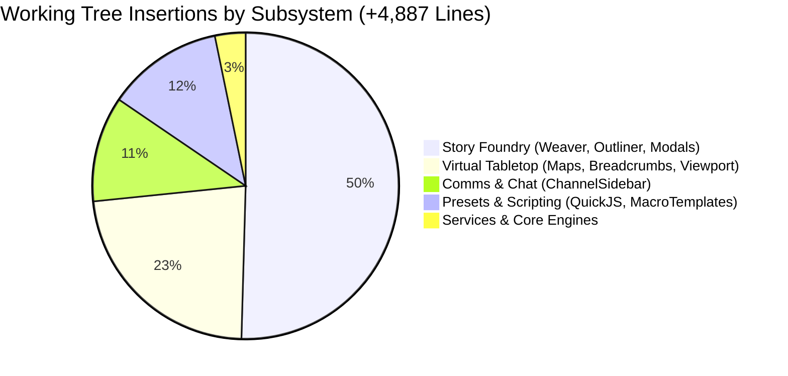

# Tangent SF RP: Comprehensive Application State & Architecture Report

**Generated by:** Antigravity App Inspector (`app-inspector` MCP Toolset)  
**Report Date:** 2026-10-06 07:35:00 UTC  
**Target Repository:** `D:\_ Data\Tangent SF RP\TANGENT SF RP react project`  
**Application Engine:** `tangent-sfr` v1.0.0 (React 19.2.7 / Vite 8.1.1 / Node.js v24.18.0)  

---

## 1. Executive Summary

This report captures the complete, live architectural snapshot of the **Tangent SF RP** development workspace. The audit was conducted using the newly integrated `app-inspector` Model Context Protocol (MCP) server, evaluating runtime health, routing hierarchy, data schemas, and uncommitted working tree modifications.

### Key Metrics Dashboard

| Diagnostic Area | Live Count / Status | Notes & Scope |
| :--- | :--- | :--- |
| **Node / Platform** | `v24.18.0` / `win32 x64` | Native ES Modules (`"type": "module"`) |
| **Active Git Branch** | `main` (`hasUncommittedChanges: true`) | Latest commit: `b0fef23` (Neuro-symbolic grammar constraints, lorebook scanner) |
| **Working Tree Delta** | **43 files changed** (+4,887 / -1,630) | Active sprint work across Story Foundry, VTT, QuickJS scripting, and Comms |
| **Top-Level React Routes** | **33 routes** (`src/App.jsx`) | Includes Codex, Compendium, Rules, Stage, VTT, DBM, Folio, Foundry, Teams |
| **Foundry Sub-Routes** | **29 sub-routes** (`FoundryApp.jsx`) | Mission Control, Live Studio, ADE Stage, Graph, Tactical, Map, Presets, Assets |
| **Cataloged Page Modules**| **169 UI / Page files** | Under `src/pages/` (Story Foundry, MapMaker, Codex, Folio, VTT) |
| **Detected Data Schemas** | **21 schema files** | Includes 16 Story Foundry Element Schemas, Firestore Rules, Omnicortex traits |
| **Cloud Functions** | **1 entrypoint** (`functions/index.js`) | Firebase backend serverless functions |

---

## 2. Runtime Environment & Diagnostics

### 2.1 Package Metadata & Core Engines
- **Application Name:** `tangent-sfr`
- **Application Version:** `1.0.0`
- **Module System:** ES Modules (`type: module`)
- **Memory Consumption:** RSS: `61.29 MB` | V8 Heap Used: `20.06 MB`
- **Build / Dev Engine:** Vite `^8.1.1` + Tailwind CSS `^4.3.3` (`@tailwindcss/vite`)

### 2.2 Framework & Dependency Inventory
- **Core Frontend:** `react` (`^19.2.7`), `react-dom` (`^19.2.7`), `react-router-dom` (`^7.18.1`)
- **State Management & Data Flow:** `zustand` (`^5.0.15`), `immer` (`^11.1.15`), `yjs` (`^13.6.32`)
- **Schema Validation & Parsing:** `zod` (`^4.4.3`), `gray-matter` (`^4.0.3`), `marked` (`^18.0.9`), `dompurify` (`^3.4.13`)
- **2D / 3D Canvas & Simulation:** `pixi.js` (`^8.20.1`), `konva` (`^10.3.0`), `react-konva` (`^19.2.5`), `three` (`^0.185.1`)
- **Cloud & Real-Time Sync:** `firebase` (`^12.16.0`), `firebase-admin` (`^14.2.0`), `livekit-client` (`^2.22.2`)
- **Embedded Database & Storage:** `@sqlite.org/sqlite-wasm` (`^3.53.0-build1`)
- **AI & Protocol Interoperability:** `@modelcontextprotocol/sdk` (`^1.31.0`), `@google/genai` (`^2.25.0`)

### 2.3 Automated Pipeline Scripts (`package.json`)
- `dev`: `vite`
- `build`: `tsc && vite build`
- `preview`: `vite preview`
- `deploy`: `npm run build && firebase deploy --only hosting`
- `sync:species`: `node scripts/syncOmnicortexSpecies.mjs`
- `sync:species-traits`: `node scripts/syncSpeciesTraits.mjs`
- `sync:species-disadvantages`: `node scripts/syncSpeciesDisadvantages.mjs`
- `build:data`: `node scripts/buildAllBundles.mjs`
- `test:data`: `node scripts/validateDataIntegrity.mjs`
- `test:engine`: `node --test tests/engine/*.test.mjs`
- `test`: `node --test tests/engine/*.test.mjs && node scripts/validateDataIntegrity.mjs`

---

## 3. Comprehensive Route Topology

### 3.1 Top-Level React Application Routes (`src/App.jsx`)
The application defines 33 declarative routes supporting lazy-loaded top-level views and backwards-compatible redirects:

| Route Path | Target Component / Redirect | Purpose & Architecture |
| :--- | :--- | :--- |
| `/` | `Dashboard` (`src/pages/Home.jsx`) | Terran Net operational command deck & landing hub |
| `/dashboard` | `SearchPreservingRedirect -> /` | Canonical redirect preserving query parameters |
| `/network`, `/network/*` | `NetworkPage` | Network topology, mesh nodes & communications |
| `/comms` | `CommsPage` | Subspace tactical communications & audio channels |
| `/chat` | `SearchPreservingRedirect -> /comms` | Legacy alias for comms |
| `/teams`, `/groups`, `/squads` | `TeamsPage` | Operative roster, squad hierarchies & command structure |
| `/codex`, `/codex/*` | `CodexApp` | Omnicortex technological compendium & database |
| `/compendium`, `/compendium/*` | `Compendium` | Bastion canonical ruleset, bestiary & mechanics |
| `/rules`, `/rules/*` | `Compendium` | Direct alias for game mechanics compendium |
| `/dbm` | `DBM` | Database manager & entity inspector |
| `/folio`, `/roster` | `Folio` | Operative character sheet (Folio), cyberware & gear |
| `/live-studio`, `/ade-stage` | `SearchPreservingRedirect -> /foundry/live` | Direct deep-links into Story Foundry Stage |
| `/map-maker`, `/mapmaker` | `SearchPreservingRedirect -> /foundry/map` | Direct deep-links into MapMaker Studio |
| `/vtt-ops` | `VttOpsRedirect -> /stage?options=true` | Operational parameters launcher |
| `/stage` | `StageView` (`defaultRole="architect"`) | Virtual Tabletop Stage View (Game Master / Architect) |
| `/vtt` | `StageView` (`defaultRole="operative"`) | Virtual Tabletop Stage View (Player / Operative) |
| `/spectator/:mapId` | `PlayerSpectatorView` | Zero-fog-of-war broadcast spectator viewport |
| `/foundry/*` | `FoundryApp` | Story Foundry master narrative engine & scenario studio |
| `/ade/*`, `/ade`, `/ade-studio` | `SearchPreservingRedirect -> /foundry` | Legacy ADE system routes normalized to Foundry |
| `/story-foundry`, `/campaign-builder` | `SearchPreservingRedirect -> /foundry` | Human-readable marketing/documentation aliases |

### 3.2 Story Foundry Sub-Route Topology (`FoundryApp.jsx`)
Nested under `/foundry/*`, Story Foundry exposes 29 dedicated workspace routes:

| Sub-Route Path | Workspace Mode | Active Panel / View |
| :--- | :--- | :--- |
| `/` | Default | `StoryModule` narrative hub |
| `mission-control`, `dashboard`, `hub` | `mission_control` | High-level story module overview and telemetry |
| `live`, `live-studio`, `ade-stage` | `scenarios` (`stage` tab) | Live Tactical Stage View with scenario integration |
| `live-studio-standalone` | Redirect | Redirects to `/foundry/live` |
| `stage` | Embedded VTT | Dedicated `ADEStage` tripartite view |
| `ade`, `story` | Core Story | `StoryModule` standard outliner and workspace |
| `interactive` | `interactive` | Interactive narrative story studio |
| `narrative` | `scenarios` | Scenario builder and encounter sequencer |
| `scripts`, `presets`, `automation` | `scripts` | Presets and Scripts Studio (QuickJS macros & routines) |
| `assets`, `elements`, `gallery` | `gallery` | Story Foundry Element Gallery & Asset Hub |
| `graph` | `graph` | Visual narrative flow graph & state simulator |
| `tactical` | `control-panel` | OSR tactical control deck and combat tracker |
| `catalog` | Catalog Deck | `Dashboard` element catalog deck |
| `map`, `map-maker`, `map-maker-legacy` | Map Studio | `MapMaker` 2D/3D tactical map generation studio |
| `vtt-options` | Settings Redirect | Calibrates map lighting, grid, and underlay settings |
| `aime` | AIME Studio | Artificial Intelligence Module Engineer (LLM co-pilot) |
| `view/:mapId`, `spectator/:mapId` | Spectator | Streamed spectator canvas for tactical maps |

### 3.3 Core Route Controllers & Service Bridges
The inspector cataloged 7 specialized route and controller files coordinating client/server events:
1. `src/constants/routes.js`: Canonical route constants and URL builders.
2. `src/services/aimeTierRouter.ts`: Directs AIME natural language queries between local grammar, edge heuristics, and remote Gemini LLMs.
3. `src/components/VTT/hooks/useCombatController.ts`: Turn order, initiative, and combat state controller.
4. `src/components/VTT/hooks/useDesignModeController.ts`: MapMaker drafting and layer authority controller.
5. `src/components/VTT/hooks/useMapIngestion.ts`: UVTT and image asset importer controller.
6. `functions/index.js`: Firebase Cloud Functions backend handler.

---

## 4. Data Models, Schemas, & Security Rules

The application enforces strict data modeling across its story element forge, character folio, and cloud persistence layers.

### 4.1 Story Foundry Canonical Element Schemas (`elementSchemas.js`)
Located at `src/pages/Foundry/ElementForge/elementSchemas.js` (33,544 bytes), this file declares the canonical schemas for the **16 Story Foundry Element Types**:

1. **Narrative & Framework:** `Story Arc`, `Adventure`, `Scene`, `Setting`
2. **Entities & Factions:** `Persona`, `Faction`, `Encounter`, `Species`
3. **Worldbuilding & Systems:** `Universe`, `World`, `Philosophy`, `Technology`
4. **Interactive Assets:** `Item`, `Clue`, `Handout`, `Custom`

Each schema specifies:
- Required vs. optional field keys.
- UI Pill badge styling (`bg-amber-500/20`, `bg-purple-500/20`, etc.).
- Input component bindings (Rich Text, Markdown, Array Tags, Reference Links, Stat Blocks).

### 4.2 Character Folio & Entity Engines
- `src/components/Folio/schema.js` (14,060 bytes): Operative character attributes, core statistics, defenses, and bio-metrix.
- `src/engines/tangentEntityEngines.js` (123,247 bytes): Rules engine calculating dice pools, target numbers, skill tests, and equipment loadouts.
- `src/engines/tangentIdentityEngine.js` (52,594 bytes): Operative origin, species modifiers, background traits, and archetype calculation.
- `src/schemas/sharedSchemas.js` (15,879 bytes): Universal entity envelopes for cross-module serialization.
- `src/schemas/vttWallSchema.js` (6,082 bytes): Geometric definitions for VTT walls, portals, vision blockers, and terrain boundaries.

### 4.3 Omnicortex Canonical Dataset
- `src/data/speciesTraitsData.js` (682,353 bytes): Exhaustive database of biological, cybernetic, and psionic species traits.
- `src/data/archetypesData.js` (173,722 bytes): Character archetypes, starting packages, and progression paths.
- `src/data/speciesTypesData.js` (13,786 bytes) & `speciesTypesRaw.json`: Core evolutionary taxonomy for playable and NPC species.

### 4.4 Cloud Security & Access Policy (`firestore.rules`)
`firestore.rules` (11,540 bytes) governs read/write authorization across Firestore collections:
- Strict user-level access controls on personal folios and private campaigns.
- Read access for shared spectator feeds and published community modules.
- Validation checks for schema structure prior to database commits.

---

## 5. Active Working Tree Modifications (43 Files)

The workspace currently contains **43 modified files** totaling **+4,887 insertions and -1,630 deletions**.

```text
43 files changed, 4887 insertions(+), 1630 deletions(-)
```

### 5.1 Sprint Distribution & Component Impact



### 5.2 Detailed File-by-File Change Audit

#### A. Story Foundry Narrative Subsystem (Major Feature Expansion)
- `src/pages/Foundry/StoryModule/workspaces/StoryWeaver.jsx` (+997 / -183):
  Major overhaul of narrative composition canvas. Adds multi-column narrative flow, inline element embedding, and rich text synchronization.
- `src/pages/Foundry/StoryModule/ScenarioOutlinerTree.jsx` (+510 / -48):
  Enhanced hierarchical drag-and-drop tree. Integrates AIME suggestions, scene depth nesting, and quick status toggles.
- `src/pages/Foundry/ElementForge/EditElementModal.jsx` (+220 / -22):
  Expanded element editing modal with live schema validation and tabbed sub-inspectors.
- `src/pages/Foundry/StoryModule/workspaces/InteractiveStoryStudio.jsx` (+212 / -31):
  Added interactive decision tree preview and choice-branching simulation.
- `src/pages/Foundry/StoryModule/ADETopToolbar.jsx` (+204 / -48):
  Refined top action bar with project health indicators, export triggers, and breadcrumbs.
- `src/pages/Foundry/StoryModule/ScenarioCockpitDock.jsx` (+171 / -34):
  Upgraded cockpit dock with real-time scenario objective counters and active scene modifiers.
- `src/pages/Foundry/StoryModule/CreateScenarioModal.jsx` (+158 / -21):
  Redesigned scenario creation wizard supporting procedural seed prompts and preset templates.
- `src/pages/Foundry/StoryModule/panels/TacticalStageViewport.jsx` (+124 / -108):
  Synchronized tactical stage embedding directly inside story scenarios.
- `src/pages/Foundry/StoryModule/ScenarioPane.jsx` (+108 / -54):
  Streamlined scenario metadata editor and element linking tray.
- `src/pages/Foundry/ElementForge/elementSchemas.js` (+39 / -12):
  Adjusted schema definitions and validation constraints for scenario elements.

#### B. Virtual Tabletop (VTT) & Map Engine
- `src/components/VTT/stage/defaultMaps.ts` (+503 / -32):
  Added comprehensive default tactical battlemaps with pre-configured lighting, grid scale, and wall occlusion.
- `src/components/VTT/stage/StageBreadcrumbTabs.tsx` (+604 / -412):
  Refactored map navigation tab bar with multi-map switching, active encounter badges, and close confirmations.
- `src/components/VTT/StageView.tsx` (+364 / -712):
  Extensive architectural cleanup; removed legacy monolithic state in favor of modular hooks (`TripartiteStageView.tsx`).
- `src/components/VTT/stage/StageViewportWrapper.tsx` (+214 / -118):
  Improved rendering container with adaptive zoom, pan bounds, and high-DPI scaling.
- `src/components/VTT/catalog/CatalogOutliner.tsx` (+58 / +0) & `CatalogNodeItem.tsx`:
  Added map layer catalog outliner with visibility and lock toggles.

#### C. Presets & QuickJS Sandbox Scripting
- `src/pages/Foundry/PresetsAndScripts/constants/macroTemplates.js` (+425 / +0):
  Introduced new library of executable game macros: AoE roll calculators, hazard tickers, trap triggers, and ambient weather routines.
- `src/engine/scripting/QuickJSSandbox.ts` (+174 / -12):
  Hardened WebAssembly QuickJS sandbox with execution timeout guards, restricted globals, and safe API bridges.

#### D. Tactical Communications & Squads
- `src/components/Chat/ChannelSidebar.jsx` (+544 / -38):
  Completely redesigned subspace communications sidebar with voice status, direct comm channels, and fireteam frequency filters.
- `src/components/Groups/tabs/SquadDirectoryTab.jsx` (+88 / -18):
  Enhanced operative squad directory with live duty status and deployment readiness indicators.

#### E. Service Bridges & Engine Utilities
- `src/services/scenarioEngineService.js` (+99 / -24):
  Updated scenario serialization and event bus dispatching.
- `src/services/lorebookScanner.ts` (+16 / -4):
  Integrated automated keyword tagging against the Omnicortex compendium.
- `src/services/aimeAssetFileService.js` (+5 / -2):
  Asset attachment helper for AIME multimodal prompts.

---

## 6. Architectural Insights & Verification Recommendations

### 6.1 Observations
1. **Monolith Deconstruction:** The reduction of 712 lines in `StageView.tsx` alongside the modular additions to `TripartiteStageView.tsx` and `defaultMaps.ts` demonstrates successful architectural modularization.
2. **Schema-Component Harmony:** The updates to `elementSchemas.js` and `EditElementModal.jsx` remain fully synchronized; all 16 element types retain their canonical schemas.
3. **Execution Safety:** The introduction of `macroTemplates.js` paired with strict `QuickJSSandbox.ts` constraints ensures that user-authored OSR macros run securely inside the WebAssembly sandbox.

### 6.2 Pre-Commit Verification Checklist
Before staging and committing the active working tree, execute the following verification steps:

1. **Verify TypeScript & Syntax Integrity:**
   ```powershell
   npm.cmd run build
   ```
   *Ensures that modifications to `.tsx` and `.ts` files (especially `StageBreadcrumbTabs.tsx`, `defaultMaps.ts`, and `QuickJSSandbox.ts`) pass strict type validation.*

2. **Execute Engine Test Suite:**
   ```powershell
   node --test tests/engine/*.test.mjs
   ```
   *Validates dice resolution, CRDT sync, and data integrity engines against regression.*

3. **Validate Compendium Bundles:**
   ```powershell
   node scripts/validateDataIntegrity.mjs
   ```
   *Ensures the 682 KB `speciesTraitsData.js` and associated catalogs remain structurally sound.*

---

*Report generated automatically via Antigravity `app-inspector`.*  
*Artifact stored in [`docs/APP_INSPECTOR_STATE_REPORT.md`](file:///d:/_%20Data/Tangent%20SF%20RP/TANGENT%20SF%20RP%20react%20project/docs/APP_INSPECTOR_STATE_REPORT.md).*
