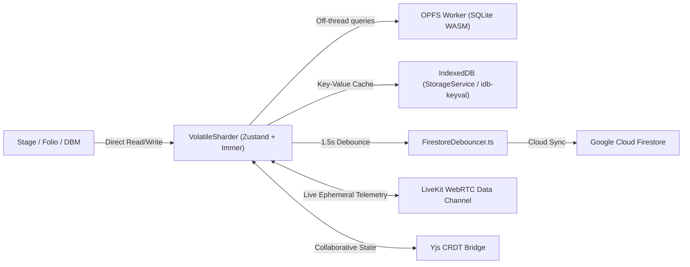

# 🌌 TANGENT SCIENCE FANTASY ROLEPLAY (TANGENT SFF RP)
## Comprehensive Technical & Architectural System Report
**Document Designation:** `TANGENT-SYS-ARCH-SPEC-2026.09-REV1`  
**Classification:** Canonical System Specification & Development / AI Review Dossier  
**Target Codebase:** `d:/_ Data/Tangent SF RP/TANGENT SF RP react project`  
**Master Rules Catalog:** `BASTION_CANONICAL_GAME_RULESET_CATALOG.md`  

---

## 📑 TABLE OF CONTENTS

1. [Executive Summary & High-Level Purpose](#1-executive-summary--high-level-purpose)
2. [Technical Stack & Multi-Tier Infrastructure](#2-technical-stack--multi-tier-infrastructure)
3. [Canonical Game Rules & Mathematical Engines](#3-canonical-game-rules--mathematical-engines)
4. [Persistent Global Shell & Ergonomics](#4-persistent-global-shell--ergonomics)
5. [Command Center Hub (`/`, `/dashboard`)](#5-command-center-hub--dashboard)
6. [Omnicortex Database Management & Compendium (`/dbm`, `/compendium`)](#6-omnicortex-database-management--compendium-dbm-compendium)
7. [Codex & Asset Studio (`/codex`)](#7-codex--asset-studio-codex)
8. [Persona Folio (`/folio`, `/roster`)](#8-persona-folio-folio-roster)
9. [ADE Stage & Tactical Battlemap VTT (`/stage`, `/vtt`)](#9-ade-stage--tactical-battlemap-vtt-stage-vtt)
10. [Story Foundry & Campaign Creation Suite (`/foundry/*`)](#10-story-foundry--campaign-creation-suite-foundry)
11. [Teams, Squads & Voice Comms (`/teams`, `/comms`)](#11-teams-squads--voice-comms-teams-comms)
12. [The 10-Stage Core Engine Architecture (`src/engine/`)](#12-the-10-stage-core-engine-architecture-srcengine)
13. [Domain Engines Suite (`src/engines/`)](#13-domain-engines-suite-srcengines)
14. [Data Architecture, Cross-Module Schemas & Security](#14-data-architecture-cross-module-schemas--security)
15. [Development & AI Review Evaluation & Roadmap](#15-development--ai-review-evaluation--roadmap)
16. [Route & Component Reference Matrix](#16-route--component-reference-matrix)

---

## 1. Executive Summary & High-Level Purpose

**Tangent Science Fantasy Roleplay (TANGENT SFF RP)** is an enterprise-grade, cyberpunk/space-opera Virtual Tabletop (VTT), rules arbitration codex, character lifecycle manager, and AI-directed campaign authoring suite. The platform bridges hard mathematical tactical simulation with rich narrative campaign generation, operating across both 2D hardware-accelerated canvas (Pixi.js / WebGPU) and 3D spatial holographic battlemaps (Three.js).

The system serves three primary user roles:
1. **The Architect (Game Master / Referee / Worldbuilder):** Exercises total systemic authority over campaign timelines, procedural terrain, encounter balance, custom species/item authoring, and secret tactical map layers.
2. **The Operative (Player / Persona Specialist):** Controls personal hero folios, point-buy budgets, tactical stances, called-shot strikes, cybernetic installations, vehicle sockets, and inventory.
3. **The Spectator / Stream Observer:** Read-only tactical feed with synchronized live camera view, token status, and fog-of-war culling.

The application is uniquely architected around a **Dual-AI Assistant Framework**:
- **BASTION:** The deterministic, mathematical Rules Arbiter and Tactical Combat Assistant.
- **AIME (Artificial Intellect Master Entity):** The narrative director, campaign weaver, and dynamic storyline generator.

```mermaid
graph TD
    APP["🛰️ Persistent Application Shell (App.jsx)"]
    APP --> HUD["Persistent Global HUD & Ergonomics"]
    APP --> HUB["⚡ Command Hub (/)"]
    APP --> FOLIO["📜 Persona Folio (/folio)"]
    APP --> DBM["🧠 Omnicortex DBM & Codex (/dbm, /codex)"]
    APP --> STAGE["🗺️ ADE Stage & Tactical VTT (/stage, /vtt)"]
    APP --> FOUNDRY["🛠️ Story Foundry Suite (/foundry/*)"]
    APP --> TEAMS["👥 Teams & Voice Comms (/teams, /comms)"]

    subgraph CORE_ENGINES ["Modular Engine Subsystems (src/engine/ & src/engines/)"]
        SHARD["Stage 1: Volatile Sharder & OPFS SQLite"]
        GPU["Stage 2: WebGPU & Pixi Layer Compositor"]
        WGSL["Stage 3: BVH & WGSL Compute Shaders"]
        CART["Stage 4: Cartography & Spatial Audio"]
        RULES["Stage 5: Rules & Damage Pipelines"]
        UIENG["Stage 6: Cockpit HUD & QuickJS Sandbox"]
        AIENG["Stage 7: Dual-Agent AI Gateway & Auto-Walling"]
        NORM["Stage 8: Schema Normalization & Migrations"]
        COMP["Stage 9: Paged PDF & Foundry VTT Compilers"]
        STAGE3D["Stage 10: Three.js 3D Holographic Stage"]
    end

    STAGE --> CORE_ENGINES
    FOLIO --> RULES
    DBM --> NORM
    FOUNDRY --> AIENG
```



---

## 2. Technical Stack & Multi-Tier Infrastructure

### 2.1 Core Runtime & UI Framework
- **UI Engine:** React 19 / React 18 (Functional Components, React Hooks, React Suspense lazy code-splitting).
- **Build Toolchain:** Vite 6 / Vite 8 with Hot Module Replacement (HMR) and `@tailwindcss/vite` (Tailwind CSS v4).
- **Type Safety & Schemas:** TypeScript `~6.0.2`, Zod `^4.4.3` for runtime schema enforcement.
- **Iconography & Styling:** Lucide React (`^1.31.0`), centralized Design Tokens (`src/css/design-tokens.css`), and custom cyberpunk scanline/glow styling.

### 2.2 Data Persistence & Real-Time Sync Hierarchy
The application implements a 4-tier storage hierarchy to balance zero-latency local operations with cloud-synchronized multi-user multiplayer:



1. **Ephemeral Volatile Memory (`src/engine/state/VolatileSharder.ts`):**
   - High-frequency token movement, orientation, and vitals bypass React reconciliation entirely via Zustand with Immer and `subscribeWithSelector`.
2. **Local Relational Storage (`src/engine/database/OPFSDatabaseWorker.ts`):**
   - Origin Private File System (OPFS) running SQLite WebAssembly (`@sqlite.org/sqlite-wasm`). Delivers microsecond queries across thousands of compendium records and scenario nodes offline.
3. **Local Key-Value Cache (`src/services/storageService.js`):**
   - IndexedDB caching using `idb-keyval` for persona rosters, custom folders, and draft state.
4. **Cloud Persistence & Security (`src/firebase.js` & `firestore.rules`):**
   - Google Firebase Firestore with 1.5-second write debouncing (`src/engine/network/FirestoreDebouncer.ts`).
   - Comprehensive security rules strictly isolating user folios, enforcing group-based campaign access, and guarding architect permissions.
5. **Multiplayer Networking (`src/engine/network/LiveKitClient.ts` & `src/engine/network/YjsProviderBridge.ts`):**
   - LiveKit WebRTC data streams broadcast 60fps cursor tracking, drag ghosts, and squad voice comms without server load.
   - Yjs CRDTs resolve concurrent modifications to battlemap tokens, notes, and scenario documents.

---

## 3. Canonical Game Rules & Mathematical Engines

The system strictly executes the **BASTION Canonical Game Ruleset Master Catalog** (`BASTION_CANONICAL_GAME_RULESET_CATALOG.md`):

### 3.1 Domain 0: Dual Resolution & Dice Engine
- **$2d10$ Dual Resolution Curve:**
  $$\text{Check Total} = 2d10 + \text{Attribute Modifier} + \text{Skill Rank} + \text{Situational Modifiers}$$
- **Opposed Roll Standard:** Attacker Check vs. Defender Defense Check ($\text{Agility} + \text{Defense Skill} + \text{Modifiers}$). **DEFENDER WINS ALL TIES.**
- **Unopposed Standard:** Baseline Challenge Rating $\text{CR } 15$ (Average), modified by target size, range, and environmental conditions.
- **Natural Dice Thresholds:**
  - **Natural 20 (Double 10s):** Critical Success. Doubles base weapon damage dice, grants $+30$ to the base attack check score, and triggers called-shot trauma.
  - **Natural 2 (Double 1s):** Critical Fumble. Deducts $-10$ from the check score and triggers weapon jam, stumble, or metaphysical backfire.
- **Karma Point Economy:** Default pool of 3 Karma Points (KP) per session with 6 canonical spending actions:
  1. *I Got This* (Pre-roll Advantage: roll $2d10$ twice, keep higher).
  2. *Not What I Meant* (Post-roll non-combat reroll).
  3. *Shake it Off* (Reduce active condition severity by 1 stage).
  4. *Second Wind* (1-minute focus replaces a Light Rest).
  5. *So Mote it Be* (Metaphysical potency boost or discipline karma feat).
  6. *By Will Alone* (Narrative reality alteration / push limits).

### 3.2 Domain 1: Attributes, Sub-Attributes & Vitals Engine
- **6 Core Attributes:** Strength, Agility, Stamina, Intellect, Wisdom, Charisma (base 0, 5 Base Points per $+1$).
- **Stamina Mechanics:** Stamina provides **natural Damage Reduction (DR / Toughness)**; it does *not* inflate base HP/VP pools.
- **Sub-Attributes:** Canonical derivation:
  $$\text{Sub-Attribute Base} = 2 + (\text{Primary Attribute} \times 2)$$
- **Biological Vitals Structure:**
  - Base Vitality (VP): $30\text{ pts}$ (represents energy, glancing blows, fatigue).
  - Base Health (HP): $30\text{ pts}$ (represents physical flesh integrity).
  - Damage Flow: Incoming damage depletes Armor DR $\rightarrow$ Stamina DR $\rightarrow$ Vitality $\rightarrow$ Health. Non-lethal damage only affects Vitality.
- **Synthetics, Constructs & Mecha:**
  - Zero Vitality (VP).
  - Base Structure Points (SP): $60\text{ pts}$ for Medium chassis, scaled by size tier.
  - Complete immunity to non-lethal fatigue, biological poisons, and suffocation.

### 3.3 Domain 2: The 5 Pillars of Character Creation
BASTION enforces that character synthesis strictly adheres to the 5 canonical pillars in fixed sequence:
```
1. Archetype (100 Canonical Archetypes: Sentinels, Operatives, Visionaries, Savants)
   └── 2. Species (Humans, Celestine Aeld, Synthetics, Aulurans, Kitin, Gen-E, etc.)
        └── 3. Faction (Dracon Dynasty, Syndicate, Impyrium, Entari Combine, Alliance)
             └── 4. Origin (Urban, Spacer, Industrial, Agricultural, Colony, etc.)
                  └── 5. Occupation (Soldier, Netrunner, Pilot, Tech Specialist, Scholar)
```
- **Budget Chassis:** 150 Base Points (BP) allocation for Attributes + three distinct 20 Skill Point (SP) background pools (Faction, Origin, Occupation).

### 3.4 Domain 3: Skill-Tier Action Economy
The system replaces arbitrary Action Points (AP) with a skill-gated action economy:
| Skill Rank | Designation | Combat Action Allocation | Defense Reaction Capacity |
| :---: | :---: | :--- | :--- |
| **0** | Untrained | Full-round action required for single attack | 1 basic defense reaction |
| **1–5** | Novice | 1 standard action ($+2\text{ Focus}$) | 1 reaction at full score |
| **6–10** | Trained | 2nd attack action at $-5\text{ penalty}$ ($+3\text{ Focus}$) | 2 reactions (2nd at $-5$) |
| **11–15** | Expert | 3rd attack action at $-10\text{ penalty}$ ($+4\text{ Focus}$) | 3 reactions (cumulative $-5$) |
| **16–20** | Master | 4th attack action at $-15\text{ penalty}$ ($+5\text{ Focus}$) | 4 reactions (cumulative $-5$) |
| **21–30** | Grandmaster | Up to 6th attack action at $-25\text{ penalty}$ | Up to 6 active reactions |

### 3.5 Domain 4: Volumetric Scaling & Economatrix
- **14-Tier Volumetric Scaling Matrix:** From Miniscule (Tier 1) through Medium (Tier 5) to Mega-Colossal (Tier 14). Computes quadratic SP multipliers, weapon damage dice multipliers, and starship blast radii.
- **Universal Cost Equation:**
  $$\text{Cost} = \text{Base Price} \times 2^{\text{Tech Level (TL)}} \times 1.5^{\text{Meta Level (ML)}}$$

---

## 4. Persistent Global Shell & Ergonomics
**Root File:** `src/App.jsx`

The application shell provides persistent viewport ergonomics across every route:
- **Persistent Global HUD (`src/components/Layout/GlobalHUD.jsx`):** 52–56px top bar with breadcrumb tracking, Terran Data Net status, real-time unread comms counters, procedural audio mute toggle, user profile management (`src/components/UserSettingsModal.jsx`), and quick launcher shortcuts.
- **Spotlight Command Palette (`Ctrl+K` / `src/components/UI/CommandPalette.jsx`):** Global omni-search indexing compendium entries, hero folios, battlemaps, and scenarios. Supports direct slash execution (e.g., `/roll 2d10+4`, `/goto folio`, `/kick`).
- **Polyhedral Dice Roller Dock (`Alt+D` / `src/components/UI/DiceRollerDock.jsx`):** Collapsible floating dock powered by `src/engine/math/DiceASTParser.ts`. Supports dice math, exploding dice, drop/keep notations (`4d6kh3`), and persistent roll audit logging.
- **Persistent Guidance Rail (`src/components/Layout/GlobalSideRail.jsx`):** Quick-access drawer for core modules (Hub, Codex, DBM, Folio, Stage, Foundry, Teams, Comms).
- **Universal Catalog Modal (`src/components/UI/UniversalCatalogModal.jsx`):** Searchable reference modal exposing the full rules compendium from any view.
- **Procedural SFX Synthesizer (`src/services/audioService.js`):** Zero-dependency Web Audio API synthesizer generating real-time sci-fi UI clicks, terminal chirps, dice tumbling acoustics, and critical fanfares.

---

## 5. Command Center Hub (`/`, `/dashboard`)
**Primary Files:** `src/pages/Home.jsx`, `src/components/Hub/`

The Command Center Hub serves as the central operational cockpit for ongoing campaigns:
- **Campaign Ops Widget (`src/components/Hub/CampaignOpsWidget.jsx`):** Tracks current campaign state, active scenario milestones, and quick launcher buttons for ADE Stage and Story Foundry.
- **Party Status Widget (`src/components/Hub/PartyStatusWidget.jsx`):** Live vitals carousel displaying operative Health, Vitality, and active status conditions for quick triage.
- **Game Squads Widget (`src/components/Hub/GameSquadsWidget.jsx`):** Shows joined tactical fireteams, pending invitations, and provides direct squad join links (`?join=GRP-XXXXXX`).
- **Comm Center Widget (`src/components/Hub/CommCenterWidget.jsx`):** Displays active tactical radio frequencies, unread broadcasts, and direct links to voice channels.
- **Transmission Feed (`src/components/Hub/TransmissionFeed.jsx`):** Live timeline feed of in-universe transmissions, campaign event logs, and GM bulletins.

---

## 6. Omnicortex Database Management & Compendium (`/dbm`, `/compendium`)
**Primary Files:** `src/components/DBM/DBMContainer.jsx`, `src/components/DBM/categoryConfig.js`, `src/data/omnicortex/`

The Omnicortex Database Management (DBM) system is the relational data backbone of the game, managing **62 distinct schema categories**:
- **Relational Data Scope:** Archetypes, Species, Movement Modes, Size Tiers, Origins, Occupations, Skills, Maneuvers, Traits, Disadvantages, Features, Invocations, Metaphysical Disciplines, Armoring, Weaponry, Cybernetics/Augmentations, Mecha Components, Factions, Societies (Agriculture, Biotech, Energy, Synthetics, etc.), and Environmental Hazards.
- **Dual Presentation Modes:**
  - **Table View (`src/components/DBM/DBMTableView.jsx`):** High-density spreadsheet with multi-column sorting, facet filters (TL, ML, Category, Tags), inline editing, and virtualized scrolling (`src/components/DBM/VirtualizedList.jsx`).
  - **Wiki View (`src/components/DBM/DBMWikiView.jsx`):** Rich markdown encyclopedic layout with hyperlinked relational chips, prerequisite trees, and visual hierarchy breakdowns.
- **Unified Relational Selector (`src/components/DBM/UnifiedRelationalSelectorModal.jsx`):** Universal picker allowing any item in the application (a weapon, cybernetic, or spell) to cross-reference another entity with strict foreign key validation.
- **Architect Dev Fields Modal (`src/components/DBM/ArchitectDevFieldsModal.jsx`):** Raw JSON and field editor allowing GMs to modify underlying data structures and inject custom properties.
- **Integrated Bastion Chat (`src/components/DBM/BastionChatModal.jsx`):** AI rules consultation modal with direct RAG grounding into the active compendium dataset.

---

## 7. Codex & Asset Studio (`/codex`)
**Primary Files:** `src/pages/Codex/CodexApp.jsx`, `src/components/Codex/AssetStudio.jsx`

Dedicated creator studio for generative worldbuilding and species design:
- **Species Studio:** Interactive creator for custom alien races and synthetic chassis. Enforces trait budgets, species disadvantages, size category bonuses, and movement speed calibrations.
- **Trait Choice Modal (`src/components/Codex/TraitChoiceModal.jsx`):** Guided selector for species-specific traits and disadvantages.
- **Species Studio Tooltips (`src/components/Codex/SpeciesStudioTooltips.jsx`):** Context-sensitive rule explanations for racial point-buy balance.

---

## 8. Persona Folio (`/folio`, `/roster`)
**Primary Files:** `src/components/Folio/FolioContainer.jsx`, `src/context/FolioContext.jsx`, `src/components/Folio/tabs/`

The Persona Folio is a comprehensive character manager and digital character sheet:
- **Character Point (CP) & Base Point (BP) Engine:** Validates point-buy allocations across attributes, skills, traits, and features. Automatically tracks spent vs. available points.
- **Modular Tab Architecture:**
  - **Identity Tab (`src/components/Folio/tabs/IdentityTab.jsx`):** Executes the 5 Pillars of creation (Archetype, Species, Faction, Origin, Occupation), backstory, allegiance, and physical description.
  - **Core Stats Tab (`src/components/Folio/tabs/CoreStatsTab.jsx`):** 6 Core Attributes, Sub-Attributes derivation, natural Stamina DR calculation, and dynamic Vitals meters (VP/HP vs. Structure Points).
  - **Skills Tab (`src/components/Folio/tabs/SkillsTab.jsx`):** Skill allocation across the three 20 SP background pools, general skills, and specialized sub-skills with prerequisite validation.
  - **Features Tab (`src/components/Folio/tabs/FeaturesTab.jsx`):** Categorized features, talents, cybernetic augmentations (Tiers 1–3 body conversion percentage), and racial traits.
  - **Combat & Weapons Tab (`src/components/Folio/tabs/CombatTab.jsx`):** Attack check formulas, range brackets, called-shot modifiers, rate of fire, ammo tracking, and critical hit calculations.
  - **Combat Gear & Encumbrance Tab (`src/components/Folio/tabs/CombatGearTab.jsx`):** Inventory inventory slots, carried weight, volumetric container nesting, and encumbrance penalties.
  - **Companions Tab (`src/components/Folio/tabs/CompanionsTab.jsx`):** Pet, drone, and companion statistics with independent HP/SP tracks.
  - **Situational Modifiers Panel (`src/components/Folio/tabs/SituationalModifiersPanel.jsx`):** Live toggles for lighting, cover, prone stance, elevation, and active conditions.
- **Alternate Views:**
  - **Tactical Play View (`src/components/Folio/views/TacticalPlayView.jsx`):** Streamlined mobile/tablet interface optimized for live tabletop rolling.
  - **Print Folio (`src/components/Folio/print/PrintFolio.jsx`):** High-resolution, multi-page vector printable character sheet.
  - **Roster Management:** Create, duplicate, archive, and export hero folios.

---

## 9. ADE Stage & Tactical Battlemap VTT (`/stage`, `/vtt`)
**Primary Files:** `src/components/VTT/TripartiteStageView.tsx`, `src/components/VTT/StageView.tsx`, `src/components/VTT/stage/Stage3DViewport.tsx`

The ADE Stage is a hybrid 2D/3D tabletop simulation engine built on a **Tripartite Layout**:
```
┌─────────────────────────┬──────────────────────────────────────────┬─────────────────────────┐
│ LEFT RAIL               │ CENTER STAGE VIEWPORT                    │ RIGHT RAIL              │
│ ─────────────────────── │ ──────────────────────────────────────── │ ─────────────────────── │
│ Operative Cockpit /     │ 2D WebGPU (Pixi.js v8) or 3D Three.js    │ Architect Console /     │
│ Tactical Action Deck    │ Infinite Viewport Canvas                 │ GM Inspector Deck       │
│ • Vitals & Conditions   │ • 8-Layer Compositor (ZLayer 0-7)        │ • Wall Builder & Doors  │
│ • Stances & Movement    │ • BVH Raycast Line-of-Sight              │ • Biome Brush & Stamps  │
│ • Weapon Attacks        │ • Dynamic Lights & Shadows               │ • Interactive Objects   │
│ • Called Shot Modifiers │ • Multi-Spectrum Sensor Vision           │ • Hazmat Volumes        │
│ • Module Catalog Rail   │ • Token Standees & Waypoint Ruler        │ • Layer & Lighting Ops  │
└─────────────────────────┴──────────────────────────────────────────┴─────────────────────────┘
```

#### VTT Engine Capabilities:
1. **8-Layer Compositor (`src/engine/canvas/LayerCompositor.ts`):**
   - Layer 0: Map Underlay & Terrain Textures.
   - Layer 1: Floor Grids & Hex Overlays.
   - Layer 2: Interactive Objects & Hazard Particle Volumes.
   - Layer 3: Tokens (FusedToken Standees & Auras).
   - Layer 4: Overhead Walls, Portals & Bulkheads.
   - Layer 5: Dynamic Lighting & Ambient Shadows.
   - Layer 6: Fog of War & Line-of-Sight Masking.
   - Layer 7: Tactical UI, Waypoint Rulers & Ping Markers.
2. **Infinite Viewport & Frustum Culling (`src/engine/canvas/FrustumChunkManager.ts`):**
   - Chunks the canvas into $512\text{px}$ tiles, culling off-screen graphics to sustain 60 FPS on massive battlemaps.
3. **Multi-Spectrum Sensor Vision (`src/services/sensorVisionService.js` & `src/engine/vision/shaders/fused_vision.wgsl.ts`):**
   - Switches vision shaders across **Optical**, **Thermal** (highlights heat signatures through light cover), **Cyber** (reveals network nodes and electronics), and **Electromagnetic (EM)** spectrums.
4. **BVH Raycast Line-of-Sight (`src/engine/vision/BVHBuilder.ts` & `src/engine/3d/vision/LoSRaycast3D.ts`):**
   - Bounding Volume Hierarchy computes line-of-sight and dynamic shadows against thousands of wall segments in sub-millisecond times.
5. **Interactive Destructible Objects (`src/engine/assets/InteractiveObjectManager.ts`):**
   - Bulkheads, power generators, explosive containers, computer consoles, and security terminals. Supports lock picking DCs, hacking thresholds, Structure Points, and destruction states that alter line-of-sight.
6. **Hazmat & AoE Hazard Particles (`src/engine/physics/HazardParticleSimulator.ts`):**
   - Real-time particle simulations for Radiation zones, Bio-Gas, Plasma Fire, Nanite Swarms, and Vacuum Breaches.
7. **Tactical Action Deck & Called Shots (`src/components/VTT/cockpit/TangentActionDeck.tsx`):**
   - Direct execution of weapon strikes with called shot anatomy selections (Optics $-3$, Head $-2$, Arms $-2$, Legs $-1$). Triggers Major Wound Trauma evaluation when damage exceeds $33.3\%$ of maximum Health.
8. **Universal UVTT Importer (`src/pages/Foundry/MapMaker/map/UvttImportModal.jsx`):**
   - Parses `.dd2vtt` and `.uvtt` files from Dungeondraft/Chronos, instantly generating walls, portals, and light sources.
9. **Procedural Landmass Generator (`src/pages/Foundry/MapMaker/map/LandmassGeneratorModal.jsx`):**
   - Simplex noise-driven terrain synthesizer generating alien planets, asteroid belts, and subterranean caverns.
10. **3D Holographic Stage (`src/components/VTT/stage/Stage3DViewport.tsx`):**
    - High-performance Three.js spatial stage with extruded 3D walls (`src/engine/3d/geometry/WallExtruder3D.ts`), token standees with dynamic billboards (`src/engine/3d/tokens/TokenStandee3D.ts`), multi-deck ship management (`src/engine/3d/cartography/MultiDeckManager.ts`), and 3D volumetric waypoint rulers (`src/engine/3d/volumetrics/WaypointRuler3D.ts`).

---

## 10. Story Foundry & Campaign Creation Suite (`/foundry/*`)
**Primary Files:** `src/pages/Foundry/StoryModule/StoryModule.jsx`, `src/components/StoryFoundry/FoundryLauncherModal.jsx`

The Story Foundry provides campaign authoring tools and specialized procedural generators:
- **Story Weaver:** 3-phase narrative creation environment (Brainstorm $\rightarrow$ Outline $\rightarrow$ Draft) with node-based scene linking and AI Guidance Gems.
- **CRONICLE State Engine (`src/components/StoryFoundry/Cronicle/CronicleDeckModal.jsx` & `src/services/cronicleService.js`):**
  - Advanced temporal campaign tracker. Tracks world state transitions $S(t+1) = E(S_t)$, state deltas, and evolutionary lore updates across sessions.
- **CyberDeck Netrunning Modal (`src/components/StoryFoundry/CyberDeckModal.jsx`):**
  - Netrunning simulation with ICE nodes, cyberdecks, memory buffers, programs, and counter-intrusion subroutines.
- **Galaxy Starmap & Astrogation Modal (`src/components/StoryFoundry/GalaxyStarmapModal.jsx`):**
  - Procedural galaxy generator powered by `src/engine/cartography/AstrogationGenerator.ts` and `src/engine/cartography/NVectorCalculator.ts`. Calculates hyperspace jump coordinates, fuel burn, and planetary gravity wells.
- **Modular Starship Forge (`src/components/StoryFoundry/ModularStarshipForgeModal.jsx`):**
  - Shipwright studio configuring hull chassis, engine drives, shield emitters, weapon hardpoints, and internal sockets.
- **Social Disposition Matrix (`src/components/StoryFoundry/SocialDispositionModal.jsx`):**
  - NPC relationship and persuasion engine tracking NPC trust, fear, leverage, and diplomatic alignment.
- **Faction Web & Faction Clocks (`src/components/StoryFoundry/FactionWebModal.jsx` & `src/components/StoryFoundry/FactionClocksModal.jsx`):**
  - Tracks inter-faction warfare, espionage progress, alliance webs, and tick-based objective countdowns (Clocks).
- **Skill Challenge System (`src/components/StoryFoundry/SkillChallengeModal.jsx`):**
  - Dynamic skill challenge manager tracking required successes vs. strikes before failure in complex non-combat crises.
- **Encounter Simulator & Tension Widget (`src/components/StoryFoundry/EncounterSimModal.jsx` & `src/components/StoryFoundry/EncounterTensionWidget.jsx`):**
  - Monte Carlo combat balance evaluator predicting party survival odds and party resource depletion.
- **UDU Facility Generator (`src/components/StoryFoundry/UduFacilityGeneratorModal.jsx`):**
  - Procedural Universal Dungeon / Facility deckplan generator utilizing Binary Space Partitioning (`src/engine/cartography/BSPDeckplanGenerator.ts`).
- **Economatrix Loot Generator (`src/components/StoryFoundry/EconomatrixLootGeneratorModal.jsx`):**
  - Procedural cache and salvage generator calibrated to Tech Level (TL) and local economic tiers.
- **AIME Narration HUD (`src/components/StoryFoundry/AimeNarrationHud.jsx`):**
  - Floating GM teleprompter providing atmospheric scene descriptions and NPC dialogue suggestions in real time.

---

## 11. Teams, Squads & Voice Comms (`/teams`, `/comms`)
**Primary Files:** `src/pages/TeamsPage.jsx`, `src/pages/CommsPage.jsx`, `src/context/VoiceChatContext.jsx`, `src/components/Chat/VoiceCommsBar.jsx`

Integrated real-time multiplayer coordination infrastructure:
- **Squad Organization:** GMs and squad commanders can invite players, designate sub-squads (Alpha, Bravo, Recon), configure permissions, and link hero folios directly to battlemap tokens.
- **LiveKit Decentralized Voice Engine (`src/services/livekitTokenService.js`):**
  - Browser-native Web Crypto HMAC-SHA256 JWT generation connecting participants directly to LiveKit Cloud. Features active speaker indication, mute/deafen controls, and spatial audio pan based on token coordinates (`src/engine/audio/SpatialAudioGraph.ts`).
- **Tactical Radio Barks & Comms Hub (`src/services/tacticalBarksService.js`):**
  - In-game radio transmissions with randomized sci-fi squelch audio filters, direct whispers, and GM secret broadcasts.

---

## 12. The 10-Stage Core Engine Architecture (`src/engine/`)

The modular engine (`src/engine/index.ts`) is decomposed into 10 explicit architectural stages:

1. **Stage 1: Core State, Relational OPFS & Network Sync**
   - `src/engine/state/VolatileSharder.ts`: Merges `StaticEntity` with `EphemeralState` into `FusedToken`.
   - `src/engine/state/DBMBridge.ts` & `src/engine/database/OPFSDatabaseWorker.ts`: Off-thread SQLite database in OPFS.
   - `src/engine/network/LiveKitClient.ts`, `src/engine/network/YjsProviderBridge.ts`, `src/engine/network/FirestoreDebouncer.ts`.
2. **Stage 2: WebGPU Stage & Infinite Viewport Renderer**
   - `src/engine/canvas/RendererContext.ts`, `src/engine/canvas/LayerCompositor.ts`, `src/engine/canvas/FrustumChunkManager.ts`.
   - `src/engine/math/CoordinateEngine.ts`: Hex cube coordinates (`q, r, s`), square grids, pixel transforms across 14 scale tiers.
   - `src/engine/memory/GCMonitor.ts`: Memory watchdog preventing texture leaks.
3. **Stage 3: Vision, BVH & WGSL Compute Kernels**
   - `src/engine/vision/WGSLComputeContext.ts`, `src/engine/vision/BVHBuilder.ts`.
   - Compute Shaders: `fused_vision.wgsl.ts` (LoS computation), `sdf_csg_core.wgsl.ts` (SDF constructive solid geometry for wall carving), `elemental_fluid.wgsl.ts` (gas/fluid hazards), `boids_swarm.wgsl.ts` (swarming nanites/creatures).
4. **Stage 4: Story Foundry Ingestion, Interactive Objects & Cartography**
   - `src/engine/assets/FoundryIngestion.ts`, `src/engine/assets/InteractiveObjectManager.ts`.
   - `src/engine/assets/OPFSCacheWorker.ts`: High-speed blob asset caching.
   - `src/engine/audio/SpatialAudioGraph.ts`, `src/engine/cartography/NVectorCalculator.ts`, `src/engine/cartography/AstrogationGenerator.ts`, `src/engine/cartography/BSPDeckplanGenerator.ts`.
5. **Stage 5: Tangent SF RP Rules Execution & Damage Pipelines**
   - `src/engine/rules/CharacterBuilder.ts`: Enforces 5-pillar rules ledger and prerequisite trees.
   - `src/engine/rules/CombatArbitrator.ts`: Manages turn order, initiative, skill-tier action economy, and range brackets.
   - `src/engine/rules/DamagePipeline.ts`: Resolves incoming damage payloads against armor reduction, stamina reduction, called-shot anatomy, and structure.
   - `src/engine/rules/MechaSocketManager.ts`: Chassis hardpoints, energy reactors, and socket augmentations.
   - `src/engine/rules/EssenceTracker.ts`: Metaphysical strain, sustained spell drain, and backlash calculation.
6. **Stage 6: UI Glass-Cockpit HUD, Dice AST & Scripting**
   - `src/engine/ui/DashboardOverlay.tsx`, `src/engine/ui/layout/ResponsiveGridConfig.ts`, `src/engine/ui/WidgetRegistry.tsx`.
   - `src/engine/math/DiceASTParser.ts`: Mathematical AST parser evaluating expressions like `(2d10+4) * 2 + 1d6`.
   - `src/engine/scripting/QuickJSSandbox.ts`: WebAssembly sandboxed JavaScript runtime executing custom GM action scripts safely without browser security risks.
7. **Stage 7: Dual-Agent AI Ecosystem & Vision Auto-Walling**
   - `src/engine/ai/VertexAIGateway.ts`: Unified gateway with automatic multi-model fallbacks across Gemini Flash models.
   - `src/engine/ai/BastionAgent.ts`: Grounded tactical rules arbiter.
   - `src/engine/ai/AimeAgent.ts`: Narrative master entity managing context injection and scenario drafting.
   - `src/engine/ai/DBMFunctionRegistry.ts`: AI tool definitions allowing LLMs to directly query and manipulate Omnicortex records.
   - `src/engine/ai/MapWallingProcessor.ts`: Computer vision processor analyzing battlemap images to automatically extract wall coordinates and door locations.
8. **Stage 8: Schema Normalization & Migration Adapters**
   - `src/engine/migration/tangentSchemaAdapters.js`: Normalizes legacy schemas, sanitizes rich text, and enforces integer values.
9. **Stage 9: Publishing Compilers & External Exporters**
   - `src/engine/compilers/PagedPdfCompiler.ts`: Generates print-ready vector PDF rulebooks and character sheets.
   - `src/engine/compilers/FoundryVttJsonExporter.ts`: Exports Tangent battlemaps, actors, and compendium packs into the external Foundry VTT format.
10. **Stage 10: 3D Holographic Tactical Stage**
    - `src/engine/3d/Stage3DRendererContext.ts`, `src/engine/3d/TacticalCameraRig.ts`, `src/engine/3d/lighting/Lighting3DManager.ts`, `src/engine/3d/geometry/WallExtruder3D.ts`.

---

## 13. Domain Engines Suite (`src/engines/`)

Parallel to the 10-stage engine, the `src/engines/` directory provides pure mathematical game logic:
- `src/engines/tangentConstants.js` ($233\text{ KB}$): Canonical constants, condition state machines, size modifiers, weapon profiles, and armor tables.
- `src/engines/tangentEntityEngines.js` ($121\text{ KB}$): Entity hydration, derived stat calculations, encumbrance penalties, and movement rates.
- `src/engines/tangentComplexEngines.js` ($62\text{ KB}$): Complex combat checks, multi-target burst fire, and area effect adjudication.
- `src/engines/tangentIdentityEngine.js` ($52\text{ KB}$): 5 Pillars generation and background pool validation.
- `src/engines/tangentScalingEngine.js`: Cross-scale combat multipliers between infantry, vehicles, mecha, and capital ships.
- `src/engines/tangentModifierEngine.js`: Stacking rules and modifier calculation.
- `src/engines/tangentPlanetaryEngine.js`: Surface gravity, atmospheric pressure, and radiation hazards.
- `src/engines/tangentRestEngine.js`: Light/full rest healing rates and trauma recovery.
- `src/engines/tangentEconEngine.js`: Market economics, trade negotiation, and repair costs.

---

## 14. Data Architecture, Cross-Module Schemas & Security

### 14.1 Cross-Module Unified Schema (`src/schemas/sharedSchemas.js`)
Provides loss-free, bidirectional translation between all four principal entity types:
```
Omnicortex DBM Item  <=======>  Story Foundry Creative Element
        ^                                      ^
        |                                      |
        v                                      v
Persona Folio Hero   <=======>  Battlemap Stage Tactical Token
```
Adapters automatically reconcile property names (e.g., standardizing `char-name`, `title`, and `label` to canonical `name`), preserve custom metadata fields, and synchronize health/structure allocations.

### 14.2 Tactical Wall & Portal Schema (`src/schemas/vttWallSchema.js`)
Defines geometric obstacles on the Stage:
- **Wall Types:** Solid Wall, Window/Transparent Barrier (blocks movement, permits vision), Door/Bulkhead (openable, lockable with DC), Secret Door, Ethereal/Force Barrier.
- **Portals:** Tracks state (`open`, `closed`, `locked`), lock DC, key requirement, and destruction Structure Points.

---

## 15. Development & AI Review Evaluation & Roadmap

### 15.1 Key Architectural Strengths
1. **True High-Performance State Sharding:** Separating high-frequency token transforms from static entity stats in `VolatileSharder.ts` enables 60 FPS battlemap rendering while maintaining deep RPG mechanics.
2. **Deep Mathematical Rigor:** Every check, modifier, scaling multiplier, and action economy step adheres strictly to the canonical $2d10$ BASTION ruleset.
3. **Decentralized Real-Time Multiplayer:** Direct LiveKit WebRTC client-side token signing and Yjs CRDTs eliminate the need for custom WebSocket servers.
4. **Offline-First Resilience:** Hybrid storage hierarchy (OPFS SQLite + IndexedDB + Firestore debouncing) guarantees full offline functionality for local conventions and home games.
5. **Dual-Agent AI Division of Labor:** Clean separation of concerns between deterministic tactical rules arbitration (BASTION) and creative storytelling (AIME).

### 15.2 Critical Architectural Hotspots & Code Smells
1. **Monolithic Components Requiring Refactoring:**
   - `src/components/VTT/StageView.tsx`: Currently **3,831 lines**. Should be decomposed into specialized sub-hooks (`useStageCompositor`, `useStageInteraction`, `useStageTools`).
   - `src/context/FolioContext.jsx`: Currently **$193\text{ KB}$**. Should be split into modular context providers (`FolioStatsProvider`, `FolioInventoryProvider`, `FolioPillarsProvider`).
   - `src/engines/tangentConstants.js`: Currently **$233\text{ KB}$**. Should be broken into discrete domain constant files.
2. **TypeScript Migration:**
   - The engine core (`src/engine/`) is strongly typed in TypeScript, but several UI components and services remain in `.jsx`/`.js`. Ongoing migration to `.tsx` will prevent subtle property naming bugs.
3. **API Key Management:**
   - Gemini API keys are currently stored in `localStorage` or read from Vite environment variables. In multi-tenant production, an authenticated backend proxy should be used to protect API keys.

### 15.3 Verification & Testing Instructions
The test suites can be executed directly using Node's native test runner:
```bash
# Run all Stage engine E2E and unit tests
node --test tests/engine/*.test.mjs

# Run specific rules and tactical vitals tests
node --test tests/engine/tacticalVitalsAndDice.test.mjs
node --test tests/engine/stage_all.test.mjs

# Run domain engine business logic tests
node --test src/engines/__tests__/*.test.js
```

---

## 16. Route & Component Reference Matrix

| Route | Primary Component | Purpose & Capabilities |
| :--- | :--- | :--- |
| `/`, `/dashboard` | `src/pages/Home.jsx` | Command Hub: active campaign tracking, party vitals, squad management, comms widget. |
| `/stage` | `src/components/VTT/TripartiteStageView.tsx` | Architect Tactical Stage: full GM controls, wall building, biome painting, fog-of-war. |
| `/vtt` | `src/components/VTT/TripartiteStageView.tsx` | Operative Tactical Stage: player cockpit, action deck, token movement, called shots. |
| `/folio`, `/roster` | `src/components/Folio/FolioContainer.jsx` | Persona Folio: 5 Pillars character creation, CP economy, equipment, cybernetics, print. |
| `/dbm` | `src/components/DBM/DBMContainer.jsx` | Omnicortex DBM: relational database over 62 categories, Table/Wiki views, dev fields. |
| `/compendium` | `src/pages/Compendium.jsx` | Player-facing rules compendium and lore reference codex. |
| `/codex` | `src/pages/Codex/CodexApp.jsx` | Asset Studio: custom species creation, trait choice modals, archetype design. |
| `/foundry/*`, `/ade/*` | `src/pages/Foundry/FoundryApp.jsx` | Story Foundry: Story Weaver, CRONICLE, CyberDeck, Starmap, Starship Forge, UDU. |
| `/teams`, `/squads` | `src/pages/TeamsPage.jsx` | Squad management, player roles (Architect, Operative, Spectator), roster linking. |
| `/comms`, `/chat` | `src/pages/CommsPage.jsx` | Unified Comms: chat channels, tactical radio barks, live voice indicators, mission feed. |
