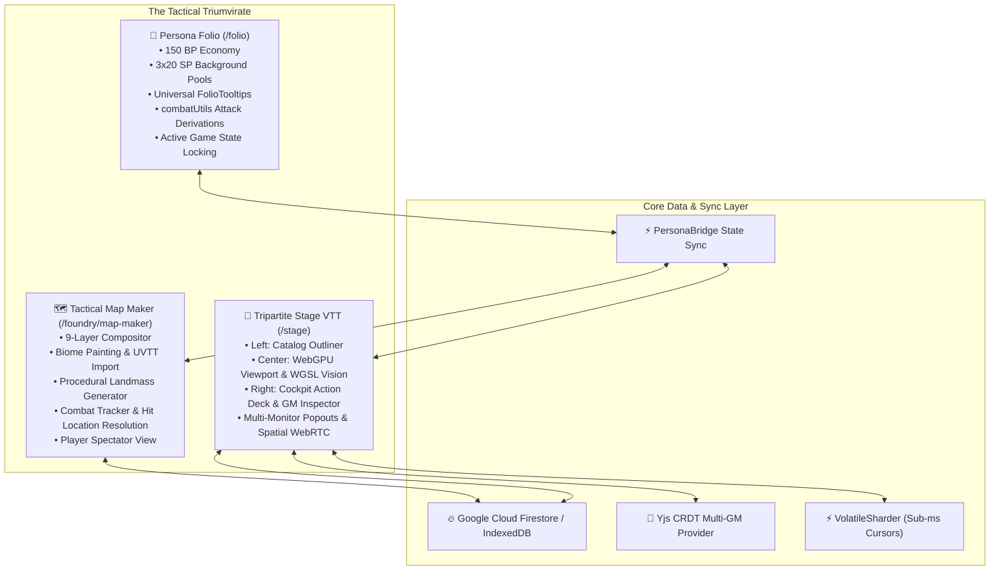
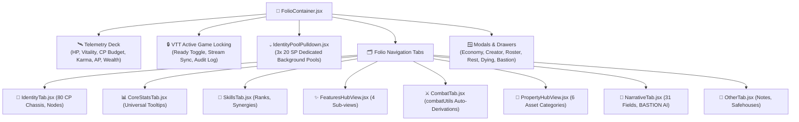
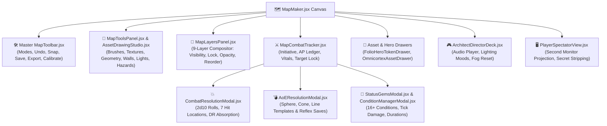
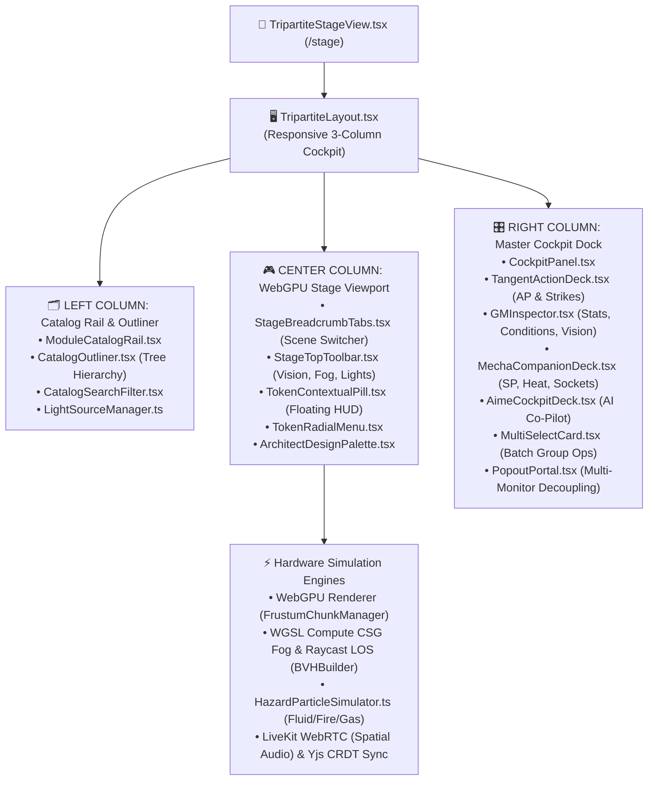
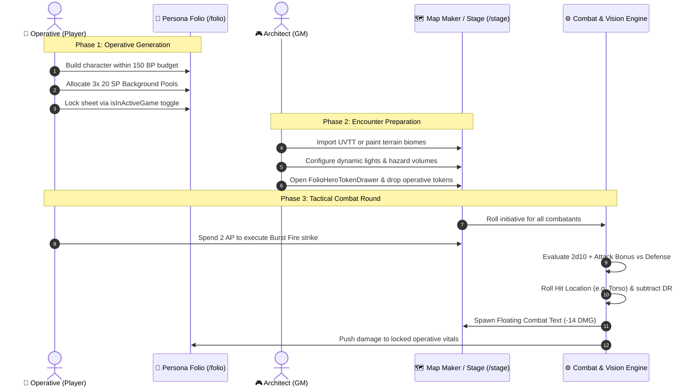

# 🌌 Tangent Science Fantasy Roleplay (TANGENT SFF RP)
# 📖 Master Component User Manual: Persona Folio, Tactical Map Maker & Tripartite VTT Stage

---

## 🧭 Executive Overview & Architectural Foundation

**Tangent Science Fantasy Roleplay (TANGENT SFF RP)** operates on an integrated triumvirate of core tactical systems:
1. **The Persona Folio (`/folio`)**: The official digital operative management and character generation suite, enforcing the 150 Build Point (BP) economy, derived mathematical pools, intelligent combat loadout derivation, and multiplayer game state locking.
2. **The Tactical Map Maker (`/foundry/map-maker`)**: The rapid-authoring battlemap studio featuring 9-layer compositing, textured biome painting, asset libraries, procedural landmass synthesis, Universal VTT (`.uvtt`) import, and integrated combat arbitration.
3. **The Next-Gen Tripartite Tactical Stage VTT (`/stage` / `/vtt`)**: The hardware-accelerated, three-column Virtual Tabletop engine powered by WebGPU, WGSL compute raycast Line-of-Sight, CSG Fog of War, fluid hazard simulations, LiveKit spatial WebRTC, and Yjs CRDT real-time multi-user synchronization.

---

## 📑 Master Table of Contents

- [Part I: The Persona Folio (`/folio`) Component Manual](#part-i-the-persona-folio-folio-component-manual)
  - [1.1 Global Header, Telemetry Deck & Top Navigation](#11-global-header-telemetry-deck--top-navigation)
  - [1.2 Active Game Participation & GM State Locking Engine](#12-active-game-participation--gm-state-locking-engine)
  - [1.3 Character Point (CP/BP) Economy Ledger (`EconomyModal.jsx`)](#13-character-point-cpbp-economy-ledger-economymodaljsx)
  - [1.4 The Three Dedicated 20 SP Background Pools (`IdentityPoolPulldown.jsx`)](#14-the-three-dedicated-20-sp-background-pools-identitypoolpulldownjsx)
  - [1.5 Tab 1: Identity & Archetype 80 CP Chassis (`IdentityTab.jsx`)](#15-tab-1-identity--archetype-80-cp-chassis-identitytabjsx)
  - [1.6 Tab 2: Core Stats, Sub-Attributes & Universal Tooltips (`CoreStatsTab.jsx`)](#16-tab-2-core-stats-sub-attributes--universal-tooltips-corestatstabjsx)
  - [1.7 Tab 3: Skills & Specializations Matrix (`SkillsTab.jsx`)](#17-tab-3-skills--specializations-matrix-skillstabjsx)
  - [1.8 Tab 4: Features & Augmentations Hub (`FeaturesHubView.jsx` & `FeaturesTab.jsx`)](#18-tab-4-features--augmentations-hub-featureshubviewjsx--featurestabjsx)
  - [1.9 Tab 5: Combat Tab & Arsenal Matrix (`CombatTab.jsx` & `combatUtils.js`)](#19-tab-5-combat-tab--arsenal-matrix-combattabjsx--combatutilsjs)
  - [1.10 Tab 6: Property & Logistics Hub (`PropertyHubView.jsx` & `PropertyTab.jsx`)](#110-tab-6-property--logistics-hub-propertyhubviewjsx--propertytabjsx)
  - [1.11 Tab 7: 31-Field Narrative Story Writer (`NarrativeTab.jsx`)](#111-tab-7-31-field-narrative-story-writer-narrativetabjsx)
  - [1.12 Tab 8: Notes, Contacts & Safehouses (`OtherTab.jsx`)](#112-tab-8-notes-contacts--safehouses-othertabjsx)
  - [1.13 Auxiliary Modals, Wizards & Drawers](#113-auxiliary-modals-wizards--drawers)
- [Part II: The Tactical Map Maker (`/foundry/map-maker`) Component Manual](#part-ii-the-tactical-map-maker-foundrymap-maker-component-manual)
  - [2.1 Main Canvas & Viewport Navigation (`MapMaker.jsx`)](#21-main-canvas--viewport-navigation-mapmakerjsx)
  - [2.2 Master Map Toolbar (`MapToolbar.jsx`)](#22-master-map-toolbar-maptoolbarjsx)
  - [2.3 Map Tools & Drawing Studio Panel (`MapToolsPanel.jsx` & `AssetDrawingStudio.jsx`)](#23-map-tools--drawing-studio-panel-maptoolspaneljsx--assetdrawingstudiojsx)
  - [2.4 9-Layer Compositor Panel (`MapLayersPanel.jsx`)](#24-9-layer-compositor-panel-maplayerspaneljsx)
  - [2.5 Map Key, Legend & POI Panel (`MapKeyPanel.jsx`)](#25-map-key-legend--poi-panel-mapkeypaneljsx)
  - [2.6 Map Metadata & Environmental Atmosphere Panel (`MapMetadataPanel.jsx`)](#26-map-metadata--environmental-atmosphere-panel-mapmetadatapaneljsx)
  - [2.7 Map Asset Manager & Texture Catalogs (`MapAssetManagerModal.jsx`)](#27-map-asset-manager--texture-catalogs-mapassetmanagermodaljsx)
  - [2.8 Folio Hero Token Drawer (`FolioHeroTokenDrawer.jsx`)](#28-folio-hero-token-drawer-folioherotokendrawerjsx)
  - [2.9 Omnicortex Asset Injection Drawer (`OmnicortexAssetDrawer.jsx`)](#29-omnicortex-asset-injection-drawer-omnicortexassetdrawerjsx)
  - [2.10 Tactical Combat Tracker & Turn Order Deck (`MapCombatTracker.jsx`)](#210-tactical-combat-tracker--turn-order-deck-mapcombattrackerjsx)
  - [2.11 Combat Resolution & Hit Location Modal (`CombatResolutionModal.jsx`)](#211-combat-resolution--hit-location-modal-combatresolutionmodaljsx)
  - [2.12 Area of Effect (AoE) Resolution Modal (`AoEResolutionModal.jsx`)](#212-area-of-effect-aoe-resolution-modal-aoeresolutionmodaljsx)
  - [2.13 Condition Manager & Status Gems Modal (`ConditionManagerModal.jsx` & `StatusGemsModal.jsx`)](#213-condition-manager--status-gems-modal-conditionmanagermodaljsx--statusgemsmodaljsx)
  - [2.14 Hazmat Volume & Environmental Breach Manager (`HazmatVolumeManagerModal.jsx`)](#214-hazmat-volume--environmental-breach-manager-hazmatvolumemanagermodaljsx)
  - [2.15 Interactive Object & Security Console Modal (`InteractiveObjectModal.jsx`)](#215-interactive-object--security-console-modal-interactiveobjectmodaljsx)
  - [2.16 Procedural Landmass & Biome Generator (`LandmassGeneratorModal.jsx`)](#216-procedural-landmass--biome-generator-landmassgeneratormodaljsx)
  - [2.17 External Map Underlay Calibration Modal (`MapUnderlayCalibrationModal.jsx`)](#217-external-map-underlay-calibration-modal-mapunderlaycalibrationmodaljsx)
  - [2.18 Universal VTT (UVTT) Importer (`UvttImportModal.jsx`)](#218-universal-vtt-uvtt-importer-uvttimportmodaljsx)
  - [2.19 Architect Director Deck & Environmental Presets (`ArchitectDirectorDeck.jsx`)](#219-architect-director-deck--environmental-presets-architectdirectordeckjsx)
  - [2.20 Token Radial Action Wheel (`TokenRadialActionWheel.jsx`)](#220-token-radial-action-wheel-tokenradialactionwheeljsx)
  - [2.21 Action Economy & Reaction Prompts (`MapActionEconomyDrawer.jsx` & `ReactionPromptModal.jsx`)](#221-action-economy--reaction-prompts-mapactioneconomydrawerjsx--reactionpromptmodaljsx)
  - [2.22 Operative Tactical HUD & Waypoint Ruler (`OperativeTacticalHud.jsx` & `WaypointRulerOverlay.jsx`)](#222-operative-tactical-hud--waypoint-ruler-operativetacticalhudjsx--waypointruleroverlayjsx)
  - [2.23 Starship Bridge & Fleet Combat Console (`StarshipBridgeModal.jsx`)](#223-starship-bridge--fleet-combat-console-starshipbridgemodaljsx)
  - [2.24 Mission Objectives & Scenario Countdown (`ScenarioObjectivesModal.jsx`)](#224-mission-objectives--scenario-countdown-scenarioobjectivesmodaljsx)
  - [2.25 Player Spectator Projection View (`PlayerSpectatorView.jsx`)](#225-player-spectator-projection-view-playerspectatorviewjsx)
  - [2.26 VTT Team Management & Permissions (`VttTeamManagementModal.jsx`)](#226-vtt-team-management--permissions-vttteammanagementmodaljsx)
  - [2.27 GM Command Console & VTT Settings (`VttCommandDrawer.jsx` & `VttOptionsModal.jsx`)](#227-gm-command-console--vtt-settings-vttcommanddrawerjsx--vttoptionsmodaljsx)
- [Part III: The Next-Gen Tripartite Tactical Stage VTT (`/stage` / `/vtt`) Component Manual](#part-iii-the-next-gen-tripartite-tactical-stage-vtt-stage--vtt-component-manual)
  - [3.1 Tripartite Architectural Layout & Layout Store (`TripartiteLayout.tsx` & `uiLayoutStore.ts`)](#31-tripartite-architectural-layout--layout-store-tripartitelayouttsx--uilayoutstorets)
  - [3.2 Left Column: Module Catalog Rail & Outliner Hierarchy](#32-left-column-module-catalog-rail--outliner-hierarchy)
  - [3.3 Center Column: Tactical Stage Viewport & Hardware Simulation Engines](#33-center-column-tactical-stage-viewport--hardware-simulation-engines)
  - [3.4 Multi-Scene Breadcrumb Tab Bar (`StageBreadcrumbTabs.tsx`)](#34-multi-scene-breadcrumb-tab-bar-stagebreadcrumbtabstsx)
  - [3.5 Stage Top Toolbar & Vision Controls (`StageTopToolbar.tsx`)](#35-stage-top-toolbar--vision-controls-stagetoptoolbartsx)
  - [3.6 Floating Token Contextual Pill (`TokenContextualPill.tsx`)](#36-floating-token-contextual-pill-tokencontextualpilltsx)
  - [3.7 Contextual Token Radial Menu (`TokenRadialMenu.tsx`)](#37-contextual-token-radial-menu-tokenradialmenutsx)
  - [3.8 Architect Design Palette & Light Source Manager (`ArchitectDesignPalette.tsx` & `LightSourceManager.ts`)](#38-architect-design-palette--light-source-manager-architectdesignpalettetsx--lightsourcemanagerts)
  - [3.9 Right Column: Master Cockpit Dock (`CockpitPanel.tsx`)](#39-right-column-master-cockpit-dock-cockpitpaneltsx)
  - [3.10 Cockpit Deck 1: Tangent Action Deck (`TangentActionDeck.tsx`)](#310-cockpit-deck-1-tangent-action-deck-tangentactiondecktsx)
  - [3.11 Cockpit Deck 2: GM Inspector (`GMInspector.tsx`)](#311-cockpit-deck-2-gm-inspector-gminspectortsx)
  - [3.12 Cockpit Deck 3: Mecha & Vehicle Companion Deck (`MechaCompanionDeck.tsx`)](#312-cockpit-deck-3-mecha--vehicle-companion-deck-mechacompaniondecktsx)
  - [3.13 Cockpit Deck 4: AIME Tactical Co-Pilot Deck (`AimeCockpitDeck.tsx`)](#313-cockpit-deck-4-aime-tactical-co-pilot-deck-aimecockpitdecktsx)
  - [3.14 Cockpit Deck 5: Multi-Select Batch Card (`MultiSelectCard.tsx`)](#314-cockpit-deck-5-multi-select-batch-card-multiselectcardtsx)
  - [3.15 Multi-Window Popout Engine (`PopoutPortal.tsx`)](#315-multi-window-popout-engine-popoutportaltsx)
  - [3.16 Real-Time Multiplayer, LiveKit WebRTC & CRDT Telemetry](#316-real-time-multiplayer-livekit-webrtc--crdt-telemetry)
- [Part IV: Integrated Cross-System Workflows](#part-iv-integrated-cross-system-workflows)
- [Part V: Exhaustive Component Lookup Table](#part-v-exhaustive-component-lookup-table)

---

# Part I: The Persona Folio (`/folio`) Component Manual

The **Persona Folio** is the digital operative sheet manager and character generation suite for Tangent Science Fantasy.

---

### 1.1 Global Header, Telemetry Deck & Top Navigation

Located at the top of the Persona Folio view (`FolioContainer.jsx`), this persistent telemetry bar monitors the operative's live vital signs, point economy, and campaign resources.

#### Usable Controls & Elements:
1. **Operative Portrait & Identity Badge**:
   - Displays avatar image. Clicking opens portrait URL input modal.
   - Shows Operative Name, Call-Sign, Species, and Archetype Class badge.
2. **Health Pool (HP) Gauge**:
   - **Formula**: $30 + \text{Fortitude}$.
   - **Visual States**: Emerald Green ($>50\%$), Amber ($25\%-50\%$), Crimson ($<25\%$), Pulsing Neon Red ($0$ HP / Dying state).
   - Direct numerical input for current HP; automatically caps at max HP.
3. **Vitality Pool Gauge**:
   - **Formula**: $30 + \text{Willpower}$.
   - Non-lethal damage and poise buffer. Absorbs standard kinetic and mental shock before lethal health damage is inflicted.
4. **Build Point (BP / CP) Economy Meter**:
   - Displays `[Spent BP] / [Max Budget BP]`.
   - **Legality Indicator**: Displays a glowing green `LEGAL BUILD` badge when $\le 150\text{ BP}$. Flashes a pulsing crimson `ILLEGAL BUILD` warning when over budget.
   - Clicking this badge immediately opens the `EconomyModal.jsx` line-item ledger.
5. **Action Points (AP) & Karma Trackers**:
   - **Action Points**: Displays available tactical AP for active rounds (default 3 AP).
   - **Karma Points**: Displays metaphysical reroll pips. Clickable to spend or replenish.
6. **Wealth Score (WS) & Liquid Credits**:
   - Displays derived Wealth Score and current Credits ($\text{Cr}$). Clickable to open property purchase modal.
7. **Quick Action Utility Bar**:
   - **Rest & Recovery (`RestRecoveryModal.jsx`)**: Short rest / Long rest trigger button.
   - **Guided Creator (`GuidedCreatorModal.jsx`)**: Launches the 8-step creation wizard.
   - **Roster Manager (`RosterModal.jsx`)**: Opens cloud-saved operatives drawer.
   - **Print Folio (`PrintFolio.jsx`)**: Formats operative for physical paper or PDF export.
   - **Cloud Sync Telemetry**: Status badge (`Synced`, `Syncing...`, `Offline Cache`, `Sync Error`).
   - **Export / Import**: One-click JSON export and file ingestion.
   - **BASTION AI Assistant Trigger**: Slides out the `BastionDrawer.jsx` co-pilot.

---

### 1.2 Active Game Participation & GM State Locking Engine

To prevent data desynchronization and cheat exploits during live multiplayer sessions, the Folio integrates a cryptographic **Active Game Locking Engine**.

#### Usable Controls & Logic:
1. **Session Ready Toggle (`isInActiveGame`)**:
   - A toggle switch in the Folio header. When enabled, the sheet locks all base inputs (Attributes, Skills, Features) into read-only mode.
2. **GM Live Telemetry Stream**:
   - While locked, the Game Master/Architect can remotely push state changes directly to the player's sheet:
     - Inflict Lethal Damage (deducts from Health).
     - Inflict Non-Lethal Damage (deducts from Vitality).
     - Grant Medical Stabilization / Healing.
     - Apply Status Conditions (Stunned, Bleeding, Burning, etc.).
     - Award Advancement Points (AP / XP) and Karma.
3. **Discreet Fate Override Modal (`DiscreetFateOverrideModal.jsx`)**:
   - If an operative must make an emergency mid-game modification (e.g., spending an unspent skill rank or rectifying an inventory error), clicking **Emergency Unlock** opens this audit dialog.
   - Requires typing a mandatory **Justification Reason**.
   - Submits an audit notification to the GM's VTT notification channel with choices to **Accept**, **Refuse**, or **Adjust**.

---

### 1.3 Character Point (CP/BP) Economy Ledger (`EconomyModal.jsx`)

The definitive financial and point ledger for character creation and advancement.

#### Usable Controls:
1. **Total Budget Configuration**: Defaults to 150 BP. GMs can adjust this limit for high-powered, cinematic, or gritty campaigns.
2. **Line-Item Category Breakdown**:
   - **Core Attributes**: Cost is 5 BP per +1 attribute score.
   - **Check Bonuses**: Cost is 1 BP per +1 sub-attribute saving check.
   - **General Skills**: Cost is 1 BP per rank beyond background allocations.
   - **Standard Features & Perks**: Rated by Tier (Tier 1: 5 CP, Tier 2: 10 CP, Tier 3: 15 CP).
   - **Metaphysics & Invocations**: 10 CP per Awakened discipline unlocked + invocation costs.
   - **Augmentation Hardware**: Node costs and Stigma calculations.
   - **Hindrances & Flaws**: Positive point rebates credited back to character pool (e.g., +5 CP, +10 CP).
3. **Rebate Reconciliation**: Real-time validation preventing players from claiming more than 30 CP in total Hindrance rebates.

---

### 1.4 The Three Dedicated 20 SP Background Pools (`IdentityPoolPulldown.jsx`)

Tangent SFF RP awards every character **three separate 20-point Skill Pools** during character creation, isolated from the general 150 BP pool:
1. **Faction Skill Pool (20 SP)**: Ranks selectable only from proficiencies granted by the operative's faction allegiance.
2. **Origin Skill Pool (20 SP)**: Ranks granted by the operative's homeworld environment.
3. **Occupation Skill Pool (20 SP)**: Ranks granted by the operative's vocational career.

#### Usable Controls:
- **Dedicated Dropdown Selectors**: In `IdentityTab.jsx` and `SkillsTab.jsx`, dropdown menus display eligible skills for each pool.
- **Independent Point Counters**: Visual `[Spent] / 20 SP` badges for each pool.
- **Anti-Bleed Safeguard**: Background skill ranks are strictly partitioned so unspent background points cannot be converted into general attribute BP.

---

### 1.5 Tab 1: Identity & Archetype 80 CP Chassis (`IdentityTab.jsx`)

Governs personal demographics, biological species lineage, archetype selection, and cybernetic node capacity.

#### Usable Controls:
1. **Biographical Demographics**: Inputs for Operative Name, Code Alias, Age, Sex/Gender, Pronouns, Height, Weight, Hair, Eyes, Distinguishing Marks.
2. **Species Selection Matrix**:
   - Dropdown selecting canon species (Human, Terran Cybrid, Kitin, Drakari, Jovian Neogen, Vulpine Corsair, etc.).
   - Automatically injects species traits, baseline attribute modifiers, vision modes (Darkvision, Thermal), and biological perks.
3. **Archetype 80 CP Chassis Selector**:
   - One-click template applicator for rapid creation: Commando, Tactical Hacker, Cyber-Ninja, Awakened Psion, Fleet Gunner, Combat Medic, Void Scavenger.
   - Instantly allocates 80 CP: +3 Primary Attribute, +2 Secondary Attribute, core vocation skills, and signature features.
4. **Augmentation Hardware Nodes Ledger**:
   - Tracks 6 somatic installation sockets: Cranial, Ocular, Thoracic, Neural, Dermal, Somatic.
   - Displays **Stigma Score**: Automatically steps down Social/Etiquette checks by $-1$ for every 5 installed augmentation nodes.

---

### 1.6 Tab 2: Core Stats, Sub-Attributes & Universal Tooltips (`CoreStatsTab.jsx`)

Governs the 6 primary attributes, 6 sub-attributes, and all derived mathematical pools.

#### Usable Controls:
1. **Primary Attributes**:
   - **STR (Strength)**: Physical power, muscle density, melee damage bonus.
   - **AGI (Agility)**: Balance, reflexes, motor coordination, evasion.
   - **STA (Stamina)**: Metabolic endurance, cellular toughness, wound soak.
   - **INT (Intelligence)**: Memory, logical deduction, technical aptitude.
   - **WIS (Wisdom)**: Intuition, situational awareness, willpower, grit.
   - **CHA (Charisma)**: Force of personality, leadership, social negotiation.
   - Incremental `+` and `-` buttons (5 BP cost per +1).
2. **Sub-Attributes / Saving Checks**:
   - **Might** (STR-linked): Feats of brute force, lifting, heavy melee recoil.
   - **Reflex** (AGI-linked): Dodging traps, diving from explosions, rapid response.
   - **Fortitude** (STA-linked): Resisting toxins, biological diseases, physical trauma.
   - **Reason** (INT-linked): Scientific analysis, hacking encryption, puzzle solving.
   - **Willpower** (WIS-linked): Mental poise, resisting psychic manipulation, fear saves.
   - **Etiquette** (CHA-linked): Diplomatic protocol, high-society banter, deception detection.
   - Incremental `+` and `-` buttons (1 BP cost per +1).
3. **Universal FolioTooltips (`FolioTooltip.jsx`)**:
   - Hovering over any attribute or pool reveals a tooltip card displaying the exact mathematical formula:
     $$\text{Final Score} = \text{Base Score} + \text{Species Mod} + \text{Purchased BP} + \text{Augmentation Mod} + \text{Gear Mod}$$
4. **Derived Tactical Vitals Cards**:
   - **Health Pool**: Base $30$, increased by $+5$ per $1\text{ CP}$ (maximum $+5 \times \text{Stamina}$). Direct structural wound threshold.
   - **Vitality Pool**: Base $30$, increased by $+5$ per $1\text{ CP}$ (maximum $+5 \times \text{Stamina}$). Non-lethal buffer and combat energy.
   - **Base Toughness (Natural DR)**: STA score. Reduces any penetrating damage down to a minimum of 1 point (if armor absorbs the blow entirely, damage is 0).
   - **Defense Value**: $10 + \text{Reflex} + \text{Armor Evasion Mod}$. Target number to hit the operative.
   - **Perception Score**: $10 + \text{Reason} + \text{Perception Skill Rank}$.
   - **Carry Capacity**: Light load ($5 \times \text{STR}\text{ kg}$), Heavy load ($10 \times \text{STR}\text{ kg}$), Maximum drag/lift ($20 \times \text{STR}\text{ kg}$).
   - **Locomotion Rates**: Tactical Walk ($10 + \text{Reflex}\text{ m/round}$), Sprint ($2 \times \text{Walk}$), Climb/Swim rates.

---

### 1.7 Tab 3: Skills & Specializations Matrix (`SkillsTab.jsx`)

Governs operative training across all technical, combat, and social disciplines.

#### Usable Controls:
1. **Categorized Skill Accordions**:
   - **Combat**: Melee, Ballistic Firearms, Energy Weapons, Heavy Weapons, Unarmed, Primitive Ranged, Gunnery.
   - **Physical**: Athletics, Acrobatics, Stealth, Sleight of Hand, Survival.
   - **Mental Knowledge**: Astrogation, Medicine, Xenobiology, History, Engineering, Computer Hacking.
   - **Mental Vocation**: Pilot (Ground, Air, Space), Investigation, Mechanics, Streetwise.
   - **Social**: Persuasion, Deception, Intimidation, Leadership, Barter.
   - **Metafocus**: Channeling, Biokinetic Control, Telepathic Scrying.
2. **Rank Stepper**:
   - Novice ($+1$), Expert ($+2$), Master ($+3$), Legend ($+4$).
3. **Synergy Bonus Indicators**: Automatically highlights linked attribute check synergy bonuses.
4. **Interactive Dice Roll Trigger**: Clicking any skill name broadcasts an instant $2\text{d}10 + \text{Bonus}$ check roll to the CommLink relay and active VTT stage.
5. **Custom Skill Creator (`AddSkillModal.jsx`)**: Allows adding homebrew skills with custom governing attributes.

---

### 1.8 Tab 4: Features & Augmentations Hub (`FeaturesHubView.jsx` & `FeaturesTab.jsx`)

Command dashboard managing special perks, psychic invocations, cyberware, and character hindrances.

#### Usable Controls:
1. **Features Hub Summary View (`FeaturesHubView.jsx`)**:
   - Top banner displaying total CP allocation across all four sub-disciplines.
   - Clickable cards navigating into each specialized sub-section.
2. **Sub-View 1: Standard Features**:
   - Martial feats, tactical perks, biological mutations.
   - Filter by Tier (Tier 1–3), search by keyword, add/remove perks.
3. **Sub-View 2: Metaphysics & Awakened**:
   - Unlocks 6 Psionic Disciplines: Telekinesis, Biokinesis, Pyrokinesis, Chronomancy, Telepathy, Void Inversion.
   - Invocation cards showing Essence Cost, Range, Duration, and Effect description.
4. **Sub-View 3: Augmentations & Cyberware**:
   - Cybernetic implants, synthetic organs, dermal armor plates, sub-dermal weaponry.
   - Socket allocation (Cranial, Ocular, Thoracic, Neural, Dermal, Somatic) and Stigma calculation.
5. **Sub-View 4: Hindrances & Flaws**:
   - Disadvantages granting CP rebates back to the character budget.
   - Enforces the 30 CP maximum rebate cap.

---

### 1.9 Tab 5: Combat Tab & Arsenal Matrix (`CombatTab.jsx` & `combatUtils.js`)

#### Usable Controls:
1. **Automated Weapon Profile Derivation (`combatUtils.js`)**:
   - Automatically maps equipped weapons to appropriate skills and attributes (using the full unhalved attribute score: $\text{Skill Rank} + \text{Attribute}$):
     - **Melee / Unarmed**: Uses `combat-melee` or `combat-unarmed` + $\text{Might}$.
     - **Ballistic Firearms**: Uses `combat-ballistic` + $\text{Reflex}$.
     - **Energy Weapons**: Uses `combat-energy` + $\text{Reflex}$.
     - **Heavy Artillery**: Uses `combat-heavy-weapons` + $\text{Might}$.
     - **Primitive Ranged**: Uses `combat-ranged` + $\text{Reflex}$.
2. **Interactive Strike Cards**:
   - Displays Weapon Name, Attack Check Bonus, Damage Expression (e.g. $2\text{d}8+4$), Damage Type (Kinetic, Thermal, Energy, Bio, Blast), Range Brackets (Point Blank, Short, Medium, Long, Extreme), Rate of Fire (Single, Burst, Full-Auto), and Ammo Counter.
   - **Attack Button**: Executes live $2\text{d}10$ attack roll directly into the VTT combat log.
   - **Reload Button**: Expends tactical AP to reload weapon ammo magazine.
3. **Armor & Protective Suite**:
   - Displays 7-Zone Hit Coverage (Head, Torso, Left Arm, Right Arm, Left Leg, Right Leg, Vitals).
   - Shows Damage Reduction (DR) values for Kinetic, Energy, Thermal, and Environmental hazards.
   - **Shield Generator HUD**: Monitors active forcefield barrier pips and recharge rate.
4. **Tactical Combat Stance Toggles**:
   - **Aim**: Spends 1 AP to gain $+2$ to the next ranged attack.
   - **Defensive Stance**: Spends 1 AP to gain $+3$ to Defense until next turn.
   - **Take Cover**: Toggles Half-Cover ($+2$ Defense) or Full-Cover ($+4$ Defense).
   - **Overwatch**: Reserves 1 AP to trigger reaction fire during enemy movement.

---

### 1.10 Tab 6: Property & Logistics Hub (`PropertyHubView.jsx` & `PropertyTab.jsx`)

Logistical command center managing gear valuation, weight encumbrance, vehicles, and real estate.

#### Usable Controls:
1. **Logistical Overview Banner (`PropertyHubView.jsx`)**:
   - Displays Total Portfolio Valuation in Credits ($\text{Cr}$) / Megacredits ($\text{MCr}$).
   - Displays Total Weight ($\text{kg}$) vs Light/Heavy Carry Capacity thresholds. Automatically flags encumbrance movement penalties.
2. **Six Modular Asset Categories**:
   - **Weaponry**: Firearms, blades, ammunition packs, weapon attachments.
   - **Armoring & Shields**: Suits, exosuits, tactical vests, shield generators.
   - **Gear & Tools**: Scanners, medkits, hacking cyberdecks, survival kits, comms.
   - **Mecha & Vehicles**: Speeders, atmospheric shuttles, assault mecha, starships.
   - **Architecture & Bases**: Safehouses, laboratory modules, private apartments, hangars.
   - **Other Logistics**: Trade commodities, ration supplies, planetary currency chits.
3. **Item Operations**: Add Item (`AddItemModal.jsx`), Edit quantity, Equip/Unequip toggle, Drop/Delete, Transfer to squad container.

---

### 1.11 Tab 7: 31-Field Narrative Story Writer (`NarrativeTab.jsx`)

Structured narrative authoring suite for rich character lore and roleplay depth.

#### Usable Controls:
1. **Four Structured Domains**:
   - **Biography**: Birthplace, Upbringing, Family Status, Education, Formative Crisis, Defining Triumph.
   - **Psychology**: Moral Philosophy, Core Values, Worst Fear / Phobias, Idiosyncratic Quirks, Emotional Triggers, Personal Code.
   - **Factions & Relations**: Allegiances, Sworn Enemies, Mentor Figures, Outstanding Debts, Corporate Bounties, Safe Contacts.
   - **Logistics & Secrets**: Hidden Agendas, Secret Safehouse Locations, Unregistered Bank Accounts, Contraband Caches.
2. **🤖 BASTION AI Auto-Writer Integration**:
   - Dedicated AI drafting buttons on every field: *Auto-Draft Backstory*, *Generate Quirks*, *Flesh out Rivalry*, *Polish Prose*.
   - Uses client-side semantic context from active species, occupation, and faction to generate lore-accurate canon prose.

---

### 1.12 Tab 8: Notes, Contacts & Safehouses (`OtherTab.jsx`)

Freeform mission journal and field logistics manager.

#### Usable Controls:
- **Session Notes Pad**: Markdown-supported rich text area with auto-save to cloud.
- **Faction Contact Directory**: Card list tracking NPC names, faction affiliations, trust ratings, and encrypted comm frequencies.
- **Safehouse & Asset Registry**: Map coordinates, security codes, and stored supplies.

---

### 1.13 Auxiliary Modals, Wizards & Drawers

- **Guided Creator Wizard (`GuidedCreatorModal.jsx`)**: 8-step wizard (Concept $\rightarrow$ Species $\rightarrow$ Origin $\rightarrow$ Faction $\rightarrow$ Occupation $\rightarrow$ Attributes $\rightarrow$ Skills $\rightarrow$ Gear).
- **Roster Management Modal (`RosterModal.jsx`)**: Cloud operatives browser with one-click switching, cloning, duplicating, and public share URL generation.
- **Rest & Recovery Modal (`RestRecoveryModal.jsx`)**: Short rest (Vitality replenishment, field dressings) and Long rest (Health regeneration, fatigue clearing, trauma recovery).
- **Vitals & Dying Modal (`VitalsDyingModal.jsx`)**: Mortal injury tables, $2\text{d}10$ Death Saving Throws, and stabilization surgery DCs.
- **BASTION AI Drawer (`BastionDrawer.jsx`)**: Sliding chat drawer offering instant rules advice, character ideas, and lore assistance.
- **Print Folio Engine (`PrintFolio.jsx`)**: Generates print-ready high-contrast character sheets optimized for physical binders or PDF archiving.

---

# Part II: The Tactical Map Maker (`/foundry/map-maker`) Component Manual

The **Tactical Map Maker** is the rapid-authoring battlemap creator and tactical combat workstation.

---

### 2.1 Main Canvas & Viewport Navigation (`MapMaker.jsx`)

The central rendering canvas powered by React Konva and HTML5 2D Canvas.

#### Usable Controls:
- **Infinite Pan**: Hold `Middle Mouse Button` or hold `Spacebar` and drag left mouse button.
- **Smooth Zoom**: Rotate `Mouse Scroll Wheel` or use the `+` / `-` buttons on the viewport controls (zooms from 10% to 500%).
- **Grid Snapping Toggle (`S`)**: Snaps placed props, walls, and tokens to grid intersections or center points.
- **Coordinate Overlay**: Real-time cursor coordinates $(X, Y)$ displayed in the status bar in both pixels and grid cells.

---

### 2.2 Master Map Toolbar (`MapToolbar.jsx`)

Persistent horizontal control bar positioned at the top of the Map Maker interface.

#### Usable Controls:
1. **Tool Mode Selector**:
   - **Select / Transform (`V`)**: Move, scale, and rotate objects, walls, or tokens.
   - **Pan / Hand (`H`)**: Navigate canvas freely.
   - **Draw Terrain (`B`)**: Paint floor tiles and biomes.
   - **Place Walls (`W`)**: Construct sight-blocking and movement-blocking barriers.
   - **Place Lights (`L`)**: Drop dynamic point lights and ambient glows.
   - **Place Hazards (`Z`)**: Paint toxic, thermal, or radiation volumes.
   - **Ruler / Measure (`M`)**: Measure tactical movement distances.
2. **Edit Actions**:
   - **Undo (`Ctrl+Z`)** / **Redo (`Ctrl+Y`)**: 50-step undo/redo stack.
   - **Clear Canvas**: Resets map with confirmation prompt.
   - **Center on Selection**: Snaps viewport camera to currently selected token or prop.
3. **File Operations**:
   - **Save Map**: Saves current scene directly to Google Cloud Firestore.
   - **Export Image**: Exports canvas to high-resolution `PNG`, `JPEG`, or `WebP`.
   - **Export UVTT / JSON**: Exports map data compatible with Universal VTT standards.
   - **Import UVTT (`UvttImportModal.jsx`)**: Imports external `.dd2vtt` battlemaps.
   - **Calibrate Underlay (`MapUnderlayCalibrationModal.jsx`)**: Aligns external blueprint images to the grid.
4. **VTT & Projection Triggers**:
   - **Combat Tracker (`MapCombatTracker.jsx`)**: Toggles the right-hand initiative tracker.
   - **Spectator Projection (`PlayerSpectatorView.jsx`)**: Launches the player-facing monitor window.

---

### 2.3 Map Tools & Drawing Studio Panel (`MapToolsPanel.jsx` & `AssetDrawingStudio.jsx`)

Left-side toolbox for painting environments and configuring geometric objects.

#### Usable Controls:
1. **Terrain & Biome Brushes**:
   - **Textures (`MapTextures.js`)**: Sci-Fi Steel Decking, Carbon Fiber Tile, Volcanic Basalt, Rust Wasteland Sand, Cyber-Neon Pavement, Toxic Sludge, Deep Water, Grassy Turf, Void Space.
   - **Brush Radius Slider**: 1 to 10 grid cells.
   - **Opacity Slider**: 0% to 100%.
2. **Geometric Vector Tools**:
   - Rectangle, Circle/Ellipse, Multi-Point Polygon, Freehand Line.
3. **Wall & Barrier Placer**:
   - **Solid Wall**: Blocks both Line-of-Sight and physical movement.
   - **Glass / Energy Window**: Transparent to sight, blocks physical movement.
   - **Standard Door**: Interactive door toggleable between **Open**, **Closed**, **Locked**, and **Destroyed**.
   - **Secret Door**: Hidden from player view; visible only to GM.
   - **Half-Cover Barricade**: Grants $+2$ Defense bonus; allows vaulting.
4. **Light Source Placer**:
   - Select Point Light, Directional Spotlight, or Ambient Glow.
   - Color picker wheel, Lumens/Radius slider (1m to 50m), Falloff Softness slider, and Dynamic Animation toggles (Flicker, Pulse, Strobe).
5. **Asset Drawing Studio (`AssetDrawingStudio.jsx`)**:
   - In-app vector drawing studio to sketch custom props, furniture, and tokens, saving them directly into your map library.

---

### 2.4 9-Layer Compositor Panel (`MapLayersPanel.jsx`)

Manages the hierarchical rendering order of all map elements.

#### The 9 Discrete Layers:
1. **Grid Overlay Layer**: Renders square or hex grid lines with customizable color and opacity.
2. **Background / Blueprint Underlay Layer**: Holds imported floorplans and satellite images.
3. **Floor Tile & Terrain Layer**: Holds painted biomes and textures.
4. **Object & Prop Layer**: Holds furniture, consoles, crates, and debris.
5. **Wall & Door Occlusion Layer**: Holds raycast vision-blocking geometry.
6. **Hazard & Environment Layer**: Holds fire, gas, and radiation volumes.
7. **Entity & Token Layer**: Holds player heroes, NPCs, and vehicles.
8. **Dynamic Lighting & Fog Layer**: Holds light sources and unexplored fog masks.
9. **GM Secret / Annotations Layer**: Holds secret traps, hidden doors, and GM notes invisible to players.

#### Usable Layer Controls:
- **Visibility Eye Icon**: Toggles layer visibility.
- **Lock Icon**: Locks layer against accidental selection or edits.
- **Opacity Slider**: Adjusts transparency of the active layer.
- **Drag Handles**: Reorders layer stacking order.

---

### 2.5 Map Key, Legend & POI Panel (`MapKeyPanel.jsx`)

Places points of interest (POIs) and narrative triggers on the map.

#### Usable Controls:
- **POI Stamp Drop**: Drops numbered (1–99) or lettered (A–Z) markers onto canvas.
- **Title & Narrative Body**: Text fields for room descriptions and encounter notes.
- **GM Secret Toggle**: Hides POI marker from player spectator views until triggered.

---

### 2.6 Map Metadata & Environmental Atmosphere Panel (`MapMetadataPanel.jsx`)

Configures global sector physics, dimensions, and atmospheric conditions.

#### Usable Controls:
- **Map Dimensions**: Width $\times$ Height in grid units (e.g. $50 \times 50$).
- **Grid Unit Scale**: Configurable scale (e.g., 1 cell = 5 ft, 1.5 m, 2 m, or 10 m for starships).
- **Atmospheric Profile**: Breathable, Thin (suffocation checks), Toxic (respirator required), Vacuum (decompression rules).
- **Gravity Rating**: Zero-G, Low Gravity, Standard Gravity, High Gravity (encumbrance doubled).
- **Ambient Lighting Level**: Bright Sunlight, Dim Interior, Pitch Darkness.

---

### 2.7 Map Asset Manager & Texture Catalogs (`MapAssetManagerModal.jsx`)

Comprehensive asset management suite for props, tokens, and textures.

#### Usable Controls:
- **Categorized Browser**: Sci-Fi Industrial, Cyberpunk Urban, Starship Interior, Alien Bioship, Wasteland Derelict.
- **Local Asset Upload**: Drag-and-drop your own `PNG`, `SVG`, or `WebP` files.
- **Scale & Tint Controls**: Adjust default dimensions and color tint of assets before stamping.

---

### 2.8 Folio Hero Token Drawer (`FolioHeroTokenDrawer.jsx`)

Direct bridge between your Persona Folio roster and the Tactical Map Maker canvas.

#### Usable Controls:
- **Operative Roster Cards**: Displays all saved characters with portraits, species, and archetypes.
- **Drag-and-Drop Spawning**: Dragging an operative card onto the canvas instantly creates a linked token.
- **Synchronized Vitals Ring**: Token displays circular Health and Vitality gauge rings around its border, updating in real time.

---

### 2.9 Omnicortex Asset Injection Drawer (`OmnicortexAssetDrawer.jsx`)

Searchable rules compendium drawer directly inside the map editor.

#### Usable Controls:
- Search weapons, armor, tech devices, and vehicles from the canonical Omnicortex database.
- Drag any item directly onto a map tile to create an interactive lootable chest or drop-pod.

---

### 2.10 Tactical Combat Tracker & Turn Order Deck (`MapCombatTracker.jsx`)

The live combat arbitration deck docked on the right side of the screen.

#### Usable Controls:
1. **Round & Turn Counter**: Displays current combat round and active combatant.
2. **Initiative Operations**:
   - **Roll All NPCs**: Automatically rolls $2\text{d}10 + \text{Reflex}$ for all enemy tokens.
   - **Roll All PCs**: Rolls initiative for all player operatives.
   - **Manual Override**: Click any initiative score to manually edit turn order.
   - **Sort Order**: Automatically sequences participants from highest to lowest initiative.
3. **Per-Combatant Token Cards**:
   - Operative thumbnail, Name, and Faction tag.
   - Live Health & Vitality numeric gauges.
   - **Fast Damage / Heal Inputs**: Enter a number and click `DMG` or `HEAL` for instant HP calculation.
   - **Status Gem Pills**: Displays active conditions (Stunned, Bleeding, etc.).
   - **Target Lock Reticle**: Selects token as active combat target.
   - **Camera Focus Button**: Instantly centers canvas camera on the token.
   - **Defeat / Remove**: Marks token dead or removes from combat tracker.

---

### 2.11 Combat Resolution & Hit Location Modal (`CombatResolutionModal.jsx`)

Automated physical combat arbitration engine.

#### Usable Controls & Flow:
1. **Attacker & Target Selection**: Automatically populates from active selection or manual dropdown.
2. **Equipped Weapon Picker**: Selects weapon from attacker's loadout.
3. **Attack Mode Selection**: Standard Attack, Aimed Shot ($+2$), Burst Fire ($-2$ attack, $+4$ damage), Full-Auto (AoE cone), Suppressive Fire.
4. **Resolution Engine**:
   - Rolls $2\text{d}10 + \text{Attack Bonus}$ vs Defender's Defense Value.
   - Evaluates Critical Hits (rolling double 10s or beating Defense by 10+) and Fumbles (double 1s).
5. **Hit Location Derivation**:
   - Automatically rolls $1\text{d}10$ for hit location:
     - **1**: Head (Crit multiplier $\times 1.5$, bypasses partial armor).
     - **2–5**: Torso (Standard armor DR applied).
     - **6**: Right Arm (Item drop check).
     - **7**: Left Arm (Shield or secondary weapon hit).
     - **8**: Right Leg (Movement speed halved).
     - **9**: Left Leg (Movement speed halved).
     - **10**: Vital Core (Direct lethal damage, bypasses Vitality).
6. **Armor Absorption & Wound Allocation**:
   - Subtracts location-specific Armor Damage Reduction (DR) from incoming damage.
   - Any damage penetrating armor is further reduced by Defender's natural Stamina DR, down to a minimum of 1 point (deflected blows deal 0).
   - Non-lethal attacks apply net damage first to Defender's Vitality; any overflow spills into Health as lethal damage. Lethal attacks apply directly to Health. Synthetics apply all damage to Structure and are immune to non-lethal damage.
7. **Floating Combat Text Dispatch**: Spawns animated floating damage numbers over target token.

---

### 2.12 Area of Effect (AoE) Resolution Modal (`AoEResolutionModal.jsx`)

Handles grenades, explosions, flamethrowers, and psionic shockwaves.

#### Usable Controls:
- **AoE Template Selector**: Sphere / Blast Radius, Cone / Spray, Line / Beam, Cube / Box.
- **Template Radius Slider**: Adjusts radius from 1m to 30m.
- **Interactive Placement**: Position template origin on map; automatically detects all tokens caught inside the volume.
- **Saving Throw Prompt**: Triggers Reflex Saving Throws for caught targets; calculates full damage vs half damage automatically.

---

### 2.13 Condition Manager & Status Gems Modal (`ConditionManagerModal.jsx` & `StatusGemsModal.jsx`)

Applies visual status gems and duration-tracked conditions to token bases.

#### Usable Conditions:
- **Bleeding (Crimson Gem)**: Takes $1\text{d}6$ kinetic damage at start of turn.
- **Burning (Orange Gem)**: Takes escalating thermal damage until extinguished.
- **Poisoned / Diseased (Emerald Gem)**: $-2$ penalty to all physical attribute checks.
- **Stunned (Amber Gem)**: Loses all Action Points for 1 turn.
- **Concealed / In Cover (Cyan Gem)**: $+3$ Defense bonus against ranged attacks.
- **Blinded / Sensor Jammed (White Gem)**: Disadvantage on all attack rolls.
- **Prone / Immobilized (Grey Gem)**: Movement speed set to 0; melee attacks against target have advantage.
- **Psionically Drained (Purple Gem)**: Cannot cast Awakened invocations.
- **Duration Counter**: Automatically decrements condition duration at end of round.

---

### 2.14 Hazmat Volume & Environmental Breach Manager (`HazmatVolumeManagerModal.jsx`)

Manages propagating hazard volumes on the map.

#### Usable Controls:
- **Hazard Type**: Toxic Gas, Spreading Fire, Radiation Leak, Atmospheric Vacuum Breach.
- **Intensity Tier (Tier 1–5)**: Dictates damage dice per round and saving throw DC.
- **Propagation Toggle**: When enabled, fire or gas automatically spreads to adjacent cells each round.
- **Dissipation Timer**: Number of rounds until hazard dissipates.

---

### 2.15 Interactive Object & Security Console Modal (`InteractiveObjectModal.jsx`)

Transforms placed props into interactive terminals, doors, chests, or traps.

#### Usable Controls:
- **Door Security**: Lock level (Keycard, Biometric, Cyber-Hack), Blast Resistance HP, Hack DC.
- **Computer Terminal**: Security clearance level, encrypted log files, camera feed links, turret control toggle.
- **Loot Cache**: Credit bounty amount, attached item inventory, locked/unlocked state.
- **Trap Mechanism**: Trigger type (Proximity, Tripwire, Pressure Plate), Detection DC, Disarm DC, AoE payload.

---

### 2.16 Procedural Landmass & Biome Generator (`LandmassGeneratorModal.jsx`)

Procedural planetary surface generator powered by multi-octave Simplex/Perlin noise algorithms.

#### Usable Controls:
- **Random Seed Input**: Enter custom seed or click `Randomize`.
- **Topography Preset**: Continental Landmass, Oceanic Archipelago, Cratered Wasteland, Volcanic Caldera, Canyon Fissures.
- **Noise Octaves & Roughness Sliders**: Fine-tunes coastline complexity and mountain peak sharpness.
- **Biome Thresholds**: Configures elevation bands (Deep Water, Shallows, Beach Sand, Lowland Plains, High Peaks).
- **Generate & Bake**: Bakes procedural terrain directly into the Floor Tile layer.

---

### 2.17 External Map Underlay Calibration Modal (`MapUnderlayCalibrationModal.jsx`)

Calibrates imported external battlemaps to match the engine's grid.

#### Usable Controls:
- **3-Point Alignment Tool**: Click three grid intersections on the image to calculate exact grid size.
- **Scale X/Y Sliders**: Stretch or shrink image dimensions.
- **Grid Offset X/Y**: Nudge image alignment by single pixels.
- **Opacity Blending**: Adjust transparency between blueprint and virtual grid.

---

### 2.18 Universal VTT (UVTT) Importer (`UvttImportModal.jsx`)

Imports `.dd2vtt` / `.uvtt` files generated by Dungeondraft and other third-party cartography tools.

#### Automated Extraction Features:
- Extracts high-resolution background map image.
- Automatically converts wall vector segments into solid sight-blocking and movement-blocking walls.
- Converts portal objects into interactive doors and windows.
- Extracts light source positions, lumens radius, and color hex codes.

---

### 2.19 Architect Director Deck & Environmental Presets (`ArchitectDirectorDeck.jsx`)

The GM's master stage director and atmospheric control console.

#### Usable Controls:
1. **Environmental Lighting Presets**:
   - **Bright Noon**: Full ambient illumination, crisp shadows.
   - **Cyberpunk Night**: Deep blue/purple ambient light, high contrast neon glows.
   - **Emergency Siren**: Pulsing red emergency lighting.
   - **Deep Space Void**: Zero ambient light; tokens rely entirely on flashlights.
   - **Alien Bioluminescence**: Eerie green/teal ambient radiance.
2. **Procedural Soundscape Player**:
   - Web Audio synthesizer generating procedural rain, wind howling, industrial hum, and starship engine drones.
3. **Master Stage Commands**:
   - **Mass Token Reveal / Hide**: Instantly hides or reveals all enemy tokens.
   - **Reset Global Fog**: Resets Fog of War to unexplored state.

---

### 2.20 Token Radial Action Wheel (`TokenRadialActionWheel.jsx`)

Contextual radial wheel that expands around any selected token.

#### Usable Slices:
- **Move**: Activates waypoint path ruler.
- **Attack**: Opens weapon strike menu.
- **Status Gems**: Opens condition applicator.
- **Inspect**: Opens character sheet summary.
- **Hide / Reveal**: Toggles player visibility.
- **Delete**: Removes token from canvas.

---

### 2.21 Action Economy & Reaction Prompts (`MapActionEconomyDrawer.jsx` & `ReactionPromptModal.jsx`)

- **MapActionEconomyDrawer.jsx**: Monitors the 3-AP tactical budget for the active combatant (Quick Actions = 1 AP, Standard Actions = 2 AP, Full-Round Actions = 3 AP).
- **ReactionPromptModal.jsx**: Pops up automatically when a combat trigger occurs (e.g. an enemy moving past an operative), prompting the player or GM to execute an Opportunity Strike, Evasive Parry, or Shield Intercept.

---

### 2.22 Operative Tactical HUD & Waypoint Ruler (`OperativeTacticalHud.jsx` & `WaypointRulerOverlay.jsx`)

- **OperativeTacticalHud.jsx**: Compact bottom overlay appearing when a player token is selected, providing quick buttons for equipped weapon attacks, defensive stances, and remaining movement.
- **WaypointRulerOverlay.jsx**: Multi-segment measuring ruler calculating distance in meters/feet, taking difficult terrain multipliers ($1.5\times$ or $2\times$) into account.

---

### 2.23 Starship Bridge & Fleet Combat Console (`StarshipBridgeModal.jsx`)

Tactical space combat command console for starship bridge operations.

#### Usable Stations:
- **Helm**: Thrust vectors, evasive maneuvers, orbital entry.
- **Power Routing**: Distributes energy pips across Weapons, Shields, Engines, and Sensors.
- **Shield Quadrants**: Monitors and reinforces Fore, Aft, Port, and Starboard shield arcs.
- **Weapon Batteries**: Fires beam cannons, railgun turrets, and torpedo salvos.

---

### 2.24 Mission Objectives & Scenario Countdown (`ScenarioObjectivesModal.jsx`)

Campaign objective tracking HUD for active encounters.

#### Usable Controls:
- Primary and Secondary objectives checklist with live completion checkmarks.
- Turn Countdown Timer: Decrements each round; triggers reinforcements or mission failure if expired.

---

### 2.25 Player Spectator Projection View (`PlayerSpectatorView.jsx`)

Secondary monitor projector route (`/spectator/:mapId`) designed for multi-monitor setups or physical TV battlemaps.

#### Usable Features:
- Automatically strips all GM toolbars, layer panels, and editor chrome.
- Hides the GM Secret Layer, concealed traps, and hidden enemies.
- Automatically tracks party tokens or locks camera to designated sector coordinates.

---

### 2.26 VTT Team Management & Permissions (`VttTeamManagementModal.jsx`)

Multiplayer squad management and access control matrix.

#### Usable Controls:
- Assigns specific character tokens to connected player accounts.
- Configures Individual Vision vs Shared Party Vision modes.
- Grants Co-GM / Assistant Architect permissions to trusted players.

---

### 2.27 GM Command Console & VTT Settings (`VttCommandDrawer.jsx` & `VttOptionsModal.jsx`)

- **VttCommandDrawer.jsx**: Terminal console executing slash commands (`/tp`, `/heal`, `/damage`, `/spawn`, `/kill`, `/weather`, `/light`).
- **VttOptionsModal.jsx**: Graphics and performance options: Renderer selection (WebGPU / WebGL / 2D Canvas), anti-aliasing, grid line thickness, measurement units, and FPS telemetry.

---

# Part III: The Next-Gen Tripartite Tactical Stage VTT (`/stage` / `/vtt`) Component Manual

The **Tripartite Tactical Stage** is Tangent's hardware-accelerated, three-column Virtual Tabletop engine designed for deep tactical combat, dynamic lighting, and real-time multiplayer simulation.

---

### 3.1 Tripartite Architectural Layout & Layout Store (`TripartiteLayout.tsx` & `uiLayoutStore.ts`)

The interface is divided into three ergonomic columns managed by Zustand (`uiLayoutStore.ts`):
1. **Left Column (Catalog Rail & Outliner)**: Hierarchical tree of all scene entities, tokens, lights, and zones.
2. **Center Column (Tactical Stage Viewport)**: Full WebGPU hardware-accelerated canvas with multi-scene breadcrumbs.
3. **Right Column (Master Cockpit Dock)**: Combat actions, GM inspector, mecha controls, AI co-pilot, and batch selectors.

#### Ergonomic Layout Controls:
- **Collapse Left Rail (`Ctrl+[` / Toggle Button)**: Collapses catalog rail to maximize stage canvas width.
- **Collapse Right Cockpit (`Ctrl+]` / Toggle Button)**: Collapses cockpit deck for cinematic spectator view.
- **Split Ratio Draggers**: Drag column divider borders to customize panel widths.
- **Persistent State**: Column widths and collapsed states are saved in browser `localStorage`.

---

### 3.2 Left Column: Module Catalog Rail & Outliner Hierarchy

Comprehensive tree hierarchy of every active asset in the tactical encounter.

#### Usable Components & Controls:
1. **Module Catalog Rail (`ModuleCatalogRail.tsx`)**:
   - Icon rail switching left pane modes between **Entity Outliner**, **Asset Catalog**, **Scene Zones**, and **Light Manager**.
2. **Catalog Outliner (`CatalogOutliner.tsx`)**:
   - Displays recursive tree view of scene entities grouped into folders:
     - **Player Operatives**: Active PC tokens.
     - **Hostile Threats**: Enemies, alien xenofauna, automated turrets.
     - **Neutral Entities**: Civilians, droids, allies.
     - **Interactive Props**: Terminals, loot crates, doors.
     - **Dynamic Lights**: Placed light sources.
     - **Hazard Volumes**: Fire, toxic gas, radiation zones.
3. **Catalog Search & Filter Bar (`CatalogSearchFilter.tsx`)**:
   - Instant search input with filter chips (`All`, `Tokens`, `Lights`, `Hazards`, `Visible`, `Hidden`).
4. **Catalog Node Items (`CatalogNodeItem.tsx`)**:
   - Per-entity row controls:
     - **Eye Icon**: Instant visibility toggle (reveal/hide from players).
     - **Lock Icon**: Lock position against dragging.
     - **Crosshair Button**: Centers stage camera directly on entity.
     - **Delete Button**: Removes entity from scene.

---

### 3.3 Center Column: Tactical Stage Viewport & Hardware Simulation Engines

The visual centerpiece of the VTT, powered by WebGPU with automated WebGL fallback.

#### Underlying Architectural Engines (`src/engine/`):
- **WebGPU Frustum Chunking (`FrustumChunkManager.ts`)**: Divides massive mega-dungeons into spatial chunks, rendering only chunks within the camera frustum for constant 60+ FPS performance.
- **WGSL Compute Raycast Vision & CSG Fog (`WGSLComputeContext.ts` & `BVHBuilder.ts`)**: Runs parallel Bounding Volume Hierarchy compute shaders to calculate true dynamic Line-of-Sight shadows and progressive Fog of War exploration.
- **Hazard Particle Simulator (`HazardParticleSimulator.ts`)**: GPU-accelerated particle physics for billowing smoke, roaring fires, vacuum decompression venting, and ambient alien boids flocking.
- **Multi-Grid Coordinate Mathematics (`CoordinateEngine.ts`)**: Native mathematical projection supporting Square, Pointy Hex, Flat Hex, and Isometric grids.

---

### 3.4 Multi-Scene Breadcrumb Tab Bar (`StageBreadcrumbTabs.tsx`)

Positioned across the top of the center stage viewport.

#### Usable Controls:
- **Scene Switcher Tabs**: Displays tabs for active sectors (e.g. `Command Bridge`, `Engineering Deck`, `Surface Landing Zone`, `Orbital Station`).
- Clicking any tab triggers an instant scene transition without page reloads.
- **`+ New Scene` Button**: Allows Architects to quickly stage a new sector or encounter map.

---

### 3.5 Stage Top Toolbar & Vision Controls (`StageTopToolbar.tsx`)

Control toolbar anchored at the top of the stage viewport.

#### Usable Controls:
1. **View Perspective Switcher**:
   - **GM Vision**: Full visibility; reveals hidden tokens, secret doors, and all fog.
   - **Player Perspective**: Simulates exact Line-of-Sight and vision range of the selected token.
   - **Spectator Mode**: Clean feed without HUD overlays.
2. **Dynamic Lighting Toggles**:
   - **Global Ambient Slider**: Controls ambient sector light level (0% to 100%).
   - **Dynamic Lights Toggle**: Enables/disables point light raytracing.
   - **Hard / Soft Shadows Toggle**: Switches between sharp geometric shadows and blurred penumbra.
3. **Fog of War Management**:
   - **Fog Active Toggle**: Enables or disables Fog of War masking.
   - **Reveal Brush**: Manually carves away fog in a radius.
   - **Hide Brush**: Paints fog back over an area.
   - **Reset Fog**: Resets the entire map to unexplored darkness.
4. **Grid Controls**:
   - Switch between Square (5ft/1.5m), Pointy Hex, Flat Hex, or Isometric.
   - Grid opacity slider and snap-to-grid toggle.
5. **Camera Controls**:
   - Zoom In (`+`), Zoom Out (`-`), Reset Zoom (`100%`), Fit Scene to Viewport.

---

### 3.6 Floating Token Contextual Pill (`TokenContextualPill.tsx`)

Floating HUD element rendered directly above active tokens on the stage canvas.

#### Usable Controls & Information:
- **Miniature Vitals Gauge**: Color-coded Health and Vitality horizontal bar.
- **Equipped Weapon Badge**: Displays current active weapon (e.g. `Plasma Carbine`). Click to roll attack.
- **Status Gem Badges**: Displays icons for active conditions (Stunned, Bleeding, etc.). Hovering reveals remaining duration.
- **Target Lock Reticle**: Indicates if token is currently targeted by an operative.

---

### 3.7 Contextual Token Radial Menu (`TokenRadialMenu.tsx`)

Circular action wheel appearing directly on the WebGPU canvas when clicking a token.

#### Usable Action Rings:
- **Attack (Crosshair Icon)**: Triggers primary weapon attack.
- **Move (Boot Icon)**: Activates waypoint pathfinding ruler.
- **Invoke (Sparkles Icon)**: Opens psionic invocation channeling deck.
- **Skills (Dice Icon)**: Opens quick skill check selector.
- **Inspect (Magnifying Glass)**: Opens token details in the right-hand GM Inspector.
- **End Turn (Checkmark)**: Concludes current turn and advances initiative.

---

### 3.8 Architect Design Palette & Light Source Manager (`ArchitectDesignPalette.tsx` & `LightSourceManager.ts`)

Floating design palette allowing the GM to build or edit the stage live during gameplay.

#### Usable Tools:
- **Tile Dropper**: Stamps floor textures and terrain tiles directly onto the grid.
- **Wall Drawer**: Draws dynamic vision-blocking wall segments with mouse clicks.
- **Light Placer (`LightSourceManager.ts`)**: Drops point lights, lanterns, torches, or emergency beacons; configures radius, color, and flickering.
- **Hazard Brush**: Paints dynamic fire or toxic gas volumes.
- **Token Spawner**: Spawns NPC threats or drones onto the stage with one click.

---

### 3.9 Right Column: Master Cockpit Dock (`CockpitPanel.tsx`)

The command nerve center on the right edge of the screen, housing five specialized decks.

#### Usable Controls:
- **Deck Switcher Tabs**: Instant switching between **Action Deck**, **GM Inspector**, **Mecha Deck**, **AIME AI Co-Pilot**, and **Multi-Select Card**.
- **Popout Button (`PopoutPortal.tsx`)**: Detaches the active deck into an independent browser window for multi-monitor setups.

---

### 3.10 Cockpit Deck 1: Tangent Action Deck (`TangentActionDeck.tsx`)

Operative combat console managing action expenditures and offensive execution.

#### Usable Controls:
1. **Action Point (AP) Ledger**:
   - Displays 3 AP pips.
   - Spending buttons for Quick Actions (1 AP), Standard Actions (2 AP), and Full-Round Actions (3 AP).
2. **Equipped Weapon Strike Cards**:
   - Card for each equipped weapon showing Attack Bonus, Damage, Range, and Ammo.
   - **Strike Button**: Executes attack check with $2\text{d}10$, automatically deducting ammo.
3. **Psionic Invocations Channeling Cards**:
   - Displays learned invocations with Essence costs and DC targets. Click to channel.
4. **Defensive Reaction Reservations**:
   - Reserve 1 AP for Opportunity Attacks, Evasive Dodges, or Shield Overcharge.

---

### 3.11 Cockpit Deck 2: GM Inspector (`GMInspector.tsx`)

Deep entity inspector allowing the GM to inspect and override any token in real time.

#### Usable Controls:
1. **Identity & Demographics**: Edit Token Name, Faction Tag, Size Category, and Player Ownership.
2. **Live Vitals Adjustment**:
   - Current/Max Health and Vitality inputs.
   - Quick increment/decrement buttons: `+1`, `-1`, `+5`, `-5`, `+10`, `-10`.
3. **Condition & Status Gem Applicator**:
   - One-click checkboxes to add/remove conditions (Stunned, Bleeding, Burning, etc.).
4. **Vision & Lighting Overrides**:
   - Vision Type dropdown: Normal, Low-Light, Darkvision, Thermal Infrared, Cyber-Radar.
   - Vision Radius slider (1m to 100m).
   - Light Emission toggle: Turn token into a light source (flashlight, glowstick, fire aura).

---

### 3.12 Cockpit Deck 3: Mecha & Vehicle Companion Deck (`MechaCompanionDeck.tsx`)

Tactical sub-system console for vehicular, mecha, and drone operations.

#### Usable Controls:
1. **Frame Structural Points (SP)**: Monitors armor plate integrity and structural breach thresholds.
2. **Reactor Output & Heat Buildup**:
   - Heat gauge: Overheating risks reactor shutdown or ammo cook-off.
   - Vent Heat action button.
3. **Mounted Hardpoints**:
   - Manage arm-mounted railguns, shoulder missile pods, and plasma cannons.
   - Individual ammo reserves and energy draw tracking.
4. **Shield Arc Management**: Distribute shield power to Forward, Aft, Port, or Starboard quadrants.

---

### 3.13 Cockpit Deck 4: AIME Tactical Co-Pilot Deck (`AimeCockpitDeck.tsx`)

Embedded Artificial Intellect Master Entity (AIME) assistant inside the VTT.

#### Usable Controls:
- **Natural Language Rules Queries**: Ask questions like *"What are the cover rules for low walls?"* or *"How does void decompression affect unarmored characters?"* Powered by client-side Semantic Vector RAG over the compendium.
- **Procedural Encounter Generator**: Generates balanced threat patrols based on party tier.
- **Dynamic Flavor Text Generator**: Generates atmospheric descriptions for the active room or sector.
- **Combat Arbitration Assistant**: Automates complex rule calculations.

---

### 3.14 Cockpit Deck 5: Multi-Select Batch Card (`MultiSelectCard.tsx`)

Appears automatically when marquee box-selecting multiple tokens on the stage.

#### Usable Controls:
- **Synchronized Group Movement**: Move entire squads in locked formation.
- **Formation Alignments**: Instant alignment into Line, Column, Wedge, or Defensive Ring.
- **Batch Damage / Healing**: Apply damage or healing to all selected tokens simultaneously.
- **Mass Condition Assignment**: Apply status conditions (e.g. Stunned by EMP) to all selected entities at once.

---

### 3.15 Multi-Window Popout Engine (`PopoutPortal.tsx`)

Enables true multi-monitor ergonomics by detaching VTT panels into separate browser windows.

#### Usable Controls:
- Click the **Popout Icon** on the Cockpit, Combat Tracker, or GM Inspector.
- Spawns a synchronized secondary browser window displaying the selected deck.
- Edits made in the popout window reflect instantly on the main stage canvas via shared memory and React state.

---

### 3.16 Real-Time Multiplayer, LiveKit WebRTC & CRDT Telemetry

- **Spatial WebRTC Audio (`LiveKitClient.ts`)**: Operatives hear teammates with 3D positional audio. Voices fall off over distance and muffle through closed doors or walls.
- **Yjs CRDT Document Synchronization (`YjsProviderBridge.ts`)**: Conflict-free replicated data types allow multiple GMs and players to place tokens, draw walls, and modify sheets simultaneously without data overwrites.
- **Sub-Millisecond Volatile Sharding (`VolatileSharder.ts`)**: Cursor movements and token dragging are broadcast through ultra-fast ephemeral WebRTC channels, keeping persistent databases free from bandwidth throttling.

---

# Part IV: Integrated Cross-System Workflows

### Workflow A: Character Creation to Tactical Deployment
1. **Build Operative in Folio (`/folio`)**: Use the Guided Creator Wizard (`GuidedCreatorModal.jsx`) or manual tabs to allocate your 150 BP budget.
2. **Allocate Background Pools**: Use `IdentityPoolPulldown.jsx` to spend the dedicated 20 Faction SP, 20 Origin SP, and 20 Occupation SP.
3. **Verify Legality**: Ensure the header displays the green `LEGAL BUILD` badge.
4. **Enter Active Game**: Toggle the **Ready / Active Game** switch to lock the sheet.
5. **Architect Spawns Token**: In the Map Maker or Tripartite Stage, the GM opens `FolioHeroTokenDrawer.jsx` and drags your hero token onto the grid.
6. **Vitals Linked**: The token's circular HUD ring is now bound to your Folio's Health and Vitality pools.

### Workflow B: High-Speed Combat Resolution
1. **Initiative Roll**: The GM clicks `Roll All` in `MapCombatTracker.jsx`. Turn order sorts automatically.
2. **Turn Start & AP Budget**: The active operative receives 3 AP in the `TangentActionDeck.tsx`.
3. **Execute Attack**: The player clicks their weapon strike card. The system evaluates $2\text{d}10 + \text{Bonus}$ vs the target's Defense.
4. **Hit Location & Armor Soak**: If successful, `CombatResolutionModal.jsx` rolls hit location (1–10) and subtracts the defender's regional DR.
5. **Damage Applied**: Net wounds are deducted first from Vitality, then Health. Animated floating numbers appear over the target token.
6. **Condition Check**: If a critical effect occurs, a status gem (e.g. Bleeding or Stunned) is attached to the target base.

---

# Part V: Exhaustive Component Lookup Table

| Component Name | File Path | Route | User Role | Primary Function & Controls |
| :--- | :--- | :--- | :--- | :--- |
| **FolioContainer** | `src/components/Folio/FolioContainer.jsx` | `/folio` | Player / GM | Master folio shell; manages tabs, vitals telemetry, active game lock, cloud save. |
| **IdentityTab** | `src/components/Folio/tabs/IdentityTab.jsx` | `/folio` | Player | Operative demographics, species traits, 80 CP chassis pre-build, cyber node sockets. |
| **IdentityPoolPulldown** | `src/components/Folio/shared/IdentityPoolPulldown.jsx` | `/folio` | Player | Manages the 3 dedicated 20 SP background pools (Faction, Origin, Occupation). |
| **CoreStatsTab** | `src/components/Folio/tabs/CoreStatsTab.jsx` | `/folio` | Player | 6 attributes, 6 sub-attributes, HP/Vitality pools, Toughness, Defense, Carry capacity. |
| **FolioTooltip** | `src/components/Folio/shared/FolioTooltip.jsx` | `/folio` | Player | Universal mathematical derivation hover cards for all stats, pools, and checks. |
| **SkillsTab** | `src/components/Folio/tabs/SkillsTab.jsx` | `/folio` | Player | Categorized skill matrices, rank steppers (Novice–Legend), synergy bonuses, roll triggers. |
| **FeaturesHubView** | `src/components/Folio/views/FeaturesHubView.jsx` | `/folio` | Player | Central features command dashboard tracking CP across standard, psychic, cyber, and flaws. |
| **FeaturesTab** | `src/components/Folio/tabs/FeaturesTab.jsx` | `/folio` | Player | Granular sub-views for Standard Features, Metaphysics, Augmentations, and Hindrances. |
| **CombatTab** | `src/components/Folio/tabs/CombatTab.jsx` | `/folio` | Player | Evaluates weapons into attack check strike cards; monitors armor DR zones and shields. |
| **combatUtils** | `src/utils/combatUtils.js` | Shared | System | Core attack bonus derivation: `Skill Rank + Linked Attribute` (never halved) based on weapon keywords. |
| **PropertyHubView** | `src/components/Folio/views/PropertyHubView.jsx` | `/folio` | Player | Logistical overview tracking credit portfolio valuation and weight encumbrance. |
| **PropertyTab** | `src/components/Folio/tabs/PropertyTab.jsx` | `/folio` | Player | Manages Weaponry, Armoring, Gear, Mecha, Architecture, and Logistics items. |
| **NarrativeTab** | `src/components/Folio/tabs/NarrativeTab.jsx` | `/folio` | Player | 31-field structured narrative editor with integrated BASTION AI auto-writer. |
| **OtherTab** | `src/components/Folio/tabs/OtherTab.jsx` | `/folio` | Player | Campaign session journal, faction contacts, safehouse coordinates. |
| **EconomyModal** | `src/components/Folio/modals/EconomyModal.jsx` | `/folio` | Player / GM | 150 BP budget ledger, line-item expenditures, hindrance rebate validation. |
| **GuidedCreatorModal** | `src/components/Folio/modals/GuidedCreatorModal.jsx` | `/folio` | Player | 8-step onboarding wizard for legal character creation from concept to gear. |
| **RosterModal** | `src/components/Folio/modals/RosterModal.jsx` | `/folio` | Player / GM | Cloud roster manager; character switching, cloning, duplicating, public URLs. |
| **RestRecoveryModal** | `src/components/Folio/modals/RestRecoveryModal.jsx` | `/folio` | Player / GM | Short rest (Vitality restore) and Long rest (Health regen, trauma recovery). |
| **VitalsDyingModal** | `src/components/Folio/modals/VitalsDyingModal.jsx` | `/folio` | Player / GM | Mortal wound tables, Death Saving Throws on 2d10, surgical stabilization checks. |
| **DiscreetFateOverride** | `src/components/Folio/modals/DiscreetFateOverrideModal.jsx` | `/folio` | Player / GM | Emergency character edits audit dialog submitted for GM review during active games. |
| **PrintFolio** | `src/components/Folio/print/PrintFolio.jsx` | `/folio` | Player | Formats character sheet into high-contrast print layout for physical play or PDF export. |
| **BastionDrawer** | `src/components/Folio/BastionDrawer.jsx` | `/folio` | Player / GM | Sliding chat drawer offering instant AI rules advice, lore queries, and build ideas. |
| **MapMaker** | `src/pages/Foundry/MapMaker/MapMaker.jsx` | `/foundry/map-maker` | GM | Core Map Maker workstation canvas; pan, zoom, grid, rendering coordinator. |
| **MapToolbar** | `src/pages/Foundry/MapMaker/map/MapToolbar.jsx` | `/foundry/map-maker` | GM | Tool modes (Select, Pan, Draw, Wall, Light, Token, Hazard, Ruler), undo/redo, save/export. |
| **MapToolsPanel** | `src/pages/Foundry/MapMaker/map/MapToolsPanel.jsx` | `/foundry/map-maker` | GM | Terrain brushes, geometric vectors, wall drawer, light placer, hazard brush. |
| **MapLayersPanel** | `src/pages/Foundry/MapMaker/map/MapLayersPanel.jsx` | `/foundry/map-maker` | GM | 9-layer compositor managing visibility, lock state, opacity, and layer ordering. |
| **MapKeyPanel** | `src/pages/Foundry/MapMaker/map/MapKeyPanel.jsx` | `/foundry/map-maker` | GM | Places numbered/lettered Points of Interest (POIs) with secret GM notes. |
| **MapMetadataPanel** | `src/pages/Foundry/MapMaker/map/MapMetadataPanel.jsx` | `/foundry/map-maker` | GM | Sector dimensions, scale units, atmosphere profile, gravity, ambient light level. |
| **MapAssetManagerModal**| `src/pages/Foundry/MapMaker/map/MapAssetManagerModal.jsx`| `/foundry/map-maker`| GM | Categorized prop and token browser; handles local image uploads. |
| **FolioHeroTokenDrawer**| `src/pages/Foundry/MapMaker/map/FolioHeroTokenDrawer.jsx` | `/foundry/map-maker`| GM | Drawer providing one-click drag-and-drop spawning of Folio characters onto map. |
| **OmnicortexAssetDrawer**| `src/pages/Foundry/MapMaker/map/OmnicortexAssetDrawer.jsx`| `/foundry/map-maker`| GM | Drag-and-drop items, weapons, vehicles from rules database onto map tiles. |
| **MapCombatTracker** | `src/pages/Foundry/MapMaker/map/MapCombatTracker.jsx` | `/foundry/map-maker` | GM | Round sequence, initiative rolling, live vitals bars, fast damage/heal, target lock. |
| **CombatResolutionModal**| `src/pages/Foundry/MapMaker/map/CombatResolutionModal.jsx`| `/foundry/map-maker`| GM | Automated 2d10 attack check, 7 hit locations, armor DR soak, wound allocation. |
| **AoEResolutionModal** | `src/pages/Foundry/MapMaker/map/AoEResolutionModal.jsx` | `/foundry/map-maker` | GM | Blast, cone, line, cube templates; target collision detection and Reflex saving throws. |
| **StatusGemsModal** | `src/pages/Foundry/MapMaker/map/StatusGemsModal.jsx` | `/foundry/map-maker` | GM | Attaches color-coded status gems to token bases with automatic duration countdowns. |
| **HazmatVolumeManager**| `src/pages/Foundry/MapMaker/map/HazmatVolumeManagerModal.jsx`| `/foundry/map-maker`| GM | Configures fire propagation, toxic clouds, radiation leaks, and vacuum breaches. |
| **InteractiveObjectModal**| `src/pages/Foundry/MapMaker/map/InteractiveObjectModal.jsx`| `/foundry/map-maker`| GM | Converts props into interactive doors, computer hacking consoles, chests, and traps. |
| **LandmassGeneratorModal**| `src/pages/Foundry/MapMaker/map/LandmassGeneratorModal.jsx`| `/foundry/map-maker`| GM | Procedural terrain synthesizer generating continents, island chains, and crater fields. |
| **MapUnderlayCalibration**| `src/pages/Foundry/MapMaker/map/MapUnderlayCalibrationModal.jsx`| `/foundry/map-maker`| GM | 3-point alignment tool to calibrate external battlemaps to virtual grid scale. |
| **UvttImportModal** | `src/pages/Foundry/MapMaker/map/UvttImportModal.jsx` | `/foundry/map-maker` | GM | Imports `.dd2vtt` files; automatically parses walls, doors, windows, and light sources. |
| **ArchitectDirectorDeck**| `src/pages/Foundry/MapMaker/map/ArchitectDirectorDeck.jsx`| `/foundry/map-maker`| GM | Atmospheric presets (Noon, Night, Emergency, Void), procedural soundscapes, fog reset. |
| **TokenRadialActionWheel**| `src/pages/Foundry/MapMaker/map/TokenRadialActionWheel.jsx`| `/foundry/map-maker`| GM / Player | Contextual token wheel: Move, Attack, Inspect, Status Gems, Reveal/Hide, Delete. |
| **MapActionEconomyDrawer**| `src/pages/Foundry/MapMaker/map/MapActionEconomyDrawer.jsx`| `/foundry/map-maker`| Player / GM | 3-AP economy tracker (Quick = 1 AP, Standard = 2 AP, Full = 3 AP, Reactions). |
| **ReactionPromptModal** | `src/pages/Foundry/MapMaker/map/ReactionPromptModal.jsx` | `/foundry/map-maker` | Player / GM | Dynamic reaction popup: prompts for Opportunity Attacks, Evasive Parry, Shield Intercept. |
| **OperativeTacticalHud** | `src/pages/Foundry/MapMaker/map/OperativeTacticalHud.jsx` | `/foundry/map-maker` | Player | Bottom tactical overlay providing quick attacks, stances, and movement tracking. |
| **WaypointRulerOverlay** | `src/pages/Foundry/MapMaker/map/WaypointRulerOverlay.jsx` | `/foundry/map-maker` | Player / GM | Multi-node movement measuring ruler calculating distance and difficult terrain costs. |
| **StarshipBridgeModal** | `src/pages/Foundry/MapMaker/map/StarshipBridgeModal.jsx` | `/foundry/map-maker` | GM / Player | Space combat console: Helm, Power routing, Shield quadrants, Weapon batteries. |
| **ScenarioObjectivesModal**| `src/pages/Foundry/MapMaker/map/ScenarioObjectivesModal.jsx`| `/foundry/map-maker`| GM / Player | Encounter objectives checklist and turn countdown timer. |
| **PlayerSpectatorView** | `src/pages/Foundry/MapMaker/PlayerSpectatorView.jsx` | `/spectator/:mapId` | Spectator | Second-screen projection stripping GM tools, hiding secret layers, tracking party. |
| **VttTeamManagement** | `src/pages/Foundry/MapMaker/map/VttTeamManagementModal.jsx`| `/foundry/map-maker`| GM | Player permissions, token assignments, shared vs individual vision modes. |
| **VttCommandDrawer** | `src/pages/Foundry/MapMaker/map/VttCommandDrawer.jsx` | `/foundry/map-maker` | GM | Developer terminal console executing slash commands (`/tp`, `/heal`, `/spawn`, etc.). |
| **VttOptionsModal** | `src/pages/Foundry/MapMaker/map/VttOptionsModal.jsx` | `/foundry/map-maker` | GM / Player | Graphics render engine settings, grid line thickness, measurement units, FPS metrics. |
| **TripartiteLayout** | `src/components/VTT/TripartiteLayout.tsx` | `/stage` | All | Responsive 3-column cockpit layout (Left Catalog, Center Stage, Right Cockpit). |
| **uiLayoutStore** | `src/components/VTT/store/uiLayoutStore.ts` | `/stage` | System | Zustand state store governing column widths, dock collapse, and popout states. |
| **ModuleCatalogRail** | `src/components/VTT/catalog/ModuleCatalogRail.tsx` | `/stage` | GM | Left icon rail switching between Outliner, Asset Catalog, Zones, and Lights. |
| **CatalogOutliner** | `src/components/VTT/catalog/CatalogOutliner.tsx` | `/stage` | GM | Recursive scene entity tree (PCs, Enemies, NPCs, Props, Lights, Hazard Zones). |
| **CatalogSearchFilter** | `src/components/VTT/catalog/CatalogSearchFilter.tsx` | `/stage` | GM | Instant entity search input with category filter chips. |
| **CatalogNodeItem** | `src/components/VTT/catalog/CatalogNodeItem.tsx` | `/stage` | GM | Entity row item: visibility eye toggle, lock toggle, camera focus, delete. |
| **StageBreadcrumbTabs** | `src/components/VTT/stage/StageBreadcrumbTabs.tsx` | `/stage` | All | Multi-scene switcher breadcrumb tabs across top of center stage viewport. |
| **TripartiteStageView** | `src/components/VTT/TripartiteStageView.tsx` | `/stage` | All | Central WebGPU viewport wrapper connecting state to the rendering pipeline. |
| **StageView** | `src/components/VTT/StageView.tsx` | `/stage` | All | Primary WebGPU canvas; handles frustum chunking, WGSL compute raycast vision, hazards. |
| **StageTopToolbar** | `src/components/VTT/StageTopToolbar.tsx` | `/stage` | GM / Player | Vision mode toggles, ambient lighting slider, fog brushes, grid options, camera zoom. |
| **TokenContextualPill** | `src/components/VTT/stage/TokenContextualPill.tsx` | `/stage` | All | Floating HUD pill above tokens showing vitals gauges, equipped weapon, status gems. |
| **TokenRadialMenu** | `src/components/VTT/TokenRadialMenu.tsx` | `/stage` | All | Fast circular action ring around token: Attack, Move, Invoke, Skills, Inspect, End Turn. |
| **ArchitectDesignPalette**| `src/components/VTT/ArchitectDesignPalette.tsx` | `/stage` | GM | Floating in-engine design palette for live tile, wall, light, and hazard placement. |
| **LightSourceManager** | `src/engine/LightSourceManager.ts` | `/stage` | GM / System | Dynamic multi-light manager handling point lights, spotlights, and shadows. |
| **CockpitPanel** | `src/components/VTT/cockpit/CockpitPanel.tsx` | `/stage` | All | Master right-side cockpit dock housing specialized operative and GM sub-decks. |
| **TangentActionDeck** | `src/components/VTT/cockpit/TangentActionDeck.tsx` | `/stage` | Player / GM | 3-AP combat console, quick strike attack cards, invocation channeling, active defenses. |
| **GMInspector** | `src/components/VTT/cockpit/GMInspector.tsx` | `/stage` | GM | Entity inspector; override token stats, adjust HP/Vitality, apply conditions, edit vision. |
| **MechaCompanionDeck** | `src/components/VTT/cockpit/MechaCompanionDeck.tsx` | `/stage` | Player / GM | Vehicular sub-system console: Frame SP, Reactor Heat, Hardpoints, Shield Arcs. |
| **AimeCockpitDeck** | `src/components/VTT/cockpit/AimeCockpitDeck.tsx` | `/stage` | GM / Player | Embedded AI co-pilot: natural language rules lookup, encounter generator, flavor text. |
| **MultiSelectCard** | `src/components/VTT/cockpit/MultiSelectCard.tsx` | `/stage` | GM | Batch operations card for marquee selections: group move, mass damage/heal, formations. |
| **PopoutPortal** | `src/components/VTT/cockpit/PopoutPortal.tsx` | `/stage` | All | Detaches cockpit decks into independent browser windows for multi-monitor setups. |
| **LiveKitClient** | `src/engine/LiveKitClient.ts` | `/stage` | All | 3D spatial WebRTC voice and video streams with distance-based sound attenuation. |
| **YjsProviderBridge** | `src/engine/YjsProviderBridge.ts` | `/stage` | System | Conflict-free Replicated Data Type (CRDT) document synchronization for multiplayer. |
| **VolatileSharder** | `src/engine/VolatileSharder.ts` | `/stage` | System | Sub-millisecond cursor and token dragging replication decoupled from persistent database. |

---
*Manual compiled and verified for Tangent SFF RP v2.5+. For rules compendium details, refer to `/compendium` or Omnicortex DBM (`/dbm`).*
