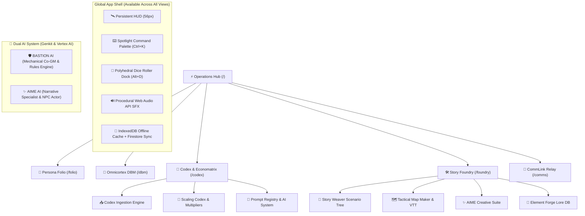
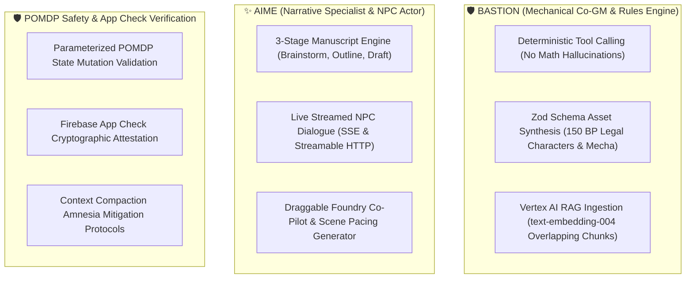

# 🌌 Tangent Science Fantasy Role-Playing Engine (TANGENT SFF RP)
## Comprehensive Technical Architecture, System Mechanics & Ecosystem Report (v2.5)

---

## 🧭 Executive Summary & System Purpose

**Tangent Science Fantasy Roleplay (TANGENT SFF RP)** is an integrated, offline-first, browser-based Virtual Tabletop (VTT), character generation suite, rules compendium, mathematical simulation engine, and narrative worldbuilding platform. Designed for high-concept cyberpunk, space-opera, and science-fantasy campaigns, Tangent unifies character generation, complex economic and craft scaling, multi-tier tactical combat, campaign lore authoring, and multiplayer session management into a single cohesive ecosystem.

Built with **React 18, Vite, Tailwind CSS, Google Firebase (Firestore + Authentication + App Check), Web Audio API, and React Konva**, the platform eliminates traditional tabletop "economic and mechanical dissonance" by establishing mathematical Difficulty Classes (DC) and Unified Difficulty Units (UDU) as the deterministic prime movers for value, craft times, hardware capacity, and scaling.



---

## 📑 Table of Contents

1. [Operations Hub & Global HUD Ergonomics](#1-operations-hub--global-hud-ergonomics)
2. [Persona Folio & Operative Architecture](#2-persona-folio--operative-architecture)
3. [Omnicortex DBM Database & Catalog Architecture](#3-omnicortex-dbm-database--catalog-architecture)
4. [Universal Economic Unified Theory (EUT & Economatrix)](#4-universal-economic-unified-theory-eut--economatrix)
5. [Unified Difficulty Units (UDU) & Modular Structural Hierarchy](#5-unified-difficulty-units-udu--modular-structural-hierarchy)
6. [Technology Levels (TL0–TL5) & 16-Domain Continuum](#6-technology-levels-tl0tl5--16-domain-continuum)
7. [Codex Matrix Suite & The 6 Deterministic Calculation Engines](#7-codex-matrix-suite--the-6-deterministic-calculation-engines)
8. [Dual-Resolution Mechanics, Combat Reference & Lethality](#8-dual-resolution-mechanics-combat-reference--lethality)
9. [Locomotion, Rest, Survival & Advancement Systems](#9-locomotion-rest-survival--advancement-systems)
10. [Planetary, Civilization & Speculative Trade Simulation Engine](#10-planetary-civilization--speculative-trade-simulation-engine)
11. [Metaphysics, Invocations & Meta-Tech Imbuement](#11-metaphysics-invocations--meta-tech-imbuement)
12. [Story Foundry, Scenario Weaver & Narrative Elements](#12-story-foundry-scenario-weaver--narrative-elements)
13. [Hardware-Accelerated Tactical Map Maker & Virtual Tabletop (VTT)](#13-hardware-accelerated-tactical-map-maker--virtual-tabletop-vtt)
14. [CommLink Quantum Relay & Multiplayer Operations](#14-commlink-quantum-relay--multiplayer-operations)
15. [Artificial Intelligence Architecture: BASTION & AIME](#15-artificial-intelligence-architecture-bastion--aime)
16. [Commercial Strategy, Tokenomics & Infrastructure Sustainability](#16-commercial-strategy-tokenomics--infrastructure-sustainability)
17. [Universal Data Ingestion & Enterprise Schema Standard](#17-universal-data-ingestion--enterprise-schema-standard)

---

## 1. Operations Hub & Global HUD Ergonomics

The **Command Operations Hub (`/`)** is the primary mission dashboard and telemetry nerve center.

### 1.1 Core Telemetry & Widgets
- **Active Campaign Tracker (`CampaignOpsWidget`)**: Displays current campaign title, active act/scenario counts, linked sector maps, and one-click routing to the Story Foundry.
- **Game Squads & Multiplayer (`GameSquadsWidget`)**: Manages multiplayer squads, active member rosters, and one-click invite join codes (`?join=GRP-XXXXXX`).
- **Party at a Glance (`PartyStatusWidget`)**: Real-time telemetry monitoring loaded operative health, vitality, species lineage, Tech Levels, and Build Point (BP) legal compliance.
- **CommCenter & Transmission Feed (`CommCenterWidget`)**: Live stream of Quantum Relay broadcasts, private operative comms, and dice check rolls with direct reply capabilities.
- **Interactive Preview Drawers (`LandingDrawerArea`)**: Clicking dashboard cards dynamically unfolds operative sheets, scenario trees, map libraries, or lore elements directly on the dashboard without route transitions.

### 1.2 Persistent Global HUD Ergonomics
The 56px top HUD persists across all routes, providing instant access to mission-critical utilities:
- **Spotlight Omni-Search (`Ctrl+K` / `Cmd+K`)**: Global search index over heroes, species, weapons, scenarios, lore items, and `/roll` commands.
- **Dice Roller Dock (`Alt+D`)**: Floating polyhedral dice dock with one-click polyhedrals (`d4`, `d6`, `d8`, `d10`, `d12`, `d20`, `d100`), custom expression input, advantage/disadvantage toggles, and channel broadcast.
- **CommLink Quick Dock (`Alt+C`)**: Slides out the live transmission stream for fast in-game banter without leaving your tactical map.
- **Procedural Web Audio API**: Zero-external-dependency audio synthesizer generating tactile clicks, terminal chirps, dice rolls, and dramatic critical fanfare.

---

## 2. Persona Folio & Operative Architecture

The **Persona Folio (`/folio`)** is the digital operative sheet manager and character generation suite.

### 2.1 The 150 Build Point (BP / CP) Economy
Characters in Tangent SFF RP are created using a strict **150 Build Point (BP)** budget:
- **Starting Budget**: 150 BP (customizable by the Architect for high-powered campaigns).
- **Legality Enforcement**: When expenditures exceed available points, the header flashes an **ILLEGAL BUILD** warning. Clicking the point meter opens a complete line-item ledger.
- **Point Allocations**:
  - **Ability Scores**: 5 BP per +1 attribute bonus.
  - **Attribute Check Bonuses**: 1 BP per +1 check score.
  - **Skills & Specializations**: Purchase additional skill ranks beyond background packages.
  - **Features & Augmentations**: Special perks, biological modifications, and cyberware.
  - **Hindrances & Flaws**: Select character flaws to receive point rebates back into your pool (up to -20 BP).

### 2.2 The Three 20-Point Background Skill Pools
In addition to the 150 BP starting budget, every character receives **three dedicated 20-point Skill Pools** during creation:
1. **Faction Skill Pool (20 SP)**: Ranks allocated strictly among proficiencies granted by the character's primary faction allegiance.
2. **Origin Skill Pool (20 SP)**: Ranks granted by the character's homeworld, habitat, or environmental upbringing.
3. **Occupation Skill Pool (20 SP)**: Ranks defining the operative's career training, professional trade, or tactical specialty.

### 2.3 The 7 Folio Tabs
- **1. Identity Tab**: Operative name, biological species selection (with automated trait modifiers), origin archetype, background occupation, physical metrics, portrait URL, and cybernetic augmentation slots.
- **2. Core Stats & Vitals**: The 6 core attributes (STR, AGI, STA, INT, WIS, CHA) and their linked sub-attributes (Might, Reflex, Fortitude, Reason, Willpower, Etiquette). Automatically derives Health, Vitality, Base Toughness, Defense Value, and Carry Capacity.
- **3. Skills & Specializations**: Master skill matrix categorized across Combat, Technical, Social, Psionic, and Scientific domains with Novice, Expert, Master, and Legend rank tiers.
- **4. Abilities, Features & Flaws**: Positive feats, racial gifts, meta-tech powers, psychic invocations, and hindrance flaws with CP tracking.
- **5. Combat Loadout & Inventory**: Weaponry (strike bonus, damage dice, rate of fire, range, AP), armor suits (coverage zones, DR rating), and equipment tracking.
- **6. 31-Field Narrative Story Writer**: Four structured narrative categories (**Biography, Psychology, Factions, Logistics**) with **🤖 Bastion AI** auto-drafting to flesh out deep character backstories.
- **7. Notes & Property**: Starship shares, contacts, safehouses, and field mission logs.

### 2.4 Guided Creator Wizard & Persona Bridge
- **Guided Creator (`GuidedCreatorModal`)**: An 8-step wizard walking new players through Concept, Species, Origin, Faction, Occupation, Attributes, Skills, and Gear.
- **Persona Bridge (`personaBridge.js`)**: Real-time synchronization layer ensuring changes to character stats immediately propagate to the Tactical Map Maker tokens and CommLink chat identity.

---

## 3. Omnicortex DBM Database & Catalog Architecture

The **Omnicortex DBM (`/dbm`)** is the relational database and rules compendium of Tangent SFF RP.

### 3.1 Architectural Subdomains
The Omnicortex catalog is organized into 14 canonical architectural domains:
- **Architecture**: Facility scales, modular room blueprints, defense stations, and power grids.
- **Armoring**: Personal armor, hazard suits, energy shielding, coverage zones, and damage reduction (DR).
- **Augmentations**: Cyberware, bioware, neural coprocessors, sensory shunts, and essence costs.
- **Mecha & Vehicles**: Combat walkers, grav-tanks, speeders, starfighters, frame weight classes, and hardpoint mounts.
- **Weaponry**: Melee weapons, slugthrowers, lasers, plasma arms, heavy artillery, and exotic beam casters.
- **Gear & Tools**: Field equipment, medical kits, scanners, communication nodes, and utility harnesses.
- **Invocations**: Metaphysical disciplines (Dimension, Energy, Entropy, Illusion, Matter, Mental) and manifestation parameters.
- **Occupations & Origins**: Complete career paths and homeworld cultural packages.
- **Species & Lineages**: Canonical biological profiles, synthetic frames, awakened creatures, and alien taxonomies (including the Kitin Collective).
- **Traits & Disadvantages**: Granular species trait catalog (Basic, Advanced, Elite, Bodyforms) and disadvantage point rebates.
- **Compendium Volumes**: Complete operator and architect rulebook texts.

### 3.2 Operating Modes & Data Pipelines
- **Game Mode (Read-Only)**: Streamlined, high-contrast interface designed for lightning-fast search during live gameplay without risk of accidental data modification.
- **Architect Dev Mode**: Unlocks in-place schema editing, item creation, field modification, and balance overrides.
- **Automated Sync Scripts**: Node.js maintenance scripts (`syncOmnicortexSpecies.mjs`, `syncOmnicortexEquipment.mjs`, `syncOmnicortexFeatures.mjs`) synchronizing local markdown files with Firestore collections in 450-operation batches to avoid quota bottlenecks.

---

## 4. Universal Economic Unified Theory (EUT & Economatrix)

Tangent solves the historic tabletop problem of **economic dissonance** where crafting time, market cost, and character wealth scale arbitrarily. In Tangent, **Complexity is the Prime Mover**: an item's market value, fabrication time, purchasing threshold, and mechanical tier are deterministic derivatives of its **Crafting Difficulty Class (DC)**.

### 4.1 The Tangent Standard Curve (TSC)
Traditional linear or quadratic progression collapses when bridging personal gear to starships. Tangent standardizes pricing using an exponential curve:

$$\text{Value (Credits)} = 10 \times 4^{\left(\frac{\text{DC}}{5}\right)}$$

* **Base Unit ($V_{\text{base}}$)**: $10\text{ Credits}$ (DC 0 basic scrap or meal).
* **Scaling Interval ($S$)**: $+5\text{ DC}$ corresponds to a $4\times$ multiplier in societal complexity and market value.
* **Material Cost**: Fixed at **50% of Market Value** ($\text{Materials} = 0.5 \times V$).

### 4.2 Wealth Score (WS) as Static Purchasing Leverage
Instead of tedious cash tracking for trivial items:
* **The Golden Rule**: An operative automatically purchases any item where $\text{Item DC} \le \text{Wealth Score (WS)}$ without rolling or deducting liquid credits ($\text{Purchase DC} = \text{Crafting DC}$).
* **Financial Status Hierarchy**:
  * **WS 0 (Indebted, -5 BP Flaw)**: Negative net worth, debt servitude.
  * **WS 1–4 (Impoverished, 0 BP)**: Auto-buy up to 30 Cr.
  * **WS 10–14 (Middle Class, 5 BP)**: Auto-buy 160–600 Cr; net worth ~25k Cr.
  * **WS 20–29 (Wealthy, 20 BP)**: Auto-buy up to 40k Cr; owns estates, servants, high-end craft.
  * **WS 40–49 (Industrialist, 50 BP)**: Auto-buy up to 10M Cr; Megacorp executive commanding personal starships.
  * **WS 60–69 (System Lord, 95 BP)**: Auto-buy up to 2.6B Cr; commands planetary colonizing fleets.
  * **WS 80+ (Faction Ruler, 160 BP)**: Auto-buy up to 600B+ Cr; post-scarcity megastructure architects.

### 4.3 Fabrication Timeline & Productivity Points (PP)
Crafting time is derived through **Productivity Points (PP)** calculated per workday:

$$\text{PP per Day} = \text{Workers} \times \left( \text{Skill Check} - \text{Base DC} \right) \times \text{Workshop Multiplier}$$

* **Workshop Multipliers**: Hand Tools ($1\times$), Belt Workshop ($2\times$), Garage ($5\times$), Industrial Factory ($20\times$), Automated Fabricator ($100\times$), Orbital Megafabricator ($1000\times$).

---

## 5. Unified Difficulty Units (UDU) & Modular Structural Hierarchy

Tangible equipment, cybernetic implants, vehicle chassis, and buildings share a strict **10:1 Modular Hierarchy**:

```
1 Module (Building / Room Unit)
 └── 10 Mounts (Vehicle / Turret Hardpoints)
      └── 100 Sockets (Heavy Weapon / Armor Plating Sockets)
           └── 1,000 Nodes (Augmentation / Weapon Mod Nodes)
                └── 10,000 Sub-Nodes (Micro-Chips / Nanotech Threads)
```

* **Highest Complexity Rule**: When stacking multiple subsystems into an architectural unit or vehicle chassis, the entire installation's engineering DC elevates to match the single highest subsystem installed.
* **Chassis Mobility Tax**: Installing propulsion or dynamic locomotion onto a static structure imposes a $+20\%$ base module overhead tax.

---

## 6. Technology Levels (TL0–TL5) & 16-Domain Continuum

Technology is categorized across **6 broad eras (TL0 to TL5)** and evaluated across **16 societal domains** (Energy, Computing, Materials, Biotech, Propulsion, Weaponry, Cybernetics, Gravitics, Nanotech, Sensors, Robotics, Medical, Shielding, Metaphysics, Agriculture, Manufacturing):

| Tech Level | Name & Epoch | Defining Characteristics | Reconfiguration Time |
| :--- | :--- | :--- | :--- |
| **TL0** | Primitive / Archaic | Muscle power, stone, wood, forged bronze, combustion fire. | Manual / Weeks |
| **TL1** | Industrial / Mechanical | Steam, fossil fuels, kinetic rifling, mass manufacturing. | Days (Machining) |
| **TL2** | Digital / Nuclear | Fission, early computing, solid-state electronics, rocketry. | Hours (Assembly) |
| **TL3** | Interplanetary / Cyberpunk | Fusion power, cybernetics, directed energy, mag-lev, smart materials. | Minutes (Modular) |
| **TL4** | Interstellar / Nanotech | Antimatter, FTL drives, programmable matter, neural shunts, hard-light. | Seconds (Programmable) |
| **TL5** | Transcendent / Cosmic | Singularity cores, zero-point energy, reality-warping metaphysics, holophotonics. | Instant (Phase-Shift) |

* **Market Availability Cap**: The maximum DC of goods available on a given planet is $\text{Availability DC} = (\text{Planetary TL} \times 5) + 10$.

---

## 7. Codex Matrix Suite & The 6 Deterministic Calculation Engines

The **Codex (`/codex`)** houses 17 matrices organized into 5 thematic suites, powered by pure deterministic math engines:

### 7.1 The 5 Canonical Suites
1. **Hardware & Structures (Amber)**: Architecture Blueprint Configurator, Armor Coverage Matrix (7 slots), Augmentation Nodes (FBC & Stigma), Equipment & Workshops, Mecha & Vehicles, Weapon Mod Stacker.
2. **Characters & Companions (Blue)**: Modular NPC Stat Blocks (Threat Tiers 1–20, minion/boss roles, automated combat AI behaviors), Features & Perks matrix.
3. **Planetary, Species & Factions (Emerald)**: Species Forge, Planetary Design Matrix (UWP), Factions & Polities matrix.
4. **Metaphysics (Purple)**: Invocation Matrix (6 disciplines), Meta-Tech Matrix (resonance imbuements).
5. **System Suites (Slate)**: Economatrix Dashboard, Technology & Domain Codex, Scaling Codex, Codex Ingestion Engine.

### 7.2 The 6 Core Calculation Engines
| Engine | Source File | Core Formulas & Responsibilities |
| :--- | :--- | :--- |
| **Economatrix Engine** | `tangentEconEngine.js` | TSC Value $V = 10 \cdot 4^{\frac{\text{DC}}{5}}$, Material Cost (50%), Crafting PP, Cooperative Crafting Days, Liquidity Gap, Speculative Trade Margins. |
| **UDU Engine** | `tangentUDUEngine.js` | Unified Difficulty Units, 10:1 UDU tier conversion (`Module → Mount → Socket → Node → Sub-Node`), Encounter Hazard Ratings. |
| **Technology Engine** | `tangentTechEngine.js` | Tech Level (TL0–TL5) progression, Domain rating evaluation, Adaptive tech reconfiguration action economy, Field rarity cost multipliers. |
| **Complex Systems Engine** | `tangentComplexEngines.js` | Architecture SP, Module allocations, 20% Mobile chassis tax, Mount hardpoints, Highest Complexity Rule (DC stacking), Mecha Chassis Defense DC & megacredits. |
| **Entity Engine** | `tangentEntityEngines.js` | Modular Character vital pools (Vitality, Health, Structure), Threat Tier scaling, Competency role matrix, Species BP budget & genetic DC. |
| **Planetary Engine** | `tangentPlanetaryEngine.js` | UWP/TWP string parser/formatter, Gravity & Atmosphere profiles, Canonical Trade Code derivation, Market availability cap $(TL \times 5) + 10$. |

---

## 8. Dual-Resolution Mechanics, Combat Reference & Lethality

Tangent SFF RP utilizes a **Dual Resolution Architecture**:

### 8.1 Trained Skills Resolution & Target Numbers (TN)
$$\text{Skill Roll} = 2\text{d}10 + \text{Attribute Modifier} + \text{Skill Rank} + \text{Situational Mods vs TN}$$
- **TN 10 (Routine)**: Tasks achievable under minor pressure.
- **TN 15 (Challenging)**: Standard combat-stress actions and technical repairs.
- **TN 20 (Formidable)**: Actions requiring elite training or high-tier equipment.
- **TN 25+ (Heroic / Legendary)**: Universe-altering feats of mastery.

#### Numeric Criticals on 2d10
- **Critical Success (Double 10s)**: Rolled value becomes **30** (`Total = 30 + Modifiers`), guaranteeing an extraordinary triumph and maximum margin of success.
- **Critical Fumble (Double 1s)**: Rolled value becomes **-10** (`Total = -10 + Modifiers`), resulting in catastrophic misfire, weapon jam, or severe hazard.

### 8.2 Core Attributes & Attribute Checks
$$\text{Base Check Score} = 2 + (\text{Attribute Score} \times 2)$$
$$\text{Check Roll} = \text{d}20 + \text{Base Check Score} + \text{Situational Modifiers vs CR}$$

| Attribute | Linked Check | Primary Application |
| :--- | :--- | :--- |
| **Strength (STR)** | **Might Check** | Heavy lifting, door breaching, grappling, melee force |
| **Agility (AGI)** | **Reflex Check** | Dodging explosions, evasion, acrobatic balance, initiative |
| **Stamina (STA)** | **Fortitude Check** | Resisting neurotoxins, disease, vacuum exposure, wound shock |
| **Intellect (INT)** | **Reason Check** | Pure logic, cipher cracking, technical deduction, computation |
| **Wisdom (WIS)** | **Willpower Check** | Resisting psionic domination, fear, emotional composure |
| **Charisma (CHA)** | **Etiquette Check** | Social diplomacy, bartering, persuasion, de-escalation |

### 8.3 Vitality, Health, Structure & Damage Classification
- **Vitality Pool (`30 + Willpower`)**: Tracks **Non-Lethal Stress**, fatigue, subdual strikes, and mental/sensory exhaustion. Depletion causes exhaustion and spills into Health.
- **Health Pool (`30 + Fortitude`)**: Tracks **Lethal Damage Capacity** (ballistics, burns, cuts). When Health reaches 0, the operative collapses and initiates their Death Clock.
- **Structure Pool (Synthetics, Mecha & Objects)**: Unified Structure pool (`Vitality + Health`). **Synthetics are 100% IMMUNE to non-lethal damage**.
- **Base Toughness (`Stamina Score`)**: Inherent physiological damage soak deducted from physical impacts.
- **Armor Damage Reduction (DR)**: Absorbs damage prior to pool subtraction based on 7 hit location slots.

### 8.4 Death Clock, Massive Damage & Revivification
- **The Death Clock**: When Health hits **0**, character falls unconscious; $\text{Death Clock} = \text{Stamina in rounds}$ (min 1 round).
- **Advancing the Clock**: Each unstabilized round ticks down the clock by 1. Reaching 0 results in clinical death.
- **Massive Damage**: Taking direct Health damage in a single strike equal to or exceeding Stamina forces an immediate DC 15 Fortitude save against instant death.
- **Stabilization**: Successful **Medicine (DC 15)** check or nano-injector stops the clock.
- **Revivification ("The High Cost of Dying")**: Requires TL5 medical tech or rare metaphysical invocations. Revived operatives forfeit all remaining Karma Points and incur a permanent **-5 Experience Debt** (paid 1-for-1 with future AP).

---

## 9. Locomotion, Rest, Survival & Advancement Systems

### 9.1 Movement Rules & Tactical Paces
- **Paces (Base Speed 30 ft / 6 sq)**: Walk ($1\times$), Hustle ($2\times$), Run ($3\times$, -2 perception), Sprint ($4\times$, -4 defense, fatigue checks).
- **Locomotion Modes**: Bipedal/Quadruped, Climbing (Scaling $2\times$, Fast Ascent $3\times$, Fast Descent $6\times$), Aerial Flight (Hover, Sail & Soar with $+2$ Strike / $+2$ Crit High Ground, Dive Ramming), Swimming, Slithering, Zero-G Drift.

### 9.2 Rest & Recovery Engine
- **Full Rest (6–8 Hours)**: Resets all exhaustion, heals vitality, restores daily abilities. (Synthetics, Fae, Insects require only Light Rest; Alterians/Mondi use structured meditation).
- **Light Rest (Up to 4x/day)**: Nap/Meditation (1 hr), Lounging (2 hr), Light Duty (3 hr).
- **Movement Fatigue**: Sprinting 5 consecutive rounds or hurried travel for 10 minutes requires DC 15 Stamina Fortitude save or suffer 5 Vitality damage and the **Exhausted** condition (-2 to checks, half speed).

### 9.3 Unified 8-Tier Scaling Multipliers
$$\text{Personal (1×)} \rightarrow \text{Heavy Exo (2×)} \rightarrow \text{Light Vehicle (5×)} \rightarrow \text{Medium Mecha (10×)} \rightarrow \text{Heavy MBT (20×)} \rightarrow \text{Super Heavy (50×)} \rightarrow \text{Capital Ship (100×)} \rightarrow \text{Planetary (1000×)}$$

### 9.4 Experience & Advancement (The Increment Rule)
- **Award Points (AP)**: $1\text{ AP} = 1\text{ BP}$. Standard pacing: 1 to 3 AP per session.
- **The Increment Rule (CRITICAL)**: **Any ability score, skill rank, or trait may ONLY BE INCREASED BY 1 POINT PER EXPERIENCE AWARD.** Players cannot pool 10 AP to dump into a single attribute in one downtime session.

---

## 10. Planetary, Civilization & Speculative Trade Simulation Engine

- **Universal World Profiles (UWP / TWP)**: 7-metric hex code: Starport (A–X), Size (0–10), Atmosphere (0–15), Hydrographics (0–10), Population (0–12), Government (0–15), Law Level (0–18).
- **16-Domain Civilization Radar**: Polygon visualization tracking governance, freedom, military doctrine, and metaphysics.
- **Canonical Trade Codes**: Automated economic tags: Agricultural (`Ag`), Industrial (`In`), Rich (`Ri`), Desert (`De`), High-Tech (`Ht`), Vacuum (`Va`).
- **Speculative Commodity Exchange**: Real-time arbitrage pipeline calculating profit margins between source and destination worlds based on supply/demand tags.

---

## 11. Metaphysics, Invocations & Meta-Tech Imbuement

- **6 Metaphysical Disciplines**:
  1. **Telekinesis**: Vector force, kinetic barriers, gravity manipulation.
  2. **Telepathy**: Neural communication, sensory disruption, psionic assault.
  3. **Pyrokinesis**: Thermal excitation, plasma projection, cryogenic draining.
  4. **Chronomancy**: Localized temporal acceleration, dilation, precognitive flashes.
  5. **Biokinesis**: Cellular regeneration, biological mutation, neuromuscular overcharge.
  6. **Voidcraft**: Dimensional phase shifting, spatial fold pockets, entropy casting.
- **Invocation Parameter Configurator**: Dynamically derives Cast DC, Essence Channeling drain, Area-of-Effect templates, and Duration multipliers.
- **Meta-Tech Imbuement**: Infuses physical hardware sockets (Weapon, Armor, Cyberware, Architecture) with metaphysical crystals and resonance matrices.

---

## 12. Story Foundry, Scenario Weaver & Narrative Elements

- **Hierarchical Campaign Tree**: Structuring stories into Acts $\rightarrow$ Chapters $\rightarrow$ Scenes $\rightarrow$ Encounters with drag-and-drop hierarchy restructuring.
- **Relational Lore Graph**: Bi-directional hyperlinking connecting 8 primary schemas (Characters, Locations, Factions, Relics, Events, Lore Docs, Session Prep, Custom Elements).
- **AIME Creative Suite**: 3-stage manuscript drafting engine (*Brainstorm $\rightarrow$ Outline $\rightarrow$ Draft*) with inline floating AI transformation actions (*Expand, Rephrase, Tighten, Polish, Shift Tone*).
- **Persistence Safety**: 1.5s debounced Firestore sync, destructive action name-confirmation gates, and offline-to-cloud sync conflict resolution modals.

---

## 13. Hardware-Accelerated Tactical Map Maker & Virtual Tabletop (VTT)

- **React-Konva Multi-Grid Canvas**: Renders Square ($5\text{ft} / 1.5\text{m}$), Flat Hex, Pointy Hex, and Isometric grids with zooming, panning, and snap-to-grid movement.
- **Folio Hero Token Synchronization**: Direct dragging of player characters from the active campaign roster onto the canvas with live Health, Vitality, and Shield rings.
- **Dynamic Visual Layering**:
  - Procedural biome texture painting (Arcology metal, Toxic sludge, Volcanic basalt, Sand).
  - Fog of War reveal/hide masks.
  - Real-time floating combat text for kinetic damage, deflection soak, and healing.
  - Token base condition status gems (Stunned, Burning, Concealed, Prone).
- **Player Spectator View (`/spectator/:mapId`)**: Clean secondary display output that strips Architect secret layers, hidden tokens, and private encounter notes for live table projection.

---

## 14. CommLink Quantum Relay & Multiplayer Operations

- **Multi-Frequency Channels**: Planetary holonet broadcasts, squad frequencies, and encrypted 1-on-1 direct channels.
- **In-Chat Dice Parser**: Real-time `/roll` execution broadcasting verifiable results and check thresholds to the channel feed.
- **Cryptographic Seeding & Audio FX**: Audio-synthesized roll feedback and cryptographically verified rolls.

---

## 15. Artificial Intelligence Architecture: BASTION & AIME

Tangent deploys **two specialized, complementary AI entities** orchestrated through **Firebase Genkit** on Cloud Functions v2:



### 15.1 BASTION (Mechanical Co-GM)
- **Deterministic Tool Calling**: Computes dice rolls and skill checks natively in JavaScript, preventing LLM calculation hallucinations.
- **Zod Schema Generation**: Guarantees valid JSON asset creation (weapons, NPCs, vehicles) ready for instant Firestore ingestion.
- **RAG Rule Retrieval**: 768-dimensional vector search across all Omnicortex compendium collections.

### 15.2 AIME (Narrative Specialist)
- **Roleplay Engine**: Real-time conversational responses reflecting NPC psychological traits, faction alignment, and hidden agendas.
- **Prose Refinement**: Inline manuscript editing tools for dramatic pacing and world lore consistency.

### 15.3 Safety & Security Architecture
- **Parameterized POMDP**: Decouples AI action proposals from database mutations, validating damage soak, armor DR, and point legality before committing writes.
- **App Check Attestation**: Enforces cryptographic client verification (`enforceAppCheck: true`) to prevent unauthorized API calls.

---

## 16. Commercial Strategy, Tokenomics & Infrastructure Sustainability

Tangent utilizes a **Hybrid Freemium SaaS + Compute Token Economy**:

### 16.1 Subscription Tier Structure
- **Tier 1: The Operative (Free)**: Up to 3 Persona Folios, standard dice roller, read-only DBM compendium, 50 MB cloud storage, local 1.5s IndexedDB caching, one-click session joins.
- **Tier 1.5: Veteran Operative ($3/mo or $30/yr)**: Unlimited character sheets, cosmetic UI skins, custom dice themes.
- **Tier 2: Architect Prime ($10/mo or $25/quarter)**: Full GM suite (Story Foundry, Tactical Map Maker, Fog of War, 2 GB storage) + monthly stipend of **Omnicortex Compute Credits (OCC)**.
- **Tier 3: Nexus Syndicate ($50/quarter, 3-month min)**: Full AIME manuscript suite, live SSE streamed NPC dialogue, 10 GB storage, high-res PDF exports, priority server routing.

### 16.2 Omnicortex Compute Credits (OCC)
- Standard DB queries and manual dice rolls are **100% free**.
- Generative AI tasks (system generation, multi-chapter campaign trees, NPC roleplaying) consume OCCs.
- GMs can purchase top-up bundles ($5.00 for 5,000 OCCs), insulating the platform from runaway Vertex AI inference costs and guaranteeing >60–80% gross margins.

### 16.3 Element Forge Creator Marketplace
- Flat **25% platform cut** (undercutting legacy 30–35% storefronts).
- Homebrew scenarios, mecha chassis packs, map biome brushes, and custom AIME personality models.

---

## 17. Universal Data Ingestion & Enterprise Schema Standard

### 17.1 Intake Pipelines
1. **Bastion AI Multimodal Parser**: Extracts structured records from uploaded PDF rulebooks and markdown documents with automatic $>10\text{k}$ character chunking.
2. **Direct JSON Array**: Ingests canonical schema JSON batches.
3. **Universal Delimiter Tabular Parser**: Auto-detects Markdown Pipe tables, TSV, CSV, and Semicolon files with automated column-alias resolution (`tl` $\rightarrow$ `tech_level`, `sp` $\rightarrow$ `structure_points`, `dc` $\rightarrow$ `craft_dc`).

### 17.2 Base Compendium Schema Contract (`BaseCompendiumItem`)
```typescript
interface BaseCompendiumItem {
  id: string;              // Kebab-case slug e.g. "weapon-plasma-rifle"
  name: string;            // Canonical display label
  category: string;        // Domain e.g. "weaponry", "species", "architecture"
  description: string;     // Summary markdown text
  body?: string;           // Full rules markdown content
  tl: number;              // Tech Level (0 to 5+)
  ml: number;              // Metaphysics Level (0 to 5+)
  cost?: number;           // Market Credits (derived from TSC formula)
  craft_dc?: number;       // Prime Mover Crafting Difficulty
  udu_size?: string;       // Module, Mount, Socket, Node, Sub-Node
  tags?: string[];         // Query and search classification tags
  updatedAt?: string;      // ISO 8601 timestamp string
}
```

---

*Document compiled and verified for the Tangent Science Fantasy Role-Playing Engine.*
