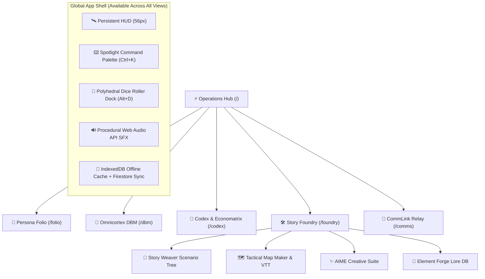

# 🌌 Tangent Science Fantasy Roleplay (TANGENT SFF RP)
## Comprehensive System User Guide & Technical Manual (v2.0)

---

## 🧭 System Overview & Architecture

**Tangent Science Fantasy Roleplay (TANGENT SFF RP)** is an integrated, cyberpunk/space-opera Virtual Tabletop (VTT), character management suite, rules compendium, and narrative worldbuilding engine. 

Built with React 18, Vite, Tailwind CSS, Google Firebase (Firestore + Authentication), and Web Audio API, Tangent SFF RP provides an offline-first, high-performance tactical environment for game masters and players alike.

---

## 📑 Table of Contents

1. [Chapter 1: Operations Hub & Global HUD Ergonomics](#chapter-1-operations-hub--global-hud-ergonomics)
2. [Chapter 2: Persona Folio & Character Architecture](#chapter-2-persona-folio--character-architecture)
3. [Chapter 3: Omnicortex DBM Compendium](#chapter-3-omnicortex-dbm-compendium)
4. [Chapter 4: Codex Matrix Suite & Economatrix](#chapter-4-codex-matrix-suite--economatrix)
5. [Chapter 5: Story Foundry & Story Weaver Engine](#chapter-5-story-foundry--story-weaver-engine)
6. [Chapter 6: Tactical Map Maker & Virtual Tabletop (VTT)](#chapter-6-tactical-map-maker--virtual-tabletop-vtt)
7. [Chapter 7: AIME Creative Suite & Element Forge](#chapter-7-aime-creative-suite--element-forge)
8. [Chapter 8: CommLink Quantum Relay & In-Chat Rolls](#chapter-8-commlink-quantum-relay--in-chat-rolls)
9. [Chapter 9: Polyhedral Dice Engine, Hotkeys & System Tools](#chapter-9-polyhedral-dice-engine-hotkeys--system-tools)
10. [Chapter 10: Tangent 2d10 Core Mechanics & Combat Reference](#chapter-10-tangent-2d10-core-mechanics--combat-reference)

---

## Chapter 1: Operations Hub & Global HUD Ergonomics

The **Command Operations Hub (`/`)** is the primary mission dashboard of Tangent SFF RP.

### 1.1 Core Telemetry & Widgets
- **Active Campaign Tracker (`CampaignOpsWidget`)**: Displays current campaign title, active scenario count, linked sector maps, and quick navigation into Story Foundry.
- **Game Squads & Multiplayer (`GameSquadsWidget`)**: Manages multiplayer game squads, active member roster, and join codes (`?join=GRP-XXXXXX`).
- **Party at a Glance (`PartyStatusWidget`)**: Renders characters loaded from your active Persona Folio roster with live Health and Vitality bars, species lineage badges, Tech Levels, and CP legality status.
- **CommCenter & Transmission Feed (`CommCenterWidget`)**: Live stream of Quantum Relay broadcasts, private operative comms, and dice check rolls with direct reply capabilities.
- **Interactive Preview Drawers (`LandingDrawerArea`)**: Clicking module cards dynamically unfolds operative sheets, scenario trees, map libraries, or lore elements directly on the dashboard without route transitions.

### 1.2 Persistent Global Top HUD
- **Application Title & Dynamic Breadcrumbs**: Shows current route context (`OPERATIONS HUB`, `PERSONA FOLIO`, `OMNICORTEX`, `CODEX`, `STORY WEAVER`, `TACTICAL MAPS & VTT`, `COMMLINK RELAY`).
- **Omni-Search Trigger (`Ctrl+K`)**: Opens Spotlight search palette.
- **Polyhedral Dice Dock Trigger (`Alt+D`)**: Toggles floating mathematical dice roller dock.
- **CommLink Quick Dock (`Alt+C`)**: Toggles side-dock comms drawer.
- **Procedural Audio Mute Switch**: Toggles Web Audio API sci-fi synthesizer sounds.
- **User Profile & Settings (`⚙️`)**: Configures public handle, contact info, Gemini AI API keys, and launches the Comprehensive User Guide modal.

---

## Chapter 2: Persona Folio & Character Architecture

The **Persona Folio (`/folio`)** is the digital operative sheet manager enforcing rigid point-buy mechanics, automated vitals calculation, and deep narrative tracking.

### 2.1 The 150 Character Point (CP) Economy
- **Standard Starting Budget**: 150 CP.
- **Real-Time Legality Validation**: If total expenditures exceed budget, a pulsating red `ILLEGAL BUILD` banner appears. Clicking the CP meter opens a full itemized line-item audit breakdown.
- **Cost Structure**:
  - *Core Attributes*: Fixed CP per point above zero base.
  - *Skill Proficiencies*: Novice (1 CP), Adept (2 CP), Expert (4 CP), Master (7 CP), Legend (10 CP).
  - *Specializations*: +1 CP per focused sub-discipline (+2 roll bonus).
  - *Features & Talents*: Positive traits cost 2 to 10 CP based on tier.
  - *Flaws & Hindrances*: Grants +2 to +8 CP rebates (negative cost adding points back to budget).
  - *Cybernetics & Augmentations*: CP scaling based on Tech Level (TL) and essence footprint.

### 2.2 Guided Character Creator Wizard
An 8-step structured wizard that guides players through complete operative creation:
1. **Concept & Identity**: Name, concept archetype, demeanor, and motivation.
2. **Species Selection**: Imports lineage traits and automatic attribute modifiers.
3. **Origin & Faction**: Background archetype and starting thematic skill perks.
4. **Occupation**: Career path (Commando, Hacker, Psion, Medic, Tech-Priest, Smuggler).
5. **Core Attributes**: Point allocation across STR, AGI, STA, INT, WIS, CHA.
6. **Technology Level (TL)**: Gear advancement tier (TL0 Primitive to TL9 Singularity).
7. **Skills & Features**: Background proficiencies and positive/negative traits.
8. **Review & Finalize**: Final validation and commit directly to the active roster.

### 2.3 The 7 Folio Tabs
1. **Identity**: Name, Species, Origin, Occupation, Augmentations, Age, Height, Weight, Body Style, Portrait upload/URL.
2. **Core Stats & Sub-Attributes**:
   - **STR (Strength)** → Sub: *Might* (Physical power, melee damage, athletics, encumbrance limit).
   - **AGI (Agility)** → Sub: *Reflex & Initiative* (Manual dexterity, ranged aim, evasion, turn order).
   - **STA (Stamina)** → Sub: *Fortitude* (Endurance, toxin resistance, Health pool base).
   - **INT (Intellect)** → Sub: *Logic* (Science, cybertech hacking, weapon crafting, analysis).
   - **WIS (Wisdom)** → Sub: *Will* (Perception, psychic attunement, Vitality/Karma pool base).
   - **CHA (Charisma)** → Sub: *Etiquette* (Presence, negotiation, leadership, intimidation).
   - **Derived Formulas**:
     - $\text{Health} = 30 + (\text{Fortitude} \times 2)$
     - $\text{Vitality} = 30 + (\text{Will} \times 2)$
     - $\text{Karma} = \text{Meta Level / Psionic Rank}$
3. **Skills**: Filterable by Combat, Tech, Social, Psionic, and Academic. Tracks Ranks, linked attribute modifiers, and Specialization bonuses.
4. **Abilities**: Positive features, species gifts, meta-tech powers, psychic disciplines, and flaw rebates.
5. **Combat Loadout & Gear**: Weapon damage formulas (e.g. `2d10+4`), Rate of Fire (Single, Burst, Auto), Armor Resistance (AR), Coverage percentages, and encumbrance tracking.
6. **31-Field Narrative Story Writer**:
   - *Biography & Identity (7 fields)*: Backstory, Origin Story, Turning Points, Physicality, Speech, Public Profile, Hidden Secrets.
   - *Psychology & Persona (7 fields)*: Beliefs, Moral Boundaries, Motivations, Fears, Quirks, Traumas, Flaws.
   - *Factions & Connections (7 fields)*: Faction Ties, Allies, Rivals, Mentors, Family, Contacts, Debts.
   - *Logistics & Operations (10 fields)*: Safehouses, Vehicles, Finances, Missions, Directives, GM Secrets, Milestones, Goals, Relics.
   - *🤖 BASTION AI Auto-Writer*: Instant AI snippet generation and polishing for any field.
7. **Other**: Property, starships, bounty contracts, and campaign notes.

### 2.4 Roster Management & Public Sharing
- **Cloud Persistence**: Automatic sync to authenticated Google Firebase Firestore.
- **Operative Duplication**: Clone existing characters to create NPC variants or backups.
- **Public Share Links**: Generates read-only shareable URLs allowing other players to view and clone sheets.
- **Printable Folios**: Clean CSS print layout formatted for standard physical sheets and PDF rendering.

---

## Chapter 3: Omnicortex DBM Compendium

The **Omnicortex (`/dbm`)** is the relational rules database and compendium for Tangent SFF RP.

### 3.1 13 Core Compendium Categories
1. **Rules Codex**: Core mechanics, combat rules, conditions, and resolution tables.
2. **Species Matrix**: Biological species profiles, multi-trait selection, and racial stat mods.
3. **Factions & Cartels**: Megacorporations, syndicates, religions, and empires.
4. **Occupations**: Career backgrounds, starting proficiencies, and perk packages.
5. **Skills Compendium**: Proficiencies, rank scales, and linked attribute associations.
6. **Features & Talents**: Special powers, combat maneuvers, and flaw rebates.
7. **Weaponry Matrix**: Ballistic, energy, plasma, projectile, and melee armaments.
8. **Armor & Defenses**: Kinetic weave, power suits, shields, and coverage matrices.
9. **Mecha & Frames**: Heavy chassis, propulsion modules, hardpoints, and mount bays.
10. **Powers & Psionics**: Meta-tech imbuements, psionic talents, and invocations.
11. **Prerequisites**: Requirement ladders for unlocking high-tier abilities.
12. **Modifiers & Buffs**: Global stat modifiers, conditions, and mechanical buffs.

### 3.2 Dual Operational Modes
- **Game Mode (Read-Only)**: Clean, high-speed interface for looking up rules and equipment during live sessions without risking accidental edits.
- **Architect Dev Mode (Full Edit & Schemas)**: Enables GMs and Admins to create new entries, edit fields, modify schemas, and generate content with Bastion AI.

### 3.3 Presentation Modes
- **Wiki Document View**: Comprehensive, long-form document reader for in-depth lore and full rule chapters.
- **Catalog Table View**: High-density comparative data grid with sorting by Tech Level, credit cost, and damage values.

### 3.4 Master JSON Backup & Chunked Imports
- **Master Export**: Downloads the entire Omnicortex database to a single standalone `.json` file.
- **Master Import**: Restores the database using 450-op chunked batch writes to protect Firebase quotas.

---

## Chapter 4: Codex Matrix Suite & Economatrix

The **Codex (`/codex`)** provides 14 specialized engineering matrices and economic simulation tools.

### 4.1 The 14 Specialized Matrices
1. **Architecture Blueprint**: Facility scales, room modules, defensive hardpoints, and energy grids.
2. **Armor Coverage Matrix**: Coverage zones (Head, Torso, Limbs), material hardness, and AR.
3. **Augmentation Nodes**: Cybernetic implants, biological grafts, and essence footprint.
4. **Companion Package**: Drones, synthetic pets, combat beasts, and loyalist AI.
5. **Invocation Matrix**: Psionic spell parameters, area effects, channeling costs, and limits.
6. **Mecha Chassis Builder**: Frame weight classes, propulsion modules, armor plates, and mount bays.
7. **Meta-Tech Imbuement**: Artifact crafting, metamaterial bonding, and supernatural enhancements.
8. **Modular Stat Blocks**: Automated NPC and monster generator with scalable difficulty tiers.
9. **Planetary Design Matrix**: Planetary biomes, atmospheric pressure, gravity, and settlement tiers.
10. **Species Trait Selector**: Custom lineage builder with balanced biological point accounting.
11. **UDU Capacity Meter**: Unified Difficulty Units meter measuring scenario hazard scaling.
12. **Weapon Mod Stacker**: Optics, muzzle devices, receivers, elemental coils, and balance points.
13. **Technology Codex**: Tech Level 0 (Primitive) to Tech Level 9 (Singularity) research trees and power consumption.
14. **Codex Ingestion Engine**: Automated rulebook markdown parser and table importer.

### 4.2 Economatrix Universal Economic Theory (EUT)
- Calculates Galactic Standard Credits (Cr), planetary market indices, supply-demand scarcity multipliers, black market markups, and barter exchange equations.

---

## Chapter 5: Story Foundry & Story Weaver Engine

The **Story Foundry (`/foundry`)** is an integrated campaign builder and narrative scenario editor.

### 5.1 Hierarchical Scenario Tree
- **Drag-and-Drop Structure**: Reorder sibling acts or nest sub-scenes inside parent chapters with real-time visual drop indicators.
- **8 Narrative Element Types**: Character, Location, Faction, Event, Item, Lore, Session Prep, and Custom Schema.
- **Quill Rich Text Editor**: Embedded formatting, markdown support, and custom field forms.
- **Relational Story Links**: Connect story characters directly to specific location nodes and factions with bi-directional references.
- **Typed Deletion Safety**: Requires typing the exact element title before deleting to prevent accidental data loss.

### 5.2 Cloud Synchronization & Export
- **1.5s Debounced Write Throttling**: Protects database quotas during rapid writing sessions.
- **Timestamp Sync Conflict Modal**: Automatically detects divergence between local and cloud timestamps and lets you choose which version to keep.
- **Multi-Format Export**: Export campaigns to Markdown (`.md`), clean HTML, printable PDF, or standalone JSON.

---

## Chapter 6: Tactical Map Maker & Virtual Tabletop (VTT)

The **Tactical Map Maker (`/foundry/map-maker`)** is a canvas powered by React Konva for spatial combat and exploration.

### 6.1 Grid Canvas & Biome Painting
- **Multi-Grid Canvas**: Square (5ft/1.5m), Hexagonal (pointy/flat-topped), and Isometric grids with coordinate rulers and snapping.
- **Textured Biome Painting**: Paint sci-fi metallic decking, wasteland sands, toxic marshes, and neon cityscapes.
- **Procedural Landmass Generator**: Generates continents, coastlines, and islands automatically.

### 6.2 Token Summoning & Initiative Combat Tracker
- **Folio-to-Map Token Summoning**: Drag hero tokens directly from your Persona Folio roster onto the map. Tokens maintain live Health and Vitality bars.
- **Initiative Combat Tracker**: Track round count, turn order, initiative rolls, status effect gems, and floating animated combat damage numbers.
- **Dynamic Fog of War**: Reveal or shroud map sectors in real time to conceal enemy ambushes.

### 6.3 Player Spectator View (`/spectator/:mapId`)
- Stream or project `/spectator/:mapId` on a secondary screen or Discord stream. Players see a clean map with GM hidden layers, monster stat blocks, and unrevealed fog obscured.

---

## Chapter 7: AIME Creative Suite & Element Forge

The **AIME Creative Suite (`/foundry/aime`)** and **Element Forge (`/foundry/elements`)** provide AI-assisted narrative drafting and structured lore bibles.

### 7.1 3-Stage AIME Manuscript Engine
1. **Stage 1 — Brainstorm**: Select active lore elements & Guidance Gems to brainstorm scene premises and unexpected narrative twists.
2. **Stage 2 — Outline**: Structure scene beats, character arcs, and pacing before generating long-form prose.
3. **Stage 3 — Draft & Floating Toolbar**: Write in a rich manuscript canvas with floating tools to *Expand, Rephrase, Shorten, Polish,* or *Transform Tone*.

### 7.2 Movable AIME Co-Pilot
- Click **✨ AIME Co-Pilot** in Story Foundry to open a floating, draggable chat assistant that checks rules with Bastion AI and executes `/roll 2d10+4` directly.

---

## Chapter 8: CommLink Quantum Relay & In-Chat Rolls

The **CommLink Relay (`/comms`)** is a real-time multiplayer chat and dispatch matrix.

### 8.1 Channels & Direct Comms
- **Public Channels**: General holonet broadcast channels.
- **Encrypted Channels**: Restricted faction frequencies accessible only to authorized squad members.
- **Direct Operative Comms**: Secure 1-on-1 private frequencies between operatives or between a player and GM for secret checks.

### 8.2 In-Chat Slash Command Dice
- Type `/roll 2d10+4` or `/roll d100` directly into the chat box to broadcast verified rolls with critical success and fumble fanfare.

---

## Chapter 9: Polyhedral Dice Engine, Hotkeys & System Tools

### 9.1 Polyhedral Dice Roller Dock (`Alt+D`)
- Floating, collapsible dice dock supporting complex dice notation:
  - `2d10+4` (Standard Tangent Check)
  - `1d20+5` (D20 System Check)
  - `1d100` (Percentage Roll)
  - `4d6kh3` (Keep Highest 3)
  - Exploding Dice & Target Number (TN) Margins
- Persistent roll history and automatic audio playback.

### 9.2 Global Keyboard Shortcuts

| Keybinding | Action Description | Scope |
| :--- | :--- | :--- |
| <kbd>Ctrl</kbd> + <kbd>K</kbd> / <kbd>Cmd</kbd> + <kbd>K</kbd> | Toggle Spotlight Omni-Search &amp; Command Palette | Global |
| <kbd>Alt</kbd> + <kbd>D</kbd> | Toggle Floating Polyhedral Dice Roller Dock | Global |
| <kbd>Alt</kbd> + <kbd>C</kbd> | Toggle CommLink Quick Chat Dock | Global |
| <kbd>Esc</kbd> | Close active modal, drawer, or palette | Global |
| <kbd>↑</kbd> / <kbd>↓</kbd> | Navigate items in Command Palette | In Command Palette |
| <kbd>Enter</kbd> | Execute selected action / jump to record | In Command Palette |

---

## Chapter 10: Tangent 2d10 Core Mechanics & Combat Reference

### 10.1 The 2d10 Resolution Curve
All standard actions in Tangent Science Fantasy are resolved using:
$$\text{Roll} = 2d10 + \text{Attribute Modifier} + \text{Skill Rank Modifier} + \text{Circumstance Bonus}$$

### 10.2 Target Number (TN) Ladder
- **TN 10 (Routine / Simple)**: Standard uncontested task under normal conditions.
- **TN 15 (Challenging / Trained)**: Combat stress, active opposition, or technical pressure.
- **TN 20 (Formidable / Expert)**: Specialist feats, advanced cyber-intrusion, master engineering.
- **TN 25+ (Heroic / Legendary)**: Universe-altering feats performed under extreme hazard.

### 10.3 Margin of Success & Critical Results
- **Margin of Success (MoS)**: $\text{Total Roll} - \text{Target Number}$. Every +5 MoS adds bonus damage or narrative momentum.
- **Critical Success (Double 10s = 20 on 2d10)**: The rolled dice value is treated as **30** before adding attribute and skill modifiers ($\text{Total} = 30 + \text{Modifiers}$), guaranteeing an extraordinary triumph and maximal margin of success.
- **Critical Fumble (Double 1s = 2 on 2d10)**: The rolled dice value is treated as **-10** before adding modifiers ($\text{Total} = -10 + \text{Modifiers}$), resulting in catastrophic failure, weapon jams, karma backlash, or hazardous tactical complications.

### 10.4 Combat Rounds & Action Economy
- **Turn Sequence**: Determined by Agility / Reflex roll at the start of combat.
- **Actions per Turn**: 1 Standard Action (Attack, Cast, Hack) + 1 Move Action + 1 Free Action.
- **Damage & Resistance**: Total weapon damage is reduced by the target's Armor Resistance (AR) before subtracting from Health/Vitality.

---

*Tangent Science Fantasy Roleplay — Official System Manual & User Guide.*
