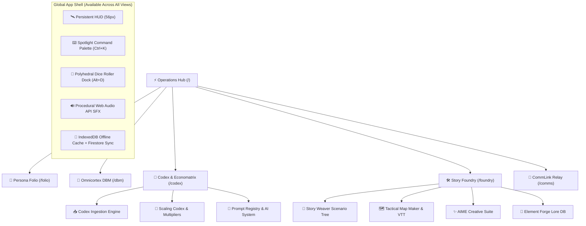

# 🌌 Tangent Science Fantasy Roleplay (TANGENT SFF RP)
## Comprehensive System User Guide & Technical Manual (v2.1)

---

## 🧭 System Overview & Architecture

**Tangent Science Fantasy Roleplay (TANGENT SFF RP)** is an integrated, cyberpunk/space-opera Virtual Tabletop (VTT), character management suite, rules compendium, and narrative worldbuilding engine.

Built with **React 18, Vite, Tailwind CSS, Google Firebase (Firestore + Authentication), and Web Audio API**, Tangent SFF RP delivers an offline-first, high-performance tactical environment for game masters (Architects) and players (Operators).



---

## 📑 Table of Contents

1. [Chapter 1: Operations Hub & Global HUD Ergonomics](#chapter-1-operations-hub--global-hud-ergonomics)
2. [Chapter 2: Persona Folio & Character Architecture](#chapter-2-persona-folio--character-architecture)
3. [Chapter 3: Omnicortex DBM Compendium & Catalog Architecture](#chapter-3-omnicortex-dbm-compendium--catalog-architecture)
4. [Chapter 4: Codex Matrix Suite, Economatrix & Ingestion](#chapter-4-codex-matrix-suite-economatrix--ingestion)
5. [Chapter 5: Story Foundry & Story Weaver Scenario Engine](#chapter-5-story-foundry--story-weaver-scenario-engine)
6. [Chapter 6: Tactical Map Maker & Virtual Tabletop (VTT)](#chapter-6-tactical-map-maker--virtual-tabletop-vtt)
7. [Chapter 7: AIME Creative Suite & Element Forge Lore Architect](#chapter-7-aime-creative-suite--element-forge-lore-architect)
8. [Chapter 8: CommLink Quantum Relay & In-Chat Rolls](#chapter-8-commlink-quantum-relay--in-chat-rolls)
9. [Chapter 9: Polyhedral Dice Engine, Hotkeys & System Tools](#chapter-9-polyhedral-dice-engine-hotkeys--system-tools)
10. [Chapter 10: Tangent Dual Resolution Mechanics & Combat Reference](#chapter-10-tangent-dual-resolution-mechanics--combat-reference)
11. [Chapter 11: Locomotion, Rest, Survival & Advancement Systems](#chapter-11-locomotion-rest-survival--advancement-systems)

---

## Chapter 1: Operations Hub & Global HUD Ergonomics

The **Command Operations Hub (`/`)** is the primary mission dashboard and nerve center of Tangent SFF RP.

### 1.1 Core Telemetry & Widgets
- **Active Campaign Tracker (`CampaignOpsWidget`)**: Displays current campaign title, active scenario count, linked sector maps, and quick navigation into Story Foundry.
- **Game Squads & Multiplayer (`GameSquadsWidget`)**: Manages multiplayer game squads, active member rosters, and one-click invite join codes (`?join=GRP-XXXXXX`).
- **Party at a Glance (`PartyStatusWidget`)**: Renders characters loaded from your active Persona Folio roster with live Health and Vitality bars, species lineage badges, Tech Levels, and Build Point (BP/CP) legality status.
- **CommCenter & Transmission Feed (`CommCenterWidget`)**: Live stream of Quantum Relay broadcasts, private operative comms, and dice check rolls with direct reply capabilities.
- **Interactive Preview Drawers (`LandingDrawerArea`)**: Clicking module cards dynamically unfolds operative sheets, scenario trees, map libraries, or lore elements directly on the dashboard without route transitions.

### 1.2 Persistent Global HUD Ergonomics
The 56px top HUD persists across all routes, providing instant access to mission-critical utilities:
- **Spotlight Omni-Search (`Ctrl+K` / `Cmd+K`)**: Global search index over heroes, species, weapons, scenarios, lore items, and `/roll` commands.
- **Dice Roller Dock (`Alt+D`)**: Floating polyhedral dice dock with one-click polyhedrals (`d4`, `d6`, `d8`, `d10`, `d12`, `d20`, `d100`), custom expression input, advantage/disadvantage toggles, and channel broadcast.
- **CommLink Quick Dock (`Alt+C`)**: Slides out the live transmission stream for fast in-game banter without leaving your tactical map.
- **Procedural Web Audio API**: Zero-external-dependency audio synthesizer generating tactile clicks, terminal chirps, dice rolls, and dramatic critical fanfare.

---

## Chapter 2: Persona Folio & Character Architecture

The **Persona Folio (`/folio`)** is the official digital operative sheet manager and character generation suite.

### 2.1 The 150 Build Point (BP / CP) Economy
Characters in Tangent SFF RP are created using a strict **150 Build Point (BP)** budget:
- **Starting Budget**: 150 BP (customizable by the Architect for high-powered campaigns).
- **Legality Enforcement**: When expenditures exceed available points, the header flashes an **ILLEGAL BUILD** warning. Clicking the point meter opens a complete line-item ledger.
- **Point Allocations**:
  - **Ability Scores**: 5 BP per +1 attribute bonus.
  - **Attribute Check Bonuses**: 1 BP per +1 check score.
  - **Skills & Specializations**: Purchase additional skill ranks beyond background packages.
  - **Features & Augmentations**: Special perks, biological modifications, and cyberware.
  - **Hindrances & Flaws**: Select character flaws to receive point rebates back into your pool.

### 2.2 The Three 20-Point Background Skill Pools
In addition to the 150 BP starting budget, every character receives **three dedicated 20-point Skill Pools** during creation:
1. **Faction Skill Pool (20 SP)**: Ranks allocated strictly among proficiencies granted by the character's primary faction allegiance.
2. **Origin Skill Pool (20 SP)**: Ranks granted by the character's homeworld, habitat, or environmental upbringing.
3. **Occupation Skill Pool (20 SP)**: Ranks defining the operative's career training, professional trade, or tactical specialty.

### 2.3 The 7 Folio Tabs
- **1. Identity Tab**: Operative name, biological species selection (with automated trait modifiers), origin archetype, background occupation, physical metrics, portrait URL, and cybernetic augmentation slots.
- **2. Core Stats & Vitals**: The 6 core attributes (STR, AGI, STA, INT, WIS, CHA) and their linked sub-attributes (Might, Reflex, Fortitude, Reason, Willpower, Etiquette). Automatically derives:
  - **Health Pool**: Structural integrity (`30 + Fortitude`).
  - **Vitality Pool**: Stamina, poise, and energy buffer (`30 + Willpower`).
  - **Base Toughness**: Stamina score (direct damage soak).
  - **Defense Value**: Reaction and armor evasion threshold.
  - **Carry Capacity**: STR-based encumbrance thresholds.
- **3. Skills & Specializations**: Master skill matrix categorized across Combat, Technical, Social, Psionic, and Scientific domains with Novice, Expert, Master, and Legend rank tiers.
- **4. Abilities, Features & Flaws**: Positive feats, racial gifts, meta-tech powers, psychic invocations, and hindrance flaws with CP tracking.
- **5. Combat Loadout & Inventory**: Weaponry (strike bonus, damage dice, rate of fire, range, AP), armor suits (coverage zones, DR rating), and equipment tracking.
- **6. 31-Field Narrative Story Writer**: Four structured narrative categories (**Biography, Psychology, Factions, Logistics**) with **🤖 Bastion AI** auto-drafting to flesh out deep character backstories.
- **7. Notes & Property**: Starship shares, contacts, safehouses, and field mission logs.

### 2.4 Guided Creator Wizard & Persona Bridge
- **Guided Creator (`GuidedCreatorModal`)**: An 8-step wizard walking new players through Concept, Species, Origin, Faction, Occupation, Attributes, Skills, and Gear.
- **Persona Bridge (`personaBridge.js`)**: Real-time synchronization layer ensuring changes to character stats immediately propagate to the Tactical Map Maker tokens and CommLink chat identity.

---

## Chapter 3: Omnicortex DBM Compendium & Catalog Architecture

The **Omnicortex DBM (`/dbm`)** is the relational database and rules compendium of Tangent SFF RP.

### 3.1 Architectural Subdomains
The Omnicortex catalog is organized into specialized architectural domains:
- **Architecture**: Facility scales, modular room blueprints, defense stations, and power grids.
- **Armoring**: Personal armor, hazard suits, energy shielding, coverage zones, and damage reduction (DR).
- **Augmentations**: Cyberware, bioware, neural coprocessors, sensory shunts, and essence costs.
- **Mecha & Vehicles**: Combat walkers, grav-tanks, speeders, starfighters, frame weight classes, and hardpoint mounts.
- **Weaponry**: Melee weapons, slugthrowers, lasers, plasma arms, heavy artillery, and exotic beam casters.
- **Gear & Tools**: Field equipment, medical kits, scanners, communication nodes, and utility harnesses.
- **Invocations**: Metaphysical disciplines (Dimension, Energy, Entropy, Illusion, Matter, Mental) and manifestation parameters.
- **Occupations & Origins**: Complete career paths and homeworld cultural packages.
- **Species & Lineages**: Canonical biological profiles, synthetic frames, awakened creatures, and alien taxonomies.
- **Traits & Disadvantages**: Granular species trait catalog (Basic, Advanced, Elite, Bodyforms) and disadvantage point rebates.
- **Compendium Volumes**: Complete operator and architect rulebook texts.

### 3.2 Operating Modes & Data Pipelines
- **Game Mode (Read-Only)**: Streamlined, high-contrast interface designed for lightning-fast search during live gameplay without risk of accidental data modification.
- **Architect Dev Mode**: Unlocks in-place schema editing, item creation, field modification, and balance overrides.
- **Automated Sync Scripts**: Node.js maintenance scripts (`syncOmnicortexSpecies.mjs`, `syncOmnicortexEquipment.mjs`, `syncOmnicortexFeatures.mjs`) synchronizing local markdown files with Firestore collections in 450-operation batches to avoid quota bottlenecks.

---

## Chapter 4: Codex Matrix Suite, Economatrix & Ingestion

The **Codex (`/codex`)** is the definitive simulation engine, mathematical source of truth, and procedural asset forge for Tangent SFF RP. It governs all asset construction, economic valuation, scaling transitions, and automated data ingestion.

```mermaid
graph TD
    CODEX["🔮 Codex Suite (/codex)"] --> SIDEBAR["📂 5-Group Accordion Sidebar"]
    
    SIDEBAR --> G1["📦 Hardware & Structures (Amber)"]
    SIDEBAR --> G2["👥 Characters & Companions (Blue)"]
    SIDEBAR --> G3["🌍 Planetary, Species & Factions (Emerald)"]
    SIDEBAR --> G4["✨ Metaphysics (Purple)"]
    SIDEBAR --> G5["⚡ System Suites (Slate)"]

    G1 --> ARCH["🏛️ Architecture Blueprint Matrix"]
    G1 --> ARMOR["🛡️ Armor Coverage Matrix"]
    G1 --> AUG["🧬 Augmentations & FBC Matrix"]
    G1 --> EQUIP["🎒 Equipment & Workshop Matrix"]
    G1 --> MECHA["🤖 Mecha & Vehicle Matrix"]
    G1 --> WEAP["⚔️ Weapon Mod Stacker Matrix"]

    G2 --> NPC["👤 Modular NPC Stat Block Matrix"]
    G2 --> FEAT["🌟 Features & Perks Matrix"]

    G3 --> SPEC["🧬 Species Forge Matrix"]
    G3 --> PLAN["🪐 Planetary Design Matrix"]
    G3 --> FACT["🚩 Factions & Polities Matrix"]

    G4 --> INVOC["⚡ Invocation Matrix"]
    G4 --> META["🔮 Meta-Tech Matrix"]

    G5 --> ECON["💰 Economatrix Dashboard"]
    G5 --> TECH["🔬 Technology & Domain Codex"]
    G5 --> SCALE["📐 Scaling Codex & Combat Matchups"]
    G5 --> INGEST["📥 Codex Data Ingestion Engine"]
```



---

### 4.1 The 5 Canonical Sidebar Suites & 17 Matrices

The Codex navigation organizes all game content into five thematic suites:

#### 1. Hardware & Structures (`#f59e0b` Amber Theme)
- **Architecture Blueprint Configurator (`ArchitectureBlueprintConfigurator.jsx`)**:
  - **Scale & Footprints**: From Outpost Sheds (1 Module) to Spire Megastructures (800+ Modules).
  - **10:1 UDU Conversion**: Converts unspent building modules into tactical mount hardpoints (`1 Module = 10 Mounts`).
  - **Highest Complexity Rule**: If any installed facility, weapon turret, or generator exceeds the baseline building DC, the final construction DC elevates to match the highest system.
  - **Workforce Productivity Engine (PP)**: Calculates cooperative construction timelines based on crew size, average skill check, and tool tier.
  - **Liquidity Gap Analysis**: Derives real-time credit shortfall against buyer Wealth Score (WS).
- **Armor Coverage Matrix (`ArmorCoverageSelector.jsx`)**:
  - **7 Hit-Location Slots**: Head, Torso, Left/Right Arm, Left/Right Leg, and Full Suit coverage.
  - **Dynamic Layering & DR**: Computes composite Damage Resistance (DR), Maximum Dexterity cap, and movement penalties.
  - **UDU Socket Displacement**: Evaluates hardware socket budgets across armor plating.
- **Augmentation Nodes Matrix (`AugmentationNodeConfigurator.jsx`)**:
  - **Node Locations**: Cranial, Ocular, Thoracic, Brachial, Neural, and Dermal node installations.
  - **Full Body Conversion (FBC)**: Complete synthetic chassis conversion packages with fixed credit valuations.
  - **Stigma Stepper**: Applies social/medical stigma penalties (`-1 per 5 nodes installed`).
- **Equipment & Workshop Matrix (`EquipmentCategoryConfigurator.jsx`)**:
  - **Size Tiers**: Fine (<0.1 kg, 2 Nodes) to Structure (>10 Tons, 1 Module).
  - **Workshop Scales**: Belt Pouch (+0) to Industrial Campus (+8 Check).
  - **Processor Ratings (PR 0–4)**: Terminal (PR 0) to Singularity Deck (PR 4).
  - **Environmental Hazard Protection (EPR 0–3)**: Standard to Vacuum/Toxic radiation sealing.
- **Mecha & Vehicle Matrix (`MechaChassisConfigurator.jsx`)**:
  - **Chassis Frames**: Humanoid, Quadruped, Tracked, Hover, Submersible, and Aerospace.
  - **Mount Hardpoints**: Heavy weapon bays, energy shielding, and variable flight thrusters (VFT).
  - **Megacredit Scaling**: Automated conversion into Megacredits (`M$ = Credits / 1,000,000`) for military-grade warmachines.
- **Weapon Mod Stacker (`WeaponModStacker.jsx`)**:
  - **Mod Stacking**: Optics, barrel extensions, recoil compensators, and exotic energy coils.
  - **Capacity Upgrades & Downgrades**: Overcharging, extended magazines, or stripped-down frames.
  - **Manufacturer Skins**: Weapon finishes and corporate aesthetic brands.

#### 2. Characters & Companions (`#3b82f6` Blue Theme)
- **Modular NPC Stat Block Matrix (`ModularStatBlockConfigurator.jsx`)**:
  - **Threat Tiers 1–20**: Narrative ranks from Recruit to Transcendent Avatar.
  - **Competency Roles**: Minion, Skirmisher, Bruiser, Sniper, Elite, and Boss.
  - **Tactical Behaviors**: Automated behavioral AI routines (Swarm, Flank, Suppress, Protect).
  - **Vitals Derivation**: Automatically calculates Vitality, Health, Structure, Defense DC, and Expected DR.
- **Features & Perks Matrix**: Canonical master library of general perks, martial features, and racial traits.

#### 3. Planetary, Species & Factions (`#10b981` Emerald Theme)
- **Species Forge Matrix (`SpeciesTraitSelector.jsx`)**:
  - **150 BP Economy**: Full point budget validation (Standard 0 BP, Advanced 10 BP, Monster 20+ BP).
  - **Movement Modes**: Ground, Burrowing, Aquatic, Gliding, and Flight.
  - **Genetic Crafting DC**: Derives biotechnology synthesis DC and gestation duration.
  - **Disadvantage Point Rebates**: Automatic point rebate calculations.
- **Planetary Design Matrix (`PlanetaryDesignConfigurator.jsx`)**:
  - **Universal World Profile (UWP/TWP)**: Procedural generation of Starport, Size, Atmosphere, Hydrographics, Population, Government, and Law levels.
  - **16-Domain Civilization Radar**: Visual polygon radar plotting governance, cybernetics, metaphysics, and infrastructure.
  - **Trade Code Derivation**: Automated tagging of Agricultural (`Ag`), Industrial (`In`), Rich (`Ri`), Desert (`De`), and High-Tech (`Ht`) worlds.
  - **Speculative Commodity Exchange**: Supply/demand price shifts for raw ores, cybernetics, narcotics, and antimatter.
- **Factions & Polities Matrix**: Comprehensive catalog across 26 canonical attributes (sigils, economic models, naval doctrines, and gear aesthetics).

#### 4. Metaphysics (`#a855f7` Purple Theme)
- **Invocation Matrix (`InvocationParameterConfigurator.jsx`)**:
  - **6 Metaphysical Disciplines**: Telekinesis, Telepathy, Pyrokinesis, Chronomancy, Biokinesis, and Voidcraft.
  - **Parameter Scaling**: Cast DC, Essence channeling cost, Area-of-Effect templates, and Duration multipliers.
- **Meta-Tech Matrix (`MetaTechImbuementConfigurator.jsx`)**:
  - **Resonance & Imbuement**: Metamaterial bonding, artifact crafting formulas, and passive effect imbuements.
  - **Host Chassis Sockets**: Weapon, Armor, Cyberware, and Architecture resonance slots.

#### 5. System Suites (`#94a3b8` Slate Theme)
- **Economatrix Dashboard (`EconomatrixDashboard.jsx`)**:
  - **TSC Curve Explorer**: Live calculation of Tangent Standard Curve (`V = 10 * 4^(DC / 5)`).
  - **7-Tier Crafting Timetable**: Fabrication days across Improvised (1x) to Megafabricator (1000x).
  - **Speculative Trade Route Calculator**: Profit margin pipeline between source and destination trade codes.
  - **Financial Status Lookup**: Wealth Score tiers (WS 0–999) and Auto-Buy purchasing limits.
- **Technology & Domain Codex (`TechnologyCodex.jsx`)**:
  - **TL 0–5 Domain Grid**: Primitive to Transcendent civilization matrix across 16 domains.
  - **Adaptive Tech Reconfiguration**: Dynamic switching times from Nanotech (Minutes) to Holophotonics (Instant).
  - **Synthetic Intelligence Continuum**: Sub-AI Automation to Self-Aware Metaminds.
- **Scaling Codex (`ScalingCodex.jsx`)**:
  - **14 Size Categories**: Fine (0.01x) to Cosmic/Planetary (100,000x).
  - **Die-Stepping Ladder**: Step degradation from `-1ds` to `-5ds`.
  - **Fluid Combat Matchups**: Cross-scale hit modifiers, damage dice multipliers, and starship overblast.
- **Codex Ingestion Engine (`CodexIngestionEngine.jsx`)**:
  - **Universal Intake Matrix**: Multi-modal BASTION AI, Direct JSON array, and Universal Delimiter Tabular parser.

---

### 4.2 The 6 Core Calculation Engines

All calculations are executed by pure, deterministic engine modules:

| Engine | Source File | Core Formulas & Responsibilities |
| :--- | :--- | :--- |
| **Economatrix Engine** | [`tangentEconEngine.js`](file:///d:/_%20Data/Tangent%20SF%20RP/TANGENT%20SF%20RP%20react%20project/src/engines/tangentEconEngine.js) | TSC Value `V = 10 * 4^(DC/5)`, Material Cost (50%), Crafting PP, Cooperative Crafting Days, Liquidity Gap, Speculative Trade Margins, Resale Fencing. |
| **UDU Engine** | [`tangentUDUEngine.js`](file:///d:/_%20Data/Tangent%20SF%20RP/TANGENT%20SF%20RP%20react%20project/src/engines/tangentUDUEngine.js) | Unified Difficulty Units, 10:1 UDU tier conversion (`Module → Mount → Socket → Node → Sub-Node`), Encounter Hazard Ratings. |
| **Technology Engine** | [`tangentTechEngine.js`](file:///d:/_%20Data/Tangent%20SF%20RP/TANGENT%20SF%20RP%20react%20project/src/engines/tangentTechEngine.js) | Tech Level (TL0–TL5) progression, Domain rating evaluation, Adaptive tech reconfiguration action economy, Field rarity cost multipliers. |
| **Complex Systems Engine** | [`tangentComplexEngines.js`](file:///d:/_%20Data/Tangent%20SF%20RP/TANGENT%20SF%20RP%20react%20project/src/engines/tangentComplexEngines.js) | Architecture SP, Module allocations, 20% Mobile chassis tax, Mount hardpoints, Highest Complexity Rule (DC stacking), Mecha Chassis Defense DC & megacredits. |
| **Entity Engine** | [`tangentEntityEngines.js`](file:///d:/_%20Data/Tangent%20SF%20RP/TANGENT%20SF%20RP%20react%20project/src/engines/tangentEntityEngines.js) | Modular Character vital pools (Vitality, Health, Structure), Threat Tier scaling, Competency role matrix, Species BP budget & genetic DC. |
| **Planetary Engine** | [`tangentPlanetaryEngine.js`](file:///d:/_%20Data/Tangent%20SF%20RP/TANGENT%20SF%20RP%20react%20project/src/engines/tangentPlanetaryEngine.js) | UWP/TWP string parser/formatter, Gravity & Atmosphere profiles, Canonical Trade Code derivation, Market availability cap `(TL * 5) + 10`. |

---

### 4.3 Data Ingestion Engine & Revision Workbench

The **Codex Ingestion Engine (`/codex?matrix=ingestion-engine`)** is the enterprise data pipeline that imports, parses, validates, and stages content for all 14 canonical Omnicortex collections.

#### 1. Intake Modes
1. **BASTION AI Studio**:
   - Multimodal extraction from uploaded rulebook PDFs, TXT, and Markdown files.
   - **Large Document Section Chunking**: Automatically segments files >10,000 characters along markdown headers and paragraph boundaries, reporting real-time synthesis progress (`Synthesizing Section X of Y...`).
2. **Direct JSON Array**:
   - Paste or upload raw JSON arrays matching the canonical schema.
3. **Universal Delimiter Tabular Parser**:
   - **Delimiter Auto-Detection**: Supports Markdown Pipe Tables (`|`), Tab-Separated Values (`\t` from Excel / Google Sheets), RFC 4180 quotation-aware CSV (`,`), and Semicolon (`;`) tables.
   - **Header Normalization Aliases**: Resolves non-standard column headers (e.g. `tl`, `craftdc`, `credits`, `sp`, `dr`, `desc`) to canonical database keys.
   - **Tabular File Dropzone**: Drag-and-drop selector accepting `.csv`, `.tsv`, and `.txt` files directly.

#### 2. Staged Ingestion Workbench & Side-by-Side Diff Inspector
- **Card Preview Ledger**: Displays staged entries with live validation badges, syntax warnings, and Folio health status.
- **Side-by-Side Diff Inspector Modal**:
  - Compares incoming records against existing database items by ID or Name.
  - Highlights modified fields in **Amber**, newly added fields in **Emerald**, and unchanged fields in **Slate**.
  - One-click transition into the In-Place Revision Workbench.
- **In-Place Revision Workbench**: Edit fields, JSON keys, and validation parameters directly before committing.
- **Conflict Handling Strategies**:
  - `Merge`: Combines existing document fields with staged modifications while preserving Firestore document IDs.
  - `Overwrite`: Replaces the entire existing record.
  - `Skip`: Bypasses conflicting document IDs.
- **Math & LaTeX Sanitization Engine**: Strips LaTeX `$`/`$$` delimiters and unescaped markdown to ensure 100% compatibility with the DBM compendium and Persona Folio sheets.

---

## Chapter 5: Story Foundry & Story Weaver Scenario Engine

The **Story Foundry (`/foundry`)** is an integrated narrative suite for campaign management, scene planning, and lore authoring.

### 5.1 Hierarchical Scenario Tree Editor
- **Tree Structure**: Organize campaigns into Acts, Chapters, Scenes, and Encounters with drag-and-drop hierarchy restructuring.
- **8 Element Types**: Characters, Locations, Factions, Relics, Events, Lore Docs, Session Prep, and Custom Schema.
- **Bi-Directional Relational Links**: Link NPC cards directly to location nodes and factions with live relational badges.
- **Destructive Deletion Safeguards**: Requires typing the exact element name to confirm deletion of critical plot nodes.

### 5.2 Conflict Resolution & Cloud Sync
- **Debounced Firestore Writes**: 1.5-second debouncing prevents Firestore quota exhaustion during rapid typing.
- **Sync Conflict Modal**: Identifies divergence between local IndexedDB timestamps and remote cloud data, offering side-by-side branch comparison or merging.
- **Multi-Format Export**: Export your complete campaign or isolated chapters to Markdown (`.md`), HTML, PDF, or JSON.

---

## Chapter 6: Tactical Map Maker & Virtual Tabletop (VTT)

The **Tactical Map Maker (`/foundry/map-maker`)** is a hardware-accelerated battlemap canvas powered by React Konva.

### 6.1 Battlemap Canvas & Grids
- **Multi-Grid Canvas**: Switch seamlessly between Square (5ft / 1.5m), Pointy-Topped Hex, Flat-Topped Hex, and Isometric grid modes with customizable grid opacity and snap-to-grid movement.
- **Biome Painting**: Textured brushes for sci-fi arcology decking, volcanic rock, sand wastelands, toxic waterways, and neon streets.
- **Fog of War**: Paintable reveal/hide masks allowing the GM to uncover dungeon chambers as characters explore.

### 6.2 Token Drawer, Status Gems & Floating Combat Text
- **Folio Hero Token Drawer (`FolioHeroTokenDrawer`)**: Slides out the active party roster. Drag and drop operative tokens directly onto the tactical map with live Health/Vitality rings.
- **Status Gems Modal (`StatusGemsModal`)**: Assign visual condition gems (Stunned, Bleeding, Burning, Concealed, Prone, Exhausted) directly to token bases.
- **Floating Combat Text (`FloatingCombatText`)**: Displays real-time animated scrolling text for damage taken, armor deflected, health healed, and critical strikes.
- **Player Spectator View (`/spectator/:mapId`)**: Clean, secondary-monitor projection route stripping GM hidden layers, private tokens, and secret notes for player viewing.

---

## Chapter 7: AIME Creative Suite & Element Forge Lore Architect

The **AIME Creative Suite (`/foundry/aime`)** (Artificial Intellect Master Entity) and **Element Forge (`/foundry/elements`)** provide narrative prose writing and structured worldbuilding databases.

### 7.1 The 3-Stage AIME Manuscript Engine
1. **Stage 1 — Brainstorm**: Synthesize active campaign lore elements and creative Guidance Gems to brainstorm scene premises and unexpected twists.
2. **Stage 2 — Outline**: Formulate narrative beats, pacing ladders, and dramatic turning points.
3. **Stage 3 — Draft & Floating Toolbar**: Full-featured prose editor equipped with floating AI tools: *Expand, Rephrase, Tighten, Polish,* and *Shift Tone*.

### 7.2 Element Forge & Draggable Co-Pilot
- **Element Forge**: Schema-backed database for creating rich world encyclopedias (Planets, Megacorps, Ancient Relics, Biological Anomalies).
- **Draggable AIME Co-Pilot**: Persistent floating chat assistant accessible across the entire Foundry suite, providing instant Bastion AI rules lookup and verified `/roll` execution.

---

## Chapter 8: CommLink Quantum Relay & In-Chat Rolls

The **CommLink Relay (`/comms`)** provides real-time encrypted communications and dispatch operations.

### 8.1 Channels & Direct Comms
- **Public & Faction Frequencies**: Open planetary Holonet channels, localized squad channels, and encrypted corporate bands.
- **Direct Operative Frequencies**: Private 1-on-1 comm channels between operatives or between a player and the GM for covert rolls and secret instructions.
- **In-Chat Dice Rolls**: Type `/roll 2d10+4` or `/roll d20+6` directly into chat to broadcast verified, cryptographically seeded rolls to the squad.

---

## Chapter 9: Polyhedral Dice Engine, Hotkeys & System Tools

### 9.1 Global Keyboard Shortcuts
| Keybinding | Action Description | Scope |
| :--- | :--- | :--- |
| `Ctrl + K` / `Cmd + K` | Toggle Spotlight Omni-Search & Command Palette | Global |
| `Alt + D` | Toggle Floating Polyhedral Dice Roller Dock | Global |
| `Alt + C` | Toggle CommLink Quick Chat Dock | Global |
| `Esc` | Close any active modal, drawer, or palette | Global |

### 9.2 Dice Formula Parsing & Evaluation
- Standard notation: `XdY + Z` (e.g. `2d10+5`, `2d10+3`, `4d6-2`).
- Advantage / Disadvantage: Rolls twice and automatically takes the higher or lower total.
- Polyhedral dock provides instant one-click rolling with advantage/disadvantage modifiers.

### Dual-Resolution Mechanics

Tangent SFF RP uses a unified **2d10** resolution framework:

1. **Skill & Tactical Checks**: `2d10 + Linked Attribute Modifier + Skill Rank vs Target Defense/DC`.
2. **Attribute Checks & Saving Throws**: `2d10 + Base Check Score + Modifiers vs Challenge Rating (CR)`.
3. **Critical Hits / Fumbles**: Natural dual 10s evaluate with a +30 subtotal (Critical Triumph), while natural dual 1s evaluate with a -10 subtotal (Critical Fumble).

```
Check Roll = 2d10 + Base Check Score + Situational Modifiers
```

### 10.1 Trained Skills Resolution & Target Numbers (TN)
```
Skill Roll = 2d10 + Linked Attribute + Skill Rank + Situational Mods
```
- **TN 10 (Routine / Simple)**: Tasks achievable under minor pressure.
- **TN 15 (Challenging / Trained)**: Standard combat-stress actions and technical repairs.
- **TN 20 (Formidable / Expert)**: Actions requiring elite training or high-tier equipment.
- **TN 25+ (Heroic / Legendary)**: Universe-altering feats of mastery.

#### Numeric Criticals on 2d10
- **Critical Success (Double 10s)**: Rolled value becomes **30** (`Total = 30 + Modifiers`), guaranteeing an extraordinary triumph and maximum margin of success.
- **Critical Fumble (Double 1s)**: Rolled value becomes **-10** (`Total = -10 + Modifiers`), resulting in catastrophic misfire, weapon jam, or severe hazard.

### 10.2 Core Attributes & Attribute Checks
```
Base Check Score = 2 + (Attribute Score × 2)
Check Roll = d20 + Base Check Score + Situational Modifiers
```
| Attribute | Linked Check | Primary Application |
| :--- | :--- | :--- |
| **Strength (STR)** | **Might Check** | Heavy lifting, door breaching, grappling, melee force |
| **Agility (AGI)** | **Reflex Check** | Dodging explosions, evasion, acrobatic balance, initiative |
| **Stamina (STA)** | **Fortitude Check** | Resisting neurotoxins, disease, vacuum exposure, wound shock |
| **Intellect (INT)** | **Reason Check** | Pure logic, cipher cracking, technical deduction, computation |
| **Wisdom (WIS)** | **Willpower Check** | Resisting psionic domination, fear, emotional composure |
| **Charisma (CHA)** | **Etiquette Check** | Social diplomacy, bartering, persuasion, de-escalation |

> [!NOTE]
> **Attribute Checks vs Saving Throws**: General Checks are proactive actions not covered by a specialized skill. Saving Throws are reactive defenses against environmental hazards or attacks. Relevant skills provide synergy bonuses to saves (e.g. Medicine aids Fortitude vs poison; Athletics aids Reflex vs falls).

### 10.3 Perception Sub-Ability & Detection Checks
**Base Perception** is derived from a character's mental acuity:
```
Base Perception = Intellect + Wisdom
```
- **Alertness Check** (`Perception + Alertness`): Spotting visual/auditory cues, noticing hidden traps, concealed doors, detecting ambushes.
- **Meta Perception** (`Perception + Attune`): Sensing magic, psychic powers, planar energies, and Metafocus aura signatures.
- **Social Perception** (`Perception + Insight`): Reading micro-expressions, vocal shifts, deceit detection, and assessing emotional motives.
- **Technical Perception** (`Perception + Technology`): Interpreting electronic sensors, locating hardware vulnerabilities, and detecting electronic counter-measures.

### 10.4 Vitality, Health, Structure & Damage Classification
- **Vitality Pool (`30 + Willpower`)**: Tracks **Non-Lethal Damage Capacity**, environmental stress, fatigue damage, subdual strikes, and mental/sensory exhaustion. Depleted by non-lethal attacks first; once Vitality reaches 0, excess non-lethal exhaustion spills into Health (causing incapacitation).
- **Health Pool (`30 + Fortitude`)**: Tracks **Lethal Damage Capacity** such as cuts, burns, bullet trauma, shrapnel, and high-impact physical wounds. Lethal attacks damage Health directly. When Health reaches 0, the operative collapses and begins their Death Clock.
- **Structure Pool (Synthetics, Mecha & Objects)**: Synthetics possess no biological nervous system and have a unified **Structure Pool** (the total of what would be Vitality + Health). **Synthetics are completely IMMUNE to non-lethal damage** (fatigue, environmental stress, subdual strikes). All lethal damage applies directly to Structure.
- **Base Toughness (`Stamina Score`)**: Inherent physiological damage soak deducted from physical impacts.
- **Armor Damage Reduction (DR)**: Absorbs damage prior to pool subtraction based on hit location coverage.

### 10.5 Death Clock, Massive Damage & Revivification
- **The Death Clock**: When a character's Health reaches **0**, they fall unconscious and initiate their **Death Clock**, equal to their **Stamina score in rounds** (minimum 1 round).
- **Advancing the Clock**: Each combat round that passes without medical stabilization ticks down the Death Clock by 1. If the clock reaches 0, the character suffers clinical death.
- **Massive Damage**: If a character takes damage in a single strike equal to or exceeding their Stamina score directly to Health, they must immediately pass a DC 15 Fortitude check or instantly die.
- **Stabilization**: A successful **Medicine (DC 15)** check, trauma kit application, or medical nano-injector immediately stops the Death Clock.
- **Revivification ("The High Cost of Dying")**: Returning from clinical death requires TL5 medical tech or rare metaphysical invocations. Revived operatives suffer severe trauma:
  1. **Forfeit all remaining Karma Points**.
  2. Incur a permanent **-5 Experience Debt**, which must be paid off 1-for-1 with future Award Points (AP) or an immediate trait score reduction.

---

## Chapter 11: Locomotion, Rest, Survival & Advancement Systems

### 11.1 Movement Rules & Tactical Paces
Characters traverse battlefields and planetary sectors across standardized movement paces based on their **Base Movement Speed (typically 30 ft / 6 sq)**:
- **Walk (1x Speed)**: Standard tactical maneuver; allows performing a standard action without penalty.
- **Hustle (2x Speed)**: Double-time movement; consumes standard action.
- **Run (3x Speed)**: Fast sprint; imposes a -2 penalty to passive perception checks.
- **Sprint (4x Speed)**: Maximum physical exertion in a straight line; imposes a -4 penalty to defense and requires fatigue checks over extended duration.

#### Locomotion Modes
- **Bipedal / Quadruped**: Standard ground locomotion.
- **Climbing**: Base Climbing (1/2 speed), Scaling (2x speed, DC 15 Athletics), Fast Ascent (3x speed, DC 18 Athletics), Fast Descent (6x speed, DC 20 Athletics).
- **Aerial Flight**:
  - **Hover / Controlled Descent**: Half speed or less; requires DC 15 Acrobatics check to maintain altitude.
  - **Sail & Soar**: High-speed gliding using thermal currents; grants the **High Ground (+2 Strike / +2 Crit)** combat bonus.
  - **Dive & Ramming**: High-speed impact causing `+1d` damage per flight stage and `+1 impact damage per 10 ft of speed` to both attacker and target.
- **Swimming, Slithering & Treads**: Specialized movement with terrain-specific hazard resistance.
- **Zero-G & Vacuum**: Requires magnetic boots or reaction thrusters; inertia drift rules apply on sudden course changes.

### 11.2 Rest & Recovery Engine
Resource and ability recovery depends on proper rest cycles:
- **Full Rest (6–8 Hours)**:
  - Required sleep cycle for standard biological species to reset all exhaustion, heal vitality, and restore daily ability uses.
  - **Physiological Exceptions**: Synthetics, Fae, and Insect species do not experience traditional sleep; a brief period of Light Rest fully restores their systems. Alterians and Mondi engage in deep structured meditative states counting as Full Rest.
- **Light Rest (Up to 4 Times per Day)**:
  - **Nap / Meditation (1 Hour)**: Deepest relaxation; optimal for resetting single-encounter traits.
  - **Lounging (2 Hours)**: Casual observation and reading; non-laborious activities allowed.
  - **Light Duty (3 Hours)**: Minimal maintenance and casual guard duty.
- **Rest Interruption & Deterioration**: Performing strenuous activity (combat, sprinting, heavy physical labor) immediately degrades rest quality (e.g. from Nap to Lounging to Light Duty to Interrupted/Failed).

#### Movement Fatigue Rules
- **Trigger**: A character sprinting for **5 consecutive combat rounds** or maintaining hurried travel for **10 minutes** must make a **DC 15 Stamina Fortitude Check**.
- **Failure**: The character suffers **5 points of non-lethal Vitality damage**. If Vitality is depleted, they take **2 points of physical Health damage** and gain the **Exhausted** condition (-2 to all active checks, half movement speed) until receiving a Light Rest.

### 11.3 Unified Scaling Multipliers (Personal to Planetary)
Combat damage, armor penetration, and structural resilience scale exponentially across 8 distinct size and vehicle tiers:

| Scale Tier | Multiplier | Typical Entities | Damage Scale | Armor DR Scale |
| :--- | :---: | :--- | :---: | :---: |
| **Personal** | **1×** | Humanoids, beasts, standard infantry weapons | 1× | 1× |
| **Heavy Exo** | **2×** | Power armor suits, heavy exo-rigs, crew-served guns | 2× | 2× |
| **Light Vehicle** | **5×** | Hoverbikes, light buggies, scout combat walkers | 5× | 5× |
| **Medium Mecha** | **10×** | Mainline combat walkers, armored personnel carriers | 10× | 10× |
| **Heavy MBT** | **20×** | Main battle tanks, heavy siege walkers | 20× | 20× |
| **Super Heavy** | **50×** | Super-heavy assault mecha, titan chassis | 50× | 50× |
| **Capital Ship** | **100×** | Corvettes, frigates, orbital defense batteries | 100× | 100× |
| **Planetary** | **1000×** | Orbital bombardment lasers, dreadnoughts, world-busters | 1000× | 1000× |

### 11.4 Experience & Advancement (Award Points & The Increment Rule)
Character progression in Tangent SFF RP is organic, story-driven, and non-linear.
- **Award Points (AP) Economy**: `1 AP = 1 BP`. Standard pacing awards **1 to 3 AP per session**.
- **Story Awards**: Concluding narrative acts (5–10 AP); overcoming major nemeses or syndicates (1–3 AP).
- **Session Awards**: Consistent mechanics handling (0–2 AP); deep roleplaying in character (0–2 AP).
- **Epic & Ad-Hoc Awards**: Brilliant tactical gambits or outsmarting the Architect (1–5 AP).

#### ⚠️ The Increment Rule (CRITICAL)
Award Points are spent on character enhancements on a 1-for-1 basis identical to Build Points, subject to the **Increment Rule**:
> **Any ability score, skill rank, or trait may ONLY BE INCREASED BY 1 POINT PER EXPERIENCE AWARD.**
Players cannot pool 10 AP and immediately dump all 10 points into a single skill or attribute in one advancement phase. Progression must be distributed incrementally across multiple areas or advanced across multiple distinct downtime sessions.
