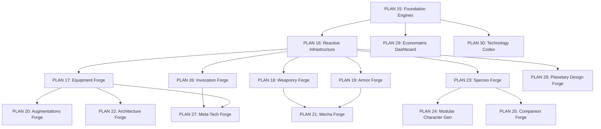

# PLAN 14: CODEX MATRIX TOOLS — MASTER PLAN

> **Scope**: Transform 14 static CODEX markdown design documents into interactive, formula-driven, dynamic matrix tools integrated into the Codex Suite (`/codex`).

---

## 1. Executive Summary

The existing Codex Suite has 12 basic form-based matrix builders defined in `codexConfig.js`. These accept manual text/number entry but perform **zero calculations**, enforce **no game rules**, and have **no cross-referencing** between matrices. Two matrices (ECONOMATRIX, TECHNOLOGY) have no existing Codex entries at all.

This master plan defines the architecture, phasing, priority ordering, and cross-cutting technical decisions for upgrading all 14 matrices into intelligent, formula-driven content creation tools that auto-calculate game values, enforce rule constraints, cross-reference linked entries, and persist complete computed data to the Omnicortex database.

---

## 2. Architecture Overview

### 2.1 System Layers

```
┌─────────────────────────────────────────────────────────────────────┐
│                        CODEX SUITE UI (/codex)                      │
│  CodexApp → CodexSidebar → CodexMatrixBuilder + ComputedOutputPanel │
│                 ↕ Per-matrix calculation hooks                       │
├─────────────────────────────────────────────────────────────────────┤
│                    REACTIVE FORM INFRASTRUCTURE                      │
│  Computed fields, conditional visibility, capacity meters,           │
│  crafting time tables, cross-matrix relational selectors             │
├─────────────────────────────────────────────────────────────────────┤
│                     SHARED CALCULATION ENGINES                       │
│  tangentEconEngine │ tangentTechEngine │ tangentUDUEngine │ Constants│
├─────────────────────────────────────────────────────────────────────┤
│                       DATA PERSISTENCE LAYER                         │
│  Compute-on-Save → Firestore Collections (correctable in Omnicortex)│
│  IndexedDB cache → 1.5s debounced Firestore sync                    │
└─────────────────────────────────────────────────────────────────────┘
```

### 2.2 UI Strategy (Option A — Smart Single Builder)

The `CodexMatrixBuilder.jsx` component remains the single entry point for all matrix forms, but is upgraded to support:

1. **Reactive computed fields** — Fields marked `computed: true` auto-populate from engine calculations when dependencies change
2. **onChange hooks** — Field changes trigger named recalculation cascades (e.g., changing `craft_dc` triggers `recalculateEconomics`)
3. **Conditional visibility** — Fields show/hide based on current Tech Level, category, or other field values
4. **ComputedOutputPanel** — Side panel rendering live-calculated values (Credit Value, Crafting Time, WS Threshold, etc.)
5. **Capacity meter integration** — UDU, Node, BP, and Socket budget meters rendered inline
6. **Cross-matrix relational selectors** — Reuse `UnifiedRelationalSelectorModal` to link entries across collections

**Progressive Enhancement**: Augmentations, Mecha, Architecture, and Planetary matrices will eventually get dedicated custom UI components with visual configurators (anatomical silhouettes, drag-and-drop slot builders, radar charts) — but the MVP uses the smart single builder for all.

### 2.3 Data Strategy (Compute-on-Save)

When an item is saved from any matrix tool:
1. All engine calculations run against the current form state
2. Computed values are injected into the document as `_computed` fields
3. The complete document (user input + computed values) is persisted to Firestore
4. Computed values are recalculated if the item is edited and re-saved
5. Computed values can be manually overridden in the Omnicortex DBM (for edge cases, GM fiat, etc.)

```javascript
// Example: Saved weapon document in Firestore
{
  name: "ARC-9 Plasma Burst Carbine",
  craft_dc: 20,
  tl: 3,
  ml: 0,
  // ...user-entered fields...
  
  // Computed on save:
  _computed: {
    credit_value: 2560,
    material_cost: 1280,
    ws_threshold: 20,
    financial_status: "Affluent",
    udu_displacement: { tier: "Socket", count: 1 },
    crafting_days: {
      improvised: 256,
      basic: 25.6,
      advanced: 5.12,
      industrial: 1.28,
      nanoforge: 0.256,
      genesis: 0.051
    }
  }
}
```

### 2.4 Cross-Matrix Interconnection

Entries can reference other Omnicortex entries across collections:

| Source Matrix | References | Target Collection |
|:---|:---|:---|
| Mecha | Mounted weapons | `weaponry` |
| Mecha | Hull armor type | `armoring` |
| Architecture | Installed modules (equipment) | `gear` |
| Modular Characters | Equipment loadout | `weaponry`, `armoring`, `gear` |
| Modular Characters | Installed augmentations | `augmentations` |
| Meta-Tech | Base item being enchanted | `gear`, `weaponry`, `armoring` |
| Companion | Equipped gear | `gear`, `weaponry` |
| Planetary Design | Dominant faction | `factions` |
| Planetary Design | Local species | `species` |

References are stored as Firestore document IDs with collection name, enabling bidirectional lookup in the Omnicortex.

---

## 3. Implementation Phases & Priority Order

### Phase 0: Foundation (PLAN 15) — COMPLETE ✅
Build the shared calculation engine library before any matrix tool.
- `src/engines/tangentEconEngine.js`
- `src/engines/tangentTechEngine.js`
- `src/engines/tangentUDUEngine.js`
- `src/engines/tangentConstants.js`
- Unit tests for all engine functions

### Phase 1: Infrastructure (PLAN 16) — COMPLETE ✅
Upgrade the Codex Suite UI to support reactive, formula-driven forms.
- Enhanced `codexConfig.js` schema with computed fields and onChange hooks
- `ComputedOutputPanel.jsx` component
- `UDUCapacityMeter.jsx` component
- `CraftingTimeTable.jsx` component
- Modified `CodexMatrixBuilder.jsx` with reactive field support
- Compute-on-save middleware in `CodexApp.jsx`

### Phase 2: Core Item Matrices (PLANS 17–19) — COMPLETE ✅
Priority 1–3. The fundamental physical item creators.

| # | Plan | Matrix Tool | Priority | Status | Rationale |
|:--|:-----|:-----------|:---------|:-------|:----------|
| 17 | Equipment Forge | Equipment | 1/14 | COMPLETE ✅ | Foundation for all physical items; establishes UDU Socket patterns |
| 18 | Weaponry Forge | Weaponry | 2/14 | COMPLETE ✅ | Highest player demand; establishes weapon mod stacking pattern |
| 19 | Armor Forge | Armor | 3/14 | COMPLETE ✅ | Paired with weaponry; establishes chassis/skin split pattern |

### Phase 3: Complex Entity Matrices (PLANS 20–22) — COMPLETE ✅
Priority 4–6. High-complexity matrices with deep calculation needs.

| # | Plan | Matrix Tool | Priority | Status | Rationale |
|:--|:-----|:-----------|:---------|:-------|:----------|
| 20 | Augmentations Forge | Augmentations | 4/14 | COMPLETE ✅ | Core cyberpunk feature; establishes Node/BP budget pattern |
| 21 | Mecha Forge | Mecha & Vehicles | 5/14 | COMPLETE ✅ | Largest matrix (70KB); uses cross-matrix weapon linking |
| 22 | Architecture Forge | Architecture | 6/14 | COMPLETE ✅ | Base building; Module allocation pattern |

### Phase 4: Character & Creature Matrices (PLANS 23–27) — COMPLETE ✅
Priority 7–11. Character creation, NPCs, companions, and abilities.

| # | Plan | Matrix Tool | Priority | Status | Rationale |
|:--|:-----|:-----------|:---------|:-------|:----------|
| 23 | Species Forge | Species | 7/14 | COMPLETE ✅ | Character creation dependency; BP budget system |
| 24 | Modular Character Gen | Modular Characters | 8/14 | COMPLETE ✅ | NPC generator; Tier + Role stack system |
| 25 | Companion Forge | Companion | 9/14 | COMPLETE ✅ | Entity creator; 40 BP budget system |
| 26 | Invocation Forge | Invocation | 10/14 | COMPLETE ✅ | Spell builder; DC adjustment sliders |
| 27 | Meta-Tech Forge | Meta-Tech | 11/14 | COMPLETE ✅ | Enchanting calculator; links to base items |

### Phase 5: World & Economy Matrices (PLANS 28–30) — NEXT UP ⏳
Priority 12–14. Worldbuilding tools and system reference.

| # | Plan | Matrix Tool | Priority | Status | Rationale |
|:--|:-----|:-----------|:---------|:-------|:----------|
| 28 | Planetary Design Forge | Planetary Design | 12/14 | PLANNED 📅 | World generator; 16-domain radar chart |
| 29 | Economatrix Dashboard | Economatrix | 13/14 | PLANNED 📅 | Reference + calculator suite |
| 30 | Technology Codex | Technology | 14/14 | PLANNED 📅 | Reference + tech profiler/configurator |

---

## 4. Cross-Cutting Technical Concerns

### 4.1 codexConfig.js Schema Evolution

Each matrix's `codexConfig.js` entry will be enhanced with:

```javascript
{
  id: 'weaponry',
  name: 'WEAPONRY',
  // ...existing fields...
  
  // NEW: Calculation engine binding
  engineHooks: {
    onDCChange: (dc, formState) => { /* recalculate economics */ },
    onTLChange: (tl, formState) => { /* filter available options */ },
    onSave: (formState) => { /* compute all derived values */ },
  },
  
  // NEW: Computed output panel configuration
  computedOutputs: [
    { id: 'credit_value', label: 'Market Value', engine: 'econ', fn: 'calculateCreditValue', input: 'craft_dc', format: 'credits' },
    { id: 'material_cost', label: 'Material Cost', engine: 'econ', fn: 'calculateMaterialCost', input: 'credit_value', format: 'credits' },
    { id: 'crafting_time', label: 'Crafting Time', engine: 'econ', fn: 'calculateCraftingDays', inputs: ['credit_value'], format: 'time_table' },
    { id: 'ws_threshold', label: 'WS Threshold', engine: 'econ', fn: 'getWSFromDC', input: 'craft_dc', format: 'status_badge' },
  ],
  
  // NEW: Cross-matrix relational fields
  relationalFields: [
    { name: 'mounted_weapons', targetCollection: 'weaponry', label: 'Mounted Weapons', multiple: true },
  ],
  
  // NEW: Capacity/budget tracking
  budgets: [
    { id: 'socket_budget', type: 'udu', tier: 'Socket', maxField: 'component_slots', label: 'Attachment Slots' },
  ],
}
```

### 4.2 Firestore Collection Mapping

| Matrix Tool | Primary Collection | Alt Collection | Computed Fields Stored |
|:---|:---|:---|:---|
| Equipment | `gear` | — | credit_value, material_cost, crafting_days, ws_threshold |
| Weaponry | `weaponry` | — | credit_value, material_cost, final_dc, crafting_days, ws_threshold |
| Armor | `armoring` | — | credit_value, dr_total, sp, crafting_days, ws_threshold |
| Augmentations | `augmentations` | — | credit_value, nodes_consumed, bp_cost, stigma_level, crafting_days |
| Mecha | `mecha` | — | credit_value, total_sp, mount_budget, module_budget, crafting_days |
| Architecture | `architecture` | `society_architecture` | credit_value, total_sp, module_count, crafting_days |
| Species | `species` | — | bp_total, attribute_modifiers, movement_speeds |
| Modular Characters | `compendium` | `features` | full_stat_block, threat_rating, encounter_xp |
| Companion | `features` | `compendium` | bp_remaining, stat_block |
| Invocation | `invocations` | — | final_cast_dc, essence_cost |
| Meta-Tech | `gear` | `compendium` | final_craft_dc, socket_cost, credit_value |
| Planetary Design | `compendium` | — | trade_codes, commodity_prices, hazard_ratings |
| Economatrix | N/A (calculator) | — | N/A (session-only) |
| Technology | N/A (reference) | — | N/A (reference data) |

### 4.3 BASTION AI Integration

The existing `CodexAiSynthesizerModal.jsx` and `bastionService.js` will continue to function with enhanced matrices. The AI synthesizer:
1. Generates initial field values based on archetype prompts
2. The generated values flow through the same reactive calculation pipeline
3. Computed outputs auto-populate from AI-generated Crafting DC and TL values
4. Users can adjust AI suggestions before saving

### 4.4 Omnicortex Correctability

All `_computed` values stored in Firestore can be manually edited in the Omnicortex DBM:
- The `DBMItemModal.jsx` shows computed fields as read-only by default
- An "Override Computed Values" toggle (Architect/Admin only) enables manual editing
- Manually overridden values are flagged with `_computed_override: true` to prevent recalculation on next save
- A "Recalculate" button re-runs engine calculations to restore formula-derived values

---

## 5. Dependency Chain



---

## 6. Sub-Plan Index
 
| Plan | File | Title | Phase | Status |
|:-----|:-----|:------|:------|:-------|
| 14 | `PLAN_14_CODEX_MATRIX_TOOLS_MASTER.md` | This document (Master Plan) | — | ACTIVE REFERENCE 📖 |
| 15 | `PLAN_15_CODEX_FOUNDATION_ENGINES.md` | Shared Calculation Engines | Phase 0 | COMPLETE ✅ |
| 16 | `PLAN_16_CODEX_REACTIVE_INFRASTRUCTURE.md` | Reactive Form Infrastructure | Phase 1 | COMPLETE ✅ |
| 17 | `PLAN_17_CODEX_EQUIPMENT_FORGE.md` | Equipment Matrix Tool | Phase 2 | COMPLETE ✅ |
| 18 | `PLAN_18_CODEX_WEAPONRY_FORGE.md` | Weaponry Matrix Tool | Phase 2 | COMPLETE ✅ |
| 19 | `PLAN_19_CODEX_ARMOR_FORGE.md` | Armor Matrix Tool | Phase 2 | COMPLETE ✅ |
| 20 | `PLAN_20_CODEX_AUGMENTATIONS_FORGE.md` | Augmentations Matrix Tool | Phase 3 | COMPLETE ✅ |
| 21 | `PLAN_21_CODEX_MECHA_FORGE.md` | Mecha & Vehicle Matrix Tool | Phase 3 | COMPLETE ✅ |
| 22 | `PLAN_22_CODEX_ARCHITECTURE_FORGE.md` | Architecture Matrix Tool | Phase 3 | COMPLETE ✅ |
| 23 | `PLAN_23_CODEX_SPECIES_FORGE.md` | Species Matrix Tool | Phase 4 | COMPLETE ✅ |
| 24 | `PLAN_24_CODEX_MODULAR_CHARACTER_GENERATOR.md` | Modular Character Generator | Phase 4 | COMPLETE ✅ |
| 25 | `PLAN_25_CODEX_COMPANION_FORGE.md` | Companion Matrix Tool | Phase 4 | COMPLETE ✅ |
| 26 | `PLAN_26_CODEX_INVOCATION_FORGE.md` | Invocation Matrix Tool | Phase 4 | COMPLETE ✅ |
| 27 | `PLAN_27_CODEX_META_TECH_FORGE.md` | Meta-Tech Matrix Tool | Phase 4 | COMPLETE ✅ |
| 28 | `PLAN_28_CODEX_PLANETARY_DESIGN_FORGE.md` | Planetary Design Matrix Tool | Phase 5 | NEXT UP ⏳ |
| 29 | `PLAN_29_CODEX_ECONOMATRIX_DASHBOARD.md` | Economatrix Dashboard | Phase 5 | PLANNED 📅 |
| 30 | `PLAN_30_CODEX_TECHNOLOGY_CODEX.md` | Technology Codex | Phase 5 | PLANNED 📅 |

---

## 7. Verification Strategy

### Per-Matrix Verification
Each matrix tool plan includes its own verification section with:
- Engine calculation unit tests against known document examples
- UI snapshot tests for computed output panels
- Integration tests for compute-on-save pipeline
- Manual verification checklist

### System-Level Verification
- `npm run build` passes after each phase completion
- No regressions in existing Codex, DBM, Folio, or Foundry functionality
- Cross-matrix references resolve correctly between collections
- BASTION AI synthesizer functions with enhanced matrix schemas
- Omnicortex DBM can display and optionally override computed values
- Performance: Real-time recalculation completes in < 16ms (60fps budget)

---

## 8. Implementation Addendum — Completed Tasks

### Stage 1 (Phases 0 & 1) Implementation Status: COMPLETE ✅

#### Phase 0: Shared Foundation Engines (PLAN 15)
- [x] **`src/engines/tangentConstants.js`**: Central repository for all static lookup tables and system enums:
  - `TECH_LEVELS` (TL 0–5 metadata, eras, species, power sources, wealth modifiers, restricted skills)
  - `UDU_TIERS` (Node, Socket, Mount, Module ratios and mass thresholds)
  - `TOOL_TIERS` (7 fabrication tiers: Improvised $1\times$, Basic $10\times$, Advanced $50\times$, Industrial $200\times$, Nanoforge $1000\times$, Bio-Cultivation $1000\times$, Genesis $5000\times$)
  - `FINANCIAL_STATUS_TABLE` (Indebted through Faction Ruler with Auto-Buy limits, BP costs, lifestyles)
  - `WORLD_TRADE_CODES`, `COMMODITIES`, `FACTION_WEALTH_MODS`, `BODY_SLOT_NODES`, `STIGMA_THRESHOLDS`, `FENCE_RATES`, `CIVILIZATION_DOMAINS`, `TECHNOLOGIST_FIELDS`, `ADAPTIVE_TECH_TYPES`, `SCHEMATIC_RARITY`, `COMPLEXITY_TIERS`.
- [x] **`src/engines/tangentEconEngine.js`**: Pure mathematical calculations for the economic subsystem:
  - `calculateCreditValue(dc)` / `calculateTSCValue(dc)` ($V = 10 \times 4^{\text{DC}/5}$)
  - `calculateMaterialCost(creditValue)` ($50\%$ of credit value)
  - `calculateCraftingDays(creditValue, skillCheck, tierMultiplier)` ($\frac{V}{\max(1, (\text{Check} - 10) \times \text{Mult})}$)
  - `calculateAllCraftingTiers(creditValue, skillCheck)` (All 7 tool tiers with humanized duration strings)
  - `calculateLiquidityGap(itemDC, playerWS)`
  - `calculateSellPrice(creditValue, fenceType)`
  - `getFinancialStatus(ws)` & `getWSFromDC(dc)`
  - `getComplexityTier(dc)`
  - `calculateStartingWealth(params)` & `calculateTradeProfit(params)`
  - `calculateCooperativeCrafting(workers, avgCheck, tierMult, creditValue)` & `calculateWealthGrowthCost(currentWS, targetWS)`
- [x] **`src/engines/tangentTechEngine.js`**: Pure functions for Tech Levels and domains:
  - `getTechLevelDef(tl)` & `getSubStrataDetails(tl, stratum)`
  - `calculateTechPenalty(deviceTL, charTL, isWeapon)`
  - `calculateEducationBonus(tl)`
  - `getSchematicCost(baseCost, rarity)`
  - `getReconfigTime(techType)`
  - `getDomainCapability(domain, tl)` & `getAvailableTechAtTL(tl)`
- [x] **`src/engines/tangentUDUEngine.js`**: Universal Displacement Unit calculations:
  - `getNodeCapacity(bodySlot)` & `getTotalBodyNodes()` ($200$)
  - `getExternalSocketMax(bodySlot)`
  - `convertUDUScale(fromTier, toTier, count)` ($10:1$ ratio)
  - `validateNodeAllocation(slot, items)`
  - `calculateSocketBudget(maxSlots, usedSlots)`
  - `calculateMountBudget(maxMounts, usedMounts)`
  - `calculateModuleBudget(maxModules, usedModules)`
  - `getStigmaLevel(totalVisibleMods)`
- [x] **`src/engines/__tests__/tangentEngines.test.js`**: 15 comprehensive automated unit tests covering all mathematical formulas and boundary conditions via `node --test` (100% pass).

#### Phase 1: Reactive Form Infrastructure (PLAN 16)
- [x] **`src/pages/Codex/hooks/useComputedState.js`**: Custom hook managing reactive formula evaluation, field triggers, and chained computed dependencies.
- [x] **`src/pages/Codex/components/CraftingTimeTable.jsx`**: Interactive 7-tier fabrication timeline with real-time Crafter Skill Check slider (11–40).
- [x] **`src/pages/Codex/components/UDUCapacityMeter.jsx`**: Visual progress meter with green/amber/red/pulse-overflow thresholds for Node, Socket, Mount, and Module budgets.
- [x] **`src/pages/Codex/components/ComputedOutputPanel.jsx`**: Real-time side dashboard displaying live Market Value, 50% Material Cost, Wealth Score Threshold, Complexity Tier, and Crafting Table.
- [x] **`src/pages/Codex/codexConfig.js`**: Enhanced all 14 matrix definitions with `computedOutputs`, `budgets`, `craft_dc` trigger bindings, and `computeOnSave` hooks. Added dedicated entries for `economatrix` and `technology`.
- [x] **`src/pages/Codex/CodexMatrixBuilder.jsx`**: Redesigned into responsive 2-column reactive builder integrating live calculation engine, capacity meters, and Compute-on-Save persistence.
- [x] **`src/pages/Codex/CodexApp.jsx`**: Upgraded matrix grid view to display live computed market value badges on saved entry cards.
- [x] **`src/components/DBM/DBMItemModal.jsx`**: Integrated Omnicortex Formula Metrics panel in view mode, plus Architect/Admin "Recalculate Metrics" action with manual override flag tracking.
- [x] **Verification**: `node --test` (15/15 passed) and `npm run build` (Clean TypeScript & Vite production build with 0 errors).

### Stage 2 (Phase 2: Core Item Matrices) Implementation Status: COMPLETE ✅

#### Phase 2: Core Item Matrices (PLANS 17–19)
- [x] **`src/engines/tangentItemEngines.js`**: Pure mathematical calculations and persistent metadata generators for physical items:
  - **Equipment Forge (Plan 17)**: `calculateEquipmentDC`, `calculateEquipmentSockets`, `computeEquipmentStats` (Workspace scales Belt to Campus, Computer PR 0–4, Software levels, EPR 0–4, Supply Die, and Skin traits).
  - **Weaponry Forge (Plan 18)**: `calculateWeaponDC`, `calculateWeaponSockets`, `computeWeaponStats` (Multi-category mod stacking, capacity upgrades, flaws/downgrades, meta-tech imbuements, handedness/scale multipliers).
  - **Armor Forge (Plan 19)**: `calculateArmorSP`, `calculateArmorDR`, `calculateArmorDC`, `calculateArmorMobility`, `calculateArmorSockets`, `computeArmorStats` (Coverage multipliers Partial to Bulwark, TL material multipliers Stone to Polymatter, socket modules, carried shields, Max Dex and Move penalty).
- [x] **`src/engines/tangentConstants.js`**: Added canonical tables:
  - `EQUIPMENT_SIZES` (Fine to Structure mass, sockets, nodes, base SP, default DC, Max Dex)
  - `WORKSPACE_SCALES` (Belt, Pack, Case, Room, Campus +0 to +8 DC modifiers)
  - `COMPUTER_PR_RATINGS` (PR 0–4 definitions, software slots, and DC adders)
  - `EPR_RATINGS` (EPR 0–4 environmental survival ratings)
  - `WEAPON_SIZES` (Tiny, Small, Medium, Large, Mecha base sockets and handedness)
  - `WEAPON_MODIFICATIONS` (Optics, Muzzle, Frame, Payload modification catalog)
  - `WEAPON_CAPACITY_UPGRADES` (Typical to Hopper 1x–20x)
  - `WEAPON_DOWNGRADES` (Inaccurate, Unreliable, Bulky, Decreased Range, Disposable)
  - `ARMOR_COVERAGE` (Partial, Standard, Sealed, Reinforced, Bulwark SP/Socket/Mobility/DC multipliers)
  - `ARMOR_MATERIALS` (TL 0–5 DR percentages and SP multipliers)
  - `ARMOR_MODULES` (Defensive socket modules catalog)
  - `CARRIED_SHIELDS` (Buckler, Small, Large, Riot, Projected Energy)
  - `MANUFACTURER_SKINS` (11 Cultural manufacturer paradigms and mechanical traits)
- [x] **`src/pages/Codex/components/EquipmentCategoryConfigurator.jsx`**: Interactive category-sensitive configurator for equipment footprints, workspace scale, computational PRs, software levels, EPR survival ratings, and supply dice.
- [x] **`src/pages/Codex/components/WeaponModStacker.jsx`**: Interactive multi-tab mod stacker for optics, muzzle devices, frame upgrades, payload modules, capacity upgrades, flaws/downgrades, meta-tech imbuements, and live socket capacity budget meter.
- [x] **`src/pages/Codex/components/ArmorCoverageSelector.jsx`**: Interactive visual coverage selector (Partial to Bulwark), anatomical body region toggles, defensive socket modules, carried shields, and live Defense profile metrics (SP, DR, Max Dex, Move penalties).
- [x] **`src/pages/Codex/codexConfig.js`**: Enhanced `equipment`, `weaponry`, and `armor` matrix configurations to integrate custom components and specialized `computeOnSave` methods.
- [x] **`src/pages/Codex/CodexMatrixBuilder.jsx`**: Enabled dynamic embedding of custom matrix configurators seamlessly alongside standard schema fields.
- [x] **`src/engines/__tests__/tangentItemEngines.test.js`**: 7 comprehensive unit tests verifying canonical formulas against CODEX design specifications.
- [x] **Verification**: All 22 engine unit tests passing (`node --test`), and `npm run build` clean production build with 0 TypeScript/Vite errors.

### Stage 3 (Phase 3: Complex Entity Matrices) Implementation Status: COMPLETE ✅

#### Phase 3: Complex Entity Matrices (PLANS 20–22)
- [x] **`src/engines/tangentComplexEngines.js`**: Pure mathematical calculations and persistent metadata generators for complex entity matrices:
  - **Augmentations Forge (Plan 20)**: `calculateAugmentationDC`, `calculateAugmentationNodes`, `calculateAugmentationBP`, `calculateAugmentationSP`, `calculateStigmaLevel`, `computeAugmentationStats` (Anatomical node budget tracking for Head 10, Torso 50, Arms 30 ea, Legs 40 ea = 200 total; BP biological tolerance costs 0–2 BP; SP with Cranium & Torso x2 hardening; Stigma levels None/Minor/Moderate/Severe with -2/-4/-8 social penalties; Full Body Conversion 200 Nodes/20 Sockets/260 SP packages Civilian/Combat/Mekan; Pseudo-cybernetics half node capacity).
  - **Mecha Forge (Plan 21)**: `calculateMechaDefenseDC`, `calculateMechaDC`, `calculateMechaMounts`, `calculateCrewRequired`, `computeMechaStats` (14 size categories Miniscule to Mega Colossal; 8 operational domains; 8 body frames with handling mods and complexity DCs; Propulsion ground/walker/flight/aquatic; Scaled Armor Plating & Shields mount cost using Scale Multiplier x1 to x320; Variable Form Technology modes None to TL5 State Shift; Defense DC formula `10 + Agility + Size Def Mod + Handling Mod`; MegaCredit valuation for capital vessels).
  - **Architecture Forge (Plan 22)**: `calculateArchitectureSP`, `calculateArchitectureModules`, `calculateArchitectureDC`, `calculateCooperativeConstructionDays`, `computeArchitectureStats` (14 footprint size categories Miniscule to Mega Colossal; 6 verticality height classes 1 to 50+ stories; TL 0–5 material SP multipliers 0.5x to 5.0x and DR 5 to 50; Environmental conditions Low-G/High-G/Vacuum/Aquatic; Highest Complexity Rule raising base building DC to match high-tier specialized modules; Workforce Productivity Points cooperative construction timeline calculator with days/months/years).
- [x] **`src/engines/tangentConstants.js`**: Added canonical catalogs and enum tables:
  - `ANATOMICAL_BODY_SLOTS`, `AUGMENTATION_CATEGORIES`, `FBC_PACKAGES`, `STIGMA_LEVELS_DETAILED`
  - `MECHA_OPERATIONAL_DOMAINS`, `MECHA_SIZES`, `MECHA_FRAMES`, `MECHA_PROPULSION`, `MECHA_ARMOR_TYPES`, `MECHA_MODULES`, `MECHA_COMPONENTS`, `VFT_MODES`
  - `ARCHITECTURE_FOOTPRINTS`, `HEIGHT_CLASSES`, `ARCHITECTURE_MATERIALS`, `ENVIRONMENTAL_MODIFIERS`, `SPECIALIZED_MODULE_CATALOG`
- [x] **`src/pages/Codex/components/AugmentationNodeConfigurator.jsx`**: Interactive custom configurator featuring anatomical body slot allocation, live node capacity progress bars, BP tolerance meter, dynamic Stigma social penalty indicator, and FBC / Wearable frame quick presets.
- [x] **`src/pages/Codex/components/MechaChassisConfigurator.jsx`**: Interactive custom configurator featuring 8-domain tab navigation, 14-tier size and frame selector, propulsion drive selection, scaled armor/shield mount allocator, tactical & utility modules, VFT reconfiguration, and live Defense DC readout.
- [x] **`src/pages/Codex/components/ArchitectureBlueprintConfigurator.jsx`**: Interactive custom configurator featuring 14-tier footprint & height story calculator, material grade DR/SP multipliers, specialized room/module allocator with Highest Complexity Rule indicators, environmental condition selectors, and interactive Workforce Cooperative Construction Timeline.
- [x] **`src/pages/Codex/codexConfig.js`**: Enhanced `augmentations`, `mecha`, and `architecture` matrix definitions with registered custom components and formula-driven `computeOnSave` methods.
- [x] **`src/pages/Codex/CodexMatrixBuilder.jsx`**: Registered all Phase 3 custom components and passed `complexEngines` into the compute-on-save lifecycle.
- [x] **`src/engines/__tests__/tangentComplexEngines.test.js`**: 6 comprehensive unit tests covering all mathematical formulas, node budgets, size multipliers, defense DCs, highest complexity rules, and workforce PP calculations.
- [x] **Verification**: All 28 engine unit tests passing (`node --test`), and `npm.cmd run build` clean production build with 0 TypeScript/Vite errors.

### Stage 4 (Phase 4: Character & Creature Matrices) Implementation Status: COMPLETE ✅

#### Phase 4: Character & Creature Matrices (PLANS 23–27)
- [x] **`src/engines/tangentEntityEngines.js`**: Pure mathematical calculations and persistent metadata generators for character and creature matrices:
  - **Species Forge (Plan 23)**: `calculateSpeciesBP`, `calculateSpeciesCombatModifiers`, `computeSpeciesStats` (13 Species Types Aberration to Entity 0–24 BP; 6 Size Categories Diminutive to Huge with combat/defense/stealth/stability/speed modifiers; 19 Movement modes ground/fast/flight/burrow/swim; 42 Basic traits 1 BP, 35 Advanced traits 2 BP, 13 Elite traits 4 BP; 7 Disadvantages -2 to -6 BP refund; Standard/Advanced/Monster budget tiers 20 to 100 max BP).
  - **Modular Character Generator (Plan 24)**: `calculateThreatTierStats`, `calculateNPCCombatBlock`, `computeModularCharacterStats` (21 Threat Tiers 0–20 Civilian to Cosmic with narrative ranks, actions 1–6, expected DR 0–50, primary/secondary skills; 12 Competency Roles Tank, Brute, MeleeDPS, RangedDPS, Sniper, Mobility, Flank, Meta-User, Buffer, Leader, Debuffer; 4 Boss Chassis Multipliers Minion 1-HP rule, Standard 1x, Boss 2x, Mastermind 3x; Synthetic Structure Points SP conversion; Defense DC, Attack Bonus, Initiative, Speed, and Saving Throws).
  - **Companion Forge (Plan 25)**: `calculateCompanionBP`, `calculateCompanionStats`, `computeCompanionStats` (Starting 40 BP budget + 10 BP per extra feature rank; Biological, Synthetic, Metaphysical chassis types; 10 Form Packages Canine, Feline, Avian, Reptilian, Insectoid, Drone, Security Bot, Gun-Drone, Elemental Spirit, Riding Mount; 7 Function Packages Guardian, Scout, Utility, Medical, Hacking, Stealth, Mount; 4 Control Interfaces; 4 Bond traits; Real-time scaling with Owner's Threat Tier 1–20).
  - **Invocation Forge (Plan 26)**: `calculateInvocationDC`, `getSkillStageFromRank`, `getSkillStageFromDC`, `calculateEssenceCost`, `calculateInvocationScaling`, `computeInvocationStats` (10 Psionic Disciplines; Base Difficulties Simple to Extreme 10–25 DC & Opposed checks; Parameter DC adjustments: Time +10 to -5 DC, Range -2 to +15 DC, AoE +0 to +10 DC, Duration +0 to +20 DC, Catalysts/Backlash +5 to -5 DC; 5 Skill Stages Novice to Pinnacle; Essence push cost 1 Essence/Stage pushed).
  - **Meta-Tech Forge (Plan 27)**: `calculateMetaTechDC`, `calculateMetaTechCapacity`, `computeMetaTechStats` (4 Enhancement Architectures Passive, Active, Consumable, Amplifier; 9 Passive matter/force modifications; Active imbuement $15 + \text{Rank} + \text{TL}$; UDU Socket limits 1 Socket Rank 10, 2 Sockets Rank 20, 3 Sockets Rank 30; 5 Scale Amplifications Personal 1x to Titanic 80x; TSC Credit Value, 50% Material Cost, and Save DC $10 + \lfloor\text{Rank}/2\rfloor$).
- [x] **`src/engines/tangentConstants.js`**: Added canonical catalogs and lookup tables:
  - `SPECIES_BUDGET_LEVELS`, `SPECIES_TYPES`, `SPECIES_SIZES`, `SPECIES_MOVEMENT_MODES`, `SPECIES_TRAITS_BASIC`, `SPECIES_TRAITS_ADVANCED`, `SPECIES_TRAITS_ELITE`, `SPECIES_DISADVANTAGES`
  - `THREAT_TIER_CHASSIS`, `COMPETENCY_ROLES`, `DESIGNATIONS`, `BOSS_TYPES`, `TACTICAL_BEHAVIORS`
  - `COMPANION_TYPES`, `COMPANION_FORM_PACKAGES`, `COMPANION_FUNCTION_PACKAGES`, `COMPANION_CONTROL_INTERFACES`, `COMPANION_BOND_FEATURES`
  - `INVOCATION_DISCIPLINES`, `INVOCATION_BASE_DIFFICULTIES`, `CASTING_TIME_MODIFIERS`, `INVOCATION_RANGE_MODIFIERS`, `INVOCATION_AOE_MODIFIERS`, `INVOCATION_DURATION_MODIFIERS`, `INVOCATION_OTHER_MODIFIERS`, `SKILL_STAGES`, `INVOCATION_SCALING_FORMULAS`
  - `META_TECH_ENHANCEMENT_TYPES`, `META_TECH_PASSIVE_CATALOG`, `META_TECH_SCALE_AMPLIFICATION`, `META_TECH_SOCKET_LIMITS`
- [x] **`src/pages/Codex/components/SpeciesTraitSelector.jsx`**: Interactive custom configurator featuring multi-tab racial trait browser (Basic/Advanced/Elite), attribute +/- steppers (4 BP/pt), movement modes, disadvantage refund toggles, live combat modifier readouts, and visual BP progress bar.
- [x] **`src/pages/Codex/components/ModularStatBlockConfigurator.jsx`**: Interactive custom configurator featuring Threat Tier 0–20 slider, 12 competency role selector, designation & boss chassis multipliers, synthetic SP toggle, tactical behaviors, and live full combat stat block (HP/SP, Defense DC, Attack Bonus, DR, Initiative, Actions, Saves, WS).
- [x] **`src/pages/Codex/components/CompanionPackageSelector.jsx`**: Interactive custom configurator featuring 40 BP budget meter, rank expanders, owner tier sync (Tier 1–20), visual form & function cards, bond traits, and live companion combat profile.
- [x] **`src/pages/Codex/components/InvocationParameterConfigurator.jsx`**: Interactive custom configurator featuring 10 psionic disciplines, base difficulty selectors, parameter modifier button groups (Time, Range, AoE, Duration, Catalysts), live Final Cast DC meter, 5-stage essence economy indicator, and dynamic scaling algorithm preview.
- [x] **`src/pages/Codex/components/MetaTechImbuementConfigurator.jsx`**: Interactive custom configurator featuring 4 enhancement mode tabs, passive modifications catalog, active imbuement rank slider (1–30), scale amplification multipliers, UDU capacity validator, and live TSC credit valuation.
- [x] **`src/pages/Codex/codexConfig.js`**: Enhanced `species`, `modular-characters`, `companion`, `invocation`, and `meta-tech` matrix configurations to register custom components and wire specialized `computeOnSave` methods.
- [x] **`src/pages/Codex/CodexMatrixBuilder.jsx`**: Registered all Phase 4 custom components in `CUSTOM_COMPONENTS` and passed `entities` engine into the compute-on-save lifecycle.
- [x] **`src/engines/__tests__/tangentEntityEngines.test.js`**: 22 comprehensive unit tests covering all Phase 4 calculations, budgets, chassis scaling, essence costs, and capacity rules.
- [x] **Verification**: All 50 engine unit tests passing across all 6 test suites (`node --test`), and `npm.cmd run build` clean production build with 0 TypeScript/Vite errors.

### Stage 5 (Phase 5: World & Economy Matrices) Implementation Status: COMPLETE ✅

#### Phase 5: World & Economy Matrices (PLANS 28–30)
- [x] **`src/engines/tangentPlanetaryEngine.js`**: Pure mathematical calculations and persistent metadata generators for worldbuilding and astrophysical design:
  - **Planetary Design Forge (Plan 28)**: `parseUWP`, `formatUWP`, `getGravityDetails`, `getAtmosphereDetails`, `deriveTradeCodes`, `calculateCommodityModifiers`, `getMarketAvailabilityCap`, `calculateHazardDC`, `generateProceduralPlanet`, `evaluateCivilizationArchetype`, `computePlanetaryStats` (Universal World Profile UWP/TWP parsing and serialization; 11 Planetary Size Classes 0–10 with gravity tiers Micro to Crushing, g-values, carry multipliers 0.25x to 2.0x, combat/movement mods, and fall damage; 13 Atmosphere Types 0–12 with pressure bars, survival gear vacc suit/filter mask/hazmat, and hazard effects; 18 Canonical Trade Codes `Ag`, `As`, `Ba`, `De`, `Fl`, `Ga`, `Hi`, `Ht`, `Ic`, `In`, `Lo`, `Na`, `Ni`, `Po`, `Ri`, `Va`, `Wa`; 10 Galactic Commodity market supply & export discount 0.75x vs demand premium 1.35x price shifts; Market Availability Cap `(TL * 5) + 10`; Procedural 2d6 generation build loop with Faction Hard Overrides for The Syndicate, Dracon Dynasty, The Coalition, The Outworlds, Ascendancy, and Mekan Collective; 16-Domain Civilization Profiling and automatic archetype identification).
- [x] **`src/engines/tangentConstants.js`**: Added canonical catalogs, tables, and enum definitions:
  - `STELLAR_CLASSES` (O, B, A, F, G, K, M, D, N, BH), `ORBITAL_ZONES` (Inner, BioZone, Outer, Deep Void)
  - `PLANETARY_SIZE_CLASSES`, `ATMOSPHERE_TYPES_DETAILED`, `GOVERNMENT_TYPES_DETAILED`, `LAW_LEVELS_DETAILED`, `STARPORT_TYPES`
  - `TRADE_CODE_DEFINITIONS` (All 18 canonical trade codes with matching trigger conditions)
  - `COMMODITIES_CATALOG` (10 major galactic commodities, base costs, source codes, demand codes)
  - `CIVILIZATION_DOMAINS_DETAILED` (16 domains with 6 stages 0–5 from Primitive to Transcendent)
  - `CIVILIZATION_ARCHETYPES` (7 canonical archetypes with domain threshold evaluators)
  - `ADAPTIVE_TECH_RECONFIG_TIMES`, `SYNTHETIC_INTELLIGENCE_CONTINUUM`, `CULTURAL_QUIRKS`
- [x] **`src/pages/Codex/components/PlanetaryDesignConfigurator.jsx`**: Interactive custom configurator featuring:
  - **Geophysical Chassis**: Star class, orbital ecosphere, planetary size slider (0–10) with live gravity mechanics readout (g-value, carry capacity, movement, combat penalty, fall hazard), atmosphere type (0–12) with pressure & survival gear readouts, and surface hydrography (0–100%).
  - **Sociological Skin**: Population tier (0–12), Starport classification (A–X), Government type (0–15), Law level (0–15) with live banned weapons & armor breakdown.
  - **16-Domain Civilization Radar**: Real-time interactive SVG Spider/Radar chart visualizer, live Archetype badge, and 16 domain sliders (0–5).
  - **Trade & Economy**: Dynamic derivation of all 18 Trade Codes, Market Availability Cap DC, and live 10-Commodity Exchange matrix with export/demand status badges.
  - **Procedural Worldbuilder**: Instant 2d6 generation build loop button with Faction Hard Overrides.
- [x] **`src/pages/Codex/EconomatrixDashboard.jsx`**: Standalone master economic dashboard with 7 interactive widgets & 4 master reference tables:
  - **TSC Standard Curve Explorer**: Dynamic DC slider (0–80), Credit Value ($V = 10 \times 4^{\text{DC}/5}$), 50% Material Cost, WS auto-buy limit, and interactive logarithmic SVG growth chart.
  - **Starting Wealth Score Calculator**: Multi-variable background calculator (Occupation WS 0–30, Origin mod -2 to +4, Faction mod -2 to +4, TL mod -4 to +8, Skill Ranks 0–10) with net worth and lifestyle descriptors.
  - **Liquidity Gap & Fence Rates Simulator**: Cash cost calculation (`Value(Item DC) - Value(WS)`), auto-buy eligibility, and legal (50%), black market (22.5%), and scrap (10%) fencing rates.
  - **Fabrication & Productivity Points (PP) Calculator**: Daily PP output `(Check - 10) * Tier Mult` across all 7 tool tiers (Improvised to Genesis 5000x).
  - **Cooperative & Industrial Workforce Scheduler**: Large-scale shipyard/factory team scheduler (1 to 50,000 workers) with timeline predictions.
  - **Speculative Trade Route Simulator**: Source/dest trade codes, cargo tonnage (1 to 50,000 tons), market volatility roll, gross revenue, net profit, and ROI %.
  - **Wealth Progression & Growth Investment Tracker**: Total credit cost to raise character Wealth Score.
  - **Master Reference Tables**: Financial Status Hierarchy (WS 0 to 80+), Production Tiers, and Universal Displacement Unit (UDU) Scale Hierarchy.
- [x] **`src/pages/Codex/TechnologyCodex.jsx`**: Standalone master technology encyclopedia and profiler dashboard:
  - **Tech Level Encyclopedia & Sub-Strata**: Expandable cards for TL 0 to TL 5 and TL X with power sources, associated species, education bonuses, mechanical limitations, and Nascent/Standard/Advanced sub-strata.
  - **16-Domain Civilization Profiler**: 16 domain rating sliders (0–5), real-time SVG Spider/Radar chart, and dynamic archetype generator.
  - **Adaptive / Morphic Device Configurator**: Schematic memory bank manager (Common 5x, Uncommon 10x, Rare 20x), integration check DC ($5 \times \text{TL}$), and reconfiguration action times (Nanotech Minutes, Picotech 1 Round, Polymatter 1 Round, Holophotonics Instant).
  - **Technologist Feature Tracker**: 17-field grid of advanced study with TL advancement readiness meter.
  - **Tech Penalty Calculator**: Device TL vs Character TL gap calculator (-5/TL for technical devices, -1/TL for weapons, 0 with Technologist feature).
  - **Synthetic Intelligence Matrix**: Stages 0–5 continuum from Mechanical Automation to Artificial Super Intelligence (ASI).
- [x] **`src/pages/Codex/codexConfig.js`**: Enhanced `planetary-design` with custom component and formula-driven `computeOnSave`, and configured `economatrix` and `technology` as rich dashboard view matrices.
- [x] **`src/pages/Codex/CodexMatrixBuilder.jsx`**: Registered `PlanetaryDesignConfigurator` in `CUSTOM_COMPONENTS` and passed `planetaryEngine` into the compute-on-save lifecycle.
- [x] **`src/pages/Codex/CodexApp.jsx`**: Integrated top-level router and dashboard toggle allowing users to switch between the interactive suites and database records for Economatrix and Technology matrices.
- [x] **`src/engines/__tests__/tangentPlanetaryEngine.test.js`**: 8 comprehensive unit tests covering UWP parsing/formatting, gravity/atmosphere lookups, 18 trade code derivations, commodity exchange pricing, market caps, procedural generation with faction overrides, archetype evaluation, and persistent computed stats.
- [x] **`src/engines/__tests__/tangentEconTechDashboards.test.js`**: 11 comprehensive unit tests covering TSC benchmarks, 50% material costs, multi-variable starting wealth derivation, liquidity gaps, fence rates, cooperative shipyard timelines, speculative trade profits, wealth growth costs, tech penalty calculations, schematic rarity multipliers, and adaptive reconfiguration times.
- [x] **Verification**: All 71 unit tests passing across all 10 test suites (`node --test`), and `npm.cmd run build` clean production build with 0 TypeScript/Vite errors.
