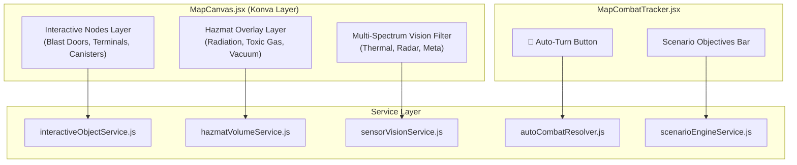

# 🕹️ Plan A: Battlemap VTT Canvas & Interactive Grid Play

## 🎯 Executive Overview
This plan connects the headless VTT simulation and automation services (`autoCombatResolver.js`, `hazmatVolumeService.js`, `interactiveObjectService.js`, `sensorVisionService.js`, `scenarioEngineService.js`) directly into the Konva canvas layer, token interactions, and combat tracker UI.

---

## 🏗️ Architecture & Component Flow

---

## 📋 Comprehensive Workflow Checklist

### Stage A.1: Interactive Destructible Objects & Map Nodes
- [ ] **Canvas Rendering Layer**:
  - [ ] Render interactive map nodes on the Konva layer (`Blast Door`, `Security Terminal`, `Explosive Canister`, `Power Conduit`).
  - [ ] Render visual status indicators (Pristine, Damaged, Destroyed/Breached).
- [ ] **Interactive Action Modal (`InteractiveObjectModal.jsx`)**:
  - [ ] 1-Click Physical Breach check (Athletics / Explosives DC).
  - [ ] 1-Click Cyber Slice check (Tech hacking DC).
  - [ ] Door Open / Lock / Seal toggle with Web Audio SFX.
- [ ] **Explosive Detonations**:
  - [ ] Canisters explode upon reaching 0 HP, dealing 3d10 damage and applying status effects in a 3-hex radius.

### Stage A.2: Dynamic Hazmat Volumes & Environmental Overlays
- [ ] **Visual Hazard Overlays**:
  - [ ] Render polygon fills for Radiation (Yellow), Toxic Gas (Green), Vacuum (Violet), and Fire (Orange).
- [ ] **Hazard Manager Modal (`HazmatVolumeManagerModal.jsx`)**:
  - [ ] GM tool to draw zones, configure tick damage, save DC, and canonical condition.
- [ ] **Movement & Turn Intercept**:
  - [ ] Moving into or ending turn in hazard zone automatically prompts save roll and condition infliction.

### Stage A.3: 1-Click Autonomous Combat Turn Execution
- [ ] **Combat Tracker Button**:
  - [ ] Add `🤖 Auto-Turn` button in `MapCombatTracker.jsx` for AI combatant rows.
  - [ ] Reads behavioral profile (Swarm, Tactical, Guardian, Coward).
  - [ ] Automatically computes movement, optimal target, rolls 2d10 attack, deducts ammo, and routes damage.

### Stage A.4: Multi-Spectrum Sensor Vision Modes
- [ ] **Vision HUD Selector**:
  - [ ] Optical, Night Vision, Thermal / IR, Cyber Radar, Meta-Attunement.
- [ ] **Visibility Filtering**:
  - [ ] Thermal reveals biological signatures; Cyber Radar reveals mechanized units through walls up to 12 hexes.

### Stage A.5: Scenario Objectives & Wave Spawn Triggers
- [ ] **Mission Objective HUD**:
  - [ ] Displays live mission goals (Extraction, Capture, Holdout, Data Retrieval) and progress bar.
- [ ] **Reinforcement Spawns**:
  - [ ] Automated token drops when round timers or alarm thresholds are reached.
