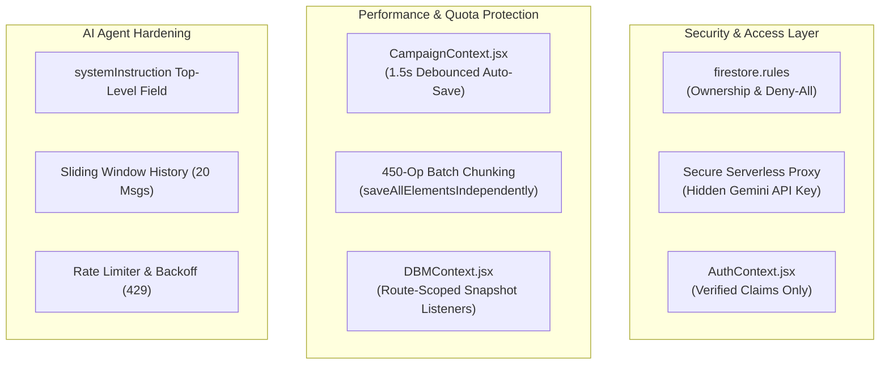

# 🛡️ Plan B: Security, Authentication & Performance Hardening

## 🎯 Executive Overview
This plan implements the critical security, authentication, and database optimization recommendations from the comprehensive audit review.

---

## 🏗️ Architecture & Component Flow

---

## 📋 Comprehensive Workflow Checklist

### Stage B.1: Firestore Security Rules Catch-All Patch (`firestore.rules`)
- [ ] **Collection Rules Isolation**:
  - [ ] Add explicit read/write rules for `story_elements/{docId}` requiring `request.auth.uid == resource.data.ownerId || isGM()`.
  - [ ] Add explicit read/write rules for `story_maps/{docId}`.
- [ ] **Deny-All Fallback**:
  - [ ] Replace the open catch-all with a secure fallback that blocks unauthorized reads and writes to unlisted collections.

### Stage B.2: Serverless Proxy / Secure API Key Architecture
- [ ] **API Key Protection**:
  - [ ] Route Gemini API calls through Firebase Cloud Functions or secure backend endpoint, removing exposed keys from client network traffic.
- [ ] **Remove Client-Side Admin Override**:
  - [ ] Delete `omnicortex_admin_override` in `localStorage` inside `AuthContext.jsx`; verify admin claims via Firebase Auth custom claims.

### Stage B.3: Gemini `systemInstruction` Protocol Migration (`bastionService.js`, `aimeService.js`)
- [ ] **System Instruction Migration**:
  - [ ] Move system prompts to top-level `systemInstruction: { parts: [{ text: PROMPT }] }`.
- [ ] **Sliding Window History Management**:
  - [ ] Keep last 20 messages + concise summary to prevent token overflows.
- [ ] **Rate Limiting & Exponential Backoff**:
  - [ ] Implement request queue with exponential backoff on HTTP 429 status.

### Stage B.4: CampaignContext Debounced Auto-Save & Throttling (`CampaignContext.jsx`)
- [ ] **Eliminate Write Storm Cascades**:
  - [ ] Connect `universeState` updates to the 1.5s debounced save trigger instead of immediate multi-document writes on every keystroke.
- [ ] **Batch Operation Chunking**:
  - [ ] Chunk `saveAllElementsIndependently` into 450-operation batches to protect against Firestore's 500-operation limit.

### Stage B.5: DBM Route Lazy-Loading & State Rollback Fix (`DBMContext.jsx`)
- [ ] **Lazy Snapshot Listeners**:
  - [ ] Activate the 40+ Firestore collection listeners only when navigating to `/dbm` rather than globally at app root.
- [ ] **Stale Closure Rollback Fix**:
  - [ ] Replace closure snapshot with `useRef` for reliable rollback on save failure.
