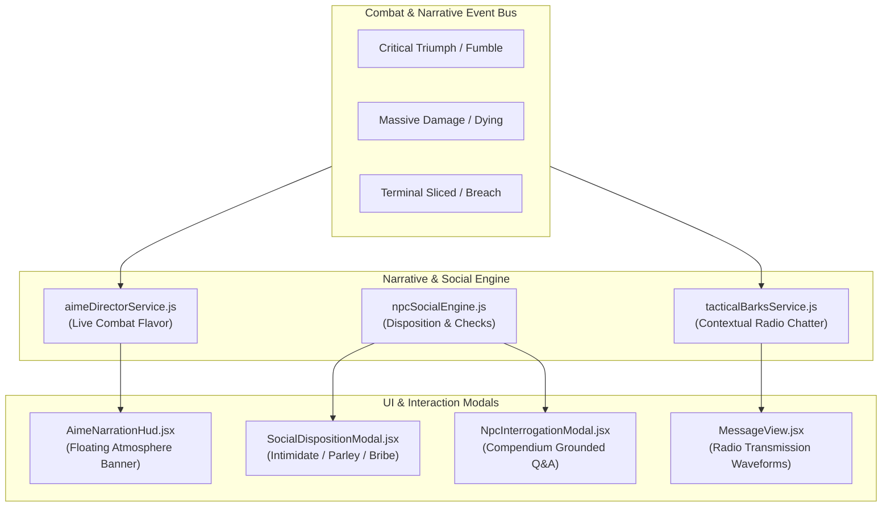

# 🧠 Plan C: AI Virtual Co-GM, Social Agents & Narrative Director

## 🎯 Executive Overview
This plan implements the immersive narrative and dynamic social agent features, providing real-time combat narration, contextual radio chatter, interactive NPC negotiations, and compendium-grounded interrogations.

---

## 🏗️ Architecture & Component Flow

---

## 📋 Comprehensive Workflow Checklist

### Stage C.1: Live Combat Event Narration HUD (`AimeNarrationHud.jsx` & `aimeDirectorService.js`)
- [ ] **Live Telemetry Event Listener**:
  - [ ] Monitors Combat Tracker events (Critical Triumphs, Fumbles, Massive Damage, Terminal Hacks, Token Deaths).
- [ ] **Atmospheric Narrative Synthesis**:
  - [ ] Generates 1–2 sentence cyber-noir / space-opera flavor text broadcast directly to a floating HUD banner and CommLink.
- [ ] **Dynamic Tension Audio Transitions**:
  - [ ] Dynamically shifts background synthesizer tension based on encounter threat score.

### Stage C.2: Dynamic NPC Social Disposition & Negotiation Matrix (`npcSocialEngine.js`)
- [ ] **Dynamic Disposition Meter**:
  - [ ] Real-time 0–100% meter (Hostile $\rightarrow$ Suspicious $\rightarrow$ Neutral $\rightarrow$ Cooperative).
- [ ] **Interactive Negotiation Checks**:
  - [ ] Intimidation check (rapid disposition shift vs. panic / hostility risk).
  - [ ] Persuasion / Parley check (gradual trust building through common ground).
  - [ ] Economatrix Bribery (credits / cargo trade for passage or codes).
- [ ] **Automated Combat State Alterations**:
  - [ ] High disposition unlocks mid-combat surrender, truce, or faction defection.

### Stage C.3: Contextual In-Character Radio Battle Barks (`tacticalBarksService.js`)
- [ ] **Contextual Radio Chatter**:
  - [ ] NPCs emit authentic faction barks into CommLink ("Hostile acquired!", "Heavy suppression!", "Command is down!").
- [ ] **Waveform Audio Effect**:
  - [ ] Visual audio waveform indicator in CommLink chat for incoming radio relays.

### Stage C.4: Compendium-Grounded Interrogation Engine (`NpcInterrogationModal.jsx`)
- [ ] **Interactive Interrogation Console**:
  - [ ] Chat interface with captured NPCs grounded in Omnicortex faction lore.
  - [ ] Social check rolls reveal verified intel, access codes, or deceptive red herrings based on roll margin.
