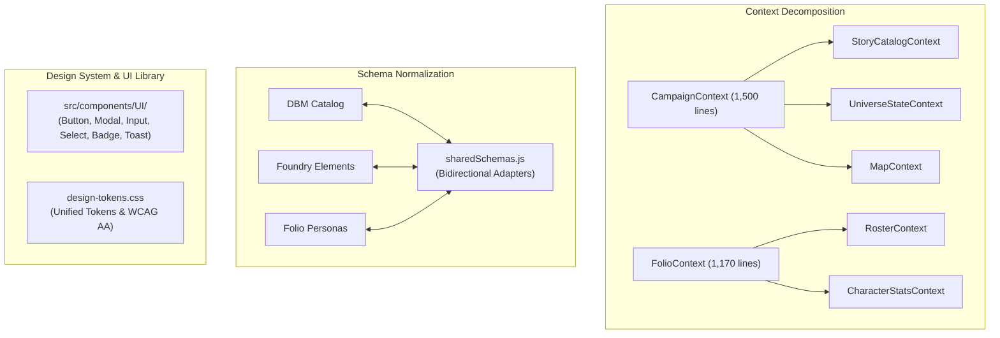

# 🏗️ Plan D: Architecture Modernization, Data Schemas & Modular Expansions

## 🎯 Executive Overview
This plan modernizes the codebase architecture by decomposing monolithic React contexts, unifying divergent schemas across modules, building standardized reusable UI components, and preparing modular expansion pipelines (*e.g., Void Crash*).

---

## 🏗️ Architecture & Component Flow

---

## 📋 Comprehensive Workflow Checklist

### Stage D.1: Monolithic Context Decomposition
- [ ] **Split `CampaignContext.jsx` (1,500 lines)**:
  - [ ] `StoryCatalogContext`: Catalog browsing, CRUD operations.
  - [ ] `UniverseStateContext`: Active project and scenario state.
  - [ ] `MapContext`: Tactical map canvas state and token management.
- [ ] **Split `FolioContext.jsx` (1,170 lines)**:
  - [ ] `RosterContext`: Character roster and active selection.
  - [ ] `CharacterStatsContext`: CP economy, point-buy ledger, and derived stat calculations.

### Stage D.2: Canonical Cross-Module Schema Adapter (`sharedSchemas.js`)
- [ ] **Schema Harmonization**:
  - [ ] Reconcile field naming differences (`char-name` vs `name`, relational species links).
  - [ ] Bidirectional adapters converting between DBM items, Story Foundry elements, and Folio characters.

### Stage D.3: Shared UI Component Library & Design Tokens
- [ ] **Reusable UI Primitives (`src/components/UI/`)**:
  - [ ] `Button.jsx`, `Modal.jsx`, `Input.jsx`, `Select.jsx`, `Badge.jsx`, `Toast.jsx`.
- [ ] **Design Token Unification**:
  - [ ] Consolidate `:root` custom properties and Tailwind tokens in `design-tokens.css`.
  - [ ] WCAG AA color contrast updates for `--text-muted` and full ARIA keyboard navigation.

### Stage D.4: Modular Expansion Packs (*Void Crash*) & Discord Webhook Relay
- [ ] **Expansion Pack Ingestion Pipeline**:
  - [ ] Support loading standalone expansion datasets (*e.g., Void Crash*) without schema conflicts.
- [ ] **Discord Webhook Bot Relay**:
  - [ ] Bidirectional relay transmitting rolls, session recaps, and CommLink transmissions to Discord channels.
