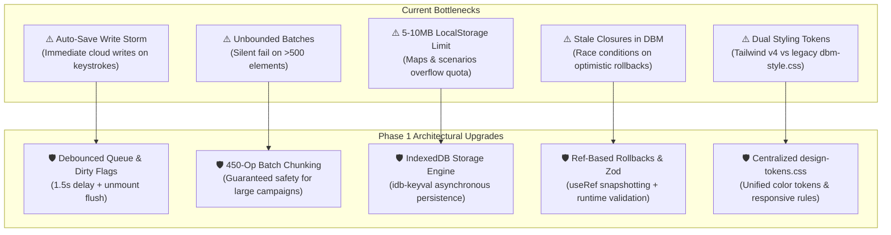

# Phase 1 Implementation Plan: Foundational Stability & Data Hygiene
**Project:** Tangent Science Fantasy Roleplaying Game (SFF RP)  
**Target Codebase:** [`TANGENT SF RP react project`](file:///d:/_ Data/Tangent SF RP/TANGENT SF RP react project/)  
**Status:** Ready for Review & Implementation

---

## 1. Executive Summary

Phase 1 establishes an unshakeable data, performance, and styling foundation for the entire Tangent SFF RP platform. Before adding dynamic HUDs, animated dice, and live multiplayer synchronization, we must eliminate critical database bottlenecks, unbounded write cascades, local storage quota limitations, and fragmented legacy styling.



---

## 2. Targeted Components & Files

| Component / Layer | File Path | Scope of Work |
| :--- | :--- | :--- |
| **Campaign State Engine** | [`CampaignContext.jsx`](file:///d:/_ Data/Tangent SF RP/TANGENT SF RP react project/src/context/CampaignContext.jsx) | Debounce auto-save, decouple scenario/map writes, chunk batches, add saving indicators. |
| **Database Manager Engine** | [`DBMContext.jsx`](file:///d:/_ Data/Tangent SF RP/TANGENT SF RP react project/src/context/DBMContext.jsx) | Refactor optimistic rollback with `useRef`, add validation check before writes, surface errors to UI. |
| **Character State Engine** | [`FolioContext.jsx`](file:///d:/_ Data/Tangent SF RP/TANGENT SF RP react project/src/context/FolioContext.jsx) | Immediate save flush on roster character switch, explicit numeric attribute coercion. |
| **Character Schema** | [`schema.js`](file:///d:/_ Data/Tangent SF RP/TANGENT SF RP react project/src/components/Folio/schema.js) | Replace loose `.catchall()` with strict 12-attribute definitions and numeric transforms. |
| **Storage Abstraction Layer** | `src/services/storageService.js` *(NEW)* | High-capacity IndexedDB async storage with automatic fallback to memory cache. |
| **Unified Design Tokens** | `src/css/design-tokens.css` *(NEW)* & [`index.css`](file:///d:/_ Data/Tangent SF RP/TANGENT SF RP react project/src/index.css) | Single source of truth for color variables, shadows, glassmorphism, and responsive breakpoints. |

---

## 3. Detailed Implementation Specifications

### 3.1. CampaignContext: Debounced Auto-Save & Batch Chunking

#### Problem
In [`CampaignContext.jsx:L460-526`](file:///d:/_ Data/Tangent SF RP/TANGENT SF RP react project/src/context/CampaignContext.jsx#L460), a `useEffect` triggers on every `universeState` mutation and executes immediate writes to:
1. `user_stories/{activeStoryId}`
2. `universe/main`
3. `saveAllElementsIndependently()` (batch writes every node in scenario tree)
4. `saveAllMapsIndependently()` (batch writes all maps)

A single user typing in a node description generates dozens of Firestore document writes per minute. Furthermore, `saveAllElementsIndependently` uses a single `writeBatch()`, which fails silently if total elements exceed 500.

#### Implementation
1. **Debounced Cloud Save Queue:** Implement a debounced save runner (1.5s delay) with an `isDirty` flag and `saveStatus` state (`'idle' | 'saving' | 'saved' | 'error'`).
2. **Chunked Batch Writing Utility:**
```javascript
// src/utils/firestoreUtils.js
import { writeBatch } from 'firebase/firestore';
import { db } from '../firebase';

export async function commitChunkedBatches(operations, chunkSize = 450) {
  const chunks = [];
  for (let i = 0; i < operations.length; i += chunkSize) {
    chunks.push(operations.slice(i, i + chunkSize));
  }

  for (const chunk of chunks) {
    const batch = writeBatch(db);
    chunk.forEach(({ ref, data, merge = true }) => {
      batch.set(ref, data, { merge });
    });
    await batch.commit();
  }
}
```
3. **Window `beforeunload` & Navigation Flush:** Flush any pending debounced save synchronously or via `navigator.sendBeacon` / immediate async trigger when navigating away or closing the tab.

---

### 3.2. DBMContext: Optimistic Rollback & Validation

#### Problem
In [`DBMContext.jsx:L61-84`](file:///d:/_ Data/Tangent SF RP/TANGENT SF RP react project/src/context/DBMContext.jsx#L61), `saveEntry` and `deleteEntry` capture `dbData` in their closures:
```javascript
// Anti-pattern: captures dbData in closure dependency
const saveEntry = useCallback(async (category, entry) => {
  const previousState = { ...dbData }; // Stale if onSnapshot updated concurrently
  // ...
}, [dbData]);
```

#### Implementation
1. Maintain `latestDbDataRef = useRef(dbData)` updated on every state transition.
2. Remove `dbData` from `useCallback` dependency arrays.
3. Validate minimum required fields (e.g. `entry.name`, `categoryKey`) before firing Firestore operations.
4. Expose `dbError` state so components can render a notification toast.

```javascript
// Refactored pattern in DBMContext.jsx
const dbDataRef = useRef(dbData);
useEffect(() => {
  dbDataRef.current = dbData;
}, [dbData]);

const saveEntry = useCallback(async (categoryKey, entry) => {
  if (!entry || !entry.name?.trim()) {
    throw new Error('Entry must have a valid name.');
  }

  const previousSnapshot = dbDataRef.current;
  // Optimistic UI update
  setDbData(prev => ({
    ...prev,
    [categoryKey]: {
      ...(prev[categoryKey] || {}),
      [entry.id]: entry
    }
  }));

  try {
    const docRef = doc(db, categoryKey, entry.id);
    await setDoc(docRef, { ...entry, updatedAt: new Date().toISOString() }, { merge: true });
  } catch (error) {
    console.error(`Failed to save entry ${entry.id} in ${categoryKey}:`, error);
    // Safe rollback to ref snapshot
    setDbData(previousSnapshot);
    setDbError(`Failed to save ${entry.name}. Reverted local changes.`);
    throw error;
  }
}, []);
```

---

### 3.3. FolioContext & Schema Hardening

#### Problem
1. [`FolioContext.jsx:L353`](file:///d:/_ Data/Tangent SF RP/TANGENT SF RP react project/src/context/FolioContext.jsx#L353) (`switchRosterCharacter`): If a user switches characters before the 1-second auto-save debounce fires, edits are lost.
2. [`schema.js:L134`](file:///d:/_ Data/Tangent SF RP/TANGENT SF RP react project/src/components/Folio/schema.js#L134): Core attributes are unvalidated `.catchall(z.any())`, allowing strings or invalid data to corrupt CP formulas.

#### Implementation
1. In `switchRosterCharacter(targetCharId)`, call `flushPendingSave()` immediately before loading the target character into state.
2. Explicitly type all 12 core attributes in `characterSchema`:
```javascript
// src/components/Folio/schema.js
export const CORE_ATTRIBUTES = [
  'strength', 'agility', 'constitution', 'dexterity',
  'intelligence', 'perception', 'willpower', 'charisma',
  'tech', 'psionics', 'luck', 'resolve'
];

const attributeSchema = z.preprocess(
  (val) => (val === '' || val === undefined ? 10 : Number(val)),
  z.number().int().min(1).max(30).default(10)
);

export const characterSchema = z.object({
  id: z.string(),
  name: z.string().default('Unnamed Hero'),
  level: z.preprocess((val) => Number(val) || 1, z.number().int().min(1).default(1)),
  species: z.string().default('Human'),
  origin: z.string().default('Standard'),
  startingCp: z.preprocess((val) => Number(val) || 100, z.number().int().default(100)),
  
  // 12 Explicit Core Attributes
  ...CORE_ATTRIBUTES.reduce((acc, attr) => {
    acc[`attr_${attr}`] = attributeSchema;
    return acc;
  }, {}),
  
  skills: z.record(z.any()).default({}),
  inventory: z.array(z.any()).default([]),
  abilities: z.array(z.any()).default([]),
  notes: z.string().default(''),
  updatedAt: z.string().optional()
}).catchall(z.any());
```

---

### 3.4. High-Capacity IndexedDB Storage Service

#### Implementation
Install or create a lightweight IndexedDB key-value store wrapper (`idb-keyval` or native wrapper) to prevent `QUOTA_EXCEEDED_ERR` in browsers when caching large campaign maps, image assets, and scenario trees.

```javascript
// src/services/storageService.js
const DB_NAME = 'tangent_sff_rp_storage';
const STORE_NAME = 'key_value_store';

function getDB() {
  return new Promise((resolve, reject) => {
    const request = indexedDB.open(DB_NAME, 1);
    request.onupgradeneeded = (e) => {
      const db = e.target.result;
      if (!db.objectStoreNames.contains(STORE_NAME)) {
        db.createObjectStore(STORE_NAME);
      }
    };
    request.onsuccess = () => resolve(request.result);
    request.onerror = () => reject(request.error);
  });
}

export const StorageService = {
  async get(key, defaultValue = null) {
    try {
      const db = await getDB();
      return new Promise((resolve) => {
        const tx = db.transaction(STORE_NAME, 'readonly');
        const store = tx.objectStore(STORE_NAME);
        const req = store.get(key);
        req.onsuccess = () => resolve(req.result !== undefined ? req.result : defaultValue);
        req.onerror = () => resolve(defaultValue);
      });
    } catch {
      // Fallback to localStorage
      try {
        const raw = localStorage.getItem(key);
        return raw ? JSON.parse(raw) : defaultValue;
      } catch {
        return defaultValue;
      }
    }
  },

  async set(key, value) {
    try {
      const db = await getDB();
      return new Promise((resolve, reject) => {
        const tx = db.transaction(STORE_NAME, 'readwrite');
        const store = tx.objectStore(STORE_NAME);
        const req = store.put(value, key);
        req.onsuccess = () => resolve(true);
        req.onerror = () => reject(req.error);
      });
    } catch {
      try {
        localStorage.setItem(key, JSON.stringify(value));
      } catch (err) {
        console.warn('Storage quota exceeded on fallback:', err);
      }
    }
  },

  async remove(key) {
    try {
      const db = await getDB();
      const tx = db.transaction(STORE_NAME, 'readwrite');
      tx.objectStore(STORE_NAME).delete(key);
    } catch {
      localStorage.removeItem(key);
    }
  }
};
```

---

### 3.5. CSS Architecture & Design Token Centralization

#### Implementation
Create `src/css/design-tokens.css` to consolidate duplicated `:root` declarations across `index.css` and `dbm-style.css`.

```css
/* src/css/design-tokens.css */
:root {
  /* Sci-Fi Palette */
  --bg-core: #090d16;
  --bg-surface: #0d1117;
  --bg-surface-elevated: #161b22;
  --bg-glass: rgba(20, 26, 36, 0.75);
  --bg-glass-heavy: rgba(13, 17, 23, 0.92);

  /* Brand Accents */
  --accent-cyan: #22d3ee;
  --accent-cyan-glow: rgba(34, 211, 238, 0.35);
  --accent-amber: #f59e0b;
  --accent-amber-glow: rgba(245, 158, 11, 0.3);
  --accent-emerald: #10b981;
  --accent-purple: #a855f7;
  --accent-crimson: #ef4444;

  /* Typography */
  --font-mono: ui-monospace, SFMono-Regular, Menlo, Monaco, Consolas, monospace;
  --font-sans: 'Inter', system-ui, -apple-system, BlinkMacSystemFont, 'Segoe UI', Roboto, sans-serif;

  /* Borders & Shadows */
  --border-subtle: rgba(255, 255, 255, 0.08);
  --border-active: rgba(34, 211, 238, 0.4);
  --shadow-sci-fi: 0 0 15px var(--accent-cyan-glow);
  --shadow-sci-fi-amber: 0 0 15px var(--accent-amber-glow);
  
  /* Layout Dimensions */
  --header-height: 56px;
  --sidebar-width: 280px;
}
```

---

## 4. Verification & Testing Plan

| Verification Item | Method | Expected Outcome |
| :--- | :--- | :--- |
| **Firestore Write Volume** | Network tab / Firestore dashboard during rapid scenario text editing. | Writes drop from ~100/min to 1 write 1.5s after typing pauses. |
| **Large Batch Write (>500 nodes)** | Create a test universe with 600 elements and invoke `saveAllElementsIndependently`. | All 600 nodes commit across 2 chunks without throwing batch size limit errors. |
| **DBM Optimistic Rollback** | Mock Firestore offline/network error during `saveEntry`. | Local state reverts to previous snapshot without stale closure race conditions; user error toast appears. |
| **Unsaved Folio Switch** | Edit character stats and immediately click another roster character. | In-flight changes are flushed before the new character is mounted. |
| **IndexedDB Quota Handling** | Save a 15MB map asset catalog. | Successfully writes to IndexedDB without `localStorage` quota crash. |
