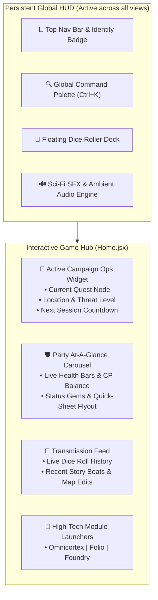

# Phase 2 Implementation Plan: Dynamic Game Hub & Persistent Global HUD
**Project:** Tangent Science Fantasy Roleplaying Game (SFF RP)  
**Target Codebase:** [`TANGENT SF RP react project`](file:///d:/_ Data/Tangent SF RP/TANGENT SF RP react project/)  
**Status:** Ready for Review & Implementation

---

## 1. Executive Summary

Phase 2 transforms the user experience from navigating disconnected static sub-pages into operating a **living, dynamic science-fantasy command center**. The central hub ([`Home.jsx`](file:///d:/_ Data/Tangent SF RP/TANGENT SF RP react project/src/pages/Home.jsx)) is elevated into an interactive tactical terminal featuring real-time campaign status, active hero health vitals, a global `Ctrl+K` command palette, an animated dice roller dock, and atmospheric sci-fi audio.



---

## 2. Targeted Components & Files

| Component / Service | File Path | Scope of Work |
| :--- | :--- | :--- |
| **Command Center Hub** | [`Home.jsx`](file:///d:/_ Data/Tangent SF RP/TANGENT SF RP react project/src/pages/Home.jsx) | Complete UI redesign into a multi-widget live operational terminal. |
| **Persistent Global HUD** | `src/components/Layout/GlobalHUD.jsx` *(NEW)* | Persistent top-bar across all routes with breadcrumbs, user badge, audio switch, and dice toggle. |
| **Command Palette (`Ctrl+K`)** | `src/components/UI/CommandPalette.jsx` *(NEW)* | Fuzzy omni-search across rules, items, characters, maps, story nodes, and quick roll commands. |
| **Animated Dice Roller Dock** | `src/components/UI/DiceRollerDock.jsx` *(NEW)* | Floating interactive polyhedral dice tray with modifiers, advantage, critical alerts, and roll history. |
| **Dice Math & Roll Engine** | `src/services/diceService.js` *(NEW)* | Roll notation parser (`2d10+4`, `d100`, exploding dice, drop lowest, TN success checks). |
| **Web Audio Immersion Engine** | `src/services/audioService.js` *(NEW)* | Procedural Web Audio API sound synthesis for terminal beeps, roll rumbles, critical chimes, and ambient hum. |
| **Party Status Carousel** | `src/components/Hub/PartyStatusWidget.jsx` *(NEW)* | Real-time hero cards with live HP bars, CP summary, conditions, and instant Folio preview. |
| **Campaign Ops Widget** | `src/components/Hub/ActiveCampaignWidget.jsx` *(NEW)* | Live mission overview, current scene summary, quick resume button. |
| **Transmission Feed** | `src/components/Hub/TransmissionFeed.jsx` *(NEW)* | Live log of recent party actions, dice rolls, AIME story ideas, and scenario edits. |

---

## 3. Detailed Implementation Specifications

### 3.1. Interactive Game Hub Layout ([`Home.jsx`](file:///d:/_ Data/Tangent SF RP/TANGENT SF RP react project/src/pages/Home.jsx))

#### Visual Architecture
The home screen is split into a modular sci-fi grid:
1. **Hero Header:** Tangent SFF RP typography with animated plasma sweep and quick session status (`Online • Sector 4`).
2. **Top Operational Tier (2 Columns):**
   - *Left Column (60%):* [`ActiveCampaignWidget`](file:///d:/_ Data/Tangent SF RP/TANGENT SF RP react project/src/components/Hub/ActiveCampaignWidget.jsx) showing active scenario branch, location metadata, active tactical map thumbnail, and a "Resume Campaign" 1-click CTA.
   - *Right Column (40%):* [`PartyStatusWidget`](file:///d:/_ Data/Tangent SF RP/TANGENT SF RP react project/src/components/Hub/PartyStatusWidget.jsx) displaying the 4 active characters with dynamic SVG circular health gauges, AP counters, and click-to-preview drawers.
3. **Bottom Operational Tier (2 Columns):**
   - *Left Column (65%):* **Tri-Core Module Launchers** (Omnicortex, Persona Folio, Story Foundry) with live counter badges (e.g. `1,420 Compendium Entries`, `6 Roster Heroes`, `14 Maps Created`) and glowing interactive hover states.
   - *Right Column (35%):* [`TransmissionFeed`](file:///d:/_ Data/Tangent SF RP/TANGENT SF RP react project/src/components/Hub/TransmissionFeed.jsx) showing a live chronological feed of recent dice rolls, AI brainstorming cards, and character revisions.

---

### 3.2. Global Command Palette (`Ctrl+K` / `Cmd+K`)

#### Implementation
Create `src/components/UI/CommandPalette.jsx` using an accessible dialog/modal pattern triggered via global keyboard listener.

```javascript
// Features of CommandPalette.jsx
1. Instant Keyboard Shortcut: `Ctrl+K` or `Cmd+K` anywhere in the app.
2. Cross-Module Search Indexing:
   - DBM Items & Rules: Fuzzy matches Species, Equipment, Psionics, Cybernetics, Rules Codex.
   - Folio Roster: Jump straight to any character sheet tab (e.g. "Vance Kael -> Combat Gear").
   - Foundry Stories & Maps: Jump directly to a scenario node or tactical map.
3. In-Line Action Execution:
   - Type `/roll 2d10+4` -> Instantly executes roll, plays sound, opens dice tray.
   - Type `/new-hero` -> Opens Folio character creation modal.
   - Type `/bastion <question>` -> Sends prompt directly to Bastion tactical AI.
```

---

### 3.3. Animated Polyhedral Dice Roller Dock (`DiceRollerDock.jsx` & `diceService.js`)

#### Dice Service Implementation
```javascript
// src/services/diceService.js
export function rollDice(expression, options = {}) {
  // Supports: "2d10+4", "d20", "4d6k3" (keep highest 3), "1d100", "3d10!" (exploding)
  const parsed = parseDiceExpression(expression);
  const individualRolls = [];
  let subtotal = 0;

  for (let i = 0; i < parsed.count; i++) {
    let r = Math.floor(Math.random() * parsed.sides) + 1;
    let rollEntry = { value: r, exploded: false };
    
    // Exploding dice check
    if (parsed.exploding && r === parsed.sides) {
      rollEntry.exploded = true;
      let explodeRoll = Math.floor(Math.random() * parsed.sides) + 1;
      r += explodeRoll;
      rollEntry.explodeValue = explodeRoll;
    }
    
    individualRolls.push(rollEntry);
    subtotal += r;
  }

  const total = subtotal + parsed.modifier;
  const isCritSuccess = parsed.sides === 10 && individualRolls.every(r => r.value === 10);
  const isCritFail = parsed.sides === 10 && individualRolls.every(r => r.value === 1);

  return {
    id: `roll_${Date.now()}_${Math.random().toString(36).substring(2, 7)}`,
    expression,
    rolls: individualRolls,
    modifier: parsed.modifier,
    total,
    isCritSuccess,
    isCritFail,
    timestamp: new Date().toISOString(),
    characterName: options.characterName || 'Architect',
    label: options.label || 'Standard Check'
  };
}
```

#### Dice Roller Dock Features
- **Collapsible Floating Widget:** Docked in bottom-right corner or toggled via `Alt+D`.
- **Quick Preset Buttons:** `d4`, `d6`, `d8`, `d10`, `2d10` *(Tangent standard roll)*, `d12`, `d20`, `d100`.
- **Target Number (TN) Evaluation:** Optional target number field (e.g. `TN 15`) with instant `SUCCESS [Margin: +4]` or `FAILURE [Margin: -2]` badge.
- **Roll History Stream:** Chronological log with 1-click re-roll and export to clipboard.

---

### 3.4. Sci-Fi Web Audio Immersion Suite (`audioService.js`)

#### Implementation
Zero-dependency procedural sound generator using the browser's native `AudioContext`. No external large MP3 assets required; instant, low-latency, and customizable.

```javascript
// src/services/audioService.js
class SciFiAudioEngine {
  constructor() {
    this.ctx = null;
    this.muted = localStorage.getItem('tangent_audio_muted') === 'true';
    this.volume = parseFloat(localStorage.getItem('tangent_audio_vol') || '0.3');
  }

  init() {
    if (!this.ctx && typeof window !== 'undefined') {
      const AudioCtx = window.AudioContext || window.webkitAudioContext;
      this.ctx = new AudioCtx();
    }
  }

  playTerminalBeep(freq = 1200, duration = 0.04) {
    if (this.muted) return;
    this.init();
    const osc = this.ctx.createOscillator();
    const gain = this.ctx.createGain();
    
    osc.type = 'sine';
    osc.frequency.setValueAtTime(freq, this.ctx.currentTime);
    gain.gain.setValueAtTime(this.volume * 0.15, this.ctx.currentTime);
    gain.gain.exponentialRampToValueAtTime(0.001, this.ctx.currentTime + duration);

    osc.connect(gain);
    gain.connect(this.ctx.destination);
    osc.start();
    osc.stop(this.ctx.currentTime + duration);
  }

  playDiceRollSound() {
    if (this.muted) return;
    this.init();
    // Synthesizes a multi-click dice tumble rumble
    for (let i = 0; i < 5; i++) {
      setTimeout(() => {
        this.playTerminalBeep(300 + Math.random() * 400, 0.03);
      }, i * 45);
    }
  }

  playCriticalChime(success = true) {
    if (this.muted) return;
    this.init();
    const freqs = success ? [523.25, 659.25, 783.99, 1046.50] : [400, 320, 240, 180];
    freqs.forEach((f, idx) => {
      setTimeout(() => this.playTerminalBeep(f, 0.12), idx * 80);
    });
  }

  toggleMute() {
    this.muted = !this.muted;
    localStorage.setItem('tangent_audio_muted', this.muted);
    return this.muted;
  }
}

export const AudioService = new SciFiAudioEngine();
```

---

## 4. Verification & Testing Plan

| Verification Item | Method | Expected Outcome |
| :--- | :--- | :--- |
| **Command Palette (`Ctrl+K`)** | Press `Ctrl+K` on Home, Folio, DBM, and Foundry views. Type "Plasma Rifle" or "Vance". | Palette opens immediately; arrow keys navigate results; Enter jumps to target view. |
| **Dice Roller Accuracy & Math** | Roll `2d10+4` 50 times in automated test. | All totals strictly fall in range `6` to `24`; crits trigger on dual `10`s and dual `1`s. |
| **Party Widget Live Sync** | Modify hero HP in Folio; navigate back to Home. | `PartyStatusWidget` immediately reflects updated HP gauge without manual page refresh. |
| **Audio Engine Compatibility** | Click UI buttons and roll dice in Chrome, Firefox, and Safari. | Procedural audio plays crisply without audio clipping or console warnings; mute setting persists across reloads. |
| **Responsive Hub Layout** | Test viewport from 1920x1080 down to 375x667 (mobile). | Grid collapses from multi-column operational center to vertical mobile command stack without horizontal overflow. |
