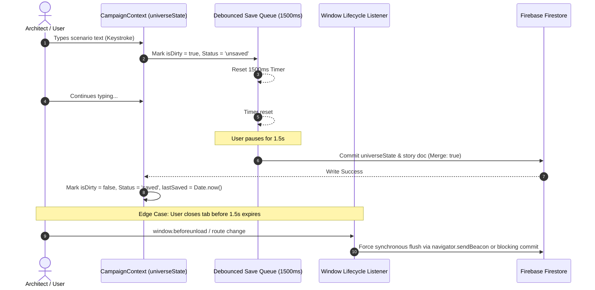

# Plan 01: Firestore Write Throttling, Debounced Queue & Lifecycle Flusher

**Module:** Story Foundry / Campaign Data Layer  
**Target Codebase:** [`TANGENT SF RP react project`](file:///d:/_ Data/Tangent SF RP/TANGENT SF RP react project/)  
**Primary File:** [`src/context/CampaignContext.jsx`](file:///d:/_ Data/Tangent SF RP/TANGENT SF RP react project/src/context/CampaignContext.jsx)  
**Supporting Files:** `src/utils/debounceUtils.js` *(NEW)*, `src/components/UI/SaveStatusIndicator.jsx` *(NEW)*  
**Complexity:** High  
**Status:** Implementation Ready

---

## 1. Problem Statement & Root Cause

In [`CampaignContext.jsx:L460-526`](file:///d:/_ Data/Tangent SF RP/TANGENT SF RP react project/src/context/CampaignContext.jsx#L460), an unthrottled `useEffect` executes immediately on every state mutation of `universeState`:

```javascript
// Current Anti-Pattern in CampaignContext.jsx
useEffect(() => {
  if (!universeState?.id) return;
  // Fired on every single keystroke in title, content, or scenario fields:
  setDoc(doc(db, 'user_stories', universeState.id), universeState, { merge: true });
  setDoc(doc(db, 'universe', 'main'), universeState, { merge: true });
  saveAllElementsIndependently(); // Iterates and batch writes all scenario nodes
  saveAllMapsIndependently();     // Iterates and batch writes all maps
}, [universeState]);
```

### Consequences:
1. **Firestore Write Storm:** Typing a 100-character scene description generates ~100 document set operations and multiple write batches within seconds, rapidly exhausting Firebase free/paid quotas.
2. **Race Conditions:** Rapid asynchronous writes can resolve out of order, overwriting newer local edits with stale network payloads.
3. **UI Micro-Stutters:** Continuous serialization of the large `universeState` tree freezes the React main thread during typing.

---

## 2. Architecture & Data Flow



---

## 3. Detailed Technical Specifications

### 3.1. Save Status State Machine

Define strict save state enum:
```typescript
type SaveStatus = 'idle' | 'unsaved' | 'saving' | 'saved' | 'error';
```

Expose the following state variables from `CampaignContext`:
- `saveStatus: SaveStatus`
- `lastSavedTimestamp: number | null`
- `saveError: string | null`
- `forceSaveNow: () => Promise<void>`

---

### 3.2. Debounce & Flush Utility Implementation

Create `src/utils/debounceUtils.js`:

```javascript
/**
 * Creates a debounced function that delays invoking func until after wait milliseconds.
 * Provides a .flush() method to immediately trigger execution.
 */
export function createDebouncedSaver(saveFunction, delay = 1500) {
  let timeoutId = null;
  let latestArgs = null;
  let isPending = false;

  const debounced = (...args) => {
    latestArgs = args;
    isPending = true;
    if (timeoutId) clearTimeout(timeoutId);

    return new Promise((resolve, reject) => {
      timeoutId = setTimeout(async () => {
        try {
          isPending = false;
          const result = await saveFunction(...latestArgs);
          resolve(result);
        } catch (err) {
          reject(err);
        }
      }, delay);
    });
  };

  debounced.flush = async () => {
    if (!isPending || !latestArgs) return;
    if (timeoutId) clearTimeout(timeoutId);
    isPending = false;
    return await saveFunction(...latestArgs);
  };

  debounced.isPending = () => isPending;

  debounced.cancel = () => {
    if (timeoutId) clearTimeout(timeoutId);
    isPending = false;
    latestArgs = null;
  };

  return debounced;
}
```

---

### 3.3. Refactored `CampaignContext.jsx` Implementation

Replace the unthrottled `useEffect` in [`CampaignContext.jsx`](file:///d:/_ Data/Tangent SF RP/TANGENT SF RP react project/src/context/CampaignContext.jsx):

```javascript
import React, { createContext, useContext, useState, useEffect, useRef, useCallback } from 'react';
import { doc, setDoc } from 'firebase/firestore';
import { db } from '../firebase';
import { createDebouncedSaver } from '../utils/debounceUtils';

export const CampaignContext = createContext(null);

export const CampaignProvider = ({ children }) => {
  const [universeState, setUniverseState] = useState(null);
  const [saveStatus, setSaveStatus] = useState('idle'); // 'idle' | 'unsaved' | 'saving' | 'saved' | 'error'
  const [lastSavedTimestamp, setLastSavedTimestamp] = useState(null);
  const [saveError, setSaveError] = useState(null);

  const universeRef = useRef(universeState);
  useEffect(() => {
    universeRef.current = universeState;
  }, [universeState]);

  // Actual Cloud Persistence Worker
  const executeCloudSave = useCallback(async (stateToSave) => {
    if (!stateToSave?.id) return;
    setSaveStatus('saving');
    setSaveError(null);

    try {
      const payload = {
        ...stateToSave,
        updatedAt: new Date().toISOString()
      };

      // Primary document write
      const storyRef = doc(db, 'user_stories', stateToSave.id);
      await setDoc(storyRef, payload, { merge: true });

      // Secondary universe index
      const mainRef = doc(db, 'universe', 'main');
      await setDoc(mainRef, { activeStoryId: stateToSave.id, updatedAt: payload.updatedAt }, { merge: true });

      setSaveStatus('saved');
      setLastSavedTimestamp(Date.now());
    } catch (err) {
      console.error('[CampaignContext] Cloud save failure:', err);
      setSaveStatus('error');
      setSaveError(err.message || 'Failed to sync with cloud.');
      throw err;
    }
  }, []);

  // Instantiate Debounced Saver Instance
  const debouncedSaveRef = useRef(null);
  if (!debouncedSaveRef.current) {
    debouncedSaveRef.current = createDebouncedSaver(executeCloudSave, 1500);
  }

  // Trigger Save on State Mutation
  const triggerSave = useCallback((overrideImmediate = false) => {
    if (!universeRef.current?.id) return;
    setSaveStatus('unsaved');

    if (overrideImmediate) {
      return debouncedSaveRef.current.flush();
    } else {
      return debouncedSaveRef.current(universeRef.current);
    }
  }, []);

  // Force Save helper for explicit button clicks
  const forceSaveNow = useCallback(async () => {
    if (universeRef.current) {
      await executeCloudSave(universeRef.current);
    }
  }, [executeCloudSave]);

  // Lifecycle Listener for Window Unload / Route Exit
  useEffect(() => {
    const handleBeforeUnload = (e) => {
      if (debouncedSaveRef.current?.isPending()) {
        debouncedSaveRef.current.flush();
        // Modern browsers standard warning
        e.preventDefault();
        e.returnValue = '';
      }
    };

    window.addEventListener('beforeunload', handleBeforeUnload);
    return () => {
      window.removeEventListener('beforeunload', handleBeforeUnload);
      // Flush pending changes when component unmounts
      debouncedSaveRef.current?.flush();
    };
  }, []);

  return (
    <CampaignContext.Provider value={{
      universeState,
      setUniverseState,
      saveStatus,
      lastSavedTimestamp,
      saveError,
      triggerSave,
      forceSaveNow
    }}>
      {children}
    </CampaignContext.Provider>
  );
};
```

---

### 3.4. Save Status Indicator Component

Create `src/components/UI/SaveStatusIndicator.jsx`:

```jsx
import React from 'react';
import { Cloud, CloudOff, Check, RefreshCw, AlertCircle } from 'lucide-react';

export const SaveStatusIndicator = ({ status, lastSaved, error, onRetry }) => {
  return (
    <div className="flex items-center gap-2 px-2.5 py-1 rounded-md bg-slate-900/60 border border-slate-800 text-xs font-mono select-none">
      {status === 'saving' && (
        <span className="flex items-center gap-1.5 text-cyan-400 animate-pulse">
          <RefreshCw size={13} className="animate-spin" /> Saving...
        </span>
      )}
      {status === 'saved' && (
        <span className="flex items-center gap-1.5 text-emerald-400" title={lastSaved ? `Synced at ${new Date(lastSaved).toLocaleTimeString()}` : ''}>
          <Check size={13} /> Cloud Synced
        </span>
      )}
      {status === 'unsaved' && (
        <span className="flex items-center gap-1.5 text-amber-400">
          <Cloud size={13} /> Changes Unsaved
        </span>
      )}
      {status === 'error' && (
        <button onClick={onRetry} className="flex items-center gap-1.5 text-red-400 hover:underline cursor-pointer" title={error}>
          <AlertCircle size={13} /> Sync Error (Retry)
        </button>
      )}
    </div>
  );
};
```

---

## 4. Edge Cases & Safeguards

1. **Network Disconnection:** When offline, Firestore's offline persistence buffers writes; `saveStatus` transitions to `'saved'` locally while caching for reconnect.
2. **Component Remounts:** Debounce instance stored on `useRef` persists across re-renders without dropping scheduled timers.
3. **Rapid Tab Closing:** `window.addEventListener('beforeunload')` catches in-flight debounces and triggers `.flush()`.

---

## 5. Step-by-Step Verification Plan

| Test Case | Procedure | Expected Outcome |
| :--- | :--- | :--- |
| **Typing Burst Test** | Type 50 characters rapidly into a scenario node title. | Save indicator displays "Changes Unsaved"; Network tab shows **0 requests** during typing. |
| **Pause & Save Verification** | Pause typing for 1.5 seconds. | Status transitions to "Saving..." then "Cloud Synced"; exactly **1 Firestore document request** is observed. |
| **Manual Force Save** | Click manual "Save" button while typing. | Triggers immediate flush without waiting 1500ms; status turns green. |
| **Unload Safety** | Type modifications and immediately refresh browser (`F5`). | Browser prompts if dirty; queued changes flush before unload. |
