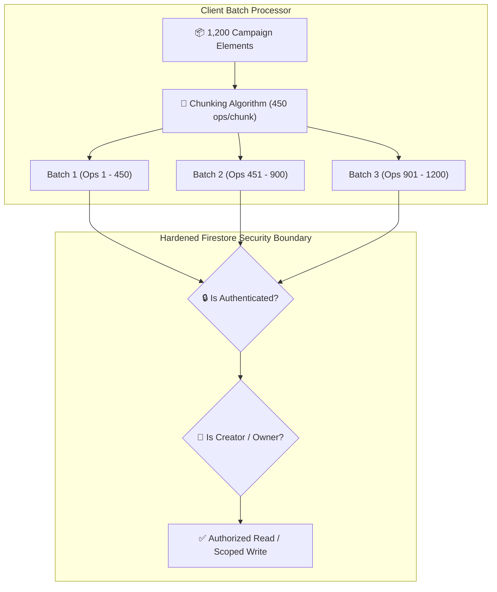

# Plan 02: Chunked Batch Operations & Firestore Security Boundary Hardening

**Module:** Story Foundry / Security & Database Infrastructure  
**Target Codebase:** [`TANGENT SF RP react project`](file:///d:/_ Data/Tangent SF RP/TANGENT SF RP react project/)  
**Primary Files:** [`src/context/CampaignContext.jsx`](file:///d:/_ Data/Tangent SF RP/TANGENT SF RP react project/src/context/CampaignContext.jsx), [`firestore.rules`](file:///d:/_ Data/Tangent SF RP/TANGENT SF RP react project/firestore.rules)  
**Supporting File:** `src/utils/firestoreUtils.js` *(NEW)*  
**Complexity:** Medium-High  
**Status:** Implementation Ready

---

## 1. Problem Statement & Vulnerability Analysis

### 1.1. Unbounded Firestore Batches
In [`CampaignContext.jsx:L164-215`](file:///d:/_ Data/Tangent SF RP/TANGENT SF RP react project/src/context/CampaignContext.jsx#L164), `saveAllElementsIndependently` extracts all scenario nodes across a campaign tree and writes them in a single `writeBatch()`:

```javascript
// Current Anti-Pattern in CampaignContext.jsx
const saveAllElementsIndependently = async () => {
  const allNodes = extractAllNodes(universeState.scenarios);
  const batch = writeBatch(db);
  allNodes.forEach(node => {
    const docRef = doc(db, 'story_elements', node.id);
    batch.set(docRef, node, { merge: true });
  });
  await batch.commit(); // CRITICAL BUG: Firestore hard-caps batches at 500 ops.
};
```
If a campaign contains more than 500 scenario nodes, map pins, or lore elements, `batch.commit()` throws an uncaught `FirebaseError: Transaction too big` and fails to save the user's data.

### 1.2. Permissive Firestore Security Catch-All
In [`firestore.rules:L52-62`](file:///d:/_ Data/Tangent SF RP/TANGENT SF RP react project/firestore.rules#L52), the wildcard rule:
```javascript
match /{collection}/{document=**} {
  allow read: if true;
  allow write: if request.auth != null && (request.auth.token.admin == true || request.auth.token.role == 'GM');
}
```
Leaves collections `story_elements`, `story_maps`, and `user_stories` readable by **any unauthenticated client on the internet**, while blocking non-admin players from saving their own campaigns.

---

## 2. Architecture & Security Model



---

## 3. Detailed Technical Specifications

### 3.1. Chunked Batch Utility (`src/utils/firestoreUtils.js`)

Create `src/utils/firestoreUtils.js`:

```javascript
import { writeBatch, doc } from 'firebase/firestore';
import { db } from '../firebase';

export interface BatchOperation {
  ref: any;
  data: Record<string, any>;
  merge?: boolean;
}

/**
 * Commits an array of operations in safe chunks of 450 items (below Firestore 500 limit).
 * Executes chunks sequentially to prevent memory bottlenecks.
 */
export async function commitChunkedBatches(
  operations: BatchOperation[],
  chunkSize: number = 450,
  onProgress?: (completed: number, total: number) => void
): Promise<void> {
  if (!operations || operations.length === 0) return;

  const total = operations.length;
  const chunks: BatchOperation[][] = [];

  for (let i = 0; i < total; i += chunkSize) {
    chunks.push(operations.slice(i, i + chunkSize));
  }

  let completed = 0;
  for (let i = 0; i < chunks.length; i++) {
    const chunk = chunks[i];
    const batch = writeBatch(db);

    chunk.forEach(({ ref, data, merge = true }) => {
      batch.set(ref, data, { merge });
    });

    await batch.commit();
    completed += chunk.length;
    if (onProgress) {
      onProgress(completed, total);
    }
  }
}
```

---

### 3.2. Refactoring `saveAllElementsIndependently` in `CampaignContext.jsx`

```javascript
import { commitChunkedBatches } from '../utils/firestoreUtils';

const saveAllElementsIndependently = useCallback(async (scenarios = null) => {
  const targetScenarios = scenarios || universeState?.scenarios || [];
  if (targetScenarios.length === 0) return;

  // Flatten nested scenario tree
  const extractNodes = (nodes) => {
    let list = [];
    nodes.forEach(n => {
      list.push(n);
      if (n.children && n.children.length > 0) {
        list = list.concat(extractNodes(n.children));
      }
    });
    return list;
  };

  const allNodes = extractNodes(targetScenarios);
  const now = new Date().toISOString();

  const operations = allNodes.map(node => ({
    ref: doc(db, 'story_elements', node.id),
    data: {
      ...node,
      storyId: universeState.id,
      creatorId: universeState.creatorId || currentUser?.uid,
      updatedAt: now
    },
    merge: true
  }));

  try {
    await commitChunkedBatches(operations, 450);
  } catch (err) {
    console.error('Failed to batch save story elements independently:', err);
    throw err;
  }
}, [universeState, currentUser]);
```

---

### 3.3. Hardened `firestore.rules`

Replace [`firestore.rules`](file:///d:/_ Data/Tangent SF RP/TANGENT SF RP react project/firestore.rules) with granular rules:

```javascript
rules_version = '2';
service cloud.firestore {
  match /databases/{database}/documents {

    // Helper functions
    function isAuthenticated() {
      return request.auth != null;
    }

    function isAdmin() {
      return isAuthenticated() && (request.auth.token.admin == true || request.auth.token.role == 'GM');
    }

    function isOwner(userId) {
      return isAuthenticated() && request.auth.uid == userId;
    }

    // 1. Omnicortex Reference DBM Collections (Public Read, Admin Write)
    match /compendium/{document} {
      allow read: if true;
      allow write: if isAdmin();
    }
    match /species/{document} {
      allow read: if true;
      allow write: if isAdmin();
    }
    match /origins/{document} {
      allow read: if true;
      allow write: if isAdmin();
    }
    match /equipment/{document} {
      allow read: if true;
      allow write: if isAdmin();
    }
    match /cybernetics/{document} {
      allow read: if true;
      allow write: if isAdmin();
    }
    match /psionics/{document} {
      allow read: if true;
      allow write: if isAdmin();
    }

    // 2. User Profiles & User Settings
    match /users/{userId} {
      allow read, write: if isOwner(userId) || isAdmin();
    }

    // 3. Persona Folio Characters (Owner read/write, authenticated read for GM)
    match /characters/{charId} {
      allow read: if isAuthenticated() && (resource.data.userId == request.auth.uid || isAdmin());
      allow create: if isAuthenticated() && request.resource.data.userId == request.auth.uid;
      allow update, delete: if isAuthenticated() && (resource.data.userId == request.auth.uid || isAdmin());
    }

    // 4. Story Foundry: User Stories & Campaigns
    match /user_stories/{storyId} {
      allow read: if isAuthenticated() && (resource.data.creatorId == request.auth.uid || isAdmin());
      allow create: if isAuthenticated() && request.resource.data.creatorId == request.auth.uid;
      allow update, delete: if isAuthenticated() && (resource.data.creatorId == request.auth.uid || isAdmin());
    }

    // 5. Story Foundry: Independent Scenario Elements
    match /story_elements/{elementId} {
      allow read: if isAuthenticated() && (resource.data.creatorId == request.auth.uid || isAdmin());
      allow create: if isAuthenticated() && request.resource.data.creatorId == request.auth.uid;
      allow update, delete: if isAuthenticated() && (resource.data.creatorId == request.auth.uid || isAdmin());
    }

    // 6. Story Foundry: Tactical Maps
    match /story_maps/{mapId} {
      allow read: if isAuthenticated(); // Authenticated players can read maps for live sessions
      allow create: if isAuthenticated() && request.resource.data.creatorId == request.auth.uid;
      allow update, delete: if isAuthenticated() && (resource.data.creatorId == request.auth.uid || isAdmin());
    }

    // 7. Final Catch-All: Explicit Deny
    match /{document=**} {
      allow read, write: if false;
    }
  }
}
```

---

## 4. Verification & Testing Protocol

| Test Case | Method | Expected Result |
| :--- | :--- | :--- |
| **800 Elements Batch Commit** | Execute `commitChunkedBatches` with 800 generated node payloads. | 2 batches commit in sequence (450 + 350) with 0 errors. |
| **Unauthenticated Read Block** | Query `user_stories` from an unauthenticated client. | Returns `permission-denied` error. |
| **Owner Write Permission** | Logged-in User A attempts to write to User A's `story_maps` doc. | Write succeeds. |
| **Cross-User Tamper Block** | Logged-in User B attempts to delete User A's `character` doc. | Returns `permission-denied` error. |
