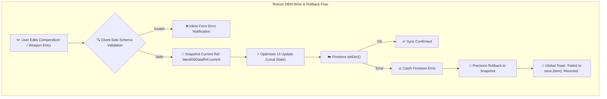

# Plan 03: DBM State Rollback Refactor, Schema Validation & Error Surfacing

**Module:** Omnicortex (DBM / Rules Codex Engine)  
**Target Codebase:** [`TANGENT SF RP react project`](file:///d:/_ Data/Tangent SF RP/TANGENT SF RP react project/)  
**Primary File:** [`src/context/DBMContext.jsx`](file:///d:/_ Data/Tangent SF RP/TANGENT SF RP react project/src/context/DBMContext.jsx)  
**Supporting Files:** `src/components/DBM/categoryConfig.js` *(AUDIT)*, `src/components/UI/Toast.jsx` *(NEW)*  
**Complexity:** Medium  
**Status:** Implementation Ready

---

## 1. Problem Statement & Architecture Flaws

### 1.1. Stale Closure Rollback Bug
In [`DBMContext.jsx:L61-84`](file:///d:/_ Data/Tangent SF RP/TANGENT SF RP react project/src/context/DBMContext.jsx#L61):
```javascript
// Current Anti-Pattern in DBMContext.jsx
const saveEntry = useCallback(async (category, entry) => {
  const previousState = { ...dbData }; // Captured in closure
  setDbData(prev => ({ ...prev, [category]: { ...(prev[category] || {}), [entry.id]: entry } }));
  try {
    await setDoc(doc(db, category, entry.id), entry);
  } catch (err) {
    setDbData(previousState); // REVERTS TO STALE SNAPSHOT!
  }
}, [dbData]);
```
Because `dbData` is an aggregated object holding all 6 DBM collections (`compendium`, `species`, `equipment`, `cybernetics`, `psionics`, `origins`), updating any single item rebuilds all memoized callbacks across the entire app. If a network rollback triggers, it restores the snapshot from when the function was created, wiping out unrelated concurrent edits.

### 1.2. Missing Schema Validation
Payloads are written directly to Firestore without verifying mandatory fields (`name`, `categoryKey`, `type`). A missing `name` field corrupts virtualized list sorting and search indexing.

### 1.3. Silent Error Swallowing
Firestore listener failures (`onSnapshot` error block, line 45) silently fail without informing the user.

---

## 2. Technical Design & Solution



---

## 3. Detailed Implementation Specifications

### 3.1. DBM Entry Schema Validator

Create validation logic in `src/utils/dbmValidators.js`:

```javascript
export function validateDbmEntry(categoryKey, entry) {
  const errors = [];

  if (!entry) {
    return { valid: false, errors: ['Entry payload is missing.'] };
  }

  if (!entry.id || typeof entry.id !== 'string') {
    errors.push('Entry requires a valid string ID.');
  }

  if (!entry.name || typeof entry.name !== 'string' || !entry.name.trim()) {
    errors.push('Entry name is required and cannot be blank.');
  }

  if (!categoryKey || typeof categoryKey !== 'string') {
    errors.push('Target category key is invalid.');
  }

  return {
    valid: errors.length === 0,
    errors
  };
}
```

---

### 3.2. Refactored `DBMContext.jsx`

```javascript
import React, { createContext, useContext, useState, useEffect, useRef, useCallback } from 'react';
import { collection, doc, onSnapshot, setDoc, deleteDoc } from 'firebase/firestore';
import { db } from '../firebase';
import { validateDbmEntry } from '../utils/dbmValidators';

export const DBMContext = createContext(null);

const DBM_COLLECTIONS = [
  'compendium',
  'species',
  'origins',
  'equipment',
  'cybernetics',
  'psionics'
];

export const DBMProvider = ({ children }) => {
  const [dbData, setDbData] = useState(() => {
    return DBM_COLLECTIONS.reduce((acc, col) => {
      acc[col] = {};
      return acc;
    }, {});
  });

  const [isLoading, setIsLoading] = useState(true);
  const [loadError, setLoadError] = useState(null);
  const [toastMessage, setToastMessage] = useState(null);

  // Maintain resilient ref for rollbacks without re-creating callbacks
  const latestDbDataRef = useRef(dbData);
  useEffect(() => {
    latestDbDataRef.current = dbData;
  }, [dbData]);

  // Firestore Real-Time Subscriptions
  useEffect(() => {
    setIsLoading(true);
    const unsubs = DBM_COLLECTIONS.map(colName => {
      const colRef = collection(db, colName);
      return onSnapshot(
        colRef,
        (snapshot) => {
          const items = {};
          snapshot.forEach(docSnap => {
            items[docSnap.id] = { id: docSnap.id, ...docSnap.data() };
          });
          setDbData(prev => ({ ...prev, [colName]: items }));
          setIsLoading(false);
        },
        (error) => {
          console.error(`[DBMContext] Listener failed for ${colName}:`, error);
          setLoadError(`Failed to load ${colName} data. Check permissions.`);
          setIsLoading(false);
        }
      );
    });

    return () => unsubs.forEach(unsub => unsub());
  }, []);

  // Safe Save Entry
  const saveEntry = useCallback(async (categoryKey, entry) => {
    // 1. Validation
    const validation = validateDbmEntry(categoryKey, entry);
    if (!validation.valid) {
      throw new Error(validation.errors.join(' '));
    }

    const previousSnapshot = latestDbDataRef.current;
    const sanitizedEntry = {
      ...entry,
      updatedAt: new Date().toISOString()
    };

    // 2. Optimistic UI update
    setDbData(prev => ({
      ...prev,
      [categoryKey]: {
        ...(prev[categoryKey] || {}),
        [entry.id]: sanitizedEntry
      }
    }));

    // 3. Cloud write with safe rollback
    try {
      const docRef = doc(db, categoryKey, entry.id);
      await setDoc(docRef, sanitizedEntry, { merge: true });
    } catch (err) {
      console.error(`[DBMContext] saveEntry failed for ${entry.id}:`, err);
      // Precision rollback to ref snapshot
      setDbData(previousSnapshot);
      setToastMessage({
        type: 'error',
        text: `Failed to save "${entry.name}". Changes reverted.`
      });
      throw err;
    }
  }, []);

  // Safe Delete Entry
  const deleteEntry = useCallback(async (categoryKey, entryId, entryName = 'Item') => {
    const previousSnapshot = latestDbDataRef.current;

    // 1. Optimistic removal
    setDbData(prev => {
      const updatedCat = { ...(prev[categoryKey] || {}) };
      delete updatedCat[entryId];
      return { ...prev, [categoryKey]: updatedCat };
    });

    // 2. Cloud delete with safe rollback
    try {
      const docRef = doc(db, categoryKey, entryId);
      await deleteDoc(docRef);
      setToastMessage({
        type: 'success',
        text: `"${entryName}" successfully deleted.`
      });
    } catch (err) {
      console.error(`[DBMContext] deleteEntry failed for ${entryId}:`, err);
      setDbData(previousSnapshot);
      setToastMessage({
        type: 'error',
        text: `Failed to delete "${entryName}". Reverted.`
      });
      throw err;
    }
  }, []);

  return (
    <DBMContext.Provider value={{
      dbData,
      isLoading,
      loadError,
      toastMessage,
      clearToast: () => setToastMessage(null),
      saveEntry,
      deleteEntry
    }}>
      {children}
    </DBMContext.Provider>
  );
};

export const useDBM = () => useContext(DBMContext);
```

---

## 4. Verification & Testing Protocol

| Test Case | Procedure | Expected Result |
| :--- | :--- | :--- |
| **Blank Name Validation Block** | Attempt to save an item with `{ id: 'item_1', name: '  ' }`. | Throws validation error; aborts network write before calling Firestore. |
| **Network Error Rollback** | Mock `setDoc` network rejection. | Item is removed from state; UI rolls back to previous snapshot; toast displays error alert. |
| **Concurrent Edit Isolation** | Edit Category A while Category B is receiving `onSnapshot` updates. | Callbacks do not recreate unnecessarily; Category B updates seamlessly without wiping Category A edits. |
| **Deletion Confirmation** | Delete an entry in Equipment. | Entry disappears instantly; success toast appears; Firestore document is deleted. |
