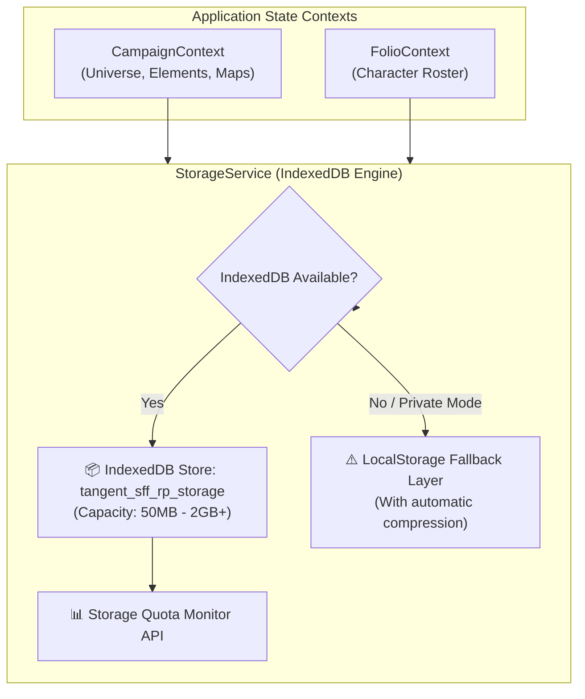

# Plan 04: IndexedDB Storage Engine & High-Capacity Offline Cache

**Module:** Core Data Layer / Client Storage  
**Target Codebase:** [`TANGENT SF RP react project`](file:///d:/_ Data/Tangent SF RP/TANGENT SF RP react project/)  
**Primary File:** `src/services/storageService.js` *(NEW)*  
**Integrating Files:** [`src/context/CampaignContext.jsx`](file:///d:/_ Data/Tangent SF RP/TANGENT SF RP react project/src/context/CampaignContext.jsx), [`src/context/FolioContext.jsx`](file:///d:/_ Data/Tangent SF RP/TANGENT SF RP react project/src/context/FolioContext.jsx)  
**Complexity:** Medium  
**Status:** Implementation Ready

---

## 1. Problem Statement & Storage Quota Risk

Currently, both [`CampaignContext.jsx:L59-101`](file:///d:/_ Data/Tangent SF RP/TANGENT SF RP react project/src/context/CampaignContext.jsx#L59) and [`FolioContext.jsx:L60-87`](file:///d:/_ Data/Tangent SF RP/TANGENT SF RP react project/src/context/FolioContext.jsx#L60) rely on synchronous `window.localStorage` to cache:
- The entire active `universeState` tree
- The `elementsCatalog` (hundreds of lore documents)
- The `mapsCatalog` (multi-megabyte JSON arrays of tactical layers, terrain polygons, asset links, and base64 preview thumbnails)
- The `persona_roster` (all character sheets, skills, and equipment)

### Vulnerabilities:
1. **5MB Quota Crash:** Most modern desktop and mobile browsers enforce a strict 5MB–10MB ceiling on `localStorage`. A campaign with 3 detailed tactical maps easily exceeds 8MB, throwing a fatal `DOMException: QuotaExceededError`.
2. **Main Thread Blocking:** `JSON.stringify()` and `JSON.parse()` on large 5MB objects during render cycles cause dropped frames and noticeable UI freezes.

---

## 2. Architecture: Asynchronous IndexedDB Storage Layer



---

## 3. Detailed Technical Specifications

### 3.1. StorageService Implementation (`src/services/storageService.js`)

```javascript
/**
 * Asynchronous, high-capacity IndexedDB key-value storage engine.
 * Automatically falls back to localStorage if IndexedDB is disabled.
 */

const DB_NAME = 'tangent_sff_rp_storage';
const DB_VERSION = 1;
const STORE_NAME = 'app_state_kv';

let dbInstance = null;

async function getDB() {
  if (dbInstance) return dbInstance;

  return new Promise((resolve, reject) => {
    if (typeof window === 'undefined' || !window.indexedDB) {
      return reject(new Error('IndexedDB is not supported in this environment.'));
    }

    const request = indexedDB.open(DB_NAME, DB_VERSION);

    request.onupgradeneeded = (event) => {
      const db = event.target.result;
      if (!db.objectStoreNames.contains(STORE_NAME)) {
        db.createObjectStore(STORE_NAME);
      }
    };

    request.onsuccess = (event) => {
      dbInstance = event.target.result;
      resolve(dbInstance);
    };

    request.onerror = (event) => {
      console.warn('[StorageService] IndexedDB open error:', event.target.error);
      reject(event.target.error);
    };
  });
}

export const StorageService = {
  /**
   * Retrieves an item from IndexedDB with fallback
   */
  async getItem(key, defaultValue = null) {
    try {
      const db = await getDB();
      return new Promise((resolve) => {
        const tx = db.transaction(STORE_NAME, 'readonly');
        const store = tx.objectStore(STORE_NAME);
        const req = store.get(key);

        req.onsuccess = () => {
          resolve(req.result !== undefined ? req.result : defaultValue);
        };
        req.onerror = () => {
          resolve(defaultValue);
        };
      });
    } catch {
      // Fallback to localStorage
      try {
        const raw = localStorage.getItem(key);
        return raw ? JSON.parse(raw) : defaultValue;
      } catch {
        return defaultValue;
      }
    }
  },

  /**
   * Persists an item to IndexedDB with fallback
   */
  async setItem(key, value) {
    try {
      const db = await getDB();
      return new Promise((resolve, reject) => {
        const tx = db.transaction(STORE_NAME, 'readwrite');
        const store = tx.objectStore(STORE_NAME);
        const req = store.put(value, key);

        req.onsuccess = () => resolve(true);
        req.onerror = (e) => reject(e.target.error);
      });
    } catch {
      try {
        localStorage.setItem(key, JSON.stringify(value));
        return true;
      } catch (err) {
        console.warn(`[StorageService] LocalStorage quota exceeded for key "${key}":`, err);
        return false;
      }
    }
  },

  /**
   * Deletes a key from storage
   */
  async removeItem(key) {
    try {
      const db = await getDB();
      const tx = db.transaction(STORE_NAME, 'readwrite');
      tx.objectStore(STORE_NAME).delete(key);
    } catch {
      try {
        localStorage.removeItem(key);
      } catch {}
    }
  },

  /**
   * Retrieves estimated browser storage usage and quota
   */
  async getStorageEstimate() {
    if (navigator.storage && navigator.storage.estimate) {
      const { quota, usage } = await navigator.storage.estimate();
      return {
        quotaMB: Math.round((quota || 0) / (1024 * 1024)),
        usageMB: Math.round((usage || 0) / (1024 * 1024)),
        percentUsed: quota ? Math.round((usage / quota) * 100) : 0
      };
    }
    return { quotaMB: 0, usageMB: 0, percentUsed: 0 };
  }
};
```

---

### 3.2. Integration into `CampaignContext.jsx`

Replace synchronous `localStorage` reads/writes with async `StorageService`:

```javascript
import { StorageService } from '../services/storageService';

// Hydration on mount
useEffect(() => {
  async function hydrateLocalCache() {
    try {
      const cachedUniverse = await StorageService.getItem('omnicortex_universe_state');
      if (cachedUniverse && !universeState) {
        setUniverseState(cachedUniverse);
      }

      const cachedElements = await StorageService.getItem('omnicortex_elements_catalog', []);
      setElementsCatalog(cachedElements);

      const cachedMaps = await StorageService.getItem('omnicortex_maps_catalog', []);
      setMapsCatalog(cachedMaps);
    } catch (err) {
      console.warn('Failed to hydrate local cache:', err);
    }
  }

  hydrateLocalCache();
}, []);

// Async caching on state change
useEffect(() => {
  if (universeState) {
    StorageService.setItem('omnicortex_universe_state', universeState);
  }
}, [universeState]);

useEffect(() => {
  if (mapsCatalog) {
    StorageService.setItem('omnicortex_maps_catalog', mapsCatalog);
  }
}, [mapsCatalog]);
```

---

### 3.3. Integration into `FolioContext.jsx`

```javascript
import { StorageService } from '../services/storageService';

// Hydration on mount
useEffect(() => {
  async function hydrateRoster() {
    const cachedRoster = await StorageService.getItem('omnicortex_persona_roster', []);
    if (cachedRoster.length > 0) {
      setRoster(cachedRoster);
    }
  }
  hydrateRoster();
}, []);

// Asynchronous persistence
useEffect(() => {
  if (roster.length > 0) {
    StorageService.setItem('omnicortex_persona_roster', roster);
  }
}, [roster]);
```

---

## 4. Verification & Testing Protocol

| Test Case | Method | Expected Result |
| :--- | :--- | :--- |
| **High Volume Map Payload (12MB)** | Save a map catalog with 5 large tactical maps containing high-res textures. | Successfully saves to IndexedDB; no `QuotaExceededError` thrown. |
| **Storage Estimate API** | Invoke `StorageService.getStorageEstimate()`. | Accurately returns available quota in MB and percentage used. |
| **Browser Refresh Hydration** | Refresh the browser while on a custom campaign map. | Map data hydrates instantly from IndexedDB before Firestore network resolution. |
| **Private Browsing Fallback** | Test in a browser mode with IndexedDB disabled. | Gracefully falls back to localStorage without throwing unhandled exceptions. |
