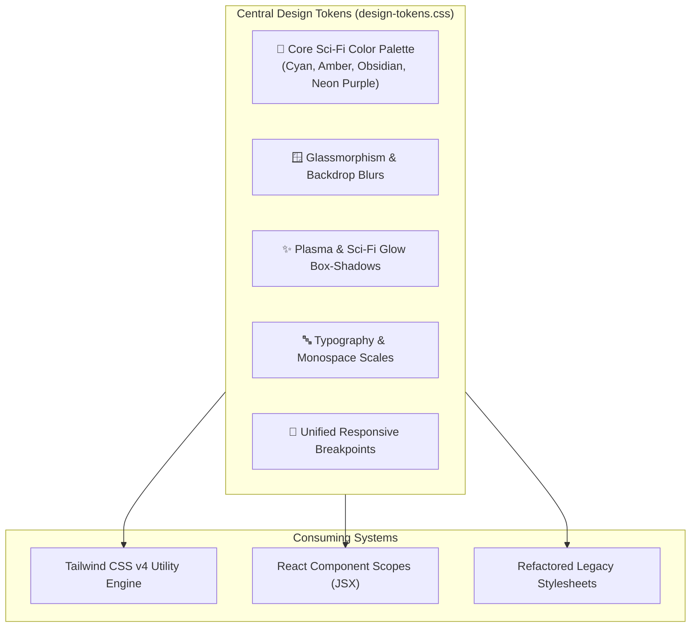

# Plan 05: CSS Architecture, Design Tokens & Responsive Normalization

**Module:** UI/UX & Styling Foundation  
**Target Codebase:** [`TANGENT SF RP react project`](file:///d:/_ Data/Tangent SF RP/TANGENT SF RP react project/)  
**Primary Files:** `src/css/design-tokens.css` *(NEW)*, [`src/index.css`](file:///d:/_ Data/Tangent SF RP/TANGENT SF RP react project/src/index.css)  
**Refactoring Files:** `src/css/dbm-style.css`, `src/components/Layout/AppShell.css`  
**Complexity:** Medium  
**Status:** Completed

---

## 1. Problem Statement & Design System Inconsistencies

1. **Duplicate `:root` Definitions:** Both [`index.css:L38`](file:///d:/_ Data/Tangent SF RP/TANGENT SF RP react project/src/index.css) and `dbm-style.css:L5` define overlapping CSS custom properties (`--bg-primary`, `--accent-color`, `--text-main`) with conflicting color codes.
2. **Conflicting Scrollbar Implementations:** Multiple CSS files redefine `::-webkit-scrollbar` with mismatched widths and thumbs, leading to visual flickering between views.
3. **No Responsive Breakpoints for Core Workspaces:** The DBM table, Persona Folio tabs, and Foundry panels have fixed pixel widths (e.g. `#app-sidebar` at 280px), overflowing on mobile screens and tablets (<768px).

---

## 2. Architecture & Design Token System



---

## 3. Detailed Technical Specifications

### 3.1. Design Tokens Master File (`src/css/design-tokens.css`)

```css
/* src/css/design-tokens.css */
:root {
  /* Surface & Background Palette */
  --color-bg-core: #090d16;
  --color-bg-surface: #0d1117;
  --color-bg-surface-elevated: #161b22;
  --color-bg-card: rgba(22, 27, 34, 0.85);
  --color-bg-glass: rgba(13, 17, 23, 0.75);
  --color-bg-glass-heavy: rgba(9, 13, 22, 0.92);

  /* Primary Brand Accents */
  --color-accent-cyan: #22d3ee;
  --color-accent-cyan-hover: #06b6d4;
  --color-accent-cyan-glow: rgba(34, 211, 238, 0.35);

  --color-accent-amber: #f59e0b;
  --color-accent-amber-hover: #d97706;
  --color-accent-amber-glow: rgba(245, 158, 11, 0.35);

  --color-accent-emerald: #10b981;
  --color-accent-purple: #a855f7;
  --color-accent-crimson: #ef4444;

  /* Text Colors */
  --color-text-primary: #f8fafc;
  --color-text-secondary: #94a3b8;
  --color-text-muted: #64748b;
  --color-text-disabled: #475569;

  /* Borders & Dividers */
  --color-border-subtle: rgba(255, 255, 255, 0.08);
  --color-border-medium: rgba(255, 255, 255, 0.16);
  --color-border-cyan: rgba(34, 211, 238, 0.4);
  --color-border-amber: rgba(245, 158, 11, 0.4);

  /* Shadows & Glows */
  --glow-cyan: 0 0 15px var(--color-accent-cyan-glow);
  --glow-amber: 0 0 15px var(--color-accent-amber-glow);
  --shadow-glass: 0 8px 32px 0 rgba(0, 0, 0, 0.37);

  /* Layout Dimensions */
  --hud-height: 56px;
  --sidebar-width: 280px;
  --radius-sm: 4px;
  --radius-md: 8px;
  --radius-lg: 12px;
  --radius-full: 9999px;

  /* Typography */
  --font-title: 'Orbitron', 'Inter', system-ui, sans-serif;
  --font-sans: 'Inter', system-ui, -apple-system, BlinkMacSystemFont, sans-serif;
  --font-mono: ui-monospace, SFMono-Regular, Menlo, Monaco, Consolas, monospace;
}

/* Global Unified Custom Scrollbar */
::-webkit-scrollbar {
  width: 6px;
  height: 6px;
}

::-webkit-scrollbar-track {
  background: var(--color-bg-core);
}

::-webkit-scrollbar-thumb {
  background: #334155;
  border-radius: var(--radius-full);
}

::-webkit-scrollbar-thumb:hover {
  background: var(--color-accent-cyan);
}
```

---

### 3.2. Updating `src/index.css`

```css
@import "tailwindcss";
@import "./css/design-tokens.css";

/* Sci-Fi Global Utility Classes */
.glass-panel {
  background: var(--color-bg-glass);
  backdrop-filter: blur(12px);
  -webkit-backdrop-filter: blur(12px);
  border: 1px solid var(--color-border-subtle);
  box-shadow: var(--shadow-glass);
}

.sci-fi-glow-cyan {
  box-shadow: var(--glow-cyan);
  border-color: var(--color-border-cyan);
}

.sci-fi-glow-amber {
  box-shadow: var(--glow-amber);
  border-color: var(--color-border-amber);
}

.tangent-title-gradient {
  background: linear-gradient(135deg, #ffffff 0%, #22d3ee 50%, #38bdf8 100%);
  -webkit-background-clip: text;
  -webkit-text-fill-color: transparent;
}
```

---

### 3.3. Responsive Layout Normalization

Add responsive breakpoints to sidebar and table grids:

```css
/* Mobile and Tablet Adaptation (< 768px) */
@media (max-width: 768px) {
  #app-sidebar {
    position: fixed;
    left: -100%;
    top: var(--hud-height);
    bottom: 0;
    width: 260px;
    z-index: 40;
    transition: left 0.3s ease-in-out;
  }

  #app-sidebar.open {
    left: 0;
  }

  .dbm-table-container {
    overflow-x: auto;
    -webkit-overflow-scrolling: touch;
  }

  .folio-tabs-header {
    flex-wrap: nowrap;
    overflow-x: auto;
    scrollbar-width: none;
  }
}
```

---

## 4. Verification & Testing Protocol

| Test Case | Method | Expected Result |
| :--- | :--- | :--- |
| **Token Uniformity** | Inspect CSS custom properties in dev tools on Home, DBM, Folio, and Foundry. | All modules reference `var(--color-*)` from `design-tokens.css` without duplicate overrides. |
| **Scrollbar Consistency** | Scroll DBM Virtualized table, Folio sheet, and Scenario tree. | All scrollbars render with uniform 6px slate-cyan thumb without layout jumping. |
| **Mobile Drawer Responsiveness** | Resize browser to 375px viewport (mobile emulation). | Sidebars collapse off-screen; toggle menu button opens drawer smoothly without horizontal screen overflow. |
