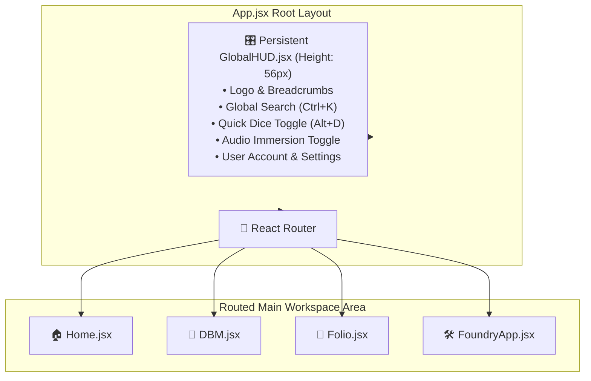

# Plan 06: Persistent Global HUD & App Shell Modernization

**Module:** Core Navigation & Layout Architecture  
**Target Codebase:** [`TANGENT SF RP react project`](file:///d:/_ Data/Tangent SF RP/TANGENT SF RP react project/)  
**Primary Files:** `src/components/Layout/GlobalHUD.jsx` *(NEW)*, [`src/App.jsx`](file:///d:/_ Data/Tangent SF RP/TANGENT SF RP react project/src/App.jsx)  
**Refactoring File:** [`src/components/Layout/AppShell.jsx`](file:///d:/_ Data/Tangent SF RP/TANGENT SF RP react project/src/components/Layout/AppShell.jsx)  
**Complexity:** Medium  
**Status:** Implementation Ready

---

## 1. Problem Statement & UX Fragmentation

Currently, each module manages its own independent navigation and headers:
- `Home.jsx` renders top-left/top-right absolute headers.
- `FoundryApp.jsx` wraps inside a separate `AppShell.jsx`.
- `DBM.jsx` and `Folio.jsx` mount their own independent headers.

### Consequences:
1. **Disorienting Navigation:** Transitioning between Home, DBM, Folio, and Foundry causes abrupt layout shifts and differing header bars.
2. **Inaccessible Global Tools:** Tools like the Dice Roller, Audio Immersion Switch, and Quick Command Palette cannot be accessed globally without duplicating code across 4 separate pages.

---

## 2. Architecture & Layout Flow



---

## 3. Detailed Technical Specifications

### 3.1. `GlobalHUD.jsx` Implementation

Create `src/components/Layout/GlobalHUD.jsx`:

```jsx
import React, { useState } from 'react';
import { NavLink, useLocation, useNavigate } from 'react-router-dom';
import { 
  Compass, 
  Search, 
  Dices, 
  Volume2, 
  VolumeX, 
  Settings, 
  User, 
  LogOut, 
  Sparkles,
  ChevronRight 
} from 'lucide-react';
import { useAuth } from '../../context/AuthContext';
import { AudioService } from '../../services/audioService';
import { UserSettingsModal } from '../UserSettingsModal';

export const GlobalHUD = ({ onOpenCommandPalette, onToggleDiceDock, isDiceDockOpen }) => {
  const navigate = useNavigate();
  const location = useLocation();
  const { currentUser, userHandle, confirmLogout } = useAuth();
  
  const [isSettingsOpen, setIsSettingsOpen] = useState(false);
  const [isAudioMuted, setIsAudioMuted] = useState(() => AudioService.muted);

  // Generate dynamic breadcrumb segments
  const getBreadcrumbs = () => {
    const path = location.pathname;
    if (path === '/') return [{ label: 'COMMAND HUB', path: '/' }];
    
    const crumbs = [{ label: 'HUB', path: '/' }];
    if (path.startsWith('/dbm')) crumbs.push({ label: 'OMNICORTEX', path: '/dbm' });
    if (path.startsWith('/folio')) crumbs.push({ label: 'PERSONA FOLIO', path: '/folio' });
    if (path.startsWith('/foundry')) {
      crumbs.push({ label: 'FOUNDRY', path: '/foundry' });
      if (path.includes('/story')) crumbs.push({ label: 'STORY WEAVER', path: '/foundry/story' });
      if (path.includes('/elements')) crumbs.push({ label: 'ELEMENT FORGE', path: '/foundry/elements' });
      if (path.includes('/map-maker')) crumbs.push({ label: 'TACTICAL MAP', path: '/foundry/map-maker' });
      if (path.includes('/aime')) crumbs.push({ label: 'AIME SUITE', path: '/foundry/aime' });
    }
    return crumbs;
  };

  const toggleAudio = () => {
    const newMuteState = AudioService.toggleMute();
    setIsAudioMuted(newMuteState);
    if (!newMuteState) {
      AudioService.playTerminalBeep(1000, 0.05);
    }
  };

  const breadcrumbs = getBreadcrumbs();
  const displayIdentity = userHandle ? `@${userHandle}` : (currentUser?.displayName || currentUser?.email || 'Guest');

  return (
    <>
      <header className="h-[56px] w-full bg-[#090d16]/90 backdrop-blur-md border-b border-slate-800 px-4 flex items-center justify-between z-50 select-none shrink-0 font-sans">
        {/* Left Section: Brand & Breadcrumbs */}
        <div className="flex items-center gap-3">
          <NavLink 
            to="/" 
            className="flex items-center gap-2 text-cyan-400 hover:opacity-90 transition-opacity group"
            title="Return to Game Hub"
          >
            <Compass className="text-cyan-400 group-hover:rotate-45 transition-transform duration-300" size={22} />
            <span className="font-bold font-mono tracking-widest text-sm text-slate-100 hidden sm:inline">
              TANGENT <span className="text-cyan-400">SFF</span>
            </span>
          </NavLink>

          <div className="h-4 w-[1px] bg-slate-700 hidden sm:block mx-1"></div>

          {/* Breadcrumb Navigation */}
          <nav className="flex items-center gap-1.5 text-xs font-mono">
            {breadcrumbs.map((crumb, idx) => (
              <React.Fragment key={crumb.path}>
                {idx > 0 && <ChevronRight size={12} className="text-slate-600" />}
                <NavLink
                  to={crumb.path}
                  className={({ isActive }) => 
                    `hover:text-cyan-300 transition-colors uppercase ${
                      isActive ? 'text-cyan-400 font-bold' : 'text-slate-400'
                    }`
                  }
                >
                  {crumb.label}
                </NavLink>
              </React.Fragment>
            ))}
          </nav>
        </div>

        {/* Center Section: Quick Search Trigger */}
        <button
          onClick={onOpenCommandPalette}
          className="hidden md:flex items-center gap-2 px-3 py-1.5 rounded-lg bg-slate-900/80 hover:bg-slate-800/80 border border-slate-700 hover:border-cyan-500/50 text-slate-400 hover:text-slate-200 text-xs transition-all shadow-inner group"
          title="Open Command Palette (Ctrl+K)"
        >
          <Search size={14} className="text-cyan-400 group-hover:scale-110 transition-transform" />
          <span>Search rules, heroes, maps...</span>
          <kbd className="px-1.5 py-0.5 rounded bg-slate-800 border border-slate-600 text-[10px] text-slate-300 font-mono">
            Ctrl+K
          </kbd>
        </button>

        {/* Right Section: Tools, Audio, User Account */}
        <div className="flex items-center gap-2">
          {/* Quick Dice Roller Toggle */}
          <button
            onClick={onToggleDiceDock}
            className={`p-2 rounded-lg border transition-all ${
              isDiceDockOpen 
                ? 'bg-amber-500/20 border-amber-500/60 text-amber-300 shadow-[0_0_10px_rgba(245,158,11,0.3)]' 
                : 'bg-slate-900/60 hover:bg-slate-800 border-slate-700 text-slate-300 hover:text-white'
            }`}
            title="Toggle Dice Roller Tray (Alt+D)"
          >
            <Dices size={17} />
          </button>

          {/* Audio Immersion Switch */}
          <button
            onClick={toggleAudio}
            className={`p-2 rounded-lg border transition-all ${
              !isAudioMuted 
                ? 'bg-cyan-500/10 border-cyan-500/40 text-cyan-300' 
                : 'bg-slate-900/60 hover:bg-slate-800 border-slate-700 text-slate-500'
            }`}
            title={isAudioMuted ? 'Unmute Sci-Fi Audio FX' : 'Mute Sci-Fi Audio FX'}
          >
            {isAudioMuted ? <VolumeX size={17} /> : <Volume2 size={17} />}
          </button>

          {/* User Account Menu */}
          {currentUser ? (
            <div className="flex items-center gap-1.5 pl-2 border-l border-slate-800">
              <button
                onClick={() => setIsSettingsOpen(true)}
                className="flex items-center gap-2 px-2.5 py-1.5 rounded-lg bg-slate-900/60 hover:bg-slate-800 border border-slate-700 text-slate-200 text-xs font-mono transition-colors"
                title="Account & System Settings"
              >
                <span className="w-2 h-2 rounded-full bg-emerald-400 animate-pulse"></span>
                <span className="max-w-[110px] truncate text-cyan-300 font-bold">{displayIdentity}</span>
                <Settings size={14} className="text-slate-400 ml-1" />
              </button>

              <button
                onClick={() => confirmLogout(navigate)}
                className="p-2 rounded-lg hover:bg-red-500/20 text-slate-400 hover:text-red-400 transition-colors"
                title="Logout"
              >
                <LogOut size={16} />
              </button>
            </div>
          ) : (
            <button
              onClick={() => navigate('/')}
              className="px-3 py-1.5 bg-cyan-600 hover:bg-cyan-500 text-white font-bold text-xs rounded-lg uppercase tracking-wider transition-colors"
            >
              Login
            </button>
          )}
        </div>
      </header>

      {/* Global Settings Modal */}
      <UserSettingsModal
        isOpen={isSettingsOpen}
        onClose={() => setIsSettingsOpen(false)}
      />
    </>
  );
};
```

---

### 3.2. Integration into `App.jsx`

Wrap the application routes with `GlobalHUD`:

```jsx
// src/App.jsx refactor
import React, { useState, lazy, Suspense } from 'react';
import { BrowserRouter as Router, Routes, Route } from 'react-router-dom';
import { GlobalHUD } from './components/Layout/GlobalHUD';
import { CommandPalette } from './components/UI/CommandPalette';
import { DiceRollerDock } from './components/UI/DiceRollerDock';
import { DBMProvider } from './context/DBMContext';

export default function App() {
  const [isCommandPaletteOpen, setIsCommandPaletteOpen] = useState(false);
  const [isDiceDockOpen, setIsDiceDockOpen] = useState(false);

  return (
    <Router>
      <DBMProvider>
        <div className="h-screen w-screen bg-[#090d16] flex flex-col font-sans overflow-hidden text-slate-100">
          {/* Persistent Top HUD */}
          <GlobalHUD
            onOpenCommandPalette={() => setIsCommandPaletteOpen(true)}
            onToggleDiceDock={() => setIsDiceDockOpen(prev => !prev)}
            isDiceDockOpen={isDiceDockOpen}
          />

          {/* Main Routed Area */}
          <main className="flex-1 w-full h-[calc(100vh-56px)] overflow-hidden relative">
            <Suspense fallback={<PageLoader />}>
              <Routes>
                <Route path="/" element={<Home />} />
                <Route path="/dbm" element={<DBM />} />
                <Route path="/folio" element={<Folio />} />
                <Route path="/foundry/*" element={<FoundryApp />} />
              </Routes>
            </Suspense>
          </main>

          {/* Global Modals & Docks */}
          <CommandPalette
            isOpen={isCommandPaletteOpen}
            onClose={() => setIsCommandPaletteOpen(false)}
          />
          
          <DiceRollerDock
            isOpen={isDiceDockOpen}
            onClose={() => setIsDiceDockOpen(false)}
          />
        </div>
      </DBMProvider>
    </Router>
  );
}
```

---

## 4. Verification & Testing Protocol

| Test Case | Method | Expected Result |
| :--- | :--- | :--- |
| **Route Breadcrumb Synchronization** | Navigate to `/foundry/map-maker`. | HUD displays `HUB > FOUNDRY > TACTICAL MAP` with active highlight on last item. |
| **Global Shortcut `Ctrl+K`** | Press `Ctrl+K` on `/folio` or `/dbm`. | Opens Command Palette dialog immediately without navigating away. |
| **Global Shortcut `Alt+D`** | Press `Alt+D` on any page. | Toggles floating Dice Roller Dock; audio chime plays if unmuted. |
| **Audio Persistence** | Mute audio in HUD, refresh page, click dice roll. | Audio remains muted across sessions. |
