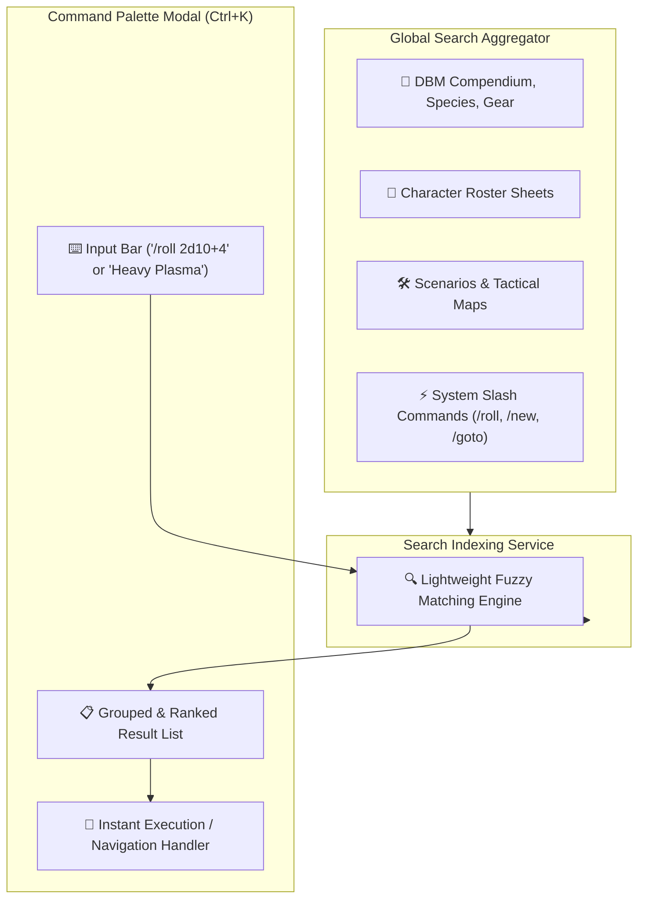

# Plan 08: Global Command Palette (`Ctrl+K` Omni-Search & Quick Actions)

**Module:** Global UI & Keyboard Ergonomics  
**Target Codebase:** [`TANGENT SF RP react project`](file:///d:/_ Data/Tangent SF RP/TANGENT SF RP react project/)  
**Primary File:** `src/components/UI/CommandPalette.jsx` *(NEW)*  
**Supporting Files:** `src/services/searchIndexService.js` *(NEW)*, [`src/components/Layout/GlobalHUD.jsx`](file:///d:/_ Data/Tangent SF RP/TANGENT SF RP react project/src/components/Layout/GlobalHUD.jsx)  
**Complexity:** Medium-High  
**Status:** Implementation Ready

---

## 1. Problem Statement & Efficiency Need

As the Tangent SFF RP platform grows with hundreds of rules entries, dozens of maps, and multiple character sheets, finding items currently requires tedious clicking through nested menus:
1. Looking up a weapon requires: DBM -> Equipment category -> Table filter.
2. Jumping to a specific character requires: Folio -> Open Roster Modal -> Select Character.
3. Rolling dice requires: Opening the Bastion AI drawer -> Typing `/roll`.

### Objective:
Implement a **spotlight/command palette (`Ctrl+K`)** accessible from anywhere in the application that indexes all compendium items, characters, maps, and story scenarios while enabling instant executable slash commands.

---

## 2. Architecture & Indexing Topology



---

## 3. Detailed Technical Specifications

### 3.1. Command Palette Implementation (`src/components/UI/CommandPalette.jsx`)

```jsx
import React, { useState, useEffect, useRef, useMemo } from 'react';
import { useNavigate } from 'react-router-dom';
import { 
  Search, 
  Dices, 
  User, 
  Map, 
  BookOpen, 
  Sparkles, 
  Compass, 
  CornerDownLeft,
  X 
} from 'lucide-react';
import { useDBM } from '../../context/DBMContext';
import { useFolio } from '../../context/FolioContext';
import { useStory } from '../../context/CampaignContext';
import { rollDice } from '../../services/diceService';
import { AudioService } from '../../services/audioService';

export const CommandPalette = ({ isOpen, onClose, onDiceRolled }) => {
  const navigate = useNavigate();
  const { dbData } = useDBM() || {};
  const { roster } = useFolio() || {};
  const { universeState, mapsCatalog } = useStory() || {};

  const [query, setQuery] = useState('');
  const [selectedIndex, setSelectedIndex] = useState(0);
  const inputRef = useRef(null);

  // Focus input on open
  useEffect(() => {
    if (isOpen) {
      setQuery('');
      setSelectedIndex(0);
      setTimeout(() => inputRef.current?.focus(), 50);
    }
  }, [isOpen]);

  // Global Keyboard Trigger (Ctrl+K / Cmd+K)
  useEffect(() => {
    const handleKeyDown = (e) => {
      if ((e.ctrlKey || e.metaKey) && e.key.toLowerCase() === 'k') {
        e.preventDefault();
        isOpen ? onClose() : null; // Toggled by parent
      }
      if (e.key === 'Escape' && isOpen) {
        onClose();
      }
    };
    window.addEventListener('keydown', handleKeyDown);
    return () => window.removeEventListener('keydown', handleKeyDown);
  }, [isOpen, onClose]);

  // Dynamic Search Index Aggregation
  const searchResults = useMemo(() => {
    if (!isOpen) return [];
    const q = query.toLowerCase().trim();

    // 1. Direct Slash Commands
    if (q.startsWith('/roll')) {
      const rollExpr = q.replace('/roll', '').trim() || '2d10';
      return [{
        id: 'cmd_roll',
        type: 'action',
        icon: <Dices size={16} className="text-amber-400" />,
        title: `Execute Roll: ${rollExpr}`,
        subtitle: 'Roll polyhedral dice and log result to tray',
        action: () => {
          const result = rollDice(rollExpr);
          AudioService.playDiceRollSound();
          if (onDiceRolled) onDiceRolled(result);
          onClose();
        }
      }];
    }

    let results = [];

    // 2. Navigation Actions
    const defaultNav = [
      { id: 'nav_hub', title: 'Go to Command Hub', subtitle: 'Main Dashboard', icon: <Compass size={16} className="text-cyan-400" />, action: () => { navigate('/'); onClose(); } },
      { id: 'nav_dbm', title: 'Go to Omnicortex (DBM)', subtitle: 'Rules Codex & Database', icon: <BookOpen size={16} className="text-emerald-400" />, action: () => { navigate('/dbm'); onClose(); } },
      { id: 'nav_folio', title: 'Go to Persona Folio', subtitle: 'Hero Roster & Sheets', icon: <User size={16} className="text-amber-400" />, action: () => { navigate('/folio'); onClose(); } },
      { id: 'nav_maps', title: 'Go to Tactical Map Maker', subtitle: 'Virtual Tabletop Grid', icon: <Map size={16} className="text-cyan-400" />, action: () => { navigate('/foundry/map-maker'); onClose(); } },
      { id: 'nav_aime', title: 'Go to AIME Creative Suite', subtitle: 'Narrative Synthesis', icon: <Sparkles size={16} className="text-purple-400" />, action: () => { navigate('/foundry/aime'); onClose(); } }
    ];

    if (!q) return defaultNav;

    // Filter Navigation
    defaultNav.forEach(n => {
      if (n.title.toLowerCase().includes(q) || n.subtitle.toLowerCase().includes(q)) {
        results.push(n);
      }
    });

    // 3. Search Roster Heroes
    (roster || []).forEach(hero => {
      if (hero.name?.toLowerCase().includes(q) || hero.species?.toLowerCase().includes(q)) {
        results.push({
          id: `hero_${hero.id}`,
          title: hero.name || 'Unnamed Hero',
          subtitle: `Hero Persona • ${hero.species || 'Human'} • Level ${hero.level || 1}`,
          icon: <User size={16} className="text-amber-400" />,
          action: () => { navigate(`/folio?charId=${hero.id}`); onClose(); }
        });
      }
    });

    // 4. Search Maps
    (mapsCatalog || []).forEach(map => {
      if (map.name?.toLowerCase().includes(q) || map.title?.toLowerCase().includes(q)) {
        results.push({
          id: `map_${map.id}`,
          title: map.name || map.title || 'Untitled Map',
          subtitle: `Tactical Map • ${map.gridType || 'Square'} Grid`,
          icon: <Map size={16} className="text-cyan-400" />,
          action: () => { navigate(`/foundry/map-maker?mapId=${map.id}`); onClose(); }
        });
      }
    });

    // 5. Search DBM Compendium Entries
    if (dbData) {
      Object.keys(dbData).forEach(category => {
        Object.values(dbData[category] || {}).forEach(item => {
          if (item.name?.toLowerCase().includes(q) || item.description?.toLowerCase().includes(q)) {
            results.push({
              id: `dbm_${item.id}`,
              title: item.name,
              subtitle: `Omnicortex ${category.toUpperCase()} • ${item.type || 'Standard'}`,
              icon: <BookOpen size={16} className="text-emerald-400" />,
              action: () => { navigate(`/dbm?category=${category}&itemId=${item.id}`); onClose(); }
            });
          }
        });
      });
    }

    return results.slice(0, 10);
  }, [query, dbData, roster, mapsCatalog, isOpen]);

  // Keyboard navigation within list
  const handleKeyDown = (e) => {
    if (e.key === 'ArrowDown') {
      e.preventDefault();
      setSelectedIndex(prev => (prev + 1) % Math.max(1, searchResults.length));
    } else if (e.key === 'ArrowUp') {
      e.preventDefault();
      setSelectedIndex(prev => (prev - 1 + searchResults.length) % Math.max(1, searchResults.length));
    } else if (e.key === 'Enter') {
      e.preventDefault();
      const selected = searchResults[selectedIndex];
      if (selected?.action) {
        AudioService.playTerminalBeep(1200, 0.04);
        selected.action();
      }
    }
  };

  if (!isOpen) return null;

  return (
    <div className="fixed inset-0 z-50 bg-black/70 backdrop-blur-sm flex items-start justify-center pt-24 px-4 select-none font-sans animate-fade-in">
      <div className="w-full max-w-2xl bg-[#0d1117] border border-cyan-500/40 rounded-xl shadow-[0_0_40px_rgba(0,0,0,0.8),0_0_20px_rgba(34,211,238,0.2)] overflow-hidden flex flex-col">
        
        {/* Search Input Bar */}
        <div className="flex items-center px-4 py-3.5 border-b border-slate-800 gap-3">
          <Search size={18} className="text-cyan-400" />
          <input
            ref={inputRef}
            type="text"
            value={query}
            onChange={(e) => { setQuery(e.target.value); setSelectedIndex(0); }}
            onKeyDown={handleKeyDown}
            placeholder="Search compendium, heroes, maps, or type /roll [dice]..."
            className="flex-1 bg-transparent text-slate-100 placeholder-slate-500 text-sm focus:outline-none font-mono"
          />
          {query && (
            <button onClick={() => setQuery('')} className="text-slate-500 hover:text-slate-300">
              <X size={16} />
            </button>
          )}
          <kbd className="px-1.5 py-0.5 rounded bg-slate-800 border border-slate-700 text-[10px] text-slate-400 font-mono">
            ESC to close
          </kbd>
        </div>

        {/* Results List */}
        <div className="max-h-80 overflow-y-auto p-2 space-y-1">
          {searchResults.length === 0 ? (
            <div className="py-8 text-center text-xs text-slate-500 font-mono">
              No matching records or commands found for "{query}".
            </div>
          ) : (
            searchResults.map((item, index) => {
              const isSelected = index === selectedIndex;
              return (
                <div
                  key={item.id}
                  onClick={() => {
                    AudioService.playTerminalBeep(1200, 0.04);
                    item.action();
                  }}
                  onMouseEnter={() => setSelectedIndex(index)}
                  className={`flex items-center justify-between p-2.5 rounded-lg cursor-pointer transition-colors ${
                    isSelected ? 'bg-cyan-500/15 border border-cyan-500/40 text-cyan-200' : 'text-slate-300 hover:bg-slate-800/50'
                  }`}
                >
                  <div className="flex items-center gap-3 truncate">
                    <div className="p-1.5 rounded-md bg-slate-800/80 border border-slate-700">
                      {item.icon}
                    </div>
                    <div className="truncate">
                      <div className="text-xs font-bold truncate">{item.title}</div>
                      <div className="text-[10px] text-slate-400 font-mono truncate">{item.subtitle}</div>
                    </div>
                  </div>

                  {isSelected && (
                    <CornerDownLeft size={14} className="text-cyan-400 ml-2 shrink-0" />
                  )}
                </div>
              );
            })
          )}
        </div>

        {/* Footer Shortcut Bar */}
        <div className="px-4 py-2 border-t border-slate-800/80 bg-slate-900/50 flex items-center justify-between text-[11px] font-mono text-slate-500">
          <div className="flex items-center gap-3">
            <span>↑↓ Navigate</span>
            <span>↵ Select</span>
            <span>/roll 2d10+4 Quick Roll</span>
          </div>
          <span>TANGENT SPOTLIGHT</span>
        </div>
      </div>
    </div>
  );
};
```

---

## 4. Verification & Testing Protocol

| Test Case | Procedure | Expected Result |
| :--- | :--- | :--- |
| **`Ctrl+K` Global Shortcut** | Press `Ctrl+K` on Home, Folio, DBM, and Story Foundry. | Palette opens in <50ms with input focused. |
| **Direct Roll Execution** | Type `/roll 3d10+2` and press Enter. | Palette closes; dice audio plays; roll result `[14, 8, 10] + 2 = 34` logs to Dice Dock. |
| **Hero Instant Navigation** | Type hero name "Vance" and hit Enter. | URL transitions to `/folio?charId=...` with Vance's sheet loaded. |
| **DBM Fast Search** | Type "Plasma" and select "Heavy Plasma Rifle". | Opens `/dbm?category=equipment&itemId=...` with the item modal open. |
