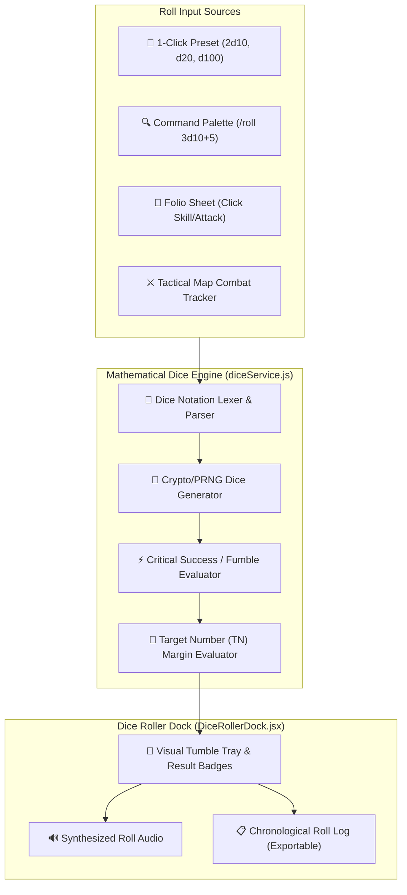

# Plan 09: Mathematical Dice Engine & Floating Polyhedral Roller Dock

**Module:** Core Game Mechanics & Virtual Tabletop Tools  
**Target Codebase:** [`TANGENT SF RP react project`](file:///d:/_ Data/Tangent SF RP/TANGENT SF RP react project/)  
**Primary Files:** `src/services/diceService.js` *(NEW)*, `src/components/UI/DiceRollerDock.jsx` *(NEW)*  
**Complexity:** Medium-High  
**Status:** Implementation Ready

---

## 1. Problem Statement & Tabletop Requirements

Dice rolling in Tangent SFF RP is the primary conflict resolution mechanism. The standard system uses `2d10 + Attribute/Skill Modifier vs. Target Number (TN)`. Currently, dice rolling is only available via text parsing in the Bastion chat drawer (`/roll 2d10+4`).

### Tabletop Requirements:
1. **Full Notation Support:** Parse polyhedrals (`d4`, `d6`, `d8`, `d10`, `d12`, `d20`, `d100`), exploding dice (`2d10!`), dropped dice (`4d6k3`), and algebraic modifiers (`+4`, `-2`).
2. **Tangent System Evaluation:** Automatic Critical Hit (dual 10s on 2d10) and Critical Fumble (dual 1s on 2d10) detection.
3. **Interactive Floating Tray:** A collapsible dock accessible from any screen with 1-click polyhedral quick buttons, target number check comparison, and rolling history.

---

## 2. Architecture & Data Flow



---

## 3. Detailed Technical Specifications

### 3.1. Mathematical Dice Engine (`src/services/diceService.js`)

```javascript
/**
 * Advanced Dice Parser and Random Number Generator for Tangent SFF RP.
 */

export interface DiceRollResult {
  id: string;
  expression: string;
  count: number;
  sides: number;
  rolls: Array<{ value: number; exploded?: boolean; explodeValue?: number }>;
  modifier: number;
  subtotal: number;
  total: number;
  isCritSuccess: boolean;
  isCritFail: boolean;
  targetNumber?: number | null;
  margin?: number | null;
  isSuccess?: boolean | null;
  characterName: string;
  label: string;
  timestamp: string;
}

/**
 * Parses dice expressions like "2d10+4", "d20", "3d10!", "4d6k3-2"
 */
export function parseDiceExpression(expression: string) {
  const clean = expression.replace(/\s+/g, '').toLowerCase();
  const regex = /^(\d+)?d(\d+)(!)?(?:k(\d+))?([+-]\d+)?$/i;
  const match = clean.match(regex);

  if (!match) {
    // Fallback: try parsing as flat number or standard 2d10
    return { count: 2, sides: 10, exploding: false, keep: null, modifier: 0 };
  }

  const count = parseInt(match[1] || '1', 10);
  const sides = parseInt(match[2], 10);
  const exploding = Boolean(match[3]);
  const keep = match[4] ? parseInt(match[4], 10) : null;
  const modifier = match[5] ? parseInt(match[5], 10) : 0;

  return { count: Math.min(count, 50), sides, exploding, keep, modifier };
}

export function rollDice(expression = '2d10', options: any = {}): DiceRollResult {
  const parsed = parseDiceExpression(expression);
  const rolls: Array<{ value: number; exploded?: boolean; explodeValue?: number }> = [];
  let rawValues: number[] = [];

  for (let i = 0; i < parsed.count; i++) {
    let r = Math.floor(Math.random() * parsed.sides) + 1;
    let rollObj = { value: r, exploded: false, explodeValue: 0 };

    // Exploding dice logic
    if (parsed.exploding && r === parsed.sides) {
      rollObj.exploded = true;
      const extra = Math.floor(Math.random() * parsed.sides) + 1;
      rollObj.explodeValue = extra;
      r += extra;
    }

    rolls.push(rollObj);
    rawValues.push(r);
  }

  // Handle keep highest (e.g. 4d6k3)
  if (parsed.keep && parsed.keep < rawValues.length) {
    rawValues.sort((a, b) => b - a);
    rawValues = rawValues.slice(0, parsed.keep);
  }

  const subtotal = rawValues.reduce((sum, v) => sum + v, 0);
  const total = subtotal + parsed.modifier;

  // Tangent SFF RP Critical Evaluation (Natural dual 10s or dual 1s on 2d10)
  const is2d10 = parsed.count === 2 && parsed.sides === 10;
  const isCritSuccess = is2d10 && rolls[0].value === 10 && rolls[1].value === 10;
  const isCritFail = is2d10 && rolls[0].value === 1 && rolls[1].value === 1;

  // Target Number (TN) evaluation
  let margin: number | null = null;
  let isSuccess: boolean | null = null;
  if (options.targetNumber !== undefined && options.targetNumber !== null && options.targetNumber > 0) {
    margin = total - options.targetNumber;
    isSuccess = margin >= 0;
  }

  return {
    id: `roll_${Date.now()}_${Math.random().toString(36).substring(2, 6)}`,
    expression,
    count: parsed.count,
    sides: parsed.sides,
    rolls,
    modifier: parsed.modifier,
    subtotal,
    total,
    isCritSuccess,
    isCritFail,
    targetNumber: options.targetNumber || null,
    margin,
    isSuccess,
    characterName: options.characterName || 'Hero',
    label: options.label || 'Action Check',
    timestamp: new Date().toISOString()
  };
}
```

---

### 3.2. Floating Dice Roller Dock (`src/components/UI/DiceRollerDock.jsx`)

```jsx
import React, { useState } from 'react';
import { Dices, ChevronDown, ChevronUp, RotateCcw, X, Plus, Sparkles, Target } from 'lucide-react';
import { rollDice, DiceRollResult } from '../../services/diceService';
import { AudioService } from '../../services/audioService';

const PRESET_DICE = [
  { label: '2d10 (Tangent)', expr: '2d10' },
  { label: 'd20', expr: '1d20' },
  { label: 'd100', expr: '1d100' },
  { label: 'd6', expr: '1d6' },
  { label: 'd8', expr: '1d8' },
  { label: 'd12', expr: '1d12' }
];

export const DiceRollerDock = ({ isOpen, onClose }) => {
  const [customExpr, setCustomExpr] = useState('2d10+2');
  const [targetNumber, setTargetNumber] = useState('');
  const [history, setHistory] = useState([]);
  const [latestRoll, setLatestRoll] = useState(null);

  if (!isOpen) return null;

  const handleRoll = (expr = customExpr) => {
    const tn = targetNumber ? parseInt(targetNumber, 10) : null;
    const result = rollDice(expr, { targetNumber: tn, label: 'Tactical Check' });

    AudioService.playDiceRollSound();
    if (result.isCritSuccess) AudioService.playCriticalChime(true);
    if (result.isCritFail) AudioService.playCriticalChime(false);

    setLatestRoll(result);
    setHistory(prev => [result, ...prev.slice(0, 19)]);
  };

  return (
    <div className="fixed bottom-4 right-4 z-50 w-84 bg-[#0d1117]/95 backdrop-blur-md border border-amber-500/50 rounded-xl shadow-[0_0_30px_rgba(0,0,0,0.8),0_0_15px_rgba(245,158,11,0.25)] p-4 flex flex-col gap-3 font-sans select-none animate-slide-up">
      
      {/* Header */}
      <div className="flex items-center justify-between pb-2 border-b border-amber-500/30">
        <div className="flex items-center gap-2">
          <Dices className="text-amber-400" size={18} />
          <h3 className="font-bold text-xs font-mono uppercase tracking-wider text-amber-300">
            TANGENT DICE TRAY
          </h3>
        </div>
        <button onClick={onClose} className="text-slate-400 hover:text-white transition-colors">
          <X size={16} />
        </button>
      </div>

      {/* Preset Dice Grid */}
      <div className="grid grid-cols-3 gap-1.5">
        {PRESET_DICE.map((p) => (
          <button
            key={p.expr}
            onClick={() => handleRoll(p.expr)}
            className="py-1.5 px-2 rounded bg-slate-900/80 hover:bg-amber-500/20 border border-slate-800 hover:border-amber-500/40 text-slate-200 text-xs font-mono font-bold transition-all"
          >
            {p.label}
          </button>
        ))}
      </div>

      {/* Custom Formula & Target Number Input */}
      <div className="flex items-center gap-2">
        <div className="flex-1 flex items-center bg-slate-900 border border-slate-700 rounded-lg px-2.5 py-1">
          <span className="text-slate-500 text-xs font-mono mr-1">Roll:</span>
          <input
            type="text"
            value={customExpr}
            onChange={(e) => setCustomExpr(e.target.value)}
            placeholder="2d10+4"
            className="w-full bg-transparent text-xs font-mono text-cyan-300 focus:outline-none"
          />
        </div>

        <div className="w-20 flex items-center bg-slate-900 border border-slate-700 rounded-lg px-2 py-1">
          <Target size={12} className="text-slate-500 mr-1" />
          <input
            type="number"
            value={targetNumber}
            onChange={(e) => setTargetNumber(e.target.value)}
            placeholder="TN"
            className="w-full bg-transparent text-xs font-mono text-amber-300 focus:outline-none"
          />
        </div>

        <button
          onClick={() => handleRoll(customExpr)}
          className="px-3 py-1.5 bg-amber-600 hover:bg-amber-500 text-white font-bold text-xs rounded-lg uppercase transition-all shadow-md"
        >
          Roll
        </button>
      </div>

      {/* Latest Result Banner */}
      {latestRoll && (
        <div className={`p-3 rounded-lg border text-center transition-all ${
          latestRoll.isCritSuccess 
            ? 'bg-amber-500/20 border-amber-400 text-amber-200 shadow-[0_0_15px_rgba(245,158,11,0.4)]'
            : latestRoll.isCritFail
            ? 'bg-red-500/20 border-red-500 text-red-200'
            : 'bg-slate-900/90 border-slate-700 text-slate-100'
        }`}>
          <div className="text-[10px] font-mono text-slate-400 uppercase">
            {latestRoll.expression} {latestRoll.targetNumber ? `vs TN ${latestRoll.targetNumber}` : ''}
          </div>
          <div className="text-3xl font-bold font-mono my-1 tracking-wider text-cyan-300">
            {latestRoll.total}
          </div>
          <div className="text-[11px] font-mono text-slate-300">
            Rolls: [{latestRoll.rolls.map(r => r.value).join(', ')}] {latestRoll.modifier !== 0 ? (latestRoll.modifier > 0 ? `+ ${latestRoll.modifier}` : `${latestRoll.modifier}`) : ''}
          </div>

          {latestRoll.isCritSuccess && (
            <div className="text-xs font-bold text-amber-300 uppercase mt-1 animate-pulse">
              ⚡ CRITICAL SUCCESS ⚡
            </div>
          )}
          {latestRoll.isCritFail && (
            <div className="text-xs font-bold text-red-400 uppercase mt-1">
              💀 CRITICAL FUMBLE 💀
            </div>
          )}
          {latestRoll.margin !== null && (
            <div className={`text-xs font-bold mt-1 ${latestRoll.isSuccess ? 'text-emerald-400' : 'text-red-400'}`}>
              {latestRoll.isSuccess ? `SUCCESS (Margin: +${latestRoll.margin})` : `FAILURE (Margin: ${latestRoll.margin})`}
            </div>
          )}
        </div>
      )}

      {/* History Log */}
      {history.length > 0 && (
        <div className="max-h-28 overflow-y-auto space-y-1 pr-1 border-t border-slate-800 pt-2">
          {history.slice(1).map((h) => (
            <div key={h.id} className="flex justify-between items-center text-[10px] font-mono text-slate-400 p-1 bg-slate-900/40 rounded">
              <span>{h.expression} ({h.rolls.map(r => r.value).join('+')})</span>
              <span className="text-slate-200 font-bold">{h.total}</span>
            </div>
          ))}
        </div>
      )}
    </div>
  );
};
```

---

## 4. Verification & Testing Protocol

| Test Case | Procedure | Expected Result |
| :--- | :--- | :--- |
| **Exploding Dice (`2d10!`)** | Roll `2d10!` repeatedly until a 10 is rolled. | Dice triggers secondary roll; subtotal reflects added value. |
| **Target Number Evaluation** | Roll `2d10+4` with TN set to `15`. | If total >= 15, displays green `SUCCESS (Margin: +N)`; else displays red `FAILURE`. |
| **Audio Coordination** | Roll dice on Tray. | Multi-click tumble SFX plays; critical roll plays triumphant fanfare. |
| **History Retention** | Execute 5 rolls consecutively. | Tray updates active result and stores chronological history with timestamp. |
