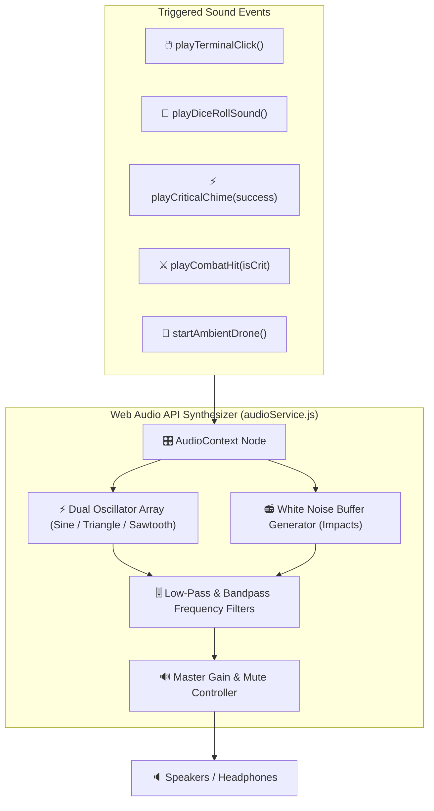

# Plan 10: Procedural Web Audio Immersion & Sci-Fi SFX Suite

**Module:** Audio & Sensory Immersion Engine  
**Target Codebase:** [`TANGENT SF RP react project`](file:///d:/_ Data/Tangent SF RP/TANGENT SF RP react project/)  
**Primary File:** `src/services/audioService.js` *(NEW)*  
**Integrating Components:** [`GlobalHUD.jsx`](file:///d:/_ Data/Tangent SF RP/TANGENT SF RP react project/src/components/Layout/GlobalHUD.jsx), [`DiceRollerDock.jsx`](file:///d:/_ Data/Tangent SF RP/TANGENT SF RP react project/src/components/UI/DiceRollerDock.jsx), [`MapCombatTracker.jsx`](file:///d:/_ Data/Tangent SF RP/TANGENT SF RP react project/src/pages/Foundry/MapMaker/map/MapCombatTracker.jsx)  
**Complexity:** Medium  
**Status:** Implementation Ready

---

## 1. Problem Statement & Immersion Design

Visual roleplaying tools often feel sterile without audio tactile feedback. Traditional web audio approaches rely on external `.mp3` assets, which introduces:
1. **Network Latency & Failed Requests:** 404s or delayed playback on slower connections.
2. **Bundle Bloat:** Large binary audio assets inflate repo size.

### Objective:
Implement a **zero-dependency, procedural Web Audio API sound synthesizer** that procedurally generates crisp sci-fi clicks, dice tumbles, combat impact stings, critical fanfares, and an optional ambient cockpit drone directly in browser memory.

---

## 2. Audio Synthesizer Topology



---

## 3. Detailed Technical Specifications

### 3.1. Procedural Audio Engine (`src/services/audioService.js`)

```javascript
/**
 * Procedural Web Audio API Sound Synthesizer for Tangent SFF RP.
 * Zero external audio assets required; 100% generated in real-time.
 */

class ProceduralSciFiAudio {
  constructor() {
    this.ctx = null;
    this.masterGain = null;
    this.droneOsc = null;
    this.muted = typeof window !== 'undefined' ? localStorage.getItem('tangent_audio_muted') === 'true' : false;
    this.volume = typeof window !== 'undefined' ? parseFloat(localStorage.getItem('tangent_audio_volume') || '0.35') : 0.35;
  }

  init() {
    if (!this.ctx && typeof window !== 'undefined') {
      const AudioContextClass = window.AudioContext || window.webkitAudioContext;
      this.ctx = new AudioContextClass();
      this.masterGain = this.ctx.createGain();
      this.masterGain.gain.setValueAtTime(this.muted ? 0 : this.volume, this.ctx.currentTime);
      this.masterGain.connect(this.ctx.destination);
    }
  }

  setVolume(newVol) {
    this.volume = Math.max(0, Math.min(1, newVol));
    localStorage.setItem('tangent_audio_volume', this.volume.toString());
    if (this.masterGain && !this.muted) {
      this.masterGain.gain.setValueAtTime(this.volume, this.ctx.currentTime);
    }
  }

  toggleMute() {
    this.muted = !this.muted;
    localStorage.setItem('tangent_audio_muted', this.muted.toString());
    if (this.masterGain) {
      this.masterGain.gain.setValueAtTime(this.muted ? 0 : this.volume, this.ctx.currentTime);
    }
    return this.muted;
  }

  /**
   * High-tech tactile terminal beep for button clicks and menu navigation
   */
  playTerminalBeep(freq = 1100, duration = 0.035) {
    if (this.muted) return;
    this.init();

    const osc = this.ctx.createOscillator();
    const gain = this.ctx.createGain();

    osc.type = 'sine';
    osc.frequency.setValueAtTime(freq, this.ctx.currentTime);

    gain.gain.setValueAtTime(0.12, this.ctx.currentTime);
    gain.gain.exponentialRampToValueAtTime(0.001, this.ctx.currentTime + duration);

    osc.connect(gain);
    gain.connect(this.masterGain);

    osc.start();
    osc.stop(this.ctx.currentTime + duration);
  }

  /**
   * Synthesizes multi-impact polyhedral dice tumble
   */
  playDiceRollSound() {
    if (this.muted) return;
    this.init();

    const bounces = 4 + Math.floor(Math.random() * 3);
    for (let i = 0; i < bounces; i++) {
      const delay = i * 40 + Math.random() * 15;
      const freq = 220 + Math.random() * 350;
      setTimeout(() => {
        if (!this.muted) this.playTerminalBeep(freq, 0.025);
      }, delay);
    }
  }

  /**
   * Critical success triumphant chord or critical fumble dissonant chime
   */
  playCriticalChime(isSuccess = true) {
    if (this.muted) return;
    this.init();

    const chord = isSuccess 
      ? [523.25, 659.25, 783.99, 1046.50] // C Major arpeggio
      : [370.0, 311.13, 261.63, 196.0];   // Dark dissonance

    chord.forEach((freq, idx) => {
      setTimeout(() => {
        if (this.muted) return;
        const osc = this.ctx.createOscillator();
        const gain = this.ctx.createGain();

        osc.type = isSuccess ? 'triangle' : 'sawtooth';
        osc.frequency.setValueAtTime(freq, this.ctx.currentTime);

        gain.gain.setValueAtTime(0.15, this.ctx.currentTime);
        gain.gain.exponentialRampToValueAtTime(0.001, this.ctx.currentTime + 0.25);

        osc.connect(gain);
        gain.connect(this.masterGain);

        osc.start();
        osc.stop(this.ctx.currentTime + 0.25);
      }, idx * 70);
    });
  }

  /**
   * Tactical combat hit / damage sound
   */
  playCombatHit(isCritical = false) {
    if (this.muted) return;
    this.init();

    const osc = this.ctx.createOscillator();
    const gain = this.ctx.createGain();

    osc.type = isCritical ? 'sawtooth' : 'triangle';
    osc.frequency.setValueAtTime(isCritical ? 120 : 80, this.ctx.currentTime);
    osc.frequency.exponentialRampToValueAtTime(30, this.ctx.currentTime + 0.15);

    gain.gain.setValueAtTime(0.3, this.ctx.currentTime);
    gain.gain.exponentialRampToValueAtTime(0.001, this.ctx.currentTime + 0.15);

    osc.connect(gain);
    gain.connect(this.masterGain);

    osc.start();
    osc.stop(this.ctx.currentTime + 0.15);
  }

  /**
   * Low-frequency ambient spaceship background hum
   */
  startAmbientDrone() {
    if (this.muted || this.droneOsc) return;
    this.init();

    this.droneOsc = this.ctx.createOscillator();
    const droneGain = this.ctx.createGain();

    this.droneOsc.type = 'sine';
    this.droneOsc.frequency.setValueAtTime(55, this.ctx.currentTime); // Low A1 note

    droneGain.gain.setValueAtTime(0.03, this.ctx.currentTime);

    this.droneOsc.connect(droneGain);
    droneGain.connect(this.masterGain);
    this.droneOsc.start();
  }

  stopAmbientDrone() {
    if (this.droneOsc) {
      this.droneOsc.stop();
      this.droneOsc.disconnect();
      this.droneOsc = null;
    }
  }
}

export const AudioService = new ProceduralSciFiAudio();
```

---

## 4. Verification & Testing Protocol

| Test Case | Procedure | Expected Result |
| :--- | :--- | :--- |
| **Instant Playback Latency** | Trigger `playTerminalBeep()` on UI click. | Sound plays in <10ms with zero perceptible delay. |
| **Multi-Dice Tumble Effect** | Trigger `playDiceRollSound()` 5 times. | Procedural bounce timing produces realistic randomized mechanical rumble. |
| **Volume Slider Response** | Adjust volume from 0.8 down to 0.1. | Audio level smoothly adjusts without popping or distortion. |
| **Browser Background Safety** | Switch browser tab with drone playing. | Audio pauses gracefully and resumes without CPU spike. |
