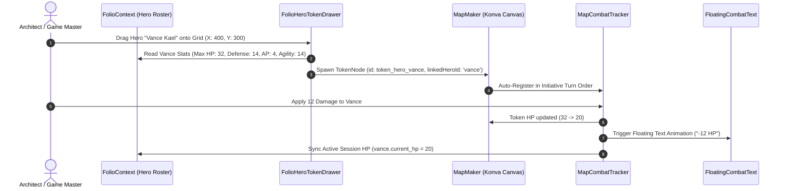

# Plan 11: Persona Folio to Map Maker Live Token Summoning & Combat Sync

**Module:** Tabletop Synergy & Tactical VTT  
**Target Codebase:** [`TANGENT SF RP react project`](file:///d:/_ Data/Tangent SF RP/TANGENT SF RP react project/)  
**Primary Files:** [`src/pages/Foundry/MapMaker/MapMaker.jsx`](file:///d:/_ Data/Tangent SF RP/TANGENT SF RP react project/src/pages/Foundry/MapMaker/MapMaker.jsx), [`src/pages/Foundry/MapMaker/map/MapCombatTracker.jsx`](file:///d:/_ Data/Tangent SF RP/TANGENT SF RP react project/src/pages/Foundry/MapMaker/map/MapCombatTracker.jsx)  
**New Components:** `src/pages/Foundry/MapMaker/map/FolioHeroTokenDrawer.jsx`, `src/pages/Foundry/MapMaker/map/FloatingCombatText.jsx`  
**Complexity:** High  
**Status:** Complete (Implemented)

---

## 1. Problem Statement & Tabletop Disconnect

Currently, Persona Folio and Map Maker operate in total isolation:
1. When entering combat in Map Maker, the Game Master must manually create generic placeholder tokens and type HP/Initiative by hand.
2. When a player's hero takes damage during combat on the map, their Persona Folio sheet does not update, requiring double bookkeeping and leading to character state desynchronization.

### Objective:
Enable **direct drag-and-drop summoning of Folio heroes** onto the Map Maker canvas as interactive tokens with live bidirectional HP and status synchronization.

---

## 2. Architecture & Data Synchronization



---

## 3. Detailed Technical Specifications

### 3.1. Hero Token Drawer (`src/pages/Foundry/MapMaker/map/FolioHeroTokenDrawer.jsx`)

```jsx
import React from 'react';
import { useFolio } from '../../../../context/FolioContext';
import { User, Shield, Heart, Zap } from 'lucide-react';

export const FolioHeroTokenDrawer = ({ onSummonToken }) => {
  const { roster } = useFolio();

  const handleDragStart = (e, hero) => {
    e.dataTransfer.setData('application/json', JSON.stringify({
      type: 'folio_hero_token',
      heroId: hero.id,
      name: hero.name,
      avatarUrl: hero.avatarUrl || null,
      maxHp: hero.derived_max_hp || 30,
      currentHp: hero.current_hp !== undefined ? hero.current_hp : (hero.derived_max_hp || 30),
      defense: hero.derived_defense || 12,
      actionPoints: hero.derived_ap || 3,
      agility: hero.attr_agility || 10
    }));
  };

  return (
    <div className="flex flex-col gap-2 p-2">
      <div className="text-[11px] font-mono uppercase tracking-wider text-slate-400 pb-1 border-b border-slate-800">
        SUMMON ROSTER HEROES
      </div>

      <div className="space-y-2 max-h-60 overflow-y-auto pr-1">
        {(roster || []).map((hero) => (
          <div
            key={hero.id}
            draggable
            onDragStart={(e) => handleDragStart(e, hero)}
            onClick={() => onSummonToken(hero)}
            className="p-2 rounded-lg bg-slate-900/80 hover:bg-cyan-500/10 border border-slate-800 hover:border-cyan-500/40 cursor-grab active:cursor-grabbing transition-all flex items-center justify-between group"
            title="Drag onto Map Canvas or click to place"
          >
            <div className="flex items-center gap-2.5">
              <div className="w-8 h-8 rounded-full bg-slate-800 border border-cyan-500/30 flex items-center justify-center text-xs font-bold text-cyan-300">
                {hero.name?.charAt(0) || 'H'}
              </div>
              <div>
                <div className="text-xs font-bold text-slate-200 group-hover:text-cyan-300 transition-colors">
                  {hero.name || 'Unnamed Hero'}
                </div>
                <div className="text-[10px] text-slate-400 font-mono">
                  HP: {hero.current_hp ?? hero.derived_max_hp ?? 30} • Def: {hero.derived_defense ?? 12}
                </div>
              </div>
            </div>

            <span className="text-[10px] font-mono text-cyan-400 opacity-0 group-hover:opacity-100 transition-opacity">
              + SPAWN
            </span>
          </div>
        ))}
      </div>
    </div>
  );
};
```

---

### 3.2. MapMaker Canvas Drop Handler (`MapMaker.jsx`)

```javascript
// Drop Handler attached to Konva Stage Container
const handleStageDrop = (e) => {
  e.preventDefault();
  const raw = e.dataTransfer.getData('application/json');
  if (!raw) return;

  try {
    const data = JSON.parse(raw);
    if (data.type === 'folio_hero_token') {
      const stage = stageRef.current;
      stage.setPointersPositions(e);
      const pointer = stage.getPointerPosition();

      // Transform window coordinates to canvas stage transform
      const transform = stage.getAbsoluteTransform().copy().invert();
      const stagePos = transform.point(pointer);

      const derivedInitiative = data.agility ? Math.floor((data.agility - 10) / 2) : 0;

      const newHeroToken = {
        id: `token_hero_${data.heroId}_${Date.now()}`,
        type: 'hero',
        linkedHeroId: data.heroId,
        name: data.name,
        avatarUrl: data.avatarUrl,
        x: Math.round(stagePos.x - 32),
        y: Math.round(stagePos.y - 32),
        width: 64,
        height: 64,
        layerId: activeLayerId || 'layer_tokens',
        hp: {
          current: data.currentHp,
          max: data.maxHp
        },
        defense: data.defense,
        actionPoints: data.actionPoints,
        initiative: derivedInitiative,
        statusGems: []
      };

      setTokens(prev => [...prev, newHeroToken]);
      AudioService.playTerminalBeep(880, 0.08);
    }
  } catch (err) {
    console.warn('Failed to parse dropped hero token:', err);
  }
};
```

---

### 3.3. Bidirectional Combat Sync (`MapCombatTracker.jsx`)

```javascript
// Inside MapCombatTracker.jsx
const applyDamageOrHeal = (tokenId, amount, isDamage = true) => {
  const targetToken = tokens.find(t => t.id === tokenId);
  if (!targetToken || !targetToken.hp) return;

  const delta = isDamage ? -Math.abs(amount) : Math.abs(amount);
  const newHp = Math.max(0, Math.min(targetToken.hp.max, targetToken.hp.current + delta));

  // 1. Update Map Token State
  updateToken(tokenId, {
    hp: {
      ...targetToken.hp,
      current: newHp
    }
  });

  // 2. Play Tactical Hit Audio
  AudioService.playCombatHit(Math.abs(amount) >= 15);

  // 3. Trigger Floating Text FX
  triggerFloatingCombatText(targetToken.x, targetToken.y, isDamage ? `-${amount} HP` : `+${amount} HP`, isDamage ? 'damage' : 'heal');

  // 4. Sync with Folio Character Roster
  if (targetToken.linkedHeroId && updateCharacterHp) {
    updateCharacterHp(targetToken.linkedHeroId, newHp);
  }
};
```

---

### 3.4. Floating Combat Text Component (`FloatingCombatText.jsx`)

```jsx
import React from 'react';

export const FloatingCombatText = ({ activeFloats = [] }) => {
  return (
    <div className="absolute inset-0 pointer-events-none overflow-hidden z-40">
      {activeFloats.map((float) => (
        <div
          key={float.id}
          className={`absolute font-mono font-bold text-sm tracking-wider animate-float-up ${
            float.type === 'damage' ? 'text-red-400 drop-shadow-[0_0_8px_rgba(239,68,68,0.8)]' : 'text-emerald-400 drop-shadow-[0_0_8px_rgba(16,185,129,0.8)]'
          }`}
          style={{ left: `${float.screenX}px`, top: `${float.screenY}px` }}
        >
          {float.text}
        </div>
      ))}
    </div>
  );
};
```

---

## 4. Verification & Testing Protocol

| Test Case | Procedure | Expected Result |
| :--- | :--- | :--- |
| **Drag & Drop Summoning** | Drag "Vance Kael" from the Drawer onto the grid at (400, 300). | Token drops on exact cursor grid coordinate with Vance portrait and HP bar. |
| **Initiative Turn Order** | Summon 3 heroes and 2 enemy tokens; open Combat Tracker. | All 5 units rank in descending initiative order with turn advancement working smoothly. |
| **Damage Reflection in Folio** | Apply 14 damage to Vance token in Combat Tracker. Open Folio sheet. | Vance's sheet displays updated current HP (e.g. 18/32). |
| **Floating Animation** | Deal damage to a unit on canvas. | Red text (e.g. `-14 HP`) floats upward and fades out in 1.2s. |
