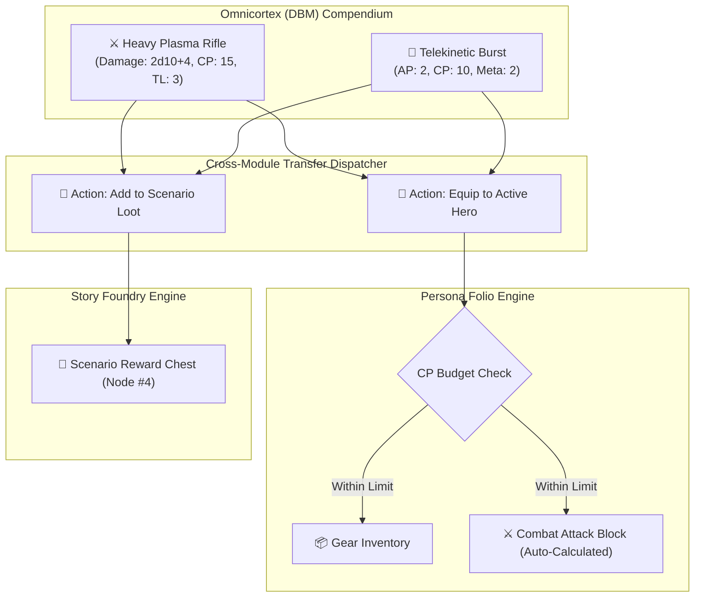

# Plan 12: Omnicortex DBM 1-Click Item Importer & Cross-Module Gear/Power Exporter

**Module:** Omnicortex & Character Gear Bridge  
**Target Codebase:** [`TANGENT SF RP react project`](file:///d:/_ Data/Tangent SF RP/TANGENT SF RP react project/)  
**Primary Files:** [`src/components/DBM/DBMItemModal.jsx`](file:///d:/_ Data/Tangent SF RP/TANGENT SF RP react project/src/components/DBM/DBMItemModal.jsx), [`src/components/Folio/tabs/CombatGearTab.jsx`](file:///d:/_ Data/Tangent SF RP/TANGENT SF RP react project/src/components/Folio/tabs/CombatGearTab.jsx)  
**Supporting Files:** [`src/components/DBM/DBMTableView.jsx`](file:///d:/_ Data/Tangent SF RP/TANGENT SF RP react project/src/components/DBM/DBMTableView.jsx), [`src/context/FolioContext.jsx`](file:///d:/_ Data/Tangent SF RP/TANGENT SF RP react project/src/context/FolioContext.jsx)  
**Complexity:** Medium  
**Status:** Implementation Ready

---

## 1. Problem Statement & Manual Entry Inefficiencies

Omnicortex holds extensive databases of Equipment, Weapons, Armor, Cybernetics, and Psionic abilities. However, when players create characters in Persona Folio or Game Masters design scenario treasure chests in Story Foundry, they are forced to manually copy and paste:
1. Item names, damage formulas (`2d10+6`), armor ratings, and range increments.
2. CP (Character Point) costs and Tech/Meta level prerequisites.

### Objective:
Implement a **1-click transfer and drag-and-drop pipeline** allowing any item or power in Omnicortex (DBM) to be instantly equipped to active hero sheets or inserted into scenario treasure caches with automated CP budget calculation.

---

## 2. Architecture & Data Transfer Protocol



---

## 3. Detailed Technical Specifications

### 3.1. DBM Item Quick-Action Bar (`src/components/DBM/DBMItemModal.jsx`)

Add the transfer bar to [`DBMItemModal.jsx`](file:///d:/_ Data/Tangent SF RP/TANGENT SF RP react project/src/components/DBM/DBMItemModal.jsx):

```jsx
import React, { useState } from 'react';
import { useFolio } from '../../context/FolioContext';
import { useStory } from '../../context/CampaignContext';
import { Backpack, Gem, Check, AlertCircle } from 'lucide-react';
import { AudioService } from '../../services/audioService';

export const DBMItemTransferBar = ({ item, categoryKey }) => {
  const { activeCharacter, addItemToInventory, addAbility } = useFolio() || {};
  const { universeState, updateScenario } = useStory() || {};

  const [transferStatus, setTransferStatus] = useState(null); // 'hero_success' | 'scenario_success' | 'cp_warning'

  const activeHeroName = activeCharacter?.name || 'Active Hero';

  const handleEquipToHero = () => {
    if (!activeCharacter) {
      alert('No active character selected in Persona Folio.');
      return;
    }

    const isPsionicOrCyber = categoryKey === 'psionics' || categoryKey === 'cybernetics';

    if (isPsionicOrCyber && addAbility) {
      addAbility({
        id: `power_${Date.now()}`,
        name: item.name,
        type: categoryKey,
        metaLevel: item.metaLevel || item.level || 1,
        apCost: item.apCost || 2,
        description: item.description || '',
        cpCost: parseInt(item.cpCost || item.cp || 5, 10)
      });
    } else if (addItemToInventory) {
      addItemToInventory({
        id: `item_${Date.now()}`,
        name: item.name,
        category: categoryKey,
        damage: item.damage || '',
        armor: item.armor || 0,
        weight: item.weight || 1,
        techLevel: item.techLevel || item.tl || 1,
        cpCost: parseInt(item.cpCost || item.cp || 5, 10),
        notes: item.description || ''
      });
    }

    AudioService.playTerminalBeep(1200, 0.05);
    setTransferStatus('hero_success');
    setTimeout(() => setTransferStatus(null), 3000);
  };

  const handleAddToScenarioLoot = () => {
    const activeScenario = universeState?.scenarios?.[0];
    if (!activeScenario) {
      alert('No active story scenario found in Story Foundry.');
      return;
    }

    const existingLoot = activeScenario.fields?.rewards || '';
    const updatedLoot = existingLoot 
      ? `${existingLoot}\n- ${item.name} (${categoryKey})` 
      : `- ${item.name} (${categoryKey})`;

    updateScenario(activeScenario.id, {
      fields: {
        ...(activeScenario.fields || {}),
        rewards: updatedLoot
      }
    });

    AudioService.playTerminalBeep(1000, 0.05);
    setTransferStatus('scenario_success');
    setTimeout(() => setTransferStatus(null), 3000);
  };

  return (
    <div className="flex items-center gap-3 pt-4 border-t border-slate-800 select-none">
      {/* Equip to Hero */}
      <button
        onClick={handleEquipToHero}
        className="flex-1 py-2 px-3 bg-cyan-600/90 hover:bg-cyan-500 text-white font-bold text-xs rounded-lg flex items-center justify-center gap-2 transition-all shadow-md"
      >
        <Backpack size={15} />
        <span>Equip to {activeHeroName}</span>
      </button>

      {/* Add to Scenario Rewards */}
      <button
        onClick={handleAddToScenarioLoot}
        className="flex-1 py-2 px-3 bg-amber-600/90 hover:bg-amber-500 text-white font-bold text-xs rounded-lg flex items-center justify-center gap-2 transition-all shadow-md"
      >
        <Gem size={15} />
        <span>Add to Scenario Loot</span>
      </button>

      {/* Status Feedback */}
      {transferStatus === 'hero_success' && (
        <span className="text-xs font-mono text-emerald-400 flex items-center gap-1">
          <Check size={14} /> Equipped!
        </span>
      )}
      {transferStatus === 'scenario_success' && (
        <span className="text-xs font-mono text-amber-400 flex items-center gap-1">
          <Check size={14} /> Added to Loot!
        </span>
      )}
    </div>
  );
};
```

---

### 3.2. Integration into Folio `CombatGearTab.jsx`

When an item is added to inventory, [`CombatGearTab.jsx`](file:///d:/_ Data/Tangent SF RP/TANGENT SF RP react project/src/components/Folio/tabs/CombatGearTab.jsx) dynamically renders an active weapon attack roll button:

```jsx
// Attack block rendering inside CombatGearTab.jsx
{inventory.filter(i => i.damage).map((weapon) => (
  <div key={weapon.id} className="p-3 bg-slate-900/60 rounded-lg border border-slate-800 flex items-center justify-between">
    <div>
      <div className="font-bold text-sm text-cyan-300">{weapon.name}</div>
      <div className="text-xs text-slate-400 font-mono">
        Damage: <span className="text-amber-400 font-bold">{weapon.damage}</span> • TL: {weapon.techLevel}
      </div>
    </div>

    <button
      onClick={() => {
        rollDice(weapon.damage, { characterName: activeCharacter.name, label: `${weapon.name} Attack` });
      }}
      className="px-3 py-1 bg-amber-600 hover:bg-amber-500 text-white font-bold text-xs rounded uppercase font-mono transition-colors"
    >
      🎲 Roll Damage
    </button>
  </div>
))}
```

---

## 4. Verification & Testing Protocol

| Test Case | Procedure | Expected Result |
| :--- | :--- | :--- |
| **1-Click Weapon Equip** | In DBM, click "Equip to Vance" on "Heavy Plasma Rifle". Open Folio. | Item appears in Vance's inventory; CP budget updates; attack damage button is ready. |
| **1-Click Loot Chest** | In DBM, click "Add to Scenario Loot" on "Crystalline Psi Core". Open Story Module. | Scenario Node #1 rewards field updates with the item entry. |
| **Audio Confirmation** | Transfer item. | Terminal success beep plays immediately. |
