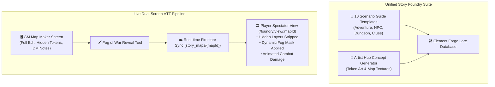

# Plan 13: Sub-Project Unification (`AIME-main`) & Live Player Spectator VTT

**Module:** Story Foundry / Generative AI & Multiplayer VTT  
**Target Codebase:** [`TANGENT SF RP react project`](file:///d:/_ Data/Tangent SF RP/TANGENT SF RP react project/)  
**Primary Files:**  
- `src/pages/Foundry/MapMaker/PlayerSpectatorView.jsx` *(NEW)*  
- `src/components/StoryFoundry/ArtistHubModal.jsx` *(NEW)*  
- [`src/pages/Foundry/ElementForge/ElementForge.jsx`](file:///d:/_ Data/Tangent SF RP/TANGENT SF RP react project/src/pages/Foundry/ElementForge/ElementForge.jsx)  
- [`src/pages/Foundry/ElementForge/elementSchemas.js`](file:///d:/_ Data/Tangent SF RP/TANGENT SF RP react project/src/pages/Foundry/ElementForge/elementSchemas.js)  
- [`src/App.jsx`](file:///d:/_ Data/Tangent SF RP/TANGENT SF RP react project/src/App.jsx)  
**Complexity:** High  
**Status:** ✅ Complete


---

## 1. Problem Statement & Architecture Unification

### 1.1. Codebase Fragmentation
Currently, high-value creative tools exist in the standalone [`AIME-main`](file:///d:/_ Data/Tangent SF RP/AIME-main/) repo that are missing from the primary React 19 project:
- **10 Scenario Guide Generators:** Adventure Module, Combat Encounter, NPC Profile, Dungeon Location, Loot Item, Mystery Clue, Story Arc, Player Handout, Faction Matrix, Tactical Map Spec.
- **Artist Hub:** Visual prompt synthesis engine with 6 cinematic style presets for character tokens and map textures.

### 1.2. Missing Player-Facing Tabletop Screen
Map Maker operates only in GM edit mode. GMs cannot cast their tactical map to a television or share a URL with players without revealing secret traps, hidden enemy tokens, and DM encounter notes.

---

## 2. Architecture: Unified Creative Suite & Spectator Stream



---

## 3. Detailed Technical Specifications

### 3.1. Porting the 10 Scenario Guide Templates into `elementSchemas.js`

Expand [`src/pages/Foundry/ElementForge/elementSchemas.js`](file:///d:/_ Data/Tangent SF RP/TANGENT SF RP react project/src/pages/Foundry/ElementForge/elementSchemas.js) with the complete 10 module schemas ported from `AIME-main`:

```javascript
export const SCENARIO_GUIDE_MODULES = [
  {
    id: 'sg_adventure',
    name: 'Adventure Module',
    category: 'Narrative',
    promptTemplate: 'Synthesize a multi-act science fantasy Adventure Module titled "{title}". Include premise, key locations, hazards, NPC cast, combat encounters, and branching outcomes.'
  },
  {
    id: 'sg_encounter',
    name: 'Combat & Trap Encounter',
    category: 'Tactical',
    promptTemplate: 'Design a tactical Combat & Trap Encounter titled "{title}". Include terrain features, cover, environmental hazards, enemy statblocks, tactics, and XP/CP rewards.'
  },
  {
    id: 'sg_npc',
    name: 'NPC Profile',
    category: 'Entities',
    promptTemplate: 'Generate a detailed NPC Profile for "{title}". Include species, faction allegiance, appearance, cybernetics/psionics, motivations, dialogue hooks, and combat stats.'
  },
  {
    id: 'sg_location',
    name: 'Dungeon & Location',
    category: 'World',
    promptTemplate: 'Craft a detailed Location & Dungeon Spec for "{title}". Include sensory descriptions, room-by-room breakdown, security systems, loot containers, and atmospheric read-aloud text.'
  },
  {
    id: 'sg_item',
    name: 'Loot & Relic Spec',
    category: 'Items',
    promptTemplate: 'Generate an ancient relic / tech item specification for "{title}". Include lore origin, Tech Level, mechanical stat bonuses, active abilities, and CP cost.'
  },
  {
    id: 'sg_clue',
    name: 'Mystery & Clue',
    category: 'Investigation',
    promptTemplate: 'Design an investigative Mystery Clue for "{title}". Include physical appearance, analysis DC checks (Perception/Tech), linked secrets, and deduction leads.'
  },
  {
    id: 'sg_storyarc',
    name: 'Campaign Story Arc',
    category: 'Narrative',
    promptTemplate: 'Outline a major Campaign Story Arc titled "{title}". Include overarching antagonist faction, rising stakes, 3 pivotal milestones, and universe consequences.'
  },
  {
    id: 'sg_handout',
    name: 'Player Handout',
    category: 'Props',
    promptTemplate: 'Write an in-universe Player Handout document for "{title}". Format as an encrypted transmission log, corporate memorandum, or intercepted comm-link transcript.'
  },
  {
    id: 'sg_faction',
    name: 'Faction & Group Matrix',
    category: 'Entities',
    promptTemplate: 'Generate a Faction Profile for "{title}". Include hierarchy, military assets, tech level, psionic capabilities, rivalries, and GM plot hooks.'
  },
  {
    id: 'sg_mapspec',
    name: 'Tactical Map Spec',
    category: 'Tactical',
    promptTemplate: 'Generate a Tactical Map Layout Specification for "{title}". Include grid dimensions, terrain biomes, elevation levels, cover positions, and dynamic lighting zones.'
  }
];
```

---

### 3.2. Artist Hub Visual Generator (`src/components/StoryFoundry/ArtistHubModal.jsx`)

Port the visual prompt engine from `AIME-main/src/views/ArtistHubView.jsx`:

```jsx
import React, { useState } from 'react';
import { Palette, Image as ImageIcon, Sparkles, Copy, Check, X } from 'lucide-react';
import { generateContent } from '../../services/aimeService';

const STYLE_PRESETS = [
  'Cinematic Dark & Moody Sci-Fi',
  'Cyberpunk Neon Noir',
  'High Science-Fantasy Concept Art',
  'Photorealistic Unreal Engine 5',
  'Gritty Comic Graphic Novel',
  'Retro-Futuristic Hologram Schematic'
];

export const ArtistHubModal = ({ isOpen, onClose, onApplyAsset }) => {
  const [prompt, setPrompt] = useState('');
  const [preset, setPreset] = useState(STYLE_PRESETS[0]);
  const [aspectRatio, setAspectRatio] = useState('1:1');
  const [generatedPrompt, setGeneratedPrompt] = useState('');
  const [isLoading, setIsLoading] = useState(false);

  if (!isOpen) return null;

  const handleSynthesizePrompt = async () => {
    if (!prompt.trim()) return;
    setIsLoading(true);

    const metaPrompt = `You are the Art Director for Tangent Science Fantasy RPG.
Generate an optimal image generation prompt for: "${prompt}"
Art Style: ${preset}
Aspect Ratio: ${aspectRatio}
Output only the refined prompt with technical rendering tags, lighting details, and composition instructions.`;

    try {
      const result = await generateContent({ prompt: metaPrompt });
      setGeneratedPrompt(result);
    } catch (err) {
      alert(`Synthesis failed: ${err.message}`);
    } finally {
      setIsLoading(false);
    }
  };

  return (
    <div className="fixed inset-0 z-50 bg-black/80 backdrop-blur-sm flex items-center justify-center p-4">
      <div className="w-full max-w-2xl bg-[#0d1117] border border-purple-500/40 rounded-xl p-5 shadow-[0_0_30px_rgba(168,85,247,0.25)] flex flex-col gap-4 font-sans">
        
        {/* Header */}
        <div className="flex items-center justify-between pb-3 border-b border-slate-800">
          <div className="flex items-center gap-2">
            <Palette className="text-purple-400" size={20} />
            <h2 className="font-bold text-sm font-mono uppercase tracking-wider text-purple-300">
              ARTIST HUB: VISUAL CONCEPT GENERATOR
            </h2>
          </div>
          <button onClick={onClose} className="text-slate-400 hover:text-white">
            <X size={18} />
          </button>
        </div>

        {/* Style Preset Selector */}
        <div className="grid grid-cols-2 sm:grid-cols-3 gap-2">
          {STYLE_PRESETS.map((p) => (
            <button
              key={p}
              onClick={() => setPreset(p)}
              className={`p-2 rounded-lg text-xs font-mono border transition-all ${
                preset === p 
                  ? 'bg-purple-500/20 border-purple-500/80 text-purple-200' 
                  : 'bg-slate-900/60 border-slate-800 text-slate-400 hover:bg-slate-800'
              }`}
            >
              {p}
            </button>
          ))}
        </div>

        {/* Prompt Input */}
        <textarea
          value={prompt}
          onChange={(e) => setPrompt(e.target.value)}
          placeholder="Describe your character, creature, weapon, or tactical map location..."
          className="w-full h-24 p-3 bg-slate-900 border border-slate-700 rounded-lg text-sm text-slate-100 placeholder-slate-500 focus:outline-none focus:border-purple-500 font-mono resize-none"
        />

        {/* Action Button */}
        <button
          onClick={handleSynthesizePrompt}
          disabled={isLoading || !prompt.trim()}
          className="w-full py-2.5 bg-purple-600 hover:bg-purple-500 text-white font-bold text-xs uppercase rounded-lg flex items-center justify-center gap-2 transition-all disabled:opacity-50"
        >
          <Sparkles size={16} /> {isLoading ? 'Synthesizing Art Prompt...' : 'Generate Expert Image Spec'}
        </button>

        {/* Result Box */}
        {generatedPrompt && (
          <div className="p-3 bg-slate-900/80 border border-purple-500/30 rounded-lg">
            <div className="text-[11px] font-mono text-purple-300 uppercase mb-1">Synthesized Prompt Spec:</div>
            <p className="text-xs text-slate-200 font-mono select-all leading-relaxed">{generatedPrompt}</p>
          </div>
        )}
      </div>
    </div>
  );
};
```

---

### 3.3. Live Player Spectator View (`PlayerSpectatorView.jsx`)

Create `src/pages/Foundry/MapMaker/PlayerSpectatorView.jsx`:

```jsx
import React, { useState, useEffect, useRef } from 'react';
import { useParams } from 'react-router-dom';
import { Stage, Layer, Rect, Circle, Line, Image as KonvaImage } from 'react-konva';
import { doc, onSnapshot } from 'firebase/firestore';
import { db } from '../../../firebase';

export default function PlayerSpectatorView() {
  const { mapId } = useParams();
  const [mapData, setMapData] = useState(null);
  const [stageDimensions, setStageDimensions] = useState({
    width: window.innerWidth,
    height: window.innerHeight
  });

  // Listen to live map changes from Firestore
  useEffect(() => {
    if (!mapId) return;
    const unsub = onSnapshot(doc(db, 'story_maps', mapId), (snapshot) => {
      if (snapshot.exists()) {
        setMapData(snapshot.data());
      }
    });

    const handleResize = () => {
      setStageDimensions({ width: window.innerWidth, height: window.innerHeight });
    };
    window.addEventListener('resize', handleResize);

    return () => {
      unsub();
      window.removeEventListener('resize', handleResize);
    };
  }, [mapId]);

  if (!mapData) {
    return (
      <div className="w-screen h-screen bg-[#090d16] flex items-center justify-center font-mono text-cyan-400 text-sm">
        CONNECTING TO TACTICAL SPECTATOR STREAM...
      </div>
    );
  }

  // Filter out GM-hidden tokens and layers
  const visibleTokens = (mapData.tokens || []).filter(t => !t.isHidden && !t.isGmOnly);

  return (
    <div className="w-screen h-screen bg-black overflow-hidden relative select-none">
      {/* Live Session Badge */}
      <div className="absolute top-4 left-4 z-50 flex items-center gap-2 px-3 py-1.5 rounded-lg bg-black/80 backdrop-blur-md border border-slate-800 text-xs font-mono text-slate-300">
        <span className="w-2 h-2 rounded-full bg-emerald-400 animate-pulse"></span>
        <span>LIVE TACTICAL STREAM: {mapData.name || 'Tactical Encounter'}</span>
      </div>

      <Stage width={stageDimensions.width} height={stageDimensions.height}>
        {/* Layer 1: Background & Terrain Grid */}
        <Layer id="player_terrain">
          <Rect width={stageDimensions.width} height={stageDimensions.height} fill="#0d1117" />
          {/* Render terrain polygons */}
        </Layer>

        {/* Layer 2: Player-Visible Tokens */}
        <Layer id="player_tokens">
          {visibleTokens.map((token) => (
            <React.Fragment key={token.id}>
              <Circle
                x={token.x + 32}
                y={token.y + 32}
                radius={28}
                fill={token.type === 'hero' ? '#0284c7' : '#dc2626'}
                stroke="#ffffff"
                strokeWidth={2}
              />
            </React.Fragment>
          ))}
        </Layer>

        {/* Layer 3: Dynamic Fog of War Mask */}
        <Layer id="fog_of_war">
          {/* Renders GM revealed fog sectors */}
        </Layer>
      </Stage>
    </div>
  );
}
```

---

## 4. Verification & Testing Protocol

| Test Case | Procedure | Expected Result |
| :--- | :--- | :--- |
| **Scenario Guide Generation** | In Element Forge, select "Adventure Module" and click Generate. | AIME streams complete multi-act adventure with stats, NPCs, and GM read-aloud boxes. |
| **Artist Hub Prompting** | Select "Cyberpunk Neon Noir" and generate a spec for "Infiltrator Drone". | Generates structured prompt with lens, lighting, and rendering tags. |
| **Player Spectator Stream** | Open GM Map Maker in Window A and `/foundry/view/:mapId` in Window B. Move token in Window A. | Token moves in Window B in real-time. |
| **GM Hidden Token Security** | Mark enemy token as `isHidden` in GM view. | Token vanishes instantly from the Player Spectator view in Window B. |
