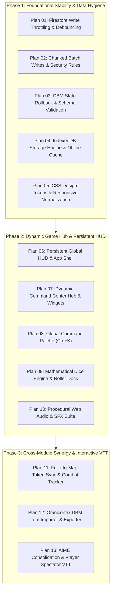

# Tangent SFF RP — 13 Modular Implementation Plans

**Master Execution Roadmap for AI & Engineer Implementation**  
**Target Codebase:** [`TANGENT SF RP react project`](file:///d:/_ Data/Tangent SF RP/TANGENT SF RP react project/)  
**Total Plans:** 13 Detailed Technical Specifications

---

## 🗺️ Master Plan Index

---

## 📑 Phase 1: Foundational Stability, Data Layer & Styling

| Plan # | Plan Document | Key Deliverables & Scope |
| :---: | :--- | :--- |
| **01** | [Plan 01: Firestore Write Throttling & Debouncing](file:///d:/_ Data/Tangent SF RP/TANGENT SF RP react project/docs/plans/PLAN_01_FIRESTORE_WRITE_THROTTLING_AND_DEBOUNCING.md) | 1.5s debounced cloud saver queue in `CampaignContext`, save status state machine, window `beforeunload` lifecycle flush. |
| **02** | [Plan 02: Chunked Batch Writes & Security Rules](file:///d:/_ Data/Tangent SF RP/TANGENT SF RP react project/docs/plans/PLAN_02_CHUNKED_BATCH_WRITES_AND_SECURITY_RULES.md) | 450-op batch chunking utility `commitChunkedBatches`, hardened Firestore rules for `story_elements` and `story_maps`. |
| **03** | [Plan 03: DBM State Rollback & Schema Validation](file:///d:/_ Data/Tangent SF RP/TANGENT SF RP react project/docs/plans/PLAN_03_DBM_STATE_ROLLBACK_AND_SCHEMA_VALIDATION.md) | `useRef` snapshot rollbacks in `DBMContext`, runtime schema validator before writes, error toast surfacing. |
| **04** | [Plan 04: IndexedDB Storage Engine & Offline Cache](file:///d:/_ Data/Tangent SF RP/TANGENT SF RP react project/docs/plans/PLAN_04_INDEXEDDB_STORAGE_ENGINE_AND_OFFLINE_CACHE.md) | High-capacity async `StorageService` replacing fragile 5MB `localStorage` blobs for maps, scenarios, and rosters. |
| **05** | [Plan 05: CSS Design Tokens & Responsive Normalization](file:///d:/_ Data/Tangent SF RP/TANGENT SF RP react project/docs/plans/PLAN_05_CSS_DESIGN_TOKENS_AND_RESPONSIVE_NORMALIZATION.md) | Central `design-tokens.css`, consolidating duplicate `:root` variables, responsive layout breakpoints. |

---

## 📑 Phase 2: Dynamic Game Hub, Global HUD, Dice & Audio Engine

| Plan # | Plan Document | Key Deliverables & Scope |
| :---: | :--- | :--- |
| **06** | [Plan 06: Persistent Global HUD & App Shell](file:///d:/_ Data/Tangent SF RP/TANGENT SF RP react project/docs/plans/PLAN_06_PERSISTENT_GLOBAL_HUD_AND_APP_SHELL.md) | Persistent 56px top HUD across all views, dynamic breadcrumbs, user badge, quick controls dock. |
| **07** | [Plan 07: Dynamic Command Center Hub & Widgets](file:///d:/_ Data/Tangent SF RP/TANGENT SF RP react project/docs/plans/PLAN_07_DYNAMIC_COMMAND_CENTER_HUB_AND_WIDGETS.md) | Redesigned `Home.jsx` with Active Campaign Widget, Party at a Glance carousel, Transmission Feed, live counter badges. |
| **08** | [Plan 08: Global Command Palette (`Ctrl+K`)](file:///d:/_ Data/Tangent SF RP/TANGENT SF RP react project/docs/plans/PLAN_08_GLOBAL_COMMAND_PALETTE_CTRL_K.md) | Omni-search modal indexing DBM items, characters, maps, story nodes, with in-line `/roll` and slash commands. |
| **09** | [Plan 09: Mathematical Dice Engine & Roller Dock](file:///d:/_ Data/Tangent SF RP/TANGENT SF RP react project/docs/plans/PLAN_09_MATHEMATICAL_DICE_ENGINE_AND_ROLLER_DOCK.md) | Polyhedral dice parser (`2d10+4`, `d20`, `d100`, exploding dice, TN margins) and floating collapsible dice tray dock. |
| **10** | [Plan 10: Procedural Web Audio & SFX Suite](file:///d:/_ Data/Tangent SF RP/TANGENT SF RP react project/docs/plans/PLAN_10_PROCEDURAL_WEB_AUDIO_AND_SFX_SUITE.md) | Zero-dependency procedural Web Audio API sound synthesizer for tactile UI clicks, dice tumbles, and critical fanfares. |

---

## 📑 Phase 3: Cross-Module Synergy & Interactive VTT

| Plan # | Plan Document | Key Deliverables & Scope |
| :---: | :--- | :--- |
| **11** | [Plan 11: Folio-to-Map Token Sync & Combat Tracker](file:///d:/_ Data/Tangent SF RP/TANGENT SF RP react project/docs/plans/PLAN_11_FOLIO_TO_MAP_TOKEN_SYNC_AND_COMBAT_TRACKER.md) | Drag-and-drop hero summoning from Folio roster onto Map Maker canvas, two-way HP sync, floating damage text. |
| **12** | [Plan 12: Omnicortex DBM Item Importer & Exporter](file:///d:/_ Data/Tangent SF RP/TANGENT SF RP react project/docs/plans/PLAN_12_OMNICORTEX_DBM_ITEM_IMPORTER_AND_EXPORTER.md) | 1-Click "Equip to Hero" and "Add to Scenario Loot" actions on DBM item cards with automated CP budget math. |
| **13** | [Plan 13: AIME Consolidation & Player Spectator VTT](file:///d:/_ Data/Tangent SF RP/TANGENT SF RP react project/docs/plans/PLAN_13_AIME_CONSOLIDATION_AND_PLAYER_SPECTATOR_VTT.md) | Port 10 Scenario Guide templates & Artist Hub generator from `AIME-main`, dedicated `/foundry/view/:mapId` player screen with Fog of War. |
