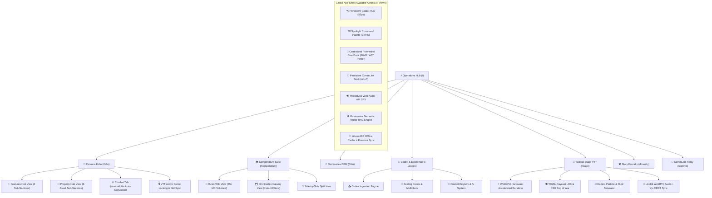

# 🌌 Tangent Science Fantasy Roleplay (TANGENT SFF RP)
## Comprehensive System User Guide & Technical Manual (v2.5+)

---

## 🧭 System Overview & Architecture

**Tangent Science Fantasy Roleplay (TANGENT SFF RP)** is an integrated, cyberpunk/space-opera Virtual Tabletop (VTT), character management suite, rules compendium, mathematical simulation engine, and narrative worldbuilding platform.

Built with **React 18, Vite, Tailwind CSS, Google Firebase (Firestore + Authentication), Web Audio API, and WebGPU / WebGL**, Tangent SFF RP delivers an offline-first, high-performance tactical environment for game masters (Architects) and players (Operators).



---

## 📑 Table of Contents

1. [Chapter 1: Operations Hub & Global HUD Ergonomics](#chapter-1-operations-hub--global-hud-ergonomics)
2. [Chapter 2: Persona Folio & Operative Architecture](#chapter-2-persona-folio--operative-architecture)
3. [Chapter 3: Compendium Suite & Omnicortex Catalogs](#chapter-3-compendium-suite--omnicortex-catalogs)
4. [Chapter 4: Codex Matrix Suite, Economatrix & Ingestion](#chapter-4-codex-matrix-suite-economatrix--ingestion)
5. [Chapter 5: Story Foundry & Story Weaver Scenario Engine](#chapter-5-story-foundry--story-weaver-scenario-engine)
6. [Chapter 6: Tactical Map Maker & Next-Gen VTT Simulation Engine](#chapter-6-tactical-map-maker--next-gen-vtt-simulation-engine)
7. [Chapter 7: AIME Creative Suite, Element Forge & Vector RAG](#chapter-7-aime-creative-suite-element-forge--vector-rag)
8. [Chapter 8: CommLink Quantum Relay & In-Chat Rolls](#chapter-8-commlink-quantum-relay--in-chat-rolls)
9. [Chapter 9: Polyhedral Dice Engine, AST Parser & Hotkeys](#chapter-9-polyhedral-dice-engine-ast-parser--hotkeys)
10. [Chapter 10: Tangent Dual Resolution Mechanics, Combat & Metaphysics](#chapter-10-tangent-dual-resolution-mechanics-combat--metaphysics)
11. [Chapter 11: Locomotion, Rest, Survival & Advancement Systems](#chapter-11-locomotion-rest-survival--advancement-systems)

---

## Chapter 1: Operations Hub & Global HUD Ergonomics

The **Command Operations Hub (`/`)** is the primary mission dashboard and nerve center of Tangent SFF RP.

### 1.1 Core Telemetry & Dashboard Widgets
- **Active Campaign Tracker (`CampaignOpsWidget`)**: Displays the current campaign title, active scenario count, linked sector maps, and quick navigation into Story Foundry.
- **Game Squads & Multiplayer (`GameSquadsWidget`)**: Manages multiplayer game squads, active member rosters, and one-click invite join codes (`?join=GRP-XXXXXX`).
- **Party at a Glance (`PartyStatusWidget`)**: Renders characters loaded from your active Persona Folio roster with live Health and Vitality bars, species lineage badges, Tech Levels, and Build Point (BP/CP) legality status.
- **CommCenter & Transmission Feed (`CommCenterWidget`)**: Live stream of Quantum Relay broadcasts, private operative comms, and dice check rolls with direct reply capabilities.
- **Interactive Preview Drawers (`LandingDrawerArea`)**: Clicking module cards dynamically unfolds operative sheets, scenario trees, map libraries, or lore elements directly on the dashboard without route transitions.

### 1.2 Persistent Global HUD Ergonomics
The standardized **52px top HUD** persists across all routes, providing instant access to mission-critical utilities:
- **Primary Route Navigation**: Instant switching between Operations Hub (`/`), Persona Folio (`/folio`), Compendium Suite (`/compendium`), Omnicortex DBM (`/dbm`), Codex (`/codex`), Tactical Stage VTT (`/stage` / `/vtt`), Story Foundry (`/foundry`), and CommLink (`/comms`).
- **Spotlight Omni-Search (`Ctrl+K` / `Cmd+K`)**: Global search index over heroes, species, weapons, scenarios, lore items, and `/roll` commands.
- **Centralized Dice Roller Dock (`Alt+D`)**: Floating polyhedral dice dock powered by `DiceContext` with one-click polyhedrals (`d4`, `d6`, `d8`, `d10`, `d12`, `d20`, `d100`), AST formula evaluation, advantage/disadvantage toggles, and live channel broadcasting.
- **CommLink Quick Dock (`Alt+C`)**: Slides out the live transmission stream for fast in-game banter without leaving your tactical map.
- **Multiplayer Squad Management (`Users` Icon)**: One-click modal to inspect active team squads, members, and invite tokens.
- **Procedural Web Audio API**: Zero-external-dependency audio synthesizer generating tactile clicks, terminal chirps, dice rolls, and dramatic critical fanfare, with persistent mute toggle (`Volume2` / `VolumeX`).
- **Comprehensive User Guide Modal (`BookOpen` / Help Icon)**: Context-sensitive in-app help modal providing immediate guidance for any active route.

---

## Chapter 2: Persona Folio & Operative Architecture

The **Persona Folio (`/folio`)** is the digital operative sheet manager and character generation suite.

### 2.1 The 150 Build Point (BP / CP) Economy & Ledger
Characters in Tangent SFF RP are created using a strict **150 Build Point (BP)** budget:
- **Starting Budget**: 150 BP (customizable by the Architect for high-powered campaigns).
- **Legality Enforcement**: When expenditures exceed available points, the header flashes an **ILLEGAL BUILD** warning. Clicking the point meter opens a complete line-item ledger (`EconomyModal.jsx`).
- **Point Allocations**:
  - **Ability Scores**: 5 BP per +1 attribute bonus.
  - **Attribute Check Bonuses**: 1 BP per +1 check score.
  - **Skills & Specializations**: Purchase additional skill ranks beyond background packages.
  - **Features & Augmentations**: Special perks, biological modifications, and cyberware.
  - **Hindrances & Flaws**: Select character flaws to receive point rebates back into your pool.
- **Wealth Score (WS) & Auto-Buy**: Derives starting wealth and purchasing thresholds based on economy allocations.

### 2.2 The Three 20-Point Background Skill Pools (`IdentityPoolPulldown.jsx`)
In addition to the 150 BP starting budget, every character receives **three dedicated 20-point Skill Pools** during creation:
1. **Faction Skill Pool (20 SP)**: Ranks allocated strictly among proficiencies granted by the character's primary faction allegiance.
2. **Origin Skill Pool (20 SP)**: Ranks granted by the character's homeworld, habitat, or environmental upbringing.
3. **Occupation Skill Pool (20 SP)**: Ranks defining the operative's career training, professional trade, or tactical specialty.

The interactive `IdentityPoolPulldown` component enforces these allocations directly in the UI, ensuring background skill ranks cannot bleed into the 150 BP general pool.

### 2.3 The Hub-and-Spoke Folio Architecture
The Folio navigation is organized into an intuitive command hierarchy:

```mermaid
graph TD
    FOLIO["📜 Persona Folio (/folio)"] --> ID["🪪 Identity"]
    FOLIO --> STATS["📊 Core Stats & Vitals"]
    FOLIO --> SKILLS["🎯 Skills & Specializations"]
    FOLIO --> FEAT_HUB["✨ Features Hub View"]
    FOLIO --> COMBAT["⚔️ Combat Tab"]
    FOLIO --> PROP_HUB["💼 Property Hub View"]
    FOLIO --> NARRATIVE["📝 Narrative Writer"]
    FOLIO --> NOTES["📁 Mission Notes & Logistics"]

    FEAT_HUB --> F1["Perks & Feats (features-standard)"]
    FEAT_HUB --> F2["Metaphysics & Awakened (features-metaphysics)"]
    FEAT_HUB --> F3["Cybernetics & Bio-Mods (features-augmentations)"]
    FEAT_HUB --> F4["Hindrances & Flaws (features-hindrances)"]

    PROP_HUB --> P1["Weaponry (property-weaponry)"]
    PROP_HUB --> P2["Armoring & Shields (property-armoring)"]
    PROP_HUB --> P3["Gear & Tools (property-gear)"]
    PROP_HUB --> P4["Mecha & Vehicles (property-mech)"]
    PROP_HUB --> P5["Architecture & Bases (property-architecture)"]
    PROP_HUB --> P6["Other Logistics (property-other)"]
```



1. **Identity Tab (`IdentityTab.jsx`)**:
   - Operative name, portrait URL, species selection (with automated trait modifiers), origin archetype, background occupation, and physical metrics.
   - **Archetype 80 CP Chassis**: One-click pre-build applying +3 Primary Attribute, +2 Secondary Attribute, essential skills, and signature features.
   - **Augmentation Node Slots**: Tracks installed nodes and somatic capacity.
2. **Core Stats & Vitals (`CoreStatsTab.jsx`)**:
   - The 6 core attributes (STR, AGI, STA, INT, WIS, CHA) and sub-attributes (Might, Reflex, Fortitude, Reason, Willpower, Etiquette).
   - **Universal Tooltips (`FolioTooltip.jsx`)**: Hovering over any card reveals dynamic calculation breakdowns:
     - **Health Pool**: Structural integrity ($30 + \text{Fortitude}$).
     - **Vitality Pool**: Stamina, poise, and energy buffer ($30 + \text{Willpower}$).
     - **Base Toughness**: Stamina score (direct damage soak).
     - **Defense Value**: Reaction and armor evasion threshold.
     - **Carry Capacity**: STR-based encumbrance thresholds.
3. **Skills & Specializations (`SkillsTab.jsx`)**:
   - Categorized across Combat, Physical, Mental Knowledge, Mental Vocation, Social, and Metafocus.
   - Ranks tier from Novice ($+1$) to Expert ($+2$), Master ($+3$), and Legend ($+4$).
   - Synergy bonuses automatically elevate related attribute checks and saving throws.
4. **Features Hub View (`FeaturesHubView.jsx` & `FeaturesTab.jsx`)**:
   - Central command dashboard displaying total Character Point (CP) investment across four specialized categories:
     - **Standard Features**: General perks, martial maneuvers, and biological gifts.
     - **Metaphysics / Awakened**: Channeling disciplines and codex invocations.
     - **Augmentations**: Cyberware, bioware, neural shunts, installed hardware nodes, and Stigma stepping ($-1$ per 5 nodes).
     - **Hindrances**: Character flaws with live CP rebate calculations.
5. **Combat Tab (`CombatTab.jsx` & `combatUtils.js`)**:
   - **Automated Attack Check Resolution**: Weapons in inventory are automatically evaluated by category and keyword to determine governing skills and attributes:
     - *Melee / Unarmed*: `combat-melee` or `combat-unarmed` + `attr-might`.
     - *Ballistic Firearms*: `combat-ballistic` + `attr-reflex`.
     - *Energy Arms* (Laser, Plasma, Ion): `combat-energy` + `attr-reflex`.
     - *Heavy Weapons* (Artillery, Cannons): `combat-heavy-weapons` + `attr-might`.
     - *Primitive Ranged* (Bows, Slings): `combat-ranged` + `attr-reflex`.
     - Attack Check Formula: $\text{Attack Bonus} = \text{Skill Rank} + \lfloor\text{Governing Attribute} / 2\rfloor$.
   - **Tactical Weapon Notes**: Automatically compiles Range, RoF, Ammo Capacity, and tactical traits into inline strike cards.
   - **Active Defensive Capabilities**: Armor suits and forcefields translate into active defenses with Damage Reduction (DR) and coverage zones.
6. **Property Hub View (`PropertyHubView.jsx` & `PropertyTab.jsx`)**:
   - Logistical command hub tracking total inventory valuation and encumbrance across Weaponry, Armoring, Gear, Mecha/Vehicles, Architecture, and Miscellaneous logistics.
7. **31-Field Narrative Story Writer (`NarrativeTab.jsx`)**:
   - Four structured domains (**Biography, Psychology, Factions, Logistics**) with **🤖 Bastion AI** auto-drafting to flesh out deep character backstories.
8. **Notes & Logistics (`OtherTab.jsx`)**:
   - Freeform campaign notes, faction contacts, safehouse locations, and field mission debriefs.

### 2.4 Active Game Participation & VTT State Locking
To support multiplayer VTT campaigns without data collisions, the Persona Folio incorporates a **VTT State Locking Engine**:
- **Ready Status Toggle**: Operators lock their sheet when entering an active game session (`isInActiveGame`).
- **Read-Only Lockout**: While locked, players cannot inadvertently alter character stats during gameplay.
- **Architect/GM Live Stream**: The GM can remotely stream real-time updates to the locked sheet:
  - Award Points (AP / XP)
  - Karma Points
  - Status Conditions (Stunned, Bleeding, Burning, Exhausted)
  - Lethal Damage (deducted from Health)
  - Non-Lethal Damage (deducted from Vitality)
  - Medical Stabilization and Healing
- **Player Override Audit Log**: If an operative must make an emergency edit, unlocking the sheet flags the change with a mandatory justification note, submitting it for GM review (**Accept**, **Refuse**, or **Adjust**).

### 2.5 Guided Creator Wizard & Roster Management
- **Guided Creator (`GuidedCreatorModal.jsx`)**: An 8-step wizard walking new players through Concept, Species, Origin, Faction, Occupation, Attributes, Skills, and Gear.
- **Persona Bridge (`personaBridge.js`)**: Real-time synchronization layer ensuring changes to character stats immediately propagate to the Tactical Map Maker tokens and CommLink chat identity.
- **Roster Management (`RosterModal.jsx`)**: Cloud-saved character roster with one-click persona switching, cloning, duplicate creation, and public read-only share links.

---

## Chapter 3: Compendium Suite & Omnicortex Catalogs

The **Compendium Suite (`/compendium`)** and **Omnicortex DBM (`/dbm`)** constitute the definitive rules repository and relational database of Tangent SFF RP.

### 3.1 The Three Compendium Operating Modes (`CompendiumApp.jsx`)
Accessible via `/compendium`, the suite features three dynamic views:
1. **Rules Wiki View (`rules`)**:
   - Powered by `DBMWikiView`, providing searchable reading of 65+ newly structured compendium volumes.
   - Organized by perspective: Operator Guides, Architect Reference Manuals, Core Combat Mechanics, Unified Economic Theory (EUT), Metaphysics, Movement, and Bestiary.
2. **Omnicortex Catalog View (`omnicortex`)**:
   - Powered by `OmnicortexCatalogView.jsx`, offering ultra-fast database browsing for Species, Weapons, Armor, Augmentations, Invocations, and Traits.
   - Dynamic multi-filter bar: Filter by Category, Tech Level (TL0–TL5), Discipline, Rarity, and Build Point cost.
3. **Side-by-Side Split View (`split`)**:
   - Dual-pane layout rendering the Rules Wiki alongside the Omnicortex Catalog for instant cross-referencing during game prep or live tactical combat.

### 3.2 Standardized Traits Library
Over 150 granular traits are codified into individual markdown specifications under `src/data/omnicortex/traits/` and accessible in the compendium:
- **Species Lineage Traits**: Basic, Advanced, and Elite biological traits.
- **Augmentation Profiles**: Cybernetic implants, bioware adaptations, and full-body conversions.
- **Disadvantages & Hindrances**: Standardized flaw definitions with prescribed point rebates.

### 3.3 Omnicortex Semantic Vector RAG (`omnicortexVectorRag.ts`)
The compendium includes a client-side **Retrieval-Augmented Generation (RAG)** engine:
- Generates semantic embeddings over rules articles and database records directly in the browser.
- Supplies verified, context-accurate rules citations to **BASTION AI**, ensuring 100% adherence to canon mechanics without hallucinations.

---

## Chapter 4: Codex Matrix Suite, Economatrix & Ingestion

The **Codex (`/codex`)** is the mathematical source of truth and procedural asset forge for Tangent SFF RP. It governs all asset construction, economic valuation, scaling transitions, and automated data ingestion.

```mermaid
graph TD
    CODEX["🔮 Codex Suite (/codex)"] --> SIDEBAR["📂 5-Group Accordion Sidebar"]
    
    SIDEBAR --> G1["📦 Hardware & Structures (Amber)"]
    SIDEBAR --> G2["👥 Characters & Companions (Blue)"]
    SIDEBAR --> G3["🌍 Planetary, Species & Factions (Emerald)"]
    SIDEBAR --> G4["✨ Metaphysics (Purple)"]
    SIDEBAR --> G5["⚡ System Suites (Slate)"]

    G1 --> ARCH["🏛️ Architecture Blueprint Matrix"]
    G1 --> ARMOR["🛡️ Armor Coverage Matrix"]
    G1 --> AUG["🧬 Augmentations & FBC Matrix"]
    G1 --> EQUIP["🎒 Equipment & Workshop Matrix"]
    G1 --> MECHA["🤖 Mecha & Vehicle Matrix"]
    G1 --> WEAP["⚔️ Weapon Mod Stacker Matrix"]

    G2 --> NPC["👤 Modular NPC Stat Block Matrix"]
    G2 --> FEAT["🌟 Features & Perks Matrix"]

    G3 --> SPEC["🧬 Species Forge Matrix"]
    G3 --> PLAN["🪐 Planetary Design Matrix"]
    G3 --> FACT["🚩 Factions & Polities Matrix"]

    G4 --> INVOC["⚡ Invocation Matrix"]
    G4 --> META["🔮 Meta-Tech Matrix"]

    G5 --> ECON["💰 Economatrix Dashboard"]
    G5 --> TECH["🔬 Technology & Domain Codex"]
    G5 --> SCALE["📐 Scaling Codex & Combat Matchups"]
    G5 --> INGEST["📥 Codex Data Ingestion Engine"]
```



### 4.1 The 5 Canonical Sidebar Suites & 17 Matrices
- **Hardware & Structures**: Architecture Blueprints (10:1 UDU module conversions, highest complexity DC stacking), Armor Coverage (7 hit locations, composite DR), Augmentation Nodes (Cranial to Dermal, FBC packages, Stigma stepper), Equipment/Workshops, Mecha Chassis (Megacredit scaling), and Weapon Mod Stacker.
- **Characters & Companions**: Modular NPC Stat Blocks (Threat Tiers 1–20, Competency Roles: Minion to Boss), and Canonical Features/Perks.
- **Planetary, Species & Factions**: Species Forge (150 BP validation, genetic crafting DC), Planetary Design (UWP/TWP profile generator, 16-domain civilization radar, speculative trade exchange), and Factions Matrix (26 polities).
- **Metaphysics**: Invocation Parameters (6 disciplines, parameter scaling), and Meta-Tech Imbuements (resonance sockets).
- **System Suites**: Economatrix Dashboard (TSC curve explorer: $V = 10 \times 4^{\text{DC}/5}$, fabrication timetable, speculative trade routes), Technology Codex (TL0–TL5 across 16 domains), Scaling Codex (14 size categories, die-stepping ladder), and Codex Ingestion Engine.

### 4.2 Data Ingestion Engine & Revision Workbench (`CodexIngestionEngine.jsx`)
Imports, parses, validates, and stages content for all canonical Omnicortex collections:
- **Intake Modes**: Multi-modal BASTION AI extraction with large-document section chunking (>10,000 chars), Direct JSON Array parser, and Universal Delimiter Tabular Parser (Pipe tables, TSV, RFC 4180 CSV, Semicolon).
- **Side-by-Side Diff Inspector**: Highlights modified fields (Amber), added fields (Emerald), and unchanged fields (Slate).
- **Conflict Strategies**: Merge, Overwrite, or Skip.

---

## Chapter 5: Story Foundry & Story Weaver Scenario Engine

The **Story Foundry (`/foundry`)** is an integrated narrative suite for campaign management, scene planning, and lore authoring.

### 5.1 Hierarchical Scenario Tree Editor
- **Tree Structure**: Organize campaigns into Acts, Chapters, Scenes, and Encounters with drag-and-drop hierarchy restructuring.
- **8 Element Types**: Characters, Locations, Factions, Relics, Events, Lore Docs, Session Prep, and Custom Schema.
- **Bi-Directional Relational Links**: Link NPC cards directly to location nodes and factions with live relational badges.
- **Safeguards**: Requires typing the exact element name to confirm deletion of critical plot nodes.

### 5.2 Conflict Resolution & Cloud Sync
- **Debounced Firestore Writes**: 1.5-second debouncing prevents quota exhaustion during rapid typing.
- **Sync Conflict Modal**: Identifies divergence between local IndexedDB timestamps and remote cloud data, offering side-by-side branch comparison or merging.
- **Multi-Format Export**: Export your complete campaign or isolated chapters to Markdown (`.md`), HTML, PDF, or JSON.

---

## Chapter 6: Tactical Map Maker & Next-Gen VTT Simulation Engine

Tangent SFF RP features a dual Virtual Tabletop ecosystem: the rapid-authoring **Tactical Map Maker (`/foundry/map-maker`)** and the hardware-accelerated **Next-Gen Simulation Engine (`/stage` / `/vtt`)**.

### 6.1 Next-Gen Simulation Engine (`StageView.tsx` & `src/engine/`)
The Next-Gen VTT engine represents a generational leap in browser simulation, built across six enterprise architectural stages:

1. **Stage 1: Multi-Grid Coordinates & Math**:
   - `CoordinateEngine.ts`: Native mathematical projection for Square (5ft / 1.5m), Pointy-Topped Hex, Flat-Topped Hex, Isometric, and Geodesic Spherical planetary grids.
   - `NVectorCalculator.ts`: High-precision planetary surface navigation and orbital distance calculations.
2. **Stage 2: WebGPU Canvas & Frustum Chunking**:
   - `RendererContext.ts` & `FrustumChunkManager.ts`: Hardware-accelerated WebGPU rendering pipeline with automatic fallback to WebGL and 2D Canvas. Only renders grid chunks visible within the viewport camera frustum.
   - `LayerCompositor.ts`: Multi-layer compositing (Background Terrain, Shadows, Token Layer, Hazard Overlays, Lighting, UI).
3. **Stage 3: Vision, Lighting & CSG Fog of War**:
   - `WGSLComputeContext.ts` & `BVHBuilder.ts`: Bounding Volume Hierarchy acceleration running parallel WGSL compute shaders.
   - Hardware-accelerated Raycast Line of Sight (LOS) and dynamic Signed Distance Field (SDF) Fog of War that updates in real time as tokens navigate past walls and obstacles.
4. **Stage 4: Particle Physics & Environmental Hazards**:
   - `HazardParticleSimulator.ts`: Real-time compute simulation for spreading fire, creeping toxic gas, radiation zones, and vacuum decompression venting.
   - GPU-accelerated boid flocking algorithms (`boids_swarm.wgsl.ts`) for ambient alien xenofauna.
5. **Stage 5: Multiplayer Sync & WebRTC Telemetry**:
   - `LiveKitClient.ts`: Ultra-low-latency spatial WebRTC voice and video streams with distance-based sound attenuation.
   - `YjsProviderBridge.ts`: Conflict-free Replicated Data Type (CRDT) document synchronization ensuring multiple GMs and players can edit maps concurrently without data loss.
   - `VolatileSharder.ts`: Sub-millisecond cursor and token drag replication decoupled from persistent database writes.
6. **Stage 6: Procedural Generators & Sandbox**:
   - `AstrogationGenerator.ts`: Generates procedural star systems, planetary orbits, and jump routes.
   - `BSPDeckplanGenerator.ts`: Generates procedural starship interiors and abandoned derelict corridors using Binary Space Partitioning.
   - `QuickJSSandbox.ts`: Secure in-browser JavaScript sandbox for executing custom trap and puzzle automation scripts.
   - `SpatialAudioGraph.ts`: 3D positional Web Audio soundscapes that dynamically muffle through walls and open doors.

### 6.2 Tactical Map Maker (`/foundry/map-maker`)
- **Biome Painting**: Textured brushes for sci-fi arcology decking, volcanic rock, sand wastelands, toxic waterways, and neon streets.
- **Folio Hero Token Drawer**: Drag-and-drop summoning of operative tokens directly from your Persona Folio roster with live Health/Vitality rings.
- **Status Gems Modal**: Assign visual condition gems (Stunned, Bleeding, Burning, Concealed, Prone, Exhausted) directly to token bases.
- **Floating Combat Text**: Animated scrolling text for damage taken, armor deflected, health healed, and critical strikes.
- **Player Spectator View (`/spectator/:mapId`)**: Clean, secondary-monitor projection route stripping GM hidden layers and secret notes.

---

## Chapter 7: AIME Creative Suite, Element Forge & Vector RAG

The **AIME Creative Suite (`/foundry/aime`)** (Artificial Intellect Master Entity) and **Element Forge (`/foundry/elements`)** provide narrative prose writing and structured worldbuilding databases.

### 7.1 The 3-Stage AIME Manuscript Engine
1. **Stage 1 — Brainstorm**: Synthesize active campaign lore elements and creative Guidance Gems to brainstorm scene premises and unexpected twists.
2. **Stage 2 — Outline**: Formulate narrative beats, pacing ladders, and dramatic turning points.
3. **Stage 3 — Draft & Floating Toolbar**: Full-featured prose editor equipped with floating AI tools: *Expand, Rephrase, Tighten, Polish,* and *Shift Tone*.

### 7.2 Element Forge & Draggable Co-Pilot
- **Element Forge**: Schema-backed database for creating rich world encyclopedias (Planets, Megacorps, Ancient Relics, Biological Anomalies).
- **Draggable AIME Co-Pilot**: Persistent floating chat assistant accessible across the entire Foundry suite, providing instant Bastion AI rules lookup and verified `/roll` execution.
- **Semantic Vector RAG Integration**: AIME queries leverage client-side vector embeddings to ensure narrative prose adheres strictly to the campaign's established canon.

---

## Chapter 8: CommLink Quantum Relay & In-Chat Rolls

The **CommLink Relay (`/comms`)** provides real-time encrypted communications and dispatch operations.

### 8.1 Channels & Direct Comms
- **Public & Faction Frequencies**: Open planetary Holonet channels, localized squad channels, and encrypted corporate bands.
- **Direct Operative Frequencies**: Private 1-on-1 comm channels between operatives or between a player and the GM for covert rolls and secret instructions.
- **In-Chat Dice Rolls**: Type `/roll 2d10+4` or `/roll d20+6` directly into chat to broadcast verified, cryptographically seeded rolls to the squad.

---

## Chapter 9: Polyhedral Dice Engine, AST Parser & Hotkeys

### 9.1 Global Keyboard Shortcuts
| Keybinding | Action Description | Scope |
| :--- | :--- | :--- |
| `Ctrl + K` / `Cmd + K` | Toggle Spotlight Omni-Search & Command Palette | Global |
| `Alt + D` | Toggle Centralized Polyhedral Dice Roller Dock | Global |
| `Alt + C` | Toggle Persistent CommLink Quick Chat Dock | Global |
| `Esc` | Close any active modal, drawer, or palette | Global |

### 9.2 Centralized Dice Architecture & AST Formula Parsing
The dice engine operates via a centralized `DiceProvider` (`DiceContext.jsx`) and is evaluated by the **Abstract Syntax Tree (AST) Parser (`DiceASTParser.ts`)**:
- **Standard Notation**: Evaluates polyhedrals, constants, and complex arithmetic: `2d10 + 5`, `4d6 - 2`, `1d20 + 7`.
- **Advanced Dice Expressions**:
  - Keep Highest / Lowest: `4d6k3` (rolls 4d6, drops the lowest).
  - Exploding Dice: `1d10!` (dice rolling maximum value trigger an additional roll).
  - Advantage / Disadvantage: Automatically evaluates paired rolls, selecting the highest or lowest total.
- **Direct Broadcast**: Every roll executed via the dock or clicked from a character sheet can be broadcast directly into the CommLink squad frequency and VTT combat logs.

---

## Chapter 10: Tangent Dual Resolution Mechanics, Combat & Metaphysics

### 10.1 The Unified 2d10 Resolution Framework
Tangent SFF RP uses a unified **2d10** resolution framework:

```
Check Roll = 2d10 + Skill Rank / Check Score + Linked Attribute Mod + Situational Modifiers vs Target DC / Defense
```

- **Target Numbers (TN / DC)**:
  - **TN 10 (Routine / Simple)**: Achievable under minor pressure.
  - **TN 15 (Challenging / Trained)**: Standard combat-stress actions and field technical repairs.
  - **TN 20 (Formidable / Expert)**: Actions requiring elite training or high-tier equipment.
  - **TN 25+ (Heroic / Legendary)**: Universe-altering feats of mastery.

#### Numeric Criticals on 2d10
- **Critical Success (Double 10s)**: Rolled value evaluates as **30** ($\text{Total} = 30 + \text{Modifiers}$), guaranteeing an extraordinary triumph and maximum margin of success.
- **Critical Fumble (Double 1s)**: Rolled value evaluates as **-10** ($\text{Total} = -10 + \text{Modifiers}$), causing a catastrophic misfire, weapon jam, or environmental hazard.

### 10.2 Core Attributes & Attribute Checks
$$\text{Base Check Score} = 2 + (\text{Attribute Score} \times 2)$$
$$\text{Check Roll} = \text{d}20 + \text{Base Check Score} + \text{Modifiers}$$

| Attribute | Linked Check | Primary Application |
| :--- | :--- | :--- |
| **Strength (STR)** | **Might Check** | Heavy lifting, door breaching, grappling, melee force |
| **Agility (AGI)** | **Reflex Check** | Dodging explosions, evasion, acrobatic balance, initiative |
| **Stamina (STA)** | **Fortitude Check** | Resisting neurotoxins, disease, vacuum exposure, wound shock |
| **Intellect (INT)** | **Reason Check** | Pure logic, cipher cracking, technical deduction, computation |
| **Wisdom (WIS)** | **Willpower Check** | Resisting psionic domination, fear, emotional composure |
| **Charisma (CHA)** | **Etiquette Check** | Social diplomacy, bartering, persuasion, de-escalation |

### 10.3 Perception Sub-Ability & Detection Checks
$$\text{Base Perception} = \text{Intellect} + \text{Wisdom}$$
- **Alertness Check** (`Perception + Alertness`): Spotting visual/auditory cues, noticing hidden traps, concealed doors, detecting ambushes.
- **Meta Perception** (`Perception + Attune`): Sensing magic, psychic powers, planar energies, and Metafocus aura signatures.
- **Social Perception** (`Perception + Insight`): Reading micro-expressions, vocal shifts, deceit detection, and assessing emotional motives.
- **Technical Perception** (`Perception + Technology`): Interpreting electronic sensors, locating hardware vulnerabilities, and detecting counter-measures.

### 10.4 Vitality, Health, Structure & Damage Soak
- **Vitality Pool ($30 + \text{Willpower}$)**: Tracks **Non-Lethal Damage Capacity**, environmental stress, fatigue damage, subdual strikes, and mental/sensory exhaustion. Once Vitality reaches 0, excess non-lethal exhaustion spills into Health (causing incapacitation).
- **Health Pool ($30 + \text{Fortitude}$)**: Tracks **Lethal Damage Capacity** such as cuts, burns, bullet trauma, shrapnel, and physical wounds. Lethal attacks damage Health directly. When Health reaches 0, the operative collapses and initiates their Death Clock.
- **Structure Pool (Synthetics, Mecha & Objects)**: Synthetics possess no biological nervous system and have a unified **Structure Pool**. **Synthetics are completely IMMUNE to non-lethal damage**. All lethal damage applies directly to Structure.
- **Base Toughness ($\text{Stamina Score}$)**: Inherent physiological damage soak deducted from physical impacts.
- **Armor Damage Reduction (DR)**: Absorbs damage prior to pool subtraction based on hit location coverage.

### 10.5 Death Clock, Massive Damage & Revivification
- **The Death Clock**: When a character's Health reaches **0**, they fall unconscious and initiate their **Death Clock**, equal to their **Stamina score in rounds** (minimum 1 round).
- **Advancing the Clock**: Each combat round that passes without medical stabilization ticks down the Death Clock by 1. If the clock reaches 0, the character suffers clinical death.
- **Massive Damage**: If a character takes damage in a single strike equal to or exceeding their Stamina score directly to Health, they must immediately pass a DC 15 Fortitude check or instantly die.
- **Stabilization**: A successful **Medicine (DC 15)** check, trauma kit application, or medical nano-injector stops the Death Clock.
- **Revivification ("The High Cost of Dying")**: Reviving an operative from clinical death requires TL5 medical tech or rare metaphysical invocations. Revived operatives forfeit all remaining Karma Points and incur a permanent **-5 Experience Debt** (paid 1-for-1 with future AP).

### 10.6 The Metaphysics Triad & Invocations Engine (`metaphysicsUtils.js`)
The metaphysics system operates through a codified three-tier hierarchy:
$$\text{Attunement (Core Potential)} \longrightarrow \text{Disciplines (Focus Areas)} \longrightarrow \text{Invocations (Manifestations)}$$

#### The 6 Canonical Disciplines & Paired Sub-Skills
| Discipline | Primary Skill | Paired Sub-Skills | Domain Focus |
| :--- | :--- | :--- | :--- |
| **Dimension** | `meta-summoning` | *Summoning*, *Teleport* | Spatial warping, portal opening, rift transit, planar summoning |
| **Energy** | `meta-elemental` | *Elemental*, *Force* | Plasma manipulation, electrical currents, kinetic force barriers |
| **Entropy** | `meta-chaos` | *Chaos*, *Order* | Decay acceleration, biological degradation, probability shifting |
| **Illusion** | `meta-phantasm` | *Phantasm*, *Shadow* | Sensory deception, holographic projections, cloaking shadows |
| **Matter** | `meta-enhancement`| *Enhancement*, *Transmutation* | Material hardening, molecular reconfiguration, telekinetic shaping |
| **Mental** | `meta-projection` | *Projection*, *Sense* | Telepathic relays, neural disruption, sensory expansion |

#### Composite Invocations Resolver
Multi-discipline composite invocations are automatically mapped to their requisite skills:
- **Accelerated Decay**: Requisite `meta-chaos` (*Chaos*, Entropy)
- **Construct Intelligence**: Requisite `meta-projection` (*Projection*, Mental)
- **Flesh Crafting**: Requisite `meta-transmutation` (*Transmutation*, Matter)
- **Life Transfer**: Requisite `meta-order` (*Order*, Entropy)
- **Living Spell Construct**: Requisite `meta-force` (*Force*, Energy)
- **Machine Spirit Interface**: Requisite `meta-sense` (*Sense*, Mental)
- **Plasma Forging**: Requisite `meta-elemental` (*Elemental*, Energy)
- **Shadow Step Assault**: Requisite `meta-teleport` (*Teleport*, Dimension)
- **Spatial Labyrinth**: Requisite `meta-summoning` (*Summoning*, Dimension)
- **Temporal Stasis**: Requisite `meta-order` (*Order*, Entropy)

---

## Chapter 11: Locomotion, Rest, Survival & Advancement Systems

### 11.1 Movement Rules & Tactical Paces
Characters traverse battlefields and planetary sectors across standardized movement paces based on their **Base Movement Speed (typically 30 ft / 6 sq)**:
- **Walk (1x Speed)**: Standard tactical maneuver; allows performing a standard action without penalty.
- **Hustle (2x Speed)**: Double-time movement; consumes standard action.
- **Run (3x Speed)**: Fast sprint; imposes a -2 penalty to passive perception checks.
- **Sprint (4x Speed)**: Maximum physical exertion in a straight line; imposes a -4 penalty to defense and requires fatigue checks over extended duration.

#### Locomotion Modes
- **Bipedal / Quadruped**: Standard ground locomotion.
- **Climbing**: Base Climbing (1/2 speed), Scaling (2x speed, DC 15 Athletics), Fast Ascent (3x speed, DC 18 Athletics), Fast Descent (6x speed, DC 20 Athletics).
- **Aerial Flight**:
  - *Hover / Controlled Descent*: Half speed or less; requires DC 15 Acrobatics check to maintain altitude.
  - *Sail & Soar*: High-speed gliding using thermal currents; grants the **High Ground (+2 Strike / +2 Crit)** combat bonus.
  - *Dive & Ramming*: High-speed impact causing $+1\text{d}$ damage per flight stage and $+1$ impact damage per 10 ft of speed to both attacker and target.
- **Zero-G & Vacuum**: Requires magnetic boots or reaction thrusters; inertia drift rules apply on sudden course changes.

### 11.2 Rest & Recovery Engine
- **Full Rest (6–8 Hours)**:
  - Required sleep cycle for standard biological species to reset all exhaustion, heal vitality, and restore daily ability uses.
  - *Physiological Exceptions*: Synthetics, Fae, and Insect species do not experience traditional sleep; a brief period of Light Rest fully restores their systems. Alterians and Mondi engage in structured meditative states counting as Full Rest.
- **Light Rest (Up to 4 Times per Day)**:
  - *Nap / Meditation (1 Hour)*: Deep relaxation; resets single-encounter traits.
  - *Lounging (2 Hours)*: Casual observation and reading; non-laborious activities.
  - *Light Duty (3 Hours)*: Minimal maintenance and casual guard duty.
- **Movement Fatigue Rules**: Sprinting for 5 consecutive rounds or maintaining hurried travel for 10 minutes requires a **DC 15 Stamina Fortitude Check**. Failure inflicts 5 points of non-lethal Vitality damage (spilling to Health if depleted) and the **Exhausted** condition ($-2$ to checks, half speed).

### 11.3 Unified Scaling Multipliers (Personal to Planetary)
Combat damage, armor penetration, and structural resilience scale exponentially across 8 distinct size and vehicle tiers:

| Scale Tier | Multiplier | Typical Entities | Damage Scale | Armor DR Scale |
| :--- | :---: | :--- | :---: | :---: |
| **Personal** | **1×** | Humanoids, beasts, standard infantry weapons | 1× | 1× |
| **Heavy Exo** | **2×** | Power armor suits, heavy exo-rigs, crew-served guns | 2× | 2× |
| **Light Vehicle** | **5×** | Hoverbikes, light buggies, scout combat walkers | 5× | 5× |
| **Medium Mecha** | **10×** | Mainline combat walkers, armored personnel carriers | 10× | 10× |
| **Heavy MBT** | **20×** | Main battle tanks, heavy siege walkers | 20× | 20× |
| **Super Heavy** | **50×** | Super-heavy assault mecha, titan chassis | 50× | 50× |
| **Capital Ship** | **100×** | Corvettes, frigates, orbital defense batteries | 100× | 100× |
| **Planetary** | **1000×** | Orbital bombardment lasers, dreadnoughts, world-busters | 1000× | 1000× |

### 11.4 Experience & Advancement (Award Points & The Increment Rule)
Character progression in Tangent SFF RP is organic, story-driven, and non-linear.
- **Award Points (AP) Economy**: $1\text{ AP} = 1\text{ BP}$. Standard pacing awards **1 to 3 AP per session**.
- **Story Awards**: Concluding narrative acts (5–10 AP); overcoming major nemeses or syndicates (1–3 AP).
- **Session Awards**: Consistent mechanics handling (0–2 AP); deep roleplaying in character (0–2 AP).

#### ⚠️ The Increment Rule (CRITICAL)
Award Points are spent on character enhancements on a 1-for-1 basis identical to Build Points, subject to the **Increment Rule**:
> **Any ability score, skill rank, or trait may ONLY BE INCREASED BY 1 POINT PER EXPERIENCE AWARD.**
Players cannot pool 10 AP and immediately dump all 10 points into a single skill or attribute in one advancement phase. Progression must be distributed incrementally across multiple areas or advanced across multiple distinct downtime sessions.
