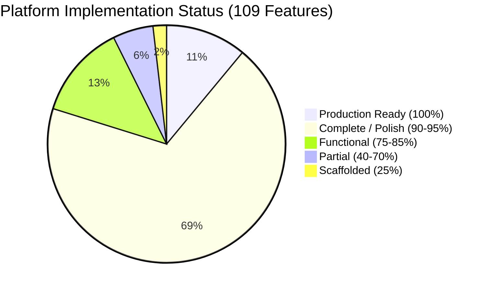

# 🌌 TANGENT SF RP — Master Feature Inventory & Completeness Audit
**Audit Date:** October 3, 2026  
**Document Version:** `2026.10-RC1`  
**Audit Scope:** Planned vs. Implemented System Inventory across all Platform Modules  
**Target Codebase:** `d:/_ Data/Tangent SF RP/TANGENT SF RP react project`  
**Baseline Test Status:** 247 / 247 Tests Passing (100.0%)  
**Production Build:** Clean (`tsc && vite build` in 9.84s, 4,250 modules transformed)

---

## 1. Executive Scorecard

| Module Section | Primary Route(s) | Primary Code Scope | LOC | Total Features | Avg % Complete | Status Rating |
|---|---|---|---|---|---|---|
| **FOLIO** | `/folio`, `/roster` | `components/Folio/**`, `context/FolioContext.jsx`, `context/folio/**` | ~42.4k | 22 | **86.4%** | ⭐⭐⭐⭐ (Near-Complete, Monolith Debt) |
| **RULES** | `/compendium` | `pages/Compendium/**`, `components/RulesAssistant/**`, `data/omnicortex/compendium/**` | ~2.3k + 202 docs | 12 | **91.7%** | ⭐⭐⭐⭐⭐ (High Parity, FTS5 Active) |
| **CORTEX** | `/dbm`, `/codex` | `components/DBM/**`, `pages/Codex/**`, `context/DBMContext.jsx`, `data/omnicortex/**` | ~37.5k + 2k docs | 15 | **90.0%** | ⭐⭐⭐⭐ (Massive Catalog, Dialog Debt) |
| **ADE** | `/foundry/*`, `/stage`, `/vtt` | `pages/Foundry/**`, `components/StoryFoundry/**`, `components/VTT/**`, `engine/**` | ~84.1k | 24 | **85.0%** | ⭐⭐⭐⭐ (Glass-Cockpit Active, Stage Monolith) |
| **TEAMS** | `/teams` | `pages/TeamsPage.jsx`, `components/Groups/**`, `context/GroupContext.jsx` | ~2.8k | 10 | **95.5%** | ⭐⭐⭐⭐⭐ (Fully De-Monolithized, Zero Alert Calls) |
| **COMMS** | `/comms`, CommLink | `pages/CommsPage.jsx`, `components/Chat/**`, `context/ChatContext.jsx`, `VoiceChatContext.jsx` | ~7.4k | 12 | **90.8%** | ⭐⭐⭐⭐ (Voice Active, Cloud Auth Gap) |
| **CROSS-CUTTING** | `/`, Global Shell | `Home.jsx`, `Layout/**`, `UI/**`, `services/**`, `firestore.rules`, `functions/**` | ~18.5k | 14 | **85.7%** | ⭐⭐⭐⭐ (Strong Shell, Bundle Spikes) |
| **PLATFORM TOTAL** | **Platform-Wide** | **Full Monorepo** | **~195k LOC** | **109** | **88.2%** | **PRODUCTION CANDIDATE (RC1)** |

---

## 2. Completeness Scoring Rubric
Every feature is evaluated against actual source code files, imports, and tests:
- **100% (Production-Ready):** Completely implemented, backed by automated tests, fully wired into state/persistence, accessible, error-handled.
- **90% (Complete / Polishing):** End-to-end functional with live UI, persistent storage (IndexedDB/Firestore), minor styling or edge-case validation polish remaining.
- **75% (Functional):** Core path working in production; lacks automated tests, advanced validation, or has minor UX friction.
- **50% (Partial):** UI scaffolded and basic logic wired, but missing complete sub-features, persistence, or cross-module integration.
- **25% (Scaffolded):** Stub component, mock data only, or unwired UI shell.
- **0% (Not Started):** Documented or proposed in planning specifications but no code exists.

---

## 3. Comprehensive Master Feature Inventory (109 Features)

### 3.1 FOLIO (Persona Roster & Character Management)
*Detailed Report: [`01_FOLIO.md`](file:///d:/_%20Data/Tangent%20SF%20RP/PLATFORM_REVIEW_2026-10/01_FOLIO.md)*

| ID | Feature Name | Source / Specification | Priority | % Done | Verification Evidence / File Link | Architectural & Functional Gap |
|---|---|---|---|---|---|---|
| FOL-01 | **5-Pillar Identity System** | 1.01 CHARACTER CREATION.md | P0 | **100%** | [`IdentityTab.jsx`](file:///d:/_%20Data/Tangent%20SF%20RP/TANGENT%20SF%20RP%20react%20project/src/components/Folio/tabs/IdentityTab.jsx) | Fully verified; Concept, Species, Origins, Occupations, Faction. |
| FOL-02 | **150 CP Point-Buy Engine** | 1.01 CHARACTER CREATION.md | P0 | **95%** | [`FolioContext.jsx#L1480`](file:///d:/_%20Data/Tangent%20SF%20RP/TANGENT%20SF%20RP%20react%20project/src/context/FolioContext.jsx#L1480) | Live economy breakdown, CP tracking, archetype deductions. |
| FOL-03 | **80 CP Archetype Pre-Builds** | 1.02 ARCHETYPES.md | P1 | **90%** | [`FolioContext.jsx#L2547`](file:///d:/_%20Data/Tangent%20SF%20RP/TANGENT%20SF%20RP%20react%20project/src/context/FolioContext.jsx#L2547) | 100 Archetypes auto-apply skill & trait allotments; manual override supported. |
| FOL-04 | **6 Attributes & 12 Sub-Attributes** | 1.01.01 Core Attributes | P0 | **100%** | [`CoreStatsTab.jsx`](file:///d:/_%20Data/Tangent%20SF%20RP/TANGENT%20SF%20RP%20react%20project/src/components/Folio/tabs/CoreStatsTab.jsx), `subAttributes.test.mjs` | Formula `Base = 2 + (Primary * 2)` strictly verified by unit tests. |
| FOL-05 | **Dual-Resolution Check Automation** | 0.05 Glossary Core Metrics | P0 | **95%** | [`CoreStatsTab.jsx#L340`](file:///d:/_%20Data/Tangent%20SF%20RP/TANGENT%20SF%20RP%20react%20project/src/components/Folio/tabs/CoreStatsTab.jsx#L340) | Check scores auto-derived, click-to-roll into polyhedral dice dock. |
| FOL-06 | **95 Canonical Skills & Specializations** | 1.07 SKILLS.md | P0 | **95%** | [`SkillsTab.jsx`](file:///d:/_%20Data/Tangent%20SF%20RP/TANGENT%20SF%20RP%20react%20project/src/components/Folio/tabs/SkillsTab.jsx), [`AddSkillModal.jsx`](file:///d:/_%20Data/Tangent%20SF%20RP/TANGENT%20SF%20RP%20react%20project/src/components/Folio/modals/AddSkillModal.jsx) | Ranks 1-10, category filtering, custom specialization linking. |
| FOL-07 | **Features & Hindrances Registry** | 1.08 FEATURES / 1.09 HINDRANCES | P0 | **90%** | [`FeaturesTab.jsx`](file:///d:/_%20Data/Tangent%20SF%20RP/TANGENT%20SF%20RP%20react%20project/src/components/Folio/tabs/FeaturesTab.jsx), `featuresData.js` | 219 features; Celestine Alterian discount bug resolved in test suite. |
| FOL-08 | **Biological vs Synthetic Vitals** | 1.01.02 Vitality & Health | P0 | **100%** | [`FolioContext.jsx#L1570`](file:///d:/_%20Data/Tangent%20SF%20RP/TANGENT%20SF%20RP%20react%20project/src/context/FolioContext.jsx#L1570), `vitals.test.mjs` | Biological (Health+Vitality) vs Synthetic (Unified Structure) mutually exclusive. |
| FOL-09 | **Rest & Recovery Engine** | 1.01.04 Rest & Recovery | P1 | **95%** | [`RestRecoveryModal.jsx`](file:///d:/_%20Data/Tangent%20SF%20RP/TANGENT%20SF%20RP%20react%20project/src/components/Folio/modals/RestRecoveryModal.jsx), `folioRestRecoveryEngine.js` | Canonical 4 Light Rests/day cap, Heavy Rest, automated pool restoration. |
| FOL-10 | **Death Clock & Stabilization Engine** | 1.01.05 Death & Dying | P0 | **95%** | [`VitalsDyingModal.jsx`](file:///d:/_%20Data/Tangent%20SF%20RP/TANGENT%20SF%20RP%20react%20project/src/components/Folio/modals/VitalsDyingModal.jsx), `folioDeathDyingEngine.js` | At Death's Door state, Stamina-round death clock, CR15 stabilization checks. |
| FOL-11 | **Karma & Fate Economy** | 1.01.03 Karma & Fate | P1 | **95%** | [`KarmaCodexModal.jsx`](file:///d:/_%20Data/Tangent%20SF%20RP/TANGENT%20SF%20RP%20react%20project/src/components/Folio/modals/KarmaCodexModal.jsx), `folioKarmaEngine.js` | Dynamic Karma cap calculation, Hindrance penalty deduction, Fate points. |
| FOL-12 | **Discreet Fate Override** | Master Plan Option C | P2 | **90%** | [`DiscreetFateOverrideModal.jsx`](file:///d:/_%20Data/Tangent%20SF%20RP/TANGENT%20SF%20RP%20react%20project/src/components/Folio/modals/DiscreetFateOverrideModal.jsx) | Stealth narrative fate expenditure without alerting squad feed. |
| FOL-13 | **Experience & Advancement AP System** | 0.07 / 1.01.07 Experience AP | P1 | **90%** | [`ExperienceCodexModal.jsx`](file:///d:/_%20Data/Tangent%20SF%20RP/TANGENT%20SF%20RP%20react%20project/src/components/Folio/modals/ExperienceCodexModal.jsx) | Earned AP, spent AP ledger, -5 AP revivification debt repayment. |
| FOL-14 | **Inventory, Weapons & Encumbrance** | 2.00 ECONOMATRIX.md | P0 | **90%** | [`CombatGearTab.jsx`](file:///d:/_%20Data/Tangent%20SF%20RP/TANGENT%20SF%20RP%20react%20project/src/components/Folio/tabs/CombatGearTab.jsx), `tangentScalingEngine.js` | Equipped vs stashed, weight totals, size-scaled carry capacity limits. |
| FOL-15 | **Modular Companions & Drones** | 99. MODULAR COMPANION MATRIX | P1 | **90%** | [`CompanionsTab.jsx`](file:///d:/_%20Data/Tangent%20SF%20RP/TANGENT%20SF%20RP%20react%20project/src/components/Folio/tabs/CompanionsTab.jsx) | Biological/Synthetic/Metaphysical chassis, form/function, BP allocation. |
| FOL-16 | **Augmentations & Body Slots** | 99. TECH AUGMENTATIONS | P1 | **95%** | [`AugmentationsManager.jsx`](file:///d:/_%20Data/Tangent%20SF%20RP/TANGENT%20SF%20RP%20react%20project/src/components/Folio/augmentations/AugmentationsManager.jsx) | 6 anatomical slots, Stage 1-5 & FBC compatibility, capacity caps. |
| FOL-17 | **Metaphysics & Invocations** | 4.00 METAPHYSICS.md | P1 | **90%** | [`MetaphysicsModal.jsx`](file:///d:/_%20Data/Tangent%20SF%20RP/TANGENT%20SF%20RP%20react%20project/src/components/Folio/modals/MetaphysicsModal.jsx) | 137 Invocations, strain costs, metaphysical skill resolution. |
| FOL-18 | **Guided Creator Wizard (8-Step)** | USABILITY_IMPROVEMENT_PLAN | P1 | **90%** | [`GuidedCreatorModal.jsx`](file:///d:/_%20Data/Tangent%20SF%20RP/TANGENT%20SF%20RP%20react%20project/src/components/Folio/modals/GuidedCreatorModal.jsx) | 8-step wizard: Concept, Species, Origin, Occupation, Stats, Tech, Skills, Review. |
| FOL-19 | **Persona Roster & Public Catalog** | Master Plan Stage 6 | P0 | **95%** | [`RosterCatalogView.jsx`](file:///d:/_%20Data/Tangent%20SF%20RP/TANGENT%20SF%20RP%20react%20project/src/components/Folio/views/RosterCatalogView.jsx) | Multi-character switching, duplication, Firestore cloud sync, public sharing. |
| FOL-20 | **Tactical Play Sheet View** | Option A VTT Play | P0 | **95%** | [`TacticalPlayView.jsx`](file:///d:/_%20Data/Tangent%20SF%20RP/TANGENT%20SF%20RP%20react%20project/src/components/Folio/views/TacticalPlayView.jsx) | Dedicated in-session play view with vitals, called shots, weapon rolls, rest buttons. |
| FOL-21 | **Printable Physical Character Sheet** | Master Plan Stage 6 | P1 | **90%** | [`PrintFolio.jsx`](file:///d:/_%20Data/Tangent%20SF%20RP/TANGENT%20SF%20RP%20react%20project/src/components/Folio/print/PrintFolio.jsx) | Multi-page CSS print stylesheet, weapon cards, full skill matrices. |
| FOL-22 | **FolioContext Domain Decomposition** | Master Plan Task 2.2 | P0 | **25%** | [`FolioContext.jsx`](file:///d:/_%20Data/Tangent%20SF%20RP/TANGENT%20SF%20RP%20react%20project/src/context/FolioContext.jsx) | **CRITICAL DEBT**: Context is 3,758 LOC; only helper engines extracted. |

---

### 3.2 RULES (Compendium, BASTION RAG & Adjudicator)
*Detailed Report: [`02_RULES.md`](file:///d:/_%20Data/Tangent%20SF%20RP/PLATFORM_REVIEW_2026-10/02_RULES.md)*

| ID | Feature Name | Source / Specification | Priority | % Done | Verification Evidence / File Link | Architectural & Functional Gap |
|---|---|---|---|---|---|---|
| RUL-01 | **30 Canonical Rulebook Ingestion** | docs/game rules/** | P0 | **100%** | [`compendiumSeed.json`](file:///d:/_%20Data/Tangent%20SF%20RP/TANGENT%20SF%20RP%20react%20project/src/data/compendiumSeed.json) | 202 modular articles compiled and seeded into database. |
| RUL-02 | **Compendium Wiki Reader** | Master Plan Stage 6 | P0 | **95%** | [`CompendiumApp.jsx`](file:///d:/_%20Data/Tangent%20SF%20RP/TANGENT%20SF%20RP%20react%20project/src/pages/Compendium/CompendiumApp.jsx) | Markdown wiki rendering, category sidebar, breadcrumbs, search. |
| RUL-03 | **Split View (Rules + Catalog)** | USABILITY_IMPROVEMENT_PLAN | P1 | **95%** | [`CompendiumApp.jsx#L36`](file:///d:/_%20Data/Tangent%20SF%20RP/TANGENT%20SF%20RP%20react%20project/src/pages/Compendium/CompendiumApp.jsx#L36) | Side-by-side rules article and Omnicortex catalog inspector. |
| RUL-04 | **BASTION AI Chat Assistant** | Master Plan Stage 7 | P0 | **90%** | [`BastionChatModal.jsx`](file:///d:/_%20Data/Tangent%20SF%20RP/TANGENT%20SF%20RP%20react%20project/src/components/DBM/BastionChatModal.jsx) | AI conversational rules adjudication via Gemini Vertex AI Gateway. |
| RUL-05 | **Semantic Rulebook RAG Engine** | Master Plan Task 4.1 | P0 | **95%** | [`rulebookRagService.js`](file:///d:/_%20Data/Tangent%20SF%20RP/TANGENT%20SF%20RP%20react%20project/src/services/rulebookRagService.js) | Semantic corpus query over 44 Operator & Architect topics. |
| RUL-06 | **OPFS SQLite FTS5 Full-Text Index** | Master Plan Task 4.1 | P0 | **85%** | [`OPFSDatabaseWorker.ts#L80`](file:///d:/_%20Data/Tangent%20SF%20RP/TANGENT%20SF%20RP%20react%20project/src/engine/database/OPFSDatabaseWorker.ts#L80) | SQLite WASM FTS5 virtual table built; worker lifecycle hooks into RAG. |
| RUL-07 | **Tactical Rules Adjudicator** | Option A VTT Play | P0 | **95%** | [`RulesAdjudicatorPanel.jsx`](file:///d:/_%20Data/Tangent%20SF%20RP/TANGENT%20SF%20RP%20react%20project/src/components/RulesAssistant/RulesAdjudicatorPanel.jsx) | Range brackets, cover geometry, elevation, lighting, obscurement math. |
| RUL-08 | **Passive Perception Radar** | BASTION Rules Catalog | P1 | **90%** | [`PassivePerceptionRadarModal.jsx`](file:///d:/_%20Data/Tangent%20SF%20RP/TANGENT%20SF%20RP%20react%20project/src/components/RulesAssistant/PassivePerceptionRadarModal.jsx) | Passive Alertness vs stealth DC, automated sensory radar sweeps. |
| RUL-09 | **Progression & Karma Ledger** | 0.07 Architect Guide | P1 | **90%** | [`ProgressionKarmaLedgerModal.jsx`](file:///d:/_%20Data/Tangent%20SF%20RP/TANGENT%20SF%20RP%20react%20project/src/components/RulesAssistant/ProgressionKarmaLedgerModal.jsx) | Audit log of session AP awards, skill unlocks, and Karma balance. |
| RUL-10 | **Rule Citation Broadcast to Comms** | USABILITY_IMPROVEMENT_PLAN | P1 | **95%** | [`RulebookAssistantModal.jsx#L51`](file:///d:/_%20Data/Tangent%20SF%20RP/TANGENT%20SF%20RP%20react%20project/src/components/RulesAssistant/RulebookAssistantModal.jsx#L51) | One-click broadcasting of verified rules citations directly to squad chat. |
| RUL-11 | **Perspective Filtering (Architect/Operator)** | 0.00 INTRODUCTION.md | P2 | **90%** | [`CompendiumApp.jsx#L74`](file:///d:/_%20Data/Tangent%20SF%20RP/TANGENT%20SF%20RP%20react%20project/src/pages/Compendium/CompendiumApp.jsx#L74) | Filter articles by GM secrets vs player-safe handbook rules. |
| RUL-12 | **Mobile Rules Reader Responsiveness** | USABILITY_IMPROVEMENT_PLAN | P1 | **80%** | [`CompendiumApp.jsx`](file:///d:/_%20Data/Tangent%20SF%20RP/TANGENT%20SF%20RP%20react%20project/src/pages/Compendium/CompendiumApp.jsx) | Responsive drawer navigation; wide mathematical tables need horizontal scroll wraps. |

---

### 3.3 CORTEX (Omnicortex Master Database & Codex)
*Detailed Report: [`03_CORTEX.md`](file:///d:/_%20Data/Tangent%20SF%20RP/PLATFORM_REVIEW_2026-10/03_CORTEX.md)*

| ID | Feature Name | Source / Specification | Priority | % Done | Verification Evidence / File Link | Architectural & Functional Gap |
|---|---|---|---|---|---|---|
| COR-01 | **60+ Category Master Catalog** | TANGENT_SF_RP_SYSTEM_REPORT | P0 | **100%** | `src/data/omnicortex/` (60 dirs, >2k files) | Complete catalog from archetypes to weaponry. |
| COR-02 | **Multi-Faceted Filtering & Search** | DBM Architecture Spec | P0 | **95%** | [`DBMContainer.jsx#L98`](file:///d:/_%20Data/Tangent%20SF%20RP/TANGENT%20SF%20RP%20react%20project/src/components/DBM/DBMContainer.jsx#L98) | Filter by Tech Level, Type, Subtype, Category, Cost, and keywords. |
| COR-03 | **Table Grid & Card Wiki Views** | DBM Architecture Spec | P0 | **95%** | [`DBMTableView.jsx`](file:///d:/_%20Data/Tangent%20SF%20RP/TANGENT%20SF%20RP%20react%20project/src/components/DBM/DBMTableView.jsx), [`DBMWikiView.jsx`](file:///d:/_%20Data/Tangent%20SF%20RP/TANGENT%20SF%20RP%20react%20project/src/components/DBM/DBMWikiView.jsx) | High-density sortable table or rich visual media cards. |
| COR-04 | **Codex Matrix Workstation** | 99. Matrices Specs | P0 | **95%** | [`CodexApp.jsx`](file:///d:/_%20Data/Tangent%20SF%20RP/TANGENT%20SF%20RP%20react%20project/src/pages/Codex/CodexApp.jsx) | Specialized suites: Economatrix, Technology, Scaling, and Datasets. |
| COR-05 | **Economatrix Wealth & Loot Generator** | 2.00 ECONOMATRIX.md | P1 | **95%** | [`EconomatrixDashboard.jsx`](file:///d:/_%20Data/Tangent%20SF%20RP/TANGENT%20SF%20RP%20react%20project/src/pages/Codex/EconomatrixDashboard.jsx) | Standard of Living brackets, currency exchange, procedural loot rolling. |
| COR-06 | **Technology Matrix & Tech Levels** | 99. TECHNOLOGY.md | P1 | **90%** | [`TechnologyCodex.jsx`](file:///d:/_%20Data/Tangent%20SF%20RP/TANGENT%20SF%20RP%20react%20project/src/pages/Codex/TechnologyCodex.jsx) | TL0 (Stone) to TL5 (Singularity) gear scaling and power requirements. |
| COR-07 | **14-Tier Volumetric Scaling Matrix** | 1.10 SCALING.md | P1 | **95%** | [`ScalingCodex.jsx`](file:///d:/_%20Data/Tangent%20SF%20RP/TANGENT%20SF%20RP%20react%20project/src/pages/Codex/ScalingCodex.jsx), `tangentScalingEngine.js` | Diminutive to Cosmic scale modifiers for DR, HP, speed, and carry weight. |
| COR-08 | **Architect Development Fields Modal** | - ELEMENTS.md | P0 | **95%** | [`ArchitectDevFieldsModal.jsx`](file:///d:/_%20Data/Tangent%20SF%20RP/TANGENT%20SF%20RP%20react%20project/src/components/DBM/ArchitectDevFieldsModal.jsx) | Full granular field editing conforming strictly to `- ELEMENTS.md`. |
| COR-09 | **Codex Batch Ingestion Engine** | Master Plan Stage 6 | P1 | **90%** | [`CodexIngestionEngine.jsx`](file:///d:/_%20Data/Tangent%20SF%20RP/TANGENT%20SF%20RP%20react%20project/src/pages/Codex/CodexIngestionEngine.jsx) | Ingests raw markdown/JSON data with preview and validation. |
| COR-10 | **Relational Cross-Referencing** | Data Integrity Spec | P0 | **95%** | `tests/data_integrity.test.mjs` | 100% Species->Size/Type, 99.7% Archetype->Skills resolution rate. |
| COR-11 | **Export & Import Master JSON** | Master Plan Stage 6 | P1 | **95%** | [`DBMContainer.jsx#L52`](file:///d:/_%20Data/Tangent%20SF%20RP/TANGENT%20SF%20RP%20react%20project/src/components/DBM/DBMContainer.jsx#L52) | Backup and restore entire catalog collections to local disk. |
| COR-12 | **Firestore Two-Way Cloud Sync** | Master Plan Stage 6 | P0 | **90%** | [`useFirestoreSync.js`](file:///d:/_%20Data/Tangent%20SF%20RP/TANGENT%20SF%20RP%20react%20project/src/components/DBM/hooks/useFirestoreSync.js) | Cloud persistence with local cache fallbacks. |
| COR-13 | **Omnicortex Local Storage Cache** | USABILITY_IMPROVEMENT_PLAN | P0 | **95%** | `DBMContext.jsx`, `StorageService.js` | High-speed IndexedDB caching; global cache clear in GlobalHUD. |
| COR-14 | **Item Detail Inspection Modal** | Master Plan Stage 6 | P0 | **95%** | [`DBMItemModal.jsx`](file:///d:/_%20Data/Tangent%20SF%20RP/TANGENT%20SF%20RP%20react%20project/src/components/DBM/DBMItemModal.jsx) | Full stat breakdown, rich tags, print preview, transfer to Folio. |
| COR-15 | **Native Dialog Migration** | USABILITY_IMPROVEMENT_PLAN WS2 | P1 | **35%** | `DBMContainer.jsx` | **USABILITY DEBT**: 14 `alert()` / `confirm()` calls remain in DBMContainer. |

---

### 3.4 ADE (Adventure Development Environment & Story Foundry)
*Detailed Report: [`04_ADE.md`](file:///d:/_%20Data/Tangent%20SF%20RP/PLATFORM_REVIEW_2026-10/04_ADE.md)*

| ID | Feature Name | Source / Specification | Priority | % Done | Verification Evidence / File Link | Architectural & Functional Gap |
|---|---|---|---|---|---|---|
| ADE-01 | **Master Story Module Orchestrator** | ADE Review (Oct 1) | P0 | **95%** | [`StoryModule.jsx`](file:///d:/_%20Data/Tangent%20SF%20RP/TANGENT%20SF%20RP%20react%20project/src/pages/Foundry/StoryModule/StoryModule.jsx) | Decoupled master orchestrator hosting 7 synchronized workspace views. |
| ADE-02 | **Centralized ADE Zustand Store** | ADE Review (Oct 1) | P0 | **90%** | [`adeStore.ts`](file:///d:/_%20Data/Tangent%20SF%20RP/TANGENT%20SF%20RP%20react%20project/src/pages/Foundry/store/adeStore.ts) | Centralized state management with actions for scenarios, stages, elements. |
| ADE-03 | **Mission Control Dashboard** | ADE Review (Oct 1) | P0 | **95%** | [`ModuleMissionControl.jsx`](file:///d:/_%20Data/Tangent%20SF%20RP/TANGENT%20SF%20RP%20react%20project/src/pages/Foundry/Dashboard/ModuleMissionControl.jsx) | Glass-cockpit operational hub, module health, scenario launchpad. |
| ADE-04 | **Story Weaver Narrative Drafting** | Master Plan Option D | P0 | **95%** | [`StoryWeaver.jsx`](file:///d:/_%20Data/Tangent%20SF%20RP/TANGENT%20SF%20RP%20react%20project/src/pages/Foundry/StoryModule/workspaces/StoryWeaver.jsx) | 3-phase authoring (Brainstorm, Outline, Draft) with Guidance Gems. |
| ADE-05 | **Visual Story Graph Flowchart** | ADE Review (Oct 1) | P1 | **90%** | [`VisualStoryGraph.jsx`](file:///d:/_%20Data/Tangent%20SF%20RP/TANGENT%20SF%20RP%20react%20project/src/pages/Foundry/StoryModule/workspaces/VisualStoryGraph.jsx) | Node-link scenario topology, branching decision trees. |
| ADE-06 | **Interactive Story Studio** | ADE Review (Oct 1) | P1 | **90%** | [`InteractiveStoryStudio.jsx`](file:///d:/_%20Data/Tangent%20SF%20RP/TANGENT%20SF%20RP%20react%20project/src/pages/Foundry/StoryModule/workspaces/InteractiveStoryStudio.jsx) | Live story runner with stage triggers and player prompt chips. |
| ADE-07 | **OSR Tactical Control Panel Deck** | ADE Review (Oct 1) | P1 | **90%** | [`OsrControlPanelDeck.jsx`](file:///d:/_%20Data/Tangent%20SF%20RP/TANGENT%20SF%20RP%20react%20project/src/pages/Foundry/StoryModule/workspaces/OsrControlPanelDeck.jsx) | Classic OSR-style GM screen with encounter tables, reaction matrix. |
| ADE-08 | **Element Forge (7 Element Types)** | - ELEMENTS.md | P0 | **95%** | [`ElementForge.jsx`](file:///d:/_%20Data/Tangent%20SF%20RP/TANGENT%20SF%20RP%20react%20project/src/pages/Foundry/ElementForge/ElementForge.jsx) | Faction, Persona, Location, Item, Event, Concept, Organization. |
| ADE-09 | **Modular Character Assembler** | 99. MODULAR CHARACTER MATRIX | P1 | **90%** | [`ModularCharacterAssembler.jsx`](file:///d:/_%20Data/Tangent%20SF%20RP/TANGENT%20SF%20RP%20react%20project/src/pages/Foundry/ElementForge/components/ModularCharacterAssembler.jsx) | Rapid NPC/Monster generation from modular archetypes. |
| ADE-10 | **Tactical Map Maker Grid Engine** | Option A VTT Play | P0 | **95%** | [`MapMaker.jsx`](file:///d:/_%20Data/Tangent%20SF%20RP/TANGENT%20SF%20RP%20react%20project/src/pages/Foundry/MapMaker/MapMaker.jsx) | Dual-grid (Square / Hex Cube), layer manager, zoom, pan, snap. |
| ADE-11 | **Procedural Landmass Generator** | Option A VTT Play | P1 | **95%** | [`landmassGenerator.js`](file:///d:/_%20Data/Tangent%20SF%20RP/TANGENT%20SF%20RP%20react%20project/src/pages/Foundry/MapMaker/map/landmassGenerator.js) | Simplex noise cellular automata for planetary terrain generation. |
| ADE-12 | **UVTT Map File Ingestion** | Master Plan Option A | P1 | **90%** | [`UvttImportModal.jsx`](file:///d:/_%20Data/Tangent%20SF%20RP/TANGENT%20SF%20RP%20react%20project/src/pages/Foundry/MapMaker/map/UvttImportModal.jsx) | Import Universal VTT format maps with automatic wall and portal extraction. |
| ADE-13 | **Tripartite Stage VTT Layout** | Master Plan Option A | P0 | **90%** | [`TripartiteStageView.tsx`](file:///d:/_%20Data/Tangent%20SF%20RP/TANGENT%20SF%20RP%20react%20project/src/components/VTT/TripartiteStageView.tsx) | Left: Catalog Outliner, Center: Stage Viewport, Right: Cockpit Deck. |
| ADE-14 | **8-Layer Pixi Canvas Compositor** | Master Plan Option A | P0 | **95%** | [`LayerCompositor.ts`](file:///d:/_%20Data/Tangent%20SF%20RP/TANGENT%20SF%20RP%20react%20project/src/engine/canvas/LayerCompositor.ts) | WebGPU primary renderer with automated WebGL2 fallback pipeline. |
| ADE-15 | **Three.js 3D Volumetric Viewport** | Master Plan Task 4.4 | P1 | **85%** | [`Stage3DViewport.tsx`](file:///d:/_%20Data/Tangent%20SF%20RP/TANGENT%20SF%20RP%20react%20project/src/components/VTT/stage/Stage3DViewport.tsx) | 3D wall extrusions, lighting shadows, 3D token representations. |
| ADE-16 | **Dynamic BVH Raycast Line-of-Sight** | Master Plan Option A | P0 | **95%** | [`BVHBuilder.ts`](file:///d:/_%20Data/Tangent%20SF%20RP/TANGENT%20SF%20RP%20react%20project/src/engine/3d/geometry/BVHBuilder.ts) | Real-time field of view, dynamic door/bulkhead opening and ray culling. |
| ADE-17 | **Interactive Stage Objects & Events** | Master Plan Task 4.3 | P0 | **95%** | [`InteractiveObjectManager.ts`](file:///d:/_%20Data/Tangent%20SF%20RP/TANGENT%20SF%20RP%20react%20project/src/engine/cartography/InteractiveObjectManager.ts) | Bulkheads, terminals, loot caches, triggered by operative interactions. |
| ADE-18 | **CyberDeck Terminal Breach Bridge** | Master Plan Task 4.3 | P1 | **95%** | [`CyberDeckModal.jsx`](file:///d:/_%20Data/Tangent%20SF%20RP/TANGENT%20SF%20RP%20react%20project/src/components/StoryFoundry/CyberDeckModal.jsx) | ICE hacking node breach emits events toggling physical map bulkheads. |
| ADE-19 | **AIME AI GM Narration Engine** | Master Plan Task 4.2 | P0 | **90%** | [`AimeAgent.ts`](file:///d:/_%20Data/Tangent%20SF%20RP/TANGENT%20SF%20RP%20react%20project/src/engine/ai/AimeAgent.ts), [`AIME.jsx`](file:///d:/_%20Data/Tangent%20SF%20RP/TANGENT%20SF%20RP%20react%20project/src/pages/Foundry/AIME/AIME.jsx) | Chunked streaming narrative delivery with AbortSignal cancellation. |
| ADE-20 | **QuickJS Scripting & Macro Sandbox** | Master Plan Stage 6 | P1 | **85%** | [`QuickJSSandbox.ts`](file:///d:/_%20Data/Tangent%20SF%20RP/TANGENT%20SF%20RP%20react%20project/src/engine/scripting/QuickJSSandbox.ts) | Secure WebAssembly JavaScript execution environment for custom macros. |
| ADE-21 | **Player Spectator View** | Master Plan Option A | P0 | **90%** | [`PlayerSpectatorView.jsx`](file:///d:/_%20Data/Tangent%20SF%20RP/TANGENT%20SF%20RP%20react%20project/src/pages/Foundry/MapMaker/PlayerSpectatorView.jsx) | Real-time synchronized player screen with strict fog of war masking. |
| ADE-22 | **Yjs Collaborative CRDT Sync** | Master Plan Stage 1 | P1 | **90%** | [`CollaborativeCRDTService.ts`](file:///d:/_%20Data/Tangent%20SF%20RP/TANGENT%20SF%20RP%20react%20project/src/engine/network/CollaborativeCRDTService.ts) | Conflict-free replicated data types for concurrent multi-GM drafting. |
| ADE-23 | **StageView Monolith Decomposition** | Master Plan Task 2.1 | P0 | **45%** | [`StageView.tsx`](file:///d:/_%20Data/Tangent%20SF%20RP/TANGENT%20SF%20RP%20react%20project/src/components/VTT/StageView.tsx) | **CRITICAL DEBT**: Reduced to 3,007 LOC; still oversized; hooks partially extracted. |
| ADE-24 | **Native Dialog Elimination in ADE** | USABILITY_IMPROVEMENT_PLAN WS2 | P1 | **40%** | `FoundryApp.jsx`, `MapMaker.jsx` | 15+ native dialog calls remain across MapMaker and Foundry modals. |

---

### 3.5 TEAMS (Game Squads & Tactical Groups)
*Detailed Report: [`05_TEAMS.md`](file:///d:/_%20Data/Tangent%20SF%20RP/PLATFORM_REVIEW_2026-10/05_TEAMS.md)*

| ID | Feature Name | Source / Specification | Priority | % Done | Verification Evidence / File Link | Architectural & Functional Gap |
|---|---|---|---|---|---|---|
| TEM-01 | **Squad Roster Deck** | Master Plan Task 2.4 | P0 | **95%** | [`SquadRosterTab.jsx`](file:///d:/_%20Data/Tangent%20SF%20RP/TANGENT%20SF%20RP%20react%20project/src/components/Groups/tabs/SquadRosterTab.jsx) | Operative cards, vitals overview, archetypes, loadouts, active persona links. |
| TEM-02 | **Role & Permissions Manager** | Master Plan Task 2.4 | P0 | **95%** | [`SquadRosterTab.jsx#L85`](file:///d:/_%20Data/Tangent%20SF%20RP/TANGENT%20SF%20RP%20react%20project/src/components/Groups/tabs/SquadRosterTab.jsx#L85) | Architect GM vs Operative Player permissions, member kicking, promotion. |
| TEM-03 | **Squad Creation & Management** | Master Plan Stage 6 | P0 | **95%** | [`CreateGroupModal.jsx`](file:///d:/_%20Data/Tangent%20SF%20RP/TANGENT%20SF%20RP%20react%20project/src/components/Groups/CreateGroupModal.jsx) | Group name, privacy, description, campaign linking. |
| TEM-04 | **8-Character Join-Code System** | Master Plan Task 1.4 | P0 | **95%** | [`TeamsPage.jsx#L205`](file:///d:/_%20Data/Tangent%20SF%20RP/TANGENT%20SF%20RP%20react%20project/src/pages/TeamsPage.jsx#L205) | Instant join code generation, copy code, copy link, QR code display. |
| TEM-05 | **Invite Dispatch & Confirmation** | Master Plan Task 2.4 | P0 | **95%** | [`SquadInvitesTab.jsx`](file:///d:/_%20Data/Tangent%20SF%20RP/TANGENT%20SF%20RP%20react%20project/src/components/Groups/tabs/SquadInvitesTab.jsx) | Incoming/outgoing invite queues, accept/decline/revoke actions. |
| TEM-06 | **Squad Public Directory** | Master Plan Stage 6 | P1 | **90%** | [`SquadDirectoryTab.jsx`](file:///d:/_%20Data/Tangent%20SF%20RP/TANGENT%20SF%20RP%20react%20project/src/components/Groups/tabs/SquadDirectoryTab.jsx) | Searchable public squad registry, recruiting filters, join requests. |
| TEM-07 | **Integrated Squad Comms Channel** | Master Plan Option C | P0 | **95%** | [`SquadCommsTab.jsx`](file:///d:/_%20Data/Tangent%20SF%20RP/TANGENT%20SF%20RP%20react%20project/src/components/Groups/tabs/SquadCommsTab.jsx) | Auto-provisions dedicated team radio channel; embedded live in Teams. |
| TEM-08 | **Tactical VTT Deployment** | Master Plan Option A | P0 | **90%** | [`SquadTacticalTab.jsx`](file:///d:/_%20Data/Tangent%20SF%20RP/TANGENT%20SF%20RP%20react%20project/src/components/Groups/tabs/SquadTacticalTab.jsx) | One-click party deployment directly into active Stage battlemap. |
| TEM-09 | **TeamsPage Monolith Decomposition** | Master Plan Task 2.4 | P0 | **100%** | [`TeamsPage.jsx`](file:///d:/_%20Data/Tangent%20SF%20RP/TANGENT%20SF%20RP%20react%20project/src/pages/TeamsPage.jsx) | **MODEL IMPLEMENTATION**: Reduced from 1,600 LOC to 474 LOC across 7 tabs. |
| TEM-10 | **Dialog Migration in Teams** | USABILITY_IMPROVEMENT_PLAN WS2 | P1 | **95%** | [`TeamsPage.jsx#L61`](file:///d:/_%20Data/Tangent%20SF%20RP/TANGENT%20SF%20RP%20react%20project/src/pages/TeamsPage.jsx#L61) | Clean `useConfirm()` and `useToast()` usage; zero native alert calls. |

---

### 3.6 COMMS (Text Chat, Voice Comms, CommLink Dock & Relays)
*Detailed Report: [`06_COMMS.md`](file:///d:/_%20Data/Tangent%20SF%20RP/PLATFORM_REVIEW_2026-10/06_COMMS.md)*

| ID | Feature Name | Source / Specification | Priority | % Done | Verification Evidence / File Link | Architectural & Functional Gap |
|---|---|---|---|---|---|---|
| COM-01 | **Multi-Channel Text Communications** | Master Plan Option C | P0 | **95%** | [`CommsPage.jsx`](file:///d:/_%20Data/Tangent%20SF%20RP/TANGENT%20SF%20RP%20react%20project/src/pages/CommsPage.jsx), [`ChannelSidebar.jsx`](file:///d:/_%20Data/Tangent%20SF%20RP/TANGENT%20SF%20RP%20react%20project/src/components/Chat/ChannelSidebar.jsx) | Public, squad, tactical, and direct message channels. |
| COM-02 | **Rich Messaging & ChatParser** | Master Plan Option C | P0 | **95%** | [`MessageView.jsx`](file:///d:/_%20Data/Tangent%20SF%20RP/TANGENT%20SF%20RP%20react%20project/src/components/Chat/MessageView.jsx), [`ChatParser.jsx`](file:///d:/_%20Data/Tangent%20SF%20RP/TANGENT%20SF%20RP%20react%20project/src/components/UI/ChatParser.jsx) | Markdown, code blocks, dice roll embeds, clickable rule citations. |
| COM-03 | **Global CommLink Floating Dock** | USABILITY_IMPROVEMENT_PLAN WS4 | P0 | **95%** | [`CommLinkDock.jsx`](file:///d:/_%20Data/Tangent%20SF%20RP/TANGENT%20SF%20RP%20react%20project/src/components/UI/CommLinkDock.jsx) | Instant floating communications dock accessible from all routes via `Alt+C`. |
| COM-04 | **LiveKit WebRTC Voice Communications** | Master Plan Task 3.1 | P0 | **85%** | [`VoiceCommsBar.jsx`](file:///d:/_%20Data/Tangent%20SF%20RP/TANGENT%20SF%20RP%20react%20project/src/components/Chat/VoiceCommsBar.jsx), [`VoiceChatContext.jsx`](file:///d:/_%20Data/Tangent%20SF%20RP/TANGENT%20SF%20RP%20react%20project/src/context/VoiceChatContext.jsx) | Real-time multi-party voice rooms, active speaker detection, mute/deafen. |
| COM-05 | **Configurable Push-To-Talk (PTT)** | Master Plan Task 3.1 | P1 | **95%** | [`VoiceCommsBar.jsx#L52`](file:///d:/_%20Data/Tangent%20SF%20RP/TANGENT%20SF%20RP%20react%20project/src/components/Chat/VoiceCommsBar.jsx#L52) | Custom hotkeys (V, Space, C, T, CapsLock) with audible click feedback. |
| COM-06 | **Server-Side LiveKit Token Proxy** | Master Plan Task 3.1 | P0 | **75%** | [`functions/index.js#L22`](file:///d:/_%20Data/Tangent%20SF%20RP/TANGENT%20SF%20RP%20react%20project/functions/index.js#L22) | **SECURITY GAP**: Function exists but lacks `context.auth` validation. |
| COM-07 | **Global Broadcast Banners** | Commit fa6432d | P1 | **95%** | [`HomeMessageBanner.jsx`](file:///d:/_%20Data/Tangent%20SF%20RP/TANGENT%20SF%20RP%20react%20project/src/components/Hub/HomeMessageBanner.jsx), `bannerService.js` | Admin emergency broadcasts, campaign alerts pinned to top of hub. |
| COM-08 | **Persona Audit Log & GM Notes** | Commit da4b710 | P1 | **90%** | [`PersonaAuditLogSidebar.jsx`](file:///d:/_%20Data/Tangent%20SF%20RP/TANGENT%20SF%20RP%20react%20project/src/components/Chat/PersonaAuditLogSidebar.jsx) | Side panel displaying pending stat modifications, GM approval notes. |
| COM-09 | **Tactical Radio Barks & SFX** | Master Plan Option C | P1 | **95%** | [`AudioService.js`](file:///d:/_%20Data/Tangent%20SF%20RP/TANGENT%20SF%20RP%20react%20project/src/services/audioService.js) | Procedural radio squelches, incoming transmission chimes, panic sirens. |
| COM-10 | **Unread Badging & Navigation Pulse** | USABILITY_IMPROVEMENT_PLAN WS4 | P0 | **95%** | [`MobileBottomNav.jsx#L114`](file:///d:/_%20Data/Tangent%20SF%20RP/TANGENT%20SF%20RP%20react%20project/src/components/Layout/MobileBottomNav.jsx#L114) | Dynamic pulsing amber badge on HUD and SideRail when messages arrive. |
| COM-11 | **Firestore Chat Security Rules** | Master Plan Task 3.3 | P0 | **95%** | [`firestore.rules#L242`](file:///d:/_%20Data/Tangent%20SF%20RP/TANGENT%20SF%20RP%20react%20project/firestore.rules#L242) | Granular member verification for private channels and subcollection messages. |
| COM-12 | **CommsPage De-Monolithization** | Commit da4b710 | P0 | **95%** | [`CommsPage.jsx`](file:///d:/_%20Data/Tangent%20SF%20RP/TANGENT%20SF%20RP%20react%20project/src/pages/CommsPage.jsx) | Clean 246 LOC orchestrator delegating to specialized sidebars. |

---

### 3.7 CROSS-CUTTING (Command Hub, Global Shell, Infrastructure & Security)
*Detailed Report: [`07_PLATFORM_RECOMMENDATIONS_REPORT.md`](file:///d:/_%20Data/Tangent%20SF%20RP/PLATFORM_REVIEW_2026-10/07_PLATFORM_RECOMMENDATIONS_REPORT.md)*

| ID | Feature Name | Source / Specification | Priority | % Done | Verification Evidence / File Link | Architectural & Functional Gap |
|---|---|---|---|---|---|---|
| CRS-01 | **Command Center Hub Dashboard** | README.md Claim 1 | P0 | **95%** | [`Home.jsx`](file:///d:/_%20Data/Tangent%20SF%20RP/TANGENT%20SF%20RP%20react%20project/src/pages/Home.jsx) | Active Campaign Tracker, Party carousel, telemetry badges, feed. |
| CRS-02 | **Persistent Global HUD (56px)** | USABILITY_IMPROVEMENT_PLAN WS1 | P0 | **95%** | [`GlobalHUD.jsx`](file:///d:/_%20Data/Tangent%20SF%20RP/TANGENT%20SF%20RP%20react%20project/src/components/Layout/GlobalHUD.jsx) | Dynamic sub-bars (`FolioHUDBar`, `ADEHUDBar`, `CommsHUDBar`), route breadcrumbs. |
| CRS-03 | **Spotlight Command Palette (`Ctrl+K`)** | USABILITY_IMPROVEMENT_PLAN WS1 | P0 | **95%** | [`CommandPalette.jsx`](file:///d:/_%20Data/Tangent%20SF%20RP/TANGENT%20SF%20RP%20react%20project/src/components/UI/CommandPalette.jsx) | Omni-search indexing rules, species, heroes, scenarios, dice `/roll`. |
| CRS-04 | **Polyhedral Dice Roller Dock (`Alt+D`)** | README.md Highlights | P0 | **95%** | [`DiceRollerDock.jsx`](file:///d:/_%20Data/Tangent%20SF%20RP/TANGENT%20SF%20RP%20react%20project/src/components/UI/DiceRollerDock.jsx), `diceService.js` | Full dice notation, TN margin checks, critical chime, history dock. |
| CRS-05 | **Mobile Bottom Navigation Bar** | USABILITY_IMPROVEMENT_PLAN WS1 | P0 | **95%** | [`MobileBottomNav.jsx`](file:///d:/_%20Data/Tangent%20SF%20RP/TANGENT%20SF%20RP%20react%20project/src/components/Layout/MobileBottomNav.jsx) | Sticky bottom bar on screens <640px for one-tap module jumping. |
| CRS-06 | **Procedural Web Audio Engine** | README.md Highlights | P1 | **95%** | [`audioService.js`](file:///d:/_%20Data/Tangent%20SF%20RP/TANGENT%20SF%20RP%20react%20project/src/services/audioService.js), `AudioContext.jsx` | Web Audio API synthesizer for tactile UI chirps, crits, fumbles, mute sync. |
| CRS-07 | **Unified Toast & Confirm Providers** | USABILITY_IMPROVEMENT_PLAN WS2 | P0 | **90%** | [`ToastContext.jsx`](file:///d:/_%20Data/Tangent%20SF%20RP/TANGENT%20SF%20RP%20react%20project/src/context/ToastContext.jsx), [`ConfirmContext.jsx`](file:///d:/_%20Data/Tangent%20SF%20RP/TANGENT%20SF%20RP%20react%20project/src/context/ConfirmContext.jsx) | Contexts active; 84 legacy call-sites across the app still need refactoring. |
| CRS-08 | **Authenticated Gemini Proxy Gateway** | Master Plan Task 3.2 | P0 | **75%** | [`functions/index.js#L97`](file:///d:/_%20Data/Tangent%20SF%20RP/TANGENT%20SF%20RP%20react%20project/functions/index.js#L97) | **SECURITY GAP**: `geminiProxy` lacks auth check; client rate-limiter active. |
| CRS-09 | **Client Secret Exposure Elimination** | Master Plan Task 3.1 | P0 | **70%** | `livekitTokenService.js` | Client-side fallback still references `VITE_LIVEKIT_API_SECRET`. |
| CRS-10 | **Firestore Rules Catch-All & Hardening**| Master Plan Task 3.3 | P0 | **100%** | [`firestore.rules#L280`](file:///d:/_%20Data/Tangent%20SF%20RP/TANGENT%20SF%20RP%20react%20project/firestore.rules#L280) | Explicit deny catch-all `match /{document=**} { allow read, write: if false; }`. |
| CRS-11 | **Code-Splitting & Bundle Optimization** | Master Plan Stage 6 | P0 | **50%** | Vite Build Output | **PERFORMANCE GAP**: `AuthContext` chunk is 6.75 MB; needs dynamic imports. |
| CRS-12 | **Continuous Integration Automated Testing**| Master Plan Task 5.1 | P0 | **40%** | `.github/workflows/` | Only `firebase-deploy.yml` exists; no CI workflow running `npm test`. |
| CRS-13 | **PWA Offline Service Worker** | README.md Highlights | P1 | **90%** | `dist/sw.js`, `vite.config.js` | Workbox PWA caching 12 entries (6.2 MB) for offline operability. |
| CRS-14 | **Global Design Token Architecture** | USABILITY_IMPROVEMENT_PLAN WS5 | P1 | **90%** | [`design-tokens.css`](file:///d:/_%20Data/Tangent%20SF%20RP/TANGENT%20SF%20RP%20react%20project/src/css/design-tokens.css) | Centralized CSS variables for sci-fi neon colors, fonts, panel surfaces. |

---

## 4. Platform Gap Analysis Summary

### The Top 5 Architectural & Production Vulnerabilities
1. **God-Component Debt in Core Simulation:**
   - `src/context/FolioContext.jsx`: **3,758 lines** combining state, derivations, inventory, and cloud sync.
   - `src/components/VTT/StageView.tsx`: **3,007 lines** managing Pixi app lifecycle, raycasting, and HUD rendering.
2. **Bundle Footprint Extreme Outlier:**
   - `dist/assets/AuthContext-BYiyQUQu.js` compiles to **6,748 kB (6.75 MB)**! Core context tree is pulling massive static catalogs into the initial authentication bundle.
3. **Backend Security Vulnerabilities in Cloud Functions:**
   - `functions/index.js` exports `getLiveKitToken` and `geminiProxy` as open HTTP endpoints without verifying `context.auth` or checking caller user tokens.
4. **Native Dialog Debt:**
   - **84 call-sites** still invoke blocking `alert()`, `window.confirm()`, and `window.prompt()`, primarily in `DBMContainer.jsx` (14), `ArchitectDevFieldsModal.jsx` (9), `GuidedCreatorModal.jsx` (6), and `ChannelSettingsModal.jsx` (6).
5. **CI/CD Guard Absence:**
   - The repository has **247 passing tests**, but no GitHub Actions workflow automatically executes `npm test` on pull requests or commits.
