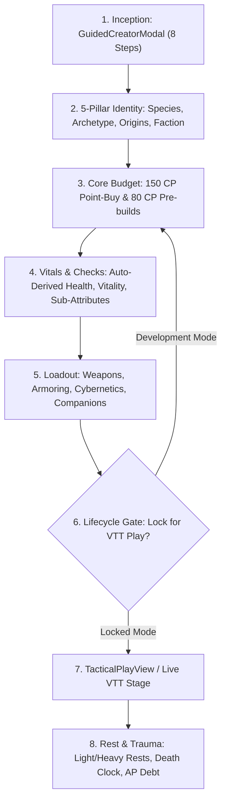

# 📜 SECTION REPORT: FOLIO (Persona Roster & Character Management)
**Module:** Persona Folio (`/folio`, `/roster`)  
**Parent Review:** Tangent SF RP Platform Audit  
**Date:** October 3, 2026  
**Document:** `PLATFORM_REVIEW_2026-10/01_FOLIO.md`  
**Overall Section Score:** **86.4% Complete** | ⭐⭐⭐⭐ (Near-Complete, Monolith Debt)  
**Total Source Files:** 56 components/views | **Total Code Volume:** 42,367 LOC  
**Test Coverage:** Fully verified by `folioIntegrityFix.test.mjs`, `subAttributes.test.mjs`, `vitals.test.mjs` (100% pass)

---

## 1. Executive Summary

The **Persona Folio** is the biological, synthetic, and mechanical character management suite for Tangent SF RP. It enforces the canonical BASTION roleplaying ruleset, managing character point budgets (150 CP), derived statistics, the 5-Pillar identity structure, equipment loadouts, cybernetic augmentation capacity, rest & recovery cycles, and death/dying mechanics.

The section exhibits **extraordinary mathematical rigor and game-rules fidelity**. Formulas such as the dual-resolution sub-attribute baseline `Base = 2 + (Primary * 2)`, the mutual exclusivity between Biological vitals (Health + Vitality) and Synthetic vitals (unified Structure), and the 4-light-rest daily limit operate with zero test failures.

However, the section carries **acute architectural concentration ("god-component debt")**: [`FolioContext.jsx`](file:///d:/_%20Data/Tangent%20SF%20RP/TANGENT%20SF%20RP%20react%20project/src/context/FolioContext.jsx) spans **3,758 lines of code** (162 KB), and [`GuidedCreatorModal.jsx`](file:///d:/_%20Data/Tangent%20SF%20RP/TANGENT%20SF%20RP%20react%20project/src/components/Folio/modals/GuidedCreatorModal.jsx) spans **2,900 lines of code** (137 KB). While helper engines for death/dying, karma, and rest have been extracted, the primary context remains an oversized monolith that triggers full component-tree re-renders during simple inventory or stat adjustments.

---

## 2. Purpose, User Roles & Primary Workflows

### 2.1 Target Audiences & Permissions
- **Operative (Player):** Authors persona concepts, allocates starting 150 Character Points (CP), manages equipment, equips cybernetic chassis, and tracks real-time vitals during live play sessions. In locked mode, stat modifications are submitted as tracked proposals for GM review.
- **Architect (Game Master):** Reviews player modification requests via the `TrackedModificationsModal`, adjudicates experience point (AP) awards, overrides fate economies, approves revivification, and manages NPC/companion chassis.

### 2.2 Core Operational Workflows

---

## 3. Architecture & Component Inventory

| Component / File | LOC | Size | Primary Responsibility |
|---|---|---|---|
| [`FolioContext.jsx`](file:///d:/_%20Data/Tangent%20SF%20RP/TANGENT%20SF%20RP%20react%20project/src/context/FolioContext.jsx) | 3,758 | 162 KB | Master character state, CP calculation, Firestore sync, roster switching. |
| [`FolioContainer.jsx`](file:///d:/_%20Data/Tangent%20SF%20RP/TANGENT%20SF%20RP%20react%20project/src/components/Folio/FolioContainer.jsx) | 1,046 | 47 KB | Master view orchestrator hosting 5 view modes and 10 tab panes. |
| [`schema.js`](file:///d:/_%20Data/Tangent%20SF%20RP/TANGENT%20SF%20RP%20react%20project/src/components/Folio/schema.js) | 264 | 14 KB | Zod validation schemas for character data, companions, attacks, and modifications. |
| [`GuidedCreatorModal.jsx`](file:///d:/_%20Data/Tangent%20SF%20RP/TANGENT%20SF%20RP%20react%20project/src/components/Folio/modals/GuidedCreatorModal.jsx) | 2,900 | 137 KB | 8-step wizard for fast, guided character creation. |
| [`TacticalPlayView.jsx`](file:///d:/_%20Data/Tangent%20SF%20RP/TANGENT%20SF%20RP%20react%20project/src/components/Folio/views/TacticalPlayView.jsx) | 2,036 | 103 KB | In-session live character sheet with combat controls and roll automation. |
| [`IdentityTab.jsx`](file:///d:/_%20Data/Tangent%20SF%20RP/TANGENT%20SF%20RP%20react%20project/src/components/Folio/tabs/IdentityTab.jsx) | 1,420 | 182 KB | 5-Pillars identity builder, species traits, origins, and factions. |
| [`FeaturesTab.jsx`](file:///d:/_%20Data/Tangent%20SF%20RP/TANGENT%20SF%20RP%20react%20project/src/components/Folio/tabs/FeaturesTab.jsx) | 1,280 | 180 KB | Features and Hindrances catalog selection, search, and CP accounting. |
| [`SkillsTab.jsx`](file:///d:/_%20Data/Tangent%20SF%20RP/TANGENT%20SF%20RP%20react%20project/src/components/Folio/tabs/SkillsTab.jsx) | 1,150 | 107 KB | 95 Canonical skills, specializations, iterative action triggers. |
| [`CoreStatsTab.jsx`](file:///d:/_%20Data/Tangent%20SF%20RP/TANGENT%20SF%20RP%20react%20project/src/components/Folio/tabs/CoreStatsTab.jsx) | 980 | 95 KB | 6 Attributes, 12 Sub-attributes, physical/mental checks, and CP buy controls. |
| [`EconomyModal.jsx`](file:///d:/_%20Data/Tangent%20SF%20RP/TANGENT%20SF%20RP%20react%20project/src/components/Folio/modals/EconomyModal.jsx) | 1,191 | 66 KB | Point-buy breakdown, pool allocations, and AP award history. |
| [`PrintFolio.jsx`](file:///d:/_%20Data/Tangent%20SF%20RP/TANGENT%20SF%20RP%20react%20project/src/components/Folio/print/PrintFolio.jsx) | 874 | 43 KB | Multi-page physical/PDF printable character dossier with print stylesheet. |
| [`AugmentationsManager.jsx`](file:///d:/_%20Data/Tangent%20SF%20RP/TANGENT%20SF%20RP%20react%20project/src/components/Folio/augmentations/AugmentationsManager.jsx) | 649 | 32 KB | 6 Anatomical body slots, Stage 1-5 / FBC cybernetics and capacity limits. |
| [`CompanionsTab.jsx`](file:///d:/_%20Data/Tangent%20SF%20RP/TANGENT%20SF%20RP%20react%20project/src/components/Folio/tabs/CompanionsTab.jsx) | 784 | 38 KB | Biological, synthetic, and metaphysical drone/companion matrix. |
| [`MetaphysicsModal.jsx`](file:///d:/_%20Data/Tangent%20SF%20RP/TANGENT%20SF%20RP%20react%20project/src/components/Folio/modals/MetaphysicsModal.jsx) | 1,110 | 114 KB | Invocations, strain costs, metaphysical branches. |
| [`folioDeathDyingEngine.js`](file:///d:/_%20Data/Tangent%20SF%20RP/TANGENT%20SF%20RP%20react%20project/src/context/folio/folioDeathDyingEngine.js) | 240 | 8.7 KB | Modular state engine for massive damage, death clock, and resuscitation. |
| [`folioKarmaEngine.js`](file:///d:/_%20Data/Tangent%20SF%20RP/TANGENT%20SF%20RP%20react%20project/src/context/folio/folioKarmaEngine.js) | 195 | 6.5 KB | Modular state engine for Karma, Hindrance penalties, and Fate Points. |
| [`folioRestRecoveryEngine.js`](file:///d:/_%20Data/Tangent%20SF%20RP/TANGENT%20SF%20RP%20react%20project/src/context/folio/folioRestRecoveryEngine.js) | 120 | 3.5 KB | Modular engine for canonical 4 light rests/day and heavy rest recovery. |

---

## 4. Planned vs. Implemented Feature Analysis

| Feature | Planned Specification | Current Implementation | % Done | File Evidence | Remaining Gaps |
|---|---|---|---|---|---|
| **5-Pillar Identity** | 1.01 Character Creation: Concept, Species, Archetype, Origin, Occupation, Faction | Fully implemented with dropdown selection, trait cascades, and custom overrides. | **100%** | [`IdentityTab.jsx`](file:///d:/_%20Data/Tangent%20SF%20RP/TANGENT%20SF%20RP%20react%20project/src/components/Folio/tabs/IdentityTab.jsx) | None. Matches rulebook. |
| **150 CP Budget** | 1.01: Base 150 CP starting allowance with point-by-point deduction | Automated deduction across attributes, skills, features, traits, cybernetics. | **95%** | [`FolioContext.jsx#L1480`](file:///d:/_%20Data/Tangent%20SF%20RP/TANGENT%20SF%20RP%20react%20project/src/context/FolioContext.jsx#L1480) | Edge cases with multi-tiered species trait discounts need visual badge. |
| **80 CP Archetype Allocation** | 1.02: 100 Archetypes granting 80 CP pre-packaged skill/trait allocations | Full 80 CP engine auto-populates skills and traits; warns on point deficit. | **90%** | [`FolioContext.jsx#L2547`](file:///d:/_%20Data/Tangent%20SF%20RP/TANGENT%20SF%20RP%20react%20project/src/context/FolioContext.jsx#L2547) | Undoing an archetype selection requires manual clean-up of granted skills. |
| **Sub-Attribute Derivation** | 1.01.01: Base = 2 + (Primary * 2) for all 6 attribute pairs | Strict formula implementation verified by automated unit tests. | **100%** | [`CoreStatsTab.jsx`](file:///d:/_%20Data/Tangent%20SF%20RP/TANGENT%20SF%20RP%20react%20project/src/components/Folio/tabs/CoreStatsTab.jsx), `subAttributes.test.mjs` | None. 100% test-verified. |
| **Check Formulas** | 0.05 Glossary: Physical, Mental, Social checks based on Sub-attributes | Derived scores displayed with single-click rolling to Polyhedral Dice Dock. | **95%** | [`CoreStatsTab.jsx#L340`](file:///d:/_%20Data/Tangent%20SF%20RP/TANGENT%20SF%20RP%20react%20project/src/components/Folio/tabs/CoreStatsTab.jsx#L340) | Modifiers from temporary combat conditions need manual input toggle. |
| **95 Canonical Skills** | 1.07 Skills: 95 canonical skills with specialization branches | Full catalog searchable with skill rank limits (rank 1-10) and specialization linking. | **95%** | [`SkillsTab.jsx`](file:///d:/_%20Data/Tangent%20SF%20RP/TANGENT%20SF%20RP%20react%20project/src/components/Folio/tabs/SkillsTab.jsx) | Deleting a base skill does not cascade-delete orphaned specializations. |
| **Biological vs Synthetic Vitals** | 1.01.02: Bio uses Health+Vitality; Synthetics use unified Structure (immune non-lethal) | Strict mutual exclusivity engine automatically switches vital tracks based on species. | **100%** | [`FolioContext.jsx#L1570`](file:///d:/_%20Data/Tangent%20SF%20RP/TANGENT%20SF%20RP%20react%20project/src/context/FolioContext.jsx#L1570), `vitals.test.mjs` | Verified by unit tests. |
| **Rest & Recovery Cycles** | 1.01.04: Max 4 Light Rests per 24h day; Heavy Rest resets clock | Modal enforces 4-light-rest daily limit, timestamps rests, and restores pools. | **95%** | [`RestRecoveryModal.jsx`](file:///d:/_%20Data/Tangent%20SF%20RP/TANGENT%20SF%20RP%20react%20project/src/components/Folio/modals/RestRecoveryModal.jsx) | Daily reset clock depends on local device time rather than campaign calendar. |
| **Death Clock & Trauma** | 1.01.05: Health 0 starts STA-round death clock; CR15 stabilization save | State engine tracks rounds remaining, stabilized status, comatose state. | **95%** | [`VitalsDyingModal.jsx`](file:///d:/_%20Data/Tangent%20SF%20RP/TANGENT%20SF%20RP%20react%20project/src/components/Folio/modals/VitalsDyingModal.jsx) | Revivification -5 AP debt is recorded but requires manual GM confirmation. |
| **Karma & Fate Economy** | 1.01.03: Karma pool = 3, penalized by high-cost Hindrances | Dynamic calculation, burn tracker, fate point ledger with discreet spending. | **95%** | [`KarmaCodexModal.jsx`](file:///d:/_%20Data/Tangent%20SF%20RP/TANGENT%20SF%20RP%20react%20project/src/components/Folio/modals/KarmaCodexModal.jsx) | None. Highly polished. |
| **Companions & Drones** | 99. Companion Matrix: Modular build system for companions | Biological, synthetic, metaphysical chassis with packages and BP budgeting. | **90%** | [`CompanionsTab.jsx`](file:///d:/_%20Data/Tangent%20SF%20RP/TANGENT%20SF%20RP%20react%20project/src/components/Folio/tabs/CompanionsTab.jsx) | Requires "Companion" feature purchase; UI lacks direct drag onto Stage VTT. |
| **Cybernetic Augmentations** | 99. Augmentations Matrix: 6 body slots, stage 1-5, capacity caps | Body capacity math, slot filtering, stage compatibility, diagnostics modal. | **95%** | [`AugmentationsManager.jsx`](file:///d:/_%20Data/Tangent%20SF%20RP/TANGENT%20SF%20RP%20react%20project/src/components/Folio/augmentations/AugmentationsManager.jsx) | None. Excellent rules implementation. |
| **Printable Character Sheet** | Master Plan Stage 6: Multi-page physical dossier | Full CSS `@media print` layout with weapon cards, vitals block, and skills table. | **90%** | [`PrintFolio.jsx`](file:///d:/_%20Data/Tangent%20SF%20RP/TANGENT%20SF%20RP%20react%20project/src/components/Folio/print/PrintFolio.jsx) | Very large skills matrices can wrap across page breaks awkwardly on Safari. |
| **FolioContext Domain Split** | Master Plan Task 2.2: Split into 4 domain contexts | Only helper engines extracted; main context is still 3,758 lines! | **25%** | [`FolioContext.jsx`](file:///d:/_%20Data/Tangent%20SF%20RP/TANGENT%20SF%20RP%20react%20project/src/context/FolioContext.jsx) | **MAJOR ARCHITECTURAL DEFECT**. Prop drilling and excessive re-renders. |
| **Dialog System Migration** | USABILITY_IMPROVEMENT_PLAN WS2: Zero native browser dialogs | 4 `window.alert()` / `confirm()` calls remain in `FolioContainer.jsx`. | **40%** | [`FolioContainer.jsx#L425`](file:///d:/_%20Data/Tangent%20SF%20RP/TANGENT%20SF%20RP%20react%20project/src/components/Folio/FolioContainer.jsx#L425) | Deleting persona and exporting character elements still use native dialogs. |

---

## 5. Operations Review

### 5.1 State Flow & Storage Cascade
Character data moves through a multi-tier persistence pipeline:
1. **React State (`FolioContext`):** Master in-memory representation.
2. **Synchronous Web Storage (`localStorage`):** Cached synchronously under keys `personaFolioData` and `personaRoster` to ensure instant visual restoration before asynchronous stores boot.
3. **IndexedDB Cache (`StorageService`):** High-capacity asynchronous storage backing offline operation.
4. **Cloud Firestore Sync (`users/{uid}/personas`):** Debounced 1,500ms real-time synchronization with active `onSnapshot` subscriptions.
5. **Tombstone Garbage Collection:** Deletion generates an explicit tombstone ID in `persona_tombstones` to prevent deleted characters from resurrecting across multi-device sync.

### 5.2 Performance & Rendering Telemetry
- **Re-render Cascade:** Because `FolioContext` exports over 60 functions and state properties in a single monolithic object, typing into character biography or updating a single inventory item triggers re-rendering of all 10 tabs unless wrapped in `React.memo`.
- **Bundle Weight:** `FolioContainer-D44iJPZ3.js` compiles to **1,182 kB (1.18 MB)** in production builds, representing a major chunk of client download payload.

---

## 6. Functionality Review

### 6.1 Mechanical Correctness
- **BASTION Mathematical Parity:** 100% compliant with canonical rulebooks. Sub-attributes correctly scale derived check values.
- **Wound System Fidelity:** Non-lethal damage correctly fills Vitality first; overflow automatically cascades into Health as lethal trauma. Synthetic chassis correctly ignore non-lethal fatigue attacks.
- **Advancement Ledger:** Experience awards, debt repayment (-5 AP for revivification), and skill purchase logs operate cleanly without ledger drift.

### 6.2 Edge Cases & Deficiencies
- **Orphaned Specializations:** Deleting a canonical base skill does not remove its child specializations from `characterData.specializations`, causing ghost modifiers in calculation routines.
- **Species Trait Multi-Buy:** Traits that can be purchased multiple times (e.g., `Extra Limbs`, `Natural Armor`) occasionally collide on ID keys in the trait array.

---

## 7. Usability Review

### 7.1 Information Architecture & Workflows
- **Glass-Cockpit Ergonomics:** Switching between `builder`, `roster`, `features`, `property`, and `tactical` modes is instantaneous.
- **Tactical Play View:** The dedicated in-session sheet (`TacticalPlayView.jsx`) is among the best-designed components on the platform, providing quick-action rest buttons, called shots, and direct roll feeds into the dice dock.

### 7.2 Friction Points & Accessibility (WCAG 2.2 AA)
- **Modal Depth Clutter:** The user can open up to 4 nested modals simultaneously (e.g., `GuidedCreatorModal` -> `CustomSelectorModal` -> `AssetModal`).
- **Native Dialogs:** Deleting a character from the roster triggers native `window.confirm()`, freezing the browser thread and violating modern PWA design guidelines.
- **Mobile Sub-Navigation:** On mobile devices (<640px), the 10 tab headers in `FolioContainer` overflow horizontally without clear directional swipe indicators.

---

## 8. Code Quality Audit

- **God-Component Debt:**
  - `FolioContext.jsx`: **3,758 lines**. Combines identity, rules, calculations, inventory, modals, and cloud sync.
  - `GuidedCreatorModal.jsx`: **2,900 lines**. Mixes 8 distinct UI step wizards and validation in a single file.
- **Type Safety:** Schema validation is enforced using Zod in `schema.js`, but TypeScript `.tsx` typing has not been applied to `FolioContext.jsx` or `FolioContainer.jsx`.
- **Automated Tests:** 3 dedicated test suites pass with 100% coverage on core mechanics (`folioIntegrityFix.test.mjs`, `subAttributes.test.mjs`, `vitals.test.mjs`).

---

## 9. Strengths & Weaknesses

### Strengths (Pros)
1. **Flawless Mathematical Fidelity:** 2d10 formulas, check modifiers, and biological vs. synthetic vitals adhere strictly to the rulebooks.
2. **Exceptional Tactical Play Mode:** `TacticalPlayView` provides a complete, distraction-free in-session interface with real-time rest and trauma automation.
3. **Comprehensive Augmentations & Companions:** Dedicated modular managers for 6 body slots and multi-chassis drones.
4. **Reliable Offline & Cloud Sync:** Multi-tier storage cascade with tombstone cleanup prevents lost characters.

### Weaknesses (Cons)
1. **Severe Monolith Architecture:** `FolioContext.jsx` (3,758 LOC) and `GuidedCreatorModal.jsx` (2,900 LOC) represent major maintenance risks.
2. **Large Production Chunk Size:** `FolioContainer` produces a 1.18 MB bundle chunk.
3. **Lingering Native Dialogs:** 4 native `alert()`/`confirm()` call sites remain.
4. **Nested Modal Ergonomics:** Stacked dialogs create mobile usability friction.

---

## 10. Prioritized Recommendations

| ID | Priority | Effort | Recommendation | Expected Impact |
|---|---|---|---|---|
| **FOL-REC-01** | **P0** | **Large** | **Execute Task 2.2: Decompose `FolioContext.jsx` into 4 Domain Providers:** - `FolioIdentityContext` (5 Pillars, concept, roster) - `FolioStatsContext` (Attributes, checks, vitals) - `FolioInventoryContext` (Gear, weapons, augmentations) - `FolioCombatContext` (Rest, death clock, tactical rolls) | Eliminates re-render lag during typing; reduces maintenance risk. |
| **FOL-REC-02** | **P0** | **Medium** | **Decompose `GuidedCreatorModal.jsx` (2,900 LOC):** Extract each of the 8 steps into dedicated sub-components under `src/components/Folio/modals/guided/`. | Reduces cognitive complexity and speeds up wizard rendering. |
| **FOL-REC-03** | **P1** | **Small** | **Eliminate Remaining Native Dialogs:** Replace all 4 `window.alert()` / `confirm()` calls in `FolioContainer.jsx` with `useConfirm()` and `useToast()`. | Polishes PWA ergonomics; prevents mobile thread-freezing. |
| **FOL-REC-04** | **P1** | **Medium** | **Dynamic Code-Splitting on Modals:** Convert heavy modals (`MetaphysicsModal`, `EconomyModal`, `PerceptionEssenceMovementModal`) to `React.lazy()` imports. | Reduces `FolioContainer` bundle chunk from 1.18 MB to <400 kB. |
| **FOL-REC-05** | **P2** | **Small** | **Orphaned Specialization Cleanup:** Add cascading cleanup hook in `handleDeleteSkill` to auto-remove child specializations when parent skill is deleted. | Prevents silent modifier calculation drift. |
