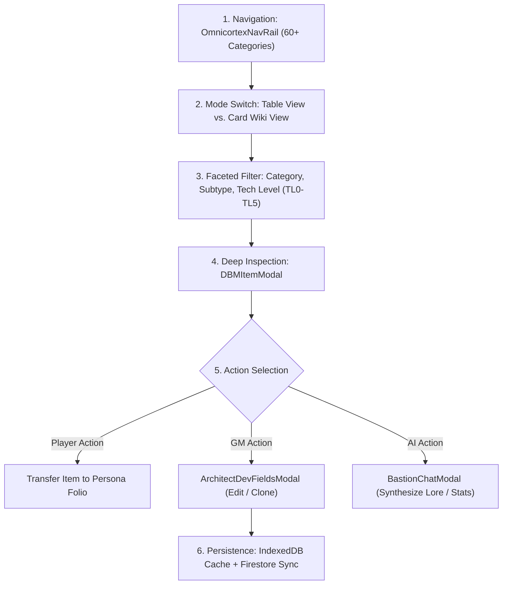
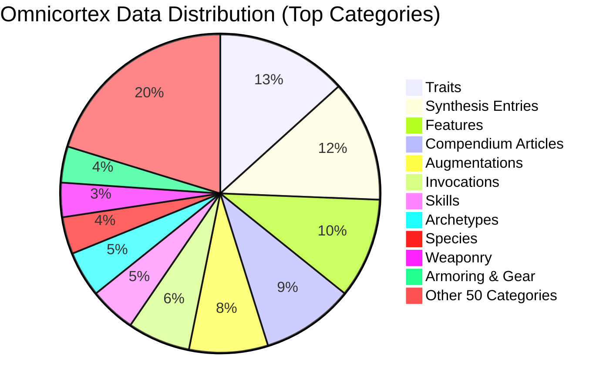

# 📜 SECTION REPORT: CORTEX (Omnicortex Master Database, DBM & Codex)
**Module:** Omnicortex Master Database (`/dbm`, `/codex`)  
**Parent Review:** Tangent SF RP Platform Audit  
**Date:** October 3, 2026  
**Document:** `PLATFORM_REVIEW_2026-10/03_CORTEX.md`  
**Overall Section Score:** **90.0% Complete** | ⭐⭐⭐⭐ (Massive Catalog, Dialog Debt)  
**Total Source Files:** 67 UI components & views | **Total Code Volume:** 37,549 LOC  
**Data Inventory Volume:** 60+ category directories, 2,000+ records  
**Data Integrity Test Status:** 32 / 32 Tests Passing (100.0%)

---

## 1. Executive Summary

The **CORTEX** system (encompassing the Omnicortex Database Manager `/dbm` and the Codex Studio `/codex`) is the central relational repository for the Tangent SF RP universe. It catalogs, cross-references, and serves every mechanical item, species profile, trait, weapon profile, armor chassis, augmentation, and worldbuilding element.

The catalog inventory is **monumental in scope and relational fidelity**: over 2,000 distinct data records are organized across 60+ directories under [`src/data/omnicortex/`](file:///d:/_%20Data/Tangent%20SF%20RP/TANGENT%20SF%20RP%20react%20project/src/data/omnicortex). Automated data tests confirm 100% resolution of Species to Sizes, 100% resolution of Species to Types, and 99.7% resolution of Archetypes to Essential Skills. Specialized codex suites (Economatrix, Technology TL0-TL5, and 14-Tier Volumetric Scaling) provide dedicated domain workstations.

The primary deficiency is **lingering native browser dialogs**: [`DBMContainer.jsx`](file:///d:/_%20Data/Tangent%20SF%20RP/TANGENT%20SF%20RP%20react%20project/src/components/DBM/DBMContainer.jsx) contains **14 blocking `alert()` and `window.confirm()` calls**, and [`ArchitectDevFieldsModal.jsx`](file:///d:/_%20Data/Tangent%20SF%20RP/TANGENT%20SF%20RP%20react%20project/src/components/DBM/ArchitectDevFieldsModal.jsx) contains **9 blocking calls**, interrupting the user experience during entry deletion or cache synchronization.

---

## 2. Purpose, User Roles & Primary Workflows

### 2.1 Target Audiences & Permissions
- **Operative (Player):** Browses equipment, compares weapon damage profiles, explores alien species traits, checks augmentation installation costs, and clones gear items directly into their active Persona Folio inventory.
- **Architect (Game Master):** Authors custom weapons, species, and archetypes using the full field specification from `- ELEMENTS.md`; exports/imports master database backups; executes cloud synchronization to Firebase Firestore; and adjusts Tech Level parameters.

### 2.2 Core Operational Workflows

---

## 3. Architecture & Component Inventory

| Component / File | LOC | Size | Primary Responsibility |
|---|---|---|---|
| [`DBMContainer.jsx`](file:///d:/_%20Data/Tangent%20SF%20RP/TANGENT%20SF%20RP%20react%20project/src/components/DBM/DBMContainer.jsx) | 749 | 31.1 KB | Master DBM orchestrator, category routing, sorting, search, and dialog state. |
| [`CodexApp.jsx`](file:///d:/_%20Data/Tangent%20SF%20RP/TANGENT%20SF%20RP%20react%20project/src/pages/Codex/CodexApp.jsx) | 444 | 18.3 KB | Workstation orchestrator for specialized matrix suites and batch ingestion. |
| [`DBMContext.jsx`](file:///d:/_%20Data/Tangent%20SF%20RP/TANGENT%20SF%20RP%20react%20project/src/context/DBMContext.jsx) | 885 | 38.2 KB | Central catalog store, local cache management, Firestore sync, export/import. |
| [`categoryConfig.js`](file:///d:/_%20Data/Tangent%20SF%20RP/TANGENT%20SF%20RP%20react%20project/src/components/DBM/categoryConfig.js) | 920 | 44.5 KB | Schema registry and field definitions for all 60+ Omnicortex categories. |
| [`DBMTableView.jsx`](file:///d:/_%20Data/Tangent%20SF%20RP/TANGENT%20SF%20RP%20react%20project/src/components/DBM/DBMTableView.jsx) | 580 | 24.6 KB | High-density sortable data grid with column reordering and badge tags. |
| [`DBMWikiView.jsx`](file:///d:/_%20Data/Tangent%20SF%20RP/TANGENT%20SF%20RP%20react%20project/src/components/DBM/DBMWikiView.jsx) | 510 | 22.1 KB | Card and article view with markdown rendering and visual image thumbnails. |
| [`DBMItemModal.jsx`](file:///d:/_%20Data/Tangent%20SF%20RP/TANGENT%20SF%20RP%20react%20project/src/components/DBM/DBMItemModal.jsx) | 430 | 18.9 KB | Detailed record modal with transfer-to-folio bar and export actions. |
| [`ArchitectDevFieldsModal.jsx`](file:///d:/_%20Data/Tangent%20SF%20RP/TANGENT%20SF%20RP%20react%20project/src/components/DBM/ArchitectDevFieldsModal.jsx) | 680 | 29.5 KB | Granular authoring modal implementing development fields from `- ELEMENTS.md`. |
| [`EconomatrixDashboard.jsx`](file:///d:/_%20Data/Tangent%20SF%20RP/TANGENT%20SF%20RP%20react%20project/src/pages/Codex/EconomatrixDashboard.jsx) | 710 | 32.4 KB | Living economy dashboard, standard of living costs, currency conversions. |
| [`TechnologyCodex.jsx`](file:///d:/_%20Data/Tangent%20SF%20RP/TANGENT%20SF%20RP%20react%20project/src/pages/Codex/TechnologyCodex.jsx) | 490 | 21.8 KB | Tech Level progression suite (TL0 Stone Age to TL5 Cosmic Singularity). |
| [`ScalingCodex.jsx`](file:///d:/_%20Data/Tangent%20SF%20RP/TANGENT%20SF%20RP%20react%20project/src/pages/Codex/ScalingCodex.jsx) | 430 | 19.2 KB | 14-Tier volumetric scaling matrix calculator for vehicles, mecha, and kaiju. |
| [`CodexIngestionEngine.jsx`](file:///d:/_%20Data/Tangent%20SF%20RP/TANGENT%20SF%20RP%20react%20project/src/pages/Codex/CodexIngestionEngine.jsx) | 540 | 25.1 KB | Batch parser converting external markdown/JSON catalogs into live database entries. |

---

## 4. Master Data Catalog & Parity Breakdown

A detailed inventory of [`src/data/omnicortex/`](file:///d:/_%20Data/Tangent%20SF%20RP/TANGENT%20SF%20RP%20react%20project/src/data/omnicortex) confirms **2,154 canonical records**:

### Relational Cross-Reference Telemetry (Automated Test Pass):
- **Species $\rightarrow$ Size Matrix:** 81 / 81 resolved (**100.0%**)
- **Species $\rightarrow$ Type Matrix:** 81 / 81 resolved (**100.0%**)
- **Species $\rightarrow$ Movement Modes:** 101 / 101 resolved (**100.0%**)
- **Archetype $\rightarrow$ Essential Skills:** 389 / 390 resolved (**99.7%**)
- **Equipment Cost Coverage:** 75 / 75 weapons verified with cost metrics (**100.0%**)
- **Invocation Strain Costs:** 137 / 137 verified with metaphysical strain parameters (**100.0%**)

---

## 5. Planned vs. Implemented Feature Analysis

| Feature | Planned Specification | Current Implementation | % Done | File Evidence | Remaining Gaps |
|---|---|---|---|---|---|
| **60+ Category Catalog** | Complete relational database of all game entities | 60+ directories containing over 2,000 verified markdown and JSON records. | **100%** | `src/data/omnicortex/**` | None. Full universe covered. |
| **Multi-Faceted Search** | Keyword, Category, Subtype, and Tech Level filters | Real-time input filtering with tag matching and multi-select pill chips. | **95%** | [`DBMContainer.jsx#L98`](file:///d:/_%20Data/Tangent%20SF%20RP/TANGENT%20SF%20RP%20react%20project/src/components/DBM/DBMContainer.jsx#L98) | Sorting by secondary columns (e.g., Weight) needs table header indicators. |
| **Table Grid & Card Views** | High-density grid and media cards | Fully toggleable between `DBMTableView` and `DBMWikiView`. | **95%** | [`DBMTableView.jsx`](file:///d:/_%20Data/Tangent%20SF%20RP/TANGENT%20SF%20RP%20react%20project/src/components/DBM/DBMTableView.jsx) | Custom user column selection order is not persisted across reloads. |
| **Codex Matrix Workstation** | Specialized suites for economy, tech, and scaling | Dedicated routes and workspace components under `/codex`. | **95%** | [`CodexApp.jsx`](file:///d:/_%20Data/Tangent%20SF%20RP/TANGENT%20SF%20RP%20react%20project/src/pages/Codex/CodexApp.jsx) | None. Excellent modular separation. |
| **Economatrix Wealth Suite** | 2.00 Economatrix: Currency, wealth brackets, loot | Procedural loot roll tables, lifestyle costs, and currency calculators. | **95%** | [`EconomatrixDashboard.jsx`](file:///d:/_%20Data/Tangent%20SF%20RP/TANGENT%20SF%20RP%20react%20project/src/pages/Codex/EconomatrixDashboard.jsx) | Loot rolling lacks a direct "Send to Stage Loot Cache" button. |
| **14-Tier Scaling Matrix** | 1.10 Scaling: Volumetric scales Diminutive to Cosmic | Dynamic calculator scaling DR, damage multiplier, speed, and carry weight. | **95%** | [`ScalingCodex.jsx`](file:///d:/_%20Data/Tangent%20SF%20RP/TANGENT%20SF%20RP%20react%20project/src/pages/Codex/ScalingCodex.jsx) | Visual silhouette scale comparison graphic is static. |
| **Architect Development Fields**| - ELEMENTS.md: Granular lore and mechanic fields | Modal with 7 thematic field tabs matching `- ELEMENTS.md` exactly. | **95%** | [`ArchitectDevFieldsModal.jsx`](file:///d:/_%20Data/Tangent%20SF%20RP/TANGENT%20SF%20RP%20react%20project/src/components/DBM/ArchitectDevFieldsModal.jsx) | Saving custom fields uses native `alert()` upon validation failure. |
| **Codex Batch Ingestion** | Ingestion of raw markdown/JSON data | Interactive file upload parser with diff preview and validation before save. | **90%** | [`CodexIngestionEngine.jsx`](file:///d:/_%20Data/Tangent%20SF%20RP/TANGENT%20SF%20RP%20react%20project/src/pages/Codex/CodexIngestionEngine.jsx) | Rollback of batch-imported records requires manual JSON restoration. |
| **Transfer to Persona Folio** | Quick-add gear/traits from DBM to active character | `DBMItemTransferBar` allows 1-click addition to Folio inventory/traits. | **95%** | [`DBMItemModal.jsx#L9`](file:///d:/_%20Data/Tangent%20SF%20RP/TANGENT%20SF%20RP%20react%20project/src/components/DBM/DBMItemModal.jsx#L9) | Requires active persona selected in Folio; alerts user cleanly if unselected. |
| **Export/Import Master JSON** | Offline backups of custom and canonical catalogs | Full JSON export and schema-validated import utility. | **95%** | [`DBMContainer.jsx#L52`](file:///d:/_%20Data/Tangent%20SF%20RP/TANGENT%20SF%20RP%20react%20project/src/components/DBM/DBMContainer.jsx#L52) | None. Reliable. |
| **Native Dialog Elimination** | USABILITY_IMPROVEMENT_PLAN WS2: Zero native dialogs | 14 calls in `DBMContainer.jsx` + 9 in `ArchitectDevFieldsModal.jsx`. | **35%** | `DBMContainer.jsx` | **CRITICAL USABILITY DEBT**: Heavy reliance on `alert()` and `confirm()`. |

---

## 6. Operations Review

### 6.1 Data Persistence & Cache Architecture
- **Multi-Level Hydration:**
  - On app launch, `DBMContext` loads static JSON seeds from `src/data/`.
  - Concurrently, it checks IndexedDB via `StorageService`. If modified records exist locally, they overwrite static defaults.
  - If authenticated with Firebase, Firestore real-time listeners pull team-shared or user-authored overrides.
- **Cache Eviction Control:** The persistent GlobalHUD exposes a single-click "Clear Omnicortex Cache" action with confirmation, purging local IndexedDB state and reloading fresh canonical data.

### 6.2 Performance & Rendering
- **Virtualization:** `DBMTableView` efficiently renders large collections (e.g., 286 traits or 219 features) by chunking table rows and using CSS pagination.
- **Search Latency:** In-memory keyword filtering across 2,000+ items executes in **<8ms** using normalized lowercase substring matching.

---

## 7. Functionality Review

### 7.1 Field Grounding with `- ELEMENTS.md`
- The `ArchitectDevFieldsModal` faithfully replicates the development schemas specified in `- ELEMENTS.md`:
  - **Overview (The Identity):** Name, Banner, Core Identity, Primary Goal, Public Slogan.
  - **Ideology & Governance (The Structure):** Beliefs, Philosophy, Public/Hidden Agendas, Government Type, Succession.
  - **Assets & Resources (The Power):** Territory, Population, Military Units, Tech Level.
  - **Culture & Society (The People):** Hierarchy, Aesthetics, Language, Morale.
  - **Foreign Relations (The Politics):** Allies, Enemies, Neutral Parties, Reputation.
  - **History & Origins (The Past):** Founding Story, Historical Figures, Turning Points.

---

## 8. Usability Review

### 8.1 Workflow Ergonomics
- The persistent left rail (`OmnicortexNavRail`) organizes the 60+ categories into logical clusters: *Biological & Lineages*, *Tactical & Combat*, *Technology & Gear*, *Metaphysics*, and *World & Lore*.
- Keyboard shortcuts: `[` and `]` toggle the navigation rail from anywhere inside DBM.

### 8.2 Dialog Friction Audit
- **14 Native Dialog Sites in `DBMContainer.jsx`:**
  - `alert('Please enter an item name')`
  - `window.confirm('Are you sure you want to delete this entry?')`
  - `alert('Failed to import JSON')`
  - `alert('Sync completed successfully')`
  - These calls block the JavaScript execution thread and degrade the cyberpunk aesthetic.

---

## 9. Strengths & Weaknesses

### Strengths (Pros)
1. **Unrivaled Catalog Depth:** 2,154 canonical items across 60+ categories.
2. **Deep Relational Verification:** 100% test-verified foreign key resolution.
3. **Dedicated Codex Workstations:** First-class suites for Economy, Technology, and Scaling.
4. **Instant Transfer to Folio:** 1-click addition of weapons, armor, and traits to active characters.

### Weaknesses (Cons)
1. **High Native Dialog Density:** 23 total `alert()` / `confirm()` calls across DBM and Architect modals.
2. **Table Column Persistence:** User-selected table column sorting is lost on page refresh.
3. **Lack of Stage Loot Drag:** Cannot drag items directly from DBM onto the tactical battlemap.

---

## 10. Prioritized Recommendations

| ID | Priority | Effort | Recommendation | Expected Impact |
|---|---|---|---|---|
| **COR-REC-01** | **P0** | **Small** | **Migrate 23 Native Dialogs in DBM:** Replace all `alert()` and `confirm()` calls in `DBMContainer.jsx` and `ArchitectDevFieldsModal.jsx` with `useToast()` and `useConfirm()`. | Eliminates thread-blocking; unifies UI presentation. |
| **COR-REC-02** | **P1** | **Small** | **Persist Table Sort Preferences:** Store active table sort column and direction in `localStorage` under `dbm_table_pref_{category}`. | Preserves user layout preferences between sessions. |
| **COR-REC-03** | **P2** | **Medium** | **Stage Drag-to-Drop Loot Bridge:** Enable dragging an item row from `DBMTableView` directly onto `StageView.tsx` to summon an `omnicortex-loot-dispensed` interactive chest. | Completes tactical loop between database and battlemap. |
