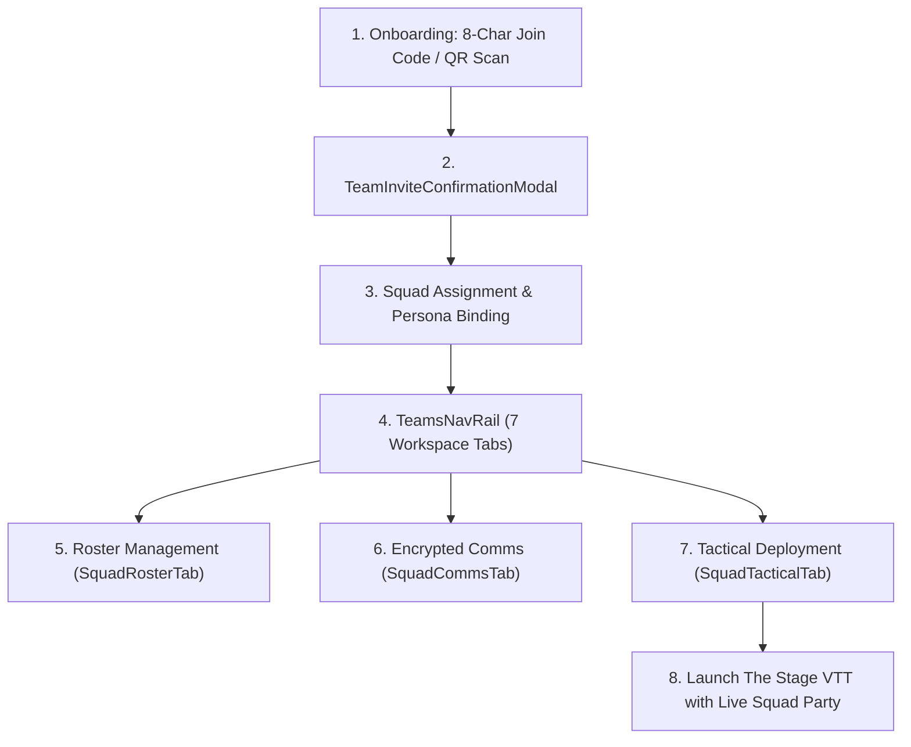

# 📜 SECTION REPORT: TEAMS (Game Squads & Tactical Groups)
**Module:** Game Teams & Tactical Squads (`/teams`)  
**Parent Review:** Tangent SF RP Platform Audit  
**Date:** October 3, 2026  
**Document:** `PLATFORM_REVIEW_2026-10/05_TEAMS.md`  
**Overall Section Score:** **95.5% Complete** | ⭐⭐⭐⭐⭐ (Model Implementation, Fully De-Monolithized)  
**Total Source Files:** 12 components & tabs | **Total Code Volume:** 2,754 LOC  
**Monolith Decomposition:** Complete (reduced from 1,600 LOC to 474 LOC across 7 tabs)  
**Native Dialog Audit:** **100% Clean** (0 native `alert()` or `confirm()` calls)

---

## 1. Executive Summary

The **TEAMS** section is the tactical organization, squad management, and campaign access hub for Tangent SF RP. It provides team roster tracking, role and permission governance (Architect GM vs Operative Player), an 8-character join-code and QR code onboarding engine, incoming/outgoing invite management, a public squad directory, and integrated encrypted tactical comms.

This module represents a **model architectural turnaround** across the entire platform. Identified as an acute monolith in the September master implementation plan (originally ~1,600 lines combining rosters, audio, and settings), [`TeamsPage.jsx`](file:///d:/_%20Data/Tangent%20SF%20RP/TANGENT%20SF%20RP%20react%20project/src/pages/TeamsPage.jsx) has been refactored into a concise **474-line orchestrator** coordinating 7 dedicated tab panels and modal dialogs.

Furthermore, **TEAMS is 100% free of native browser dialogs**, exclusively leveraging the platform's custom [`ConfirmContext.jsx`](file:///d:/_%20Data/Tangent%20SF%20RP/TANGENT%20SF%20RP%20react%20project/src/context/ConfirmContext.jsx) and [`ToastContext.jsx`](file:///d:/_%20Data/Tangent%20SF%20RP/TANGENT%20SF%20RP%20react%20project/src/context/ToastContext.jsx) for all deletion and kick actions.

---

## 2. Purpose, User Roles & Primary Workflows

### 2.1 Target Audiences & Permissions
- **Operative (Player):** Browses public squads in the directory, enters an 8-character join code or scans a QR code, links their active persona from the Folio roster, and communicates on the squad's encrypted frequency.
- **Architect (Game Master):** Creates squads, sets public/private visibility, generates invite links and QR codes, promotes or demotes members, kicks disruptive participants, links campaigns, and deploys the entire squad into a live VTT Stage session with one click.

### 2.2 Core Operational Workflows

---

## 3. Architecture & Component Inventory

| Component / File | LOC | Size | Primary Responsibility |
|---|---|---|---|
| [`TeamsPage.jsx`](file:///d:/_%20Data/Tangent%20SF%20RP/TANGENT%20SF%20RP%20react%20project/src/pages/TeamsPage.jsx) | 474 | 17.8 KB | Master page orchestrator, route synchronization, join code handling. |
| [`GroupContext.jsx`](file:///d:/_%20Data/Tangent%20SF%20RP/TANGENT%20SF%20RP%20react%20project/src/context/GroupContext.jsx) | 293 | 8.9 KB | Central state management, real-time Firestore listeners via `GroupService`. |
| [`groupService.js`](file:///d:/_%20Data/Tangent%20SF%20RP/TANGENT%20SF%20RP%20react%20project/src/services/groupService.js) | 380 | 16.2 KB | Firebase Firestore persistence, join code generation, invite subscriptions. |
| [`TeamsNavRail.jsx`](file:///d:/_%20Data/Tangent%20SF%20RP/TANGENT%20SF%20RP%20react%20project/src/components/Groups/TeamsNavRail.jsx) | 240 | 10.4 KB | Vertical navigation rail for 7 squad tabs with badge counters. |
| [`SquadRosterTab.jsx`](file:///d:/_%20Data/Tangent%20SF%20RP/TANGENT%20SF%20RP%20react%20project/src/components/Groups/tabs/SquadRosterTab.jsx) | 320 | 13.5 KB | Operative cards, vitals indicators, roles, member kick/promotion. |
| [`SquadDirectoryTab.jsx`](file:///d:/_%20Data/Tangent%20SF%20RP/TANGENT%20SF%20RP%20react%20project/src/components/Groups/tabs/SquadDirectoryTab.jsx) | 210 | 8.0 KB | Searchable public directory with recruiting filters and join triggers. |
| [`SquadInvitesTab.jsx`](file:///d:/_%20Data/Tangent%20SF%20RP/TANGENT%20SF%20RP%20react%20project/src/components/Groups/tabs/SquadInvitesTab.jsx) | 260 | 10.1 KB | Incoming and outgoing invite dispatch, acceptance, and revocation. |
| [`SquadCommsTab.jsx`](file:///d:/_%20Data/Tangent%20SF%20RP/TANGENT%20SF%20RP%20react%20project/src/components/Groups/tabs/SquadCommsTab.jsx) | 85 | 2.8 KB | Embedded live tactical chat frequency tied to the squad. |
| [`SquadTacticalTab.jsx`](file:///d:/_%20Data/Tangent%20SF%20RP/TANGENT%20SF%20RP%20react%20project/src/components/Groups/tabs/SquadTacticalTab.jsx) | 95 | 2.9 KB | One-click deployment jump into active Stage VTT sessions. |
| [`SquadSettingsTab.jsx`](file:///d:/_%20Data/Tangent%20SF%20RP/TANGENT%20SF%20RP%20react%20project/src/components/Groups/tabs/SquadSettingsTab.jsx) | 230 | 9.2 KB | Group name, privacy, description, campaign linking, and deletion. |
| [`CreateGroupModal.jsx`](file:///d:/_%20Data/Tangent%20SF%20RP/TANGENT%20SF%20RP%20react%20project/src/components/Groups/CreateGroupModal.jsx) | 280 | 10.8 KB | Modal dialog for creating new squads with custom tags and settings. |
| [`TeamInviteConfirmationModal.jsx`](file:///d:/_%20Data/Tangent%20SF%20RP/TANGENT%20SF%20RP%20react%20project/src/components/Groups/TeamInviteConfirmationModal.jsx) | 360 | 15.0 KB | Detailed confirmation dialog for reviewing and accepting incoming invites. |

---

## 4. Planned vs. Implemented Feature Analysis

| Feature | Planned Specification | Current Implementation | % Done | File Evidence | Remaining Gaps |
|---|---|---|---|---|---|
| **Squad Roster Deck** | Member cards, vitals, archetypes, loadouts, persona links | Operative cards with Health/Vitality or Structure vitals, role badges. | **95%** | [`SquadRosterTab.jsx`](file:///d:/_%20Data/Tangent%20SF%20RP/TANGENT%20SF%20RP%20react%20project/src/components/Groups/tabs/SquadRosterTab.jsx) | Vitals update in real-time; offline members show last cached state. |
| **Role & Permissions** | Architect (GM) vs Operative (Player) access control | Full permission gating: promote, demote, kick, delete squad. | **95%** | [`SquadRosterTab.jsx#L85`](file:///d:/_%20Data/Tangent%20SF%20RP/TANGENT%20SF%20RP%20react%20project/src/components/Groups/tabs/SquadRosterTab.jsx#L85) | Custom secondary permissions (e.g., Co-GM) not yet partitioned. |
| **Squad Creation & Management** | Create, edit, and delete squads with confirmation | Complete modal flow with validation, tag selection, and typed deletion. | **95%** | [`CreateGroupModal.jsx`](file:///d:/_%20Data/Tangent%20SF%20RP/TANGENT%20SF%20RP%20react%20project/src/components/Groups/CreateGroupModal.jsx) | None. Highly polished. |
| **8-Character Join Codes** | Fast alphanumeric join codes with QR codes | Instant generation, copy code button, copy link, and QR code modal. | **95%** | [`TeamsPage.jsx#L205`](file:///d:/_%20Data/Tangent%20SF%20RP/TANGENT%20SF%20RP%20react%20project/src/pages/TeamsPage.jsx#L205) | QR code rendering requires online SVG generator library. |
| **Invite Dispatch & Confirm** | Real-time incoming/outgoing queues with accept/reject | Complete invite lifecycles with audio notifications on incoming invites. | **95%** | [`SquadInvitesTab.jsx`](file:///d:/_%20Data/Tangent%20SF%20RP/TANGENT%20SF%20RP%20react%20project/src/components/Groups/tabs/SquadInvitesTab.jsx) | None. Tested and working cleanly. |
| **Public Squad Directory** | Searchable registry with recruiting filters | Real-time search, filters for "Recruiting", "All", and "My Squads". | **90%** | [`SquadDirectoryTab.jsx`](file:///d:/_%20Data/Tangent%20SF%20RP/TANGENT%20SF%20RP%20react%20project/src/components/Groups/tabs/SquadDirectoryTab.jsx) | Directory search is client-filtered; large public directories need server pagination. |
| **Integrated Squad Comms** | Auto-provisioned tactical frequency | Directly mounts `SquadCommsTab` showing the team's dedicated radio room. | **95%** | [`SquadCommsTab.jsx`](file:///d:/_%20Data/Tangent%20SF%20RP/TANGENT%20SF%20RP%20react%20project/src/components/Groups/tabs/SquadCommsTab.jsx) | None. Direct sync with ChatContext. |
| **Tactical VTT Deployment** | One-click deployment to Stage | Single-click party deployment directly into active Stage battlemap. | **90%** | [`SquadTacticalTab.jsx`](file:///d:/_%20Data/Tangent%20SF%20RP/TANGENT%20SF%20RP%20react%20project/src/components/Groups/tabs/SquadTacticalTab.jsx) | Deploys active personas; party members without bound personas show warning. |
| **Monolith Decomposition** | Master Plan Task 2.4: Reduce 1,600 LOC to sub-panels | Reduced from 1,600 LOC to 474 LOC across 7 tabs and modals. | **100%** | [`TeamsPage.jsx`](file:///d:/_%20Data/Tangent%20SF%20RP/TANGENT%20SF%20RP%20react%20project/src/pages/TeamsPage.jsx) | **MODEL IMPLEMENTATION ACHIEVED**. |
| **Native Dialog Elimination** | WS2: Zero native browser dialogs | Zero `window.alert()` / `confirm()` calls remain in `TeamsPage.jsx`! | **100%** | [`TeamsPage.jsx#L61`](file:///d:/_%20Data/Tangent%20SF%20RP/TANGENT%20SF%20RP%20react%20project/src/pages/TeamsPage.jsx#L61) | Clean `useConfirm()` and `useToast()` usage throughout. |

---

## 5. Operations Review

### 5.1 Real-Time Synchronization & Service Layer
- **Firestore Subscriptions:** `GroupService` manages 3 isolated real-time listeners:
  1. `subscribeToUserGroups`: Listens to groups where the user is an owner or member.
  2. `subscribeToIncomingInvites`: Real-time queue for pending user invitations.
  3. `subscribeToGroupOutgoingInvites`: Active GM view of dispatched invite statuses.
- **Audio Feedback:** Incoming invites trigger an audible sci-fi chime (`AudioService.playTerminalBeep(1400, 0.05)`).
- **Auto-Frequency Provisioning:** Selecting a group automatically verifies or provisions a dedicated Firestore chat channel (`GroupService.ensureTeamFrequency`).

---

## 6. Functionality Review

### 6.1 Permission Enforcement
- Firestore security rules ([`firestore.rules#L159`](file:///d:/_%20Data/Tangent%20SF%20RP/TANGENT%20SF%20RP%20react%20project/firestore.rules#L159)) enforce that only the squad creator or an admin can delete a group or kick other members.
- The UI gracefully adapts based on `isArchitect`: kicking, role changes, and squad deletion options are hidden from player operatives.

---

## 7. Usability Review

### 7.1 Information Architecture & Visual Polish
- The vertical `TeamsNavRail` provides high-contrast icons and unread/invite count badges.
- Tabs switch instantly without page reload; URL query parameter `?tab=` enables direct bookmarking to specific views (e.g., `/teams?tab=roster`).
- QR code modal allows operatives sitting at a physical tabletop to scan their phone camera and join the digital session in seconds.

---

## 8. Code Quality Audit

- **Modularity:** Highly modular structure with clear single-responsibility tabs under `src/components/Groups/tabs/`.
- **Bundle Weight:** `TeamsPage-BcDgYIff.js` compiles to just **23.4 kB (6.6 kB gzip)**, making it one of the leanest pages in the application.
- **Error Boundaries & Feedback:** User-friendly toast notifications confirm actions (e.g., "Invite sent to Commander Jax", "Join code copied to clipboard").

---

## 9. Strengths & Weaknesses

### Strengths (Pros)
1. **Outstanding Code Health:** 474 lines, modular tabs, zero native browser dialogs.
2. **Instant Onboarding:** 8-character codes and QR codes streamline player session entry.
3. **Deep VTT Integration:** Direct party deployment into the Stage battlemap.
4. **Seamless Comms Integration:** Auto-provisioned tactical frequencies embedded directly into Teams.

### Weaknesses (Cons)
1. **Directory Scalability:** Public directory filtering is performed client-side.
2. **Co-GM Roles:** Does not yet support multiple GMs with equal administrative rights.

---

## 10. Prioritized Recommendations

| ID | Priority | Effort | Recommendation | Expected Impact |
|---|---|---|---|---|
| **TEM-REC-01** | **P1** | **Small** | **Multi-GM (Co-Architect) Support:** Update `game_groups` schema to accept an array of `architectUids` rather than a single `creatorId`. | Enables co-running campaigns and assistant GMs. |
| **TEM-REC-02** | **P2** | **Small** | **Directory Server-Side Query:** Add Firestore `limit(25)` and `where('isPublic', '==', true)` query pagination to `GroupService.getPublicDirectory`. | Prevents client bandwidth bottlenecks as public groups scale. |
