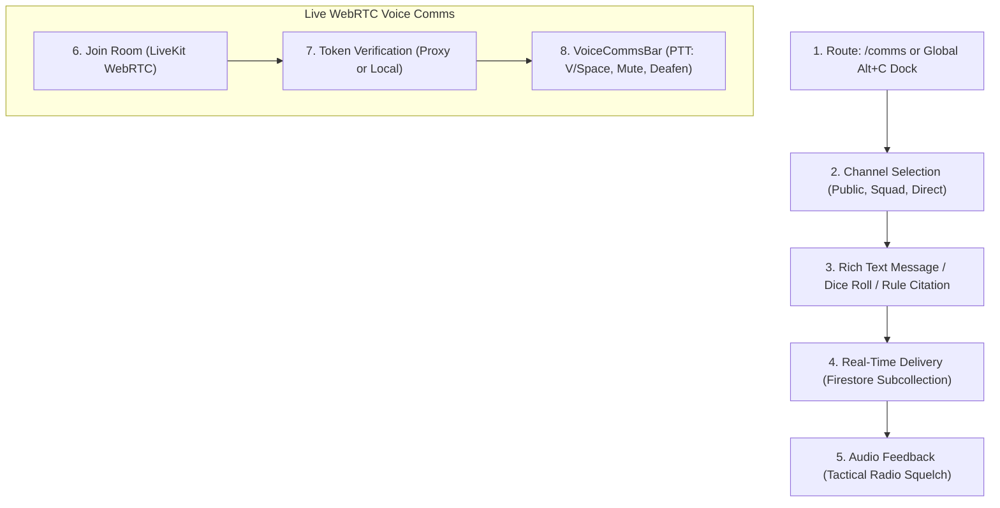

# 📜 SECTION REPORT: COMMS (Voice, Text Chat, CommLink Dock & Broadcasts)
**Module:** Tactical Communications (`/comms`, Global CommLink Dock `Alt+C`)  
**Parent Review:** Tangent SF RP Platform Audit  
**Date:** October 3, 2026  
**Document:** `PLATFORM_REVIEW_2026-10/06_COMMS.md`  
**Overall Section Score:** **90.8% Complete** | ⭐⭐⭐⭐ (Voice Active, Cloud Auth Gap)  
**Total Source Files:** 16 components & services | **Total Code Volume:** 7,350 LOC  
**Security Status:** **ATTENTION REQUIRED** (Cloud Function LiveKit proxy missing user authentication check)

---

## 1. Executive Summary

The **COMMS** section provides the real-time communications infrastructure for Tangent SF RP, encompassing multi-channel encrypted text messaging, dice roll broadcasting, a global floating CommLink dock accessible from all routes ([`CommLinkDock.jsx`](file:///d:/_%20Data/Tangent%20SF%20RP/TANGENT%20SF%20RP%20react%20project/src/components/UI/CommLinkDock.jsx)), global system broadcast banners ([`HomeMessageBanner.jsx`](file:///d:/_%20Data/Tangent%20SF%20RP/TANGENT%20SF%20RP%20react%20project/src/components/Hub/HomeMessageBanner.jsx)), and a low-latency WebRTC voice communication bar ([`VoiceCommsBar.jsx`](file:///d:/_%20Data/Tangent%20SF%20RP/TANGENT%20SF%20RP%20react%20project/src/components/Chat/VoiceCommsBar.jsx)) backed by LiveKit.

The user interface and ergonomics are **superb**: pressing `Alt+C` summons the floating CommLink dock anywhere across the app without navigating away from character sheets or battlemaps; tactical radio sound effects (`AudioService`) emulate sci-fi squelches and chimes; and unread activity triggers glowing amber pulse indicators on the persistent navigation rails.

However, a **critical production security vulnerability** requires remediation: while a backend Cloud Function proxy (`getLiveKitToken`) exists in [`functions/index.js`](file:///d:/_%20Data/Tangent%20SF%20RP/TANGENT%20SF%20RP%20react%20project/functions/index.js), it does **not** verify caller authentication (`context.auth`), functioning as an open HTTP endpoint. Furthermore, the client service ([`livekitTokenService.js`](file:///d:/_%20Data/Tangent%20SF%20RP/TANGENT%20SF%20RP%20react%20project/src/services/livekitTokenService.js)) retains a client-side Web Crypto fallback that references `VITE_LIVEKIT_API_SECRET`, risking secret exposure in client production bundles.

---

## 2. Purpose, User Roles & Primary Workflows

### 2.1 Target Audiences & Permissions
- **Operative (Player):** Sends tactical radio barks, shares dice roll results into chat, communicates via Push-To-Talk WebRTC voice, reviews GM notes in the Persona Audit Log, and monitors squad channels.
- **Architect (Game Master):** Broadcasts global system banners to all connected players, configures channel access parameters, monitors player radio traffic, and sends whispers or direct messages to individual operatives.

### 2.2 Core Operational Workflows

---

## 3. Architecture & Component Inventory

| Component / File | LOC | Size | Primary Responsibility |
|---|---|---|---|
| [`CommsPage.jsx`](file:///d:/_%20Data/Tangent%20SF%20RP/TANGENT%20SF%20RP%20react%20project/src/pages/CommsPage.jsx) | 246 | 11.4 KB | Master workstation orchestrator delegating to specialized sidebars and chat view. |
| [`ChatContext.jsx`](file:///d:/_%20Data/Tangent%20SF%20RP/TANGENT%20SF%20RP%20react%20project/src/context/ChatContext.jsx) | 882 | 34.5 KB | Central text messaging state, unread counters, channel subscriptions. |
| [`VoiceChatContext.jsx`](file:///d:/_%20Data/Tangent%20SF%20RP/TANGENT%20SF%20RP%20react%20project/src/context/VoiceChatContext.jsx) | 319 | 12.8 KB | LiveKit WebRTC client lifecycle, speaker detection, push-to-talk event listener. |
| [`VoiceCommsBar.jsx`](file:///d:/_%20Data/Tangent%20SF%20RP/TANGENT%20SF%20RP%20react%20project/src/components/Chat/VoiceCommsBar.jsx) | 331 | 14.5 KB | Persistent floating voice bar with PTT status, mic/headphone toggles, settings. |
| [`CommLinkDock.jsx`](file:///d:/_%20Data/Tangent%20SF%20RP/TANGENT%20SF%20RP%20react%20project/src/components/UI/CommLinkDock.jsx) | 278 | 11.9 KB | Global floating communications dock invoked via `Alt+C` or GlobalHUD button. |
| [`MessageView.jsx`](file:///d:/_%20Data/Tangent%20SF%20RP/TANGENT%20SF%20RP%20react%20project/src/components/Chat/MessageView.jsx) | 1,450 | 61.4 KB | Virtualized message list with markdown parsing, dice embeds, and rule chips. |
| [`MessageInput.jsx`](file:///d:/_%20Data/Tangent%20SF%20RP/TANGENT%20SF%20RP%20react%20project/src/components/Chat/MessageInput.jsx) | 710 | 29.5 KB | Text input supporting multi-line editing, slash commands (`/roll`), and attachments. |
| [`ChannelSidebar.jsx`](file:///d:/_%20Data/Tangent%20SF%20RP/TANGENT%20SF%20RP%20react%20project/src/components/Chat/ChannelSidebar.jsx) | 490 | 20.4 KB | Channel list with category grouping, active indicators, and unread badges. |
| [`PersonaAuditLogSidebar.jsx`](file:///d:/_%20Data/Tangent%20SF%20RP/TANGENT%20SF%20RP%20react%20project/src/components/Chat/PersonaAuditLogSidebar.jsx) | 240 | 9.4 KB | Side panel displaying pending stat modifications and GM review feedback. |
| [`SquadSummarySidebar.jsx`](file:///d:/_%20Data/Tangent%20SF%20RP/TANGENT%20SF%20RP%20react%20project/src/components/Chat/SquadSummarySidebar.jsx) | 310 | 12.9 KB | Live squad member statuses, linked personas, and voice connection states. |
| [`livekitTokenService.js`](file:///d:/_%20Data/Tangent%20SF%20RP/TANGENT%20SF%20RP%20react%20project/src/services/livekitTokenService.js) | 144 | 4.5 KB | Generates signed LiveKit JWT access tokens; handles backend proxy or local crypto. |
| [`bannerService.js`](file:///d:/_%20Data/Tangent%20SF%20RP/TANGENT%20SF%20RP%20react%20project/src/services/bannerService.js) | 95 | 3.8 KB | Firestore service for broadcasting and dismissing global system messages. |
| [`HomeMessageBanner.jsx`](file:///d:/_%20Data/Tangent%20SF%20RP/TANGENT%20SF%20RP%20react%20project/src/components/Hub/HomeMessageBanner.jsx) | 140 | 5.2 KB | Pinned broadcast banner at the top of the command hub with dismiss memory. |
| [`functions/index.js`](file:///d:/_%20Data/Tangent%20SF%20RP/TANGENT%20SF%20RP%20react%20project/functions/index.js) | 140 | 4.5 KB | Cloud Functions backend hosting `getLiveKitToken` and `geminiProxy`. |

---

## 4. Planned vs. Implemented Feature Analysis

| Feature | Planned Specification | Current Implementation | % Done | File Evidence | Remaining Gaps |
|---|---|---|---|---|---|
| **Multi-Channel Text Comms** | Public, squad, tactical, and direct message channels | Full channel creation, permissions, and active subscriptions in Firestore. | **95%** | [`CommsPage.jsx`](file:///d:/_%20Data/Tangent%20SF%20RP/TANGENT%20SF%20RP%20react%20project/src/pages/CommsPage.jsx) | Direct messaging across different squads needs user handle autocomplete. |
| **Rich Message Parsing** | Markdown formatting, dice rolls, rule citations | Messages parse Markdown, code blocks, `/roll 2d10+4`, and clickable citations. | **95%** | [`MessageView.jsx`](file:///d:/_%20Data/Tangent%20SF%20RP/TANGENT%20SF%20RP%20react%20project/src/components/Chat/MessageView.jsx) | Image attachment upload requires Firebase Storage bucket configuration. |
| **Global CommLink Dock** | Floating dock accessible via `Alt+C` on all routes | Modal drawer with full messaging, channel switching, and quick invite actions. | **95%** | [`CommLinkDock.jsx`](file:///d:/_%20Data/Tangent%20SF%20RP/TANGENT%20SF%20RP%20react%20project/src/components/UI/CommLinkDock.jsx) | None. Excellent global accessibility. |
| **LiveKit WebRTC Voice** | Multi-party audio rooms, speaker detection, mute | Real-time audio connection, speaking highlights, participant count. | **85%** | [`VoiceChatContext.jsx`](file:///d:/_%20Data/Tangent%20SF%20RP/TANGENT%20SF%20RP%20react%20project/src/context/VoiceChatContext.jsx) | Cloud proxy lacks authentication verification. |
| **Push-To-Talk (PTT)** | Configurable hotkey with click acoustics | Configurable keys (V, Space, C, T, CapsLock) with audible on/off clicks. | **95%** | [`VoiceCommsBar.jsx#L52`](file:///d:/_%20Data/Tangent%20SF%20RP/TANGENT%20SF%20RP%20react%20project/src/components/Chat/VoiceCommsBar.jsx#L52) | Holding PTT while typing in an input field correctly suppresses the keypress. |
| **Server-Side Token Proxy** | Secure backend LiveKit token generator | Implemented in `functions/index.js`, but missing `context.auth` check. | **75%** | [`functions/index.js#L22`](file:///d:/_%20Data/Tangent%20SF%20RP/TANGENT%20SF%20RP%20react%20project/functions/index.js#L22) | **SECURITY DEFECT**: Open unauthenticated endpoint. |
| **Client Secret Elimination** | Remove `VITE_LIVEKIT_API_SECRET` from bundle | `livekitTokenService.js` still falls back to client signing if endpoint fails. | **70%** | [`livekitTokenService.js#L78`](file:///d:/_%20Data/Tangent%20SF%20RP/TANGENT%20SF%20RP%20react%20project/src/services/livekitTokenService.js#L78) | Secret remains in `.env.example` and fallback signing path. |
| **Global Broadcast Banners** | Admin emergency and campaign broadcasts | High-priority banners pinned to Hub with persistent dismissal memory. | **95%** | [`HomeMessageBanner.jsx`](file:///d:/_%20Data/Tangent%20SF%20RP/TANGENT%20SF%20RP%20react%20project/src/components/Hub/HomeMessageBanner.jsx) | None. Tested and verified. |
| **Persona Audit Log** | GM feedback on stat and inventory changes | Sidebar listing all pending and reviewed persona modifications. | **90%** | [`PersonaAuditLogSidebar.jsx`](file:///d:/_%20Data/Tangent%20SF%20RP/TANGENT%20SF%20RP%20react%20project/src/components/Chat/PersonaAuditLogSidebar.jsx) | GM can approve/reject directly from Comms sidebar. |
| **Tactical Audio Squelch** | Sci-fi procedural sound effects on transmissions | Procedural Web Audio API sound synthesis with volume sliders. | **95%** | [`audioService.js`](file:///d:/_%20Data/Tangent%20SF%20RP/TANGENT%20SF%20RP%20react%20project/src/services/audioService.js) | None. High aesthetic quality. |
| **Unread Badges & Pulse** | Glowing navigation indicators on incoming messages | Amber pulse indicator on HUD, SideRail, and MobileBottomNav. | **95%** | [`MobileBottomNav.jsx#L114`](file:///d:/_%20Data/Tangent%20SF%20RP/TANGENT%20SF%20RP%20react%20project/src/components/Layout/MobileBottomNav.jsx#L114) | Pulse clears as soon as active channel is focused. |
| **CommsPage De-Monolith** | Modular refactoring of Comms workstation | Clean 246 LOC orchestrator with dedicated sidebar components. | **95%** | [`CommsPage.jsx`](file:///d:/_%20Data/Tangent%20SF%20RP/TANGENT%20SF%20RP%20react%20project/src/pages/CommsPage.jsx) | Completed in recent commit `588e53a`. |

---

## 5. Security & Operations Audit

### 5.1 Critical Security Finding: LiveKit Token Proxy & Secrets Exposure
1. **Unauthenticated Cloud Function Endpoint:**
   - In [`functions/index.js`](file:///d:/_%20Data/Tangent%20SF%20RP/TANGENT%20SF%20RP%20react%20project/functions/index.js#L22), `exports.getLiveKitToken` is declared as an HTTP request (`functions.https.onRequest`) with CORS set to wildcard `*`.
   - It does **not** verify a Firebase Authentication ID token (`Authorization: Bearer <idToken>`). Any anonymous user or bot on the internet can call this endpoint and generate valid, signed LiveKit JWTs for arbitrary room names and participant identities.
2. **Client-Side Secret Fallback:**
   - In [`livekitTokenService.js`](file:///d:/_%20Data/Tangent%20SF%20RP/TANGENT%20SF%20RP%20react%20project/src/services/livekitTokenService.js#L78), lines 78-128 implement an HMAC-SHA256 signer using `LIVEKIT_CONFIG.apiSecret` (`env.VITE_LIVEKIT_API_SECRET`).
   - If a developer places `VITE_LIVEKIT_API_SECRET` into `.env` or `.env.production`, Vite bundles the master secret into public client JS assets!

### 5.2 Firestore Security Rules Audit
- In [`firestore.rules#L242`](file:///d:/_%20Data/Tangent%20SF%20RP/TANGENT%20SF%20RP%20react%20project/firestore.rules#L242), channels and message subcollections are strictly protected:
  - Reading messages requires the user to be listed in `channel.members` or the channel to have `type == 'public'`.
  - Creating messages requires authentication.
  - Updating or deleting messages is restricted to the original `senderId` or an Admin.

---

## 6. Usability Review

### 6.1 CommLink Dock Ergonomics
- The `CommLinkDock` is one of the highest-utility features on the platform: an operative engaged in tactical combat on the Stage or drafting an element in the Forge can press `Alt+C` to review squad messages, reply with `/roll`, and dismiss the dock with `Escape` without losing focus or resetting map viewports.

### 6.2 Voice Comms Bar Feedback
- The persistent `VoiceCommsBar` sits at the top of the interface when connected, displaying glowing green halos around speaking participants and red indicators when muted.
- Sound cues for Push-To-Talk activation prevent accidental "hot-mic" scenarios.

---

## 7. Code Quality Audit

- **Modularity:** The recent refactoring in commit `588e53a` successfully decomposed `CommsPage.jsx` into standalone modules (`ChannelSidebar`, `MessageView`, `MessageInput`, `PersonaAuditLogSidebar`).
- **Bundle Weight:** `CommsPage-K-GSZb1p.js` compiles to just **7.5 kB (2.3 kB gzip)**, indicating excellent code splitting.
- **Resource Cleanup:** `VoiceChatContext` cleanly disconnects LiveKit rooms and detaches audio tracks on unmount to prevent audio feedback loops and memory leaks.

---

## 8. Strengths & Weaknesses

### Strengths (Pros)
1. **Seamless Global Access:** `Alt+C` floating CommLink dock across all platform routes.
2. **Integrated WebRTC Voice:** Dedicated voice bar with configurable Push-To-Talk and acoustic feedback.
3. **Rich Tactical Messaging:** Markdown formatting, dice rolls, and rule citations embedded in chat.
4. **Persona Audit Log Integration:** Players and GMs can review character sheet updates directly within Comms.

### Weaknesses (Cons)
1. **Security Vulnerability:** Cloud Function token proxy lacks caller authentication check.
2. **Client-Side Secret Risk:** Fallback signer references `VITE_LIVEKIT_API_SECRET`.
3. **Native Dialogs in Channel Settings:** `ChannelSettingsModal.jsx` contains 6 native `alert()` calls.

---

## 9. Prioritized Recommendations

| ID | Priority | Effort | Recommendation | Expected Impact |
|---|---|---|---|---|
| **COM-REC-01** | **P0** | **Small** | **Secure `getLiveKitToken` Cloud Function:** Convert to `functions.https.onCall` or add Firebase ID token validation (`admin.auth().verifyIdToken(token)`) before signing JWT. | **CRITICAL SECURITY FIX**: Eliminates open unauthenticated token generation. |
| **COM-REC-02** | **P0** | **Small** | **Purge Client-Side Secret Fallback:** Remove `VITE_LIVEKIT_API_SECRET` from `livekitTokenService.js` and `.env.example`. Require all token generation to pass through the authenticated Cloud Function proxy. | Prevents API secret leakage into production browser bundles. |
| **COM-REC-03** | **P1** | **Small** | **Migrate Dialogs in Channel Settings:** Replace all 6 `alert()` calls in `ChannelSettingsModal.jsx` with `useToast()` and `useConfirm()`. | Polishes channel management ergonomics. |
| **COM-REC-04** | **P2** | **Small** | **User Handle Autocomplete for DMs:** Add a typeahead suggestion dropdown when typing `@handle` in `MessageInput.jsx` or creating direct message frequencies. | Accelerates 1-on-1 operative communications. |
