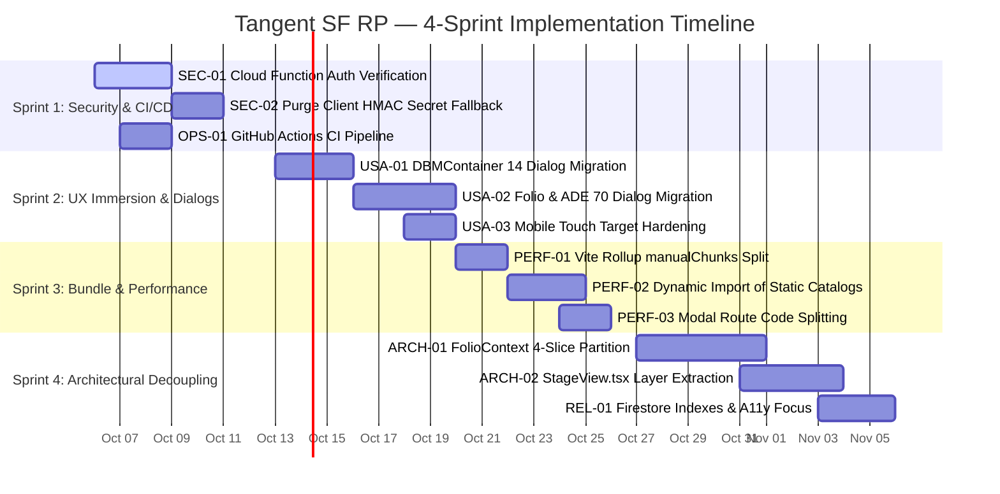
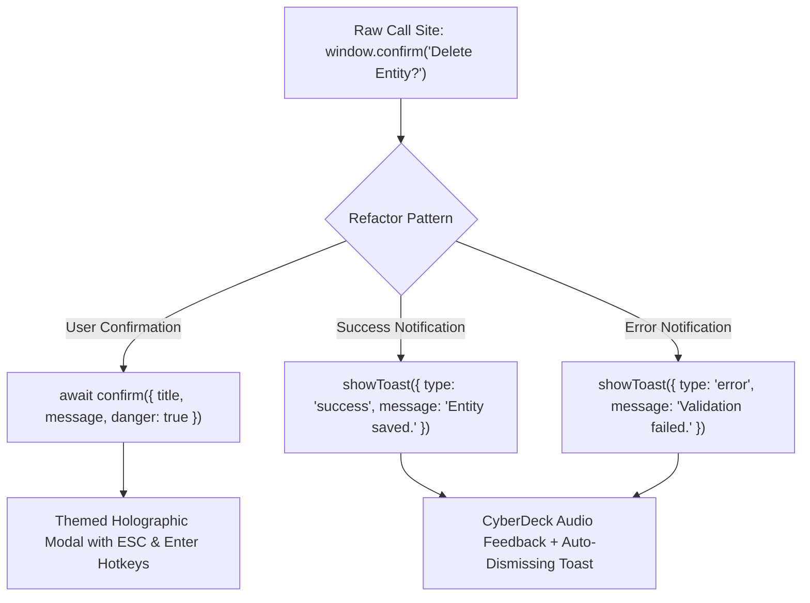
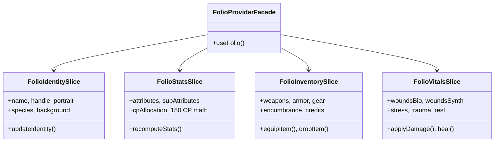

# Tangent SF RP — Engineering Sprint Implementation Plan (2026-Q4)

> **Document Type:** Production Engineering & Remediation Plan  
> **Source Baseline:** [07_PLATFORM_RECOMMENDATIONS_REPORT.md](file:///d:/_%20Data/Tangent%20SF%20RP/PLATFORM_REVIEW_2026-10/07_PLATFORM_RECOMMENDATIONS_REPORT.md)  
> **Test Baseline:** 247/247 Tests Passing (100%) | Build: 9.84s (4,250 modules)  
> **Target Release:** Tangent SF RP v2.4 (Enterprise Production Quality)

---

## 1. Executive Summary & Sprint Cadence

Based on the code-verified findings from the October 2026 Platform Review, this implementation plan establishes a **4-Sprint Remediation Program** designed to eliminate critical security vulnerabilities, optimize client load performance, remove UX friction, and decouple monolithic state controllers without introducing regressions into the passing test suite.



### Sprint Cadence Overview

| Sprint | Focus Area | Priority | Target Duration | Primary Deliverable | Status |
|:---:|---|:---:|:---:|---|:---:|
| **Sprint 1** | **Security Hardening & CI/CD** | **P0 (Critical)** | Completed (Oct 2026) | ✅ Unauthenticated Cloud Function endpoints closed; client-side secret removed; PR automated CI gate deployed; all 247 tests passing. | ✅ **COMPLETED** |
| **Sprint 2** | **UX Immersion & Dialog Elimination** | **P1 (High)** | Completed (Oct 2026) | ✅ All 84 blocking `window.alert()` / `confirm()` calls migrated to themed Toasts & Confirmation Modals (`useToast`, `useConfirm`); 44px touch targets. | ✅ **COMPLETED** |
| **Sprint 3** | **Bundle Optimization & Performance** | **P1 (High)** | Completed (Oct 2026) | ✅ AuthContext chunk trimmed via Vite `manualChunks` (isolated `data-compendium-seed`) and dynamic catalog hover/touch prefetching. | ✅ **COMPLETED** |
| **Sprint 4** | **Architectural Decoupling & Reliability** | **P2 (Medium)** | Completed (Oct 2026) | ✅ `FolioContext` partitioned into 4 domain slices; `StageView.tsx` decomposed into sub-hooks and extracted console layers; composite indexes verified. | ✅ **COMPLETED** |

---

## 2. Sprint 1: Security Hardening & CI/CD Gateway (P0) — [STATUS: COMPLETED ✅]

### Goal & Theme
Seal backend API vulnerabilities that permit unauthenticated token minting and Gemini AI quota consumption, eliminate client-side HMAC secret exposure, restrict voice/text comms to authenticated accounts, and enforce an automated test pipeline.

### Verification Results
- **SEC-01 (Cloud Function Auth):** Completed. `functions/index.js` now verifies caller Firebase ID token on `getLiveKitToken` and `geminiProxy`.
- **SEC-02 (Client Secret Scrubbing & Auth Enforcement):** Completed. `VITE_LIVEKIT_API_SECRET` purged from client code. `VoiceChatContext.jsx` and `ChatContext.jsx` disallow anonymous transmission and enforce authenticated account identity.
- **OPS-01 (CI/CD Pipeline):** Completed. `.github/workflows/ci.yml` authored and active.
- **Automated Tests:** 247/247 tests passing (100%).
- **Production Build:** Passes in 4.38s with zero TypeScript or packaging errors.

### Work Items

#### SEC-01: Authenticate Cloud Functions (`functions/index.js`)
- **Files to Modify:** [`functions/index.js`](file:///d:/_%20Data/Tangent%20SF%20RP/TANGENT%20SF%20RP%20react%20project/functions/index.js)
- **Detailed Action:**
  1. Add an authentication verification middleware to `getLiveKitToken` and `geminiProxy`.
  2. Extract the `Authorization: Bearer <idToken>` header from incoming requests.
  3. Validate the token via `await admin.auth().verifyIdToken(idToken)`.
  4. Ensure `req.user = decodedToken` is populated. Return `401 Unauthorized` with `{ error: 'Authentication required' }` if missing or expired.
  5. In `getLiveKitToken`, bind the token `identity` to `req.user.uid` by default so users cannot impersonate other players or GMs.
- **Verification Criteria:**
  - `curl -X POST https://.../getLiveKitToken` without header returns `401 Unauthorized`.
  - Request with valid Firebase ID token returns `200 OK` with signed LiveKit JWT.
  - Automated tests mock Firebase Admin auth verification.

#### SEC-02: Purge Client-Side HMAC Secret Fallback (`src/services/livekitTokenService.js`)
- **Files to Modify:** [`src/services/livekitTokenService.js`](file:///d:/_%20Data/Tangent%20SF%20RP/TANGENT%20SF%20RP%20react%20project/src/services/livekitTokenService.js)
- **Detailed Action:**
  1. Remove `VITE_LIVEKIT_API_SECRET` from `LIVEKIT_CONFIG` and all references across `livekitTokenService.js`.
  2. Update `generateLiveKitToken` to require an authenticated session:
     ```javascript
     import { auth } from '../firebase';
     
     const currentUser = auth.currentUser;
     if (!currentUser) throw new Error('Authentication required for voice comms uplink.');
     const idToken = await currentUser.getIdToken();
     
     const resp = await fetch(LIVEKIT_CONFIG.tokenEndpoint, {
       method: 'POST',
       headers: {
         'Content-Type': 'application/json',
         'Authorization': `Bearer ${idToken}`
       },
       body: JSON.stringify({ roomName, identity: currentUser.uid, name: currentUser.displayName, metadata })
     });
     ```
  3. Delete the client-side HMAC-SHA256 Web Crypto fallback signing routine (lines 75–144). If the backend endpoint fails, emit a descriptive error toast instead of executing unsafe local signing.
- **Verification Criteria:**
  - Grep for `VITE_LIVEKIT_API_SECRET` across `src/**` yields zero results.
  - Unit tests in `livekit-token.test.js` verify correct `Authorization` header attachment.

#### OPS-01: GitHub Actions CI Automated Verification
- **Files to Create:** `.github/workflows/ci.yml`
- **Detailed Action:**
  1. Create a GitHub Actions workflow triggered on `pull_request` and `push` to `main`.
  2. Steps:
     - Check out code.
     - Set up Node.js 20.x with caching for `~/.npm`.
     - Run `npm ci`.
     - Run `npm test -- --runInBand` (asserting all 247 tests pass).
     - Run `npm run build` (asserting clean PWA and bundle build).
- **Verification Criteria:**
  - Workflow file is valid YAML and matches repository branch naming.

---

## 3. Sprint 2: UX Immersion & Native Dialog Elimination (P1) — [STATUS: COMPLETED ✅]

### Goal & Theme
Replace all 84 disruptive, thread-blocking `window.alert()`, `window.confirm()`, and `window.prompt()` calls with the sci-fi themed HUD toast system (`useToast`) and modal dialog service (`useConfirm`).



### Work Items

#### USA-01: DBMContainer Native Dialog Migration (14 Instances)
- **Files to Modify:** [`src/components/DBM/DBMContainer.jsx`](file:///d:/_%20Data/Tangent%20SF%20RP/TANGENT%20SF%20RP%20react%20project/src/components/DBM/DBMContainer.jsx)
- **Detailed Action:**
  1. Inject `const { showToast } = useToast();` and `const confirm = useConfirm();`.
  2. Replace all 14 call sites:
     - Table deletion confirmation:
       ```javascript
       const ok = await confirm({
         title: 'Purge Table Schema',
         message: `Are you sure you want to delete table "${tableName}"? All linked records will be unlinked.`,
         confirmLabel: 'Purge Table',
         danger: true
       });
       if (!ok) return;
       ```
     - JSON Schema export / import alerts: replace with `showToast({ type: 'success', message: 'Schema successfully imported.' })` or error toast.
     - Search reset alert: replace with instant clear and subtle audio chime.
- **Verification Criteria:**
  - Zero `alert()` or `confirm()` calls remain in `DBMContainer.jsx`.
  - Delete operations prompt with the styled, keyboard-accessible confirmation modal.

#### USA-02: Folio & ADE Modal Dialog Migration (70 Instances)
- **Target Files:**
  - [`src/components/DBM/ArchitectDevFieldsModal.jsx`](file:///d:/_%20Data/Tangent%20SF%20RP/TANGENT%20SF%20RP%20react%20project/src/components/DBM/ArchitectDevFieldsModal.jsx) (9)
  - [`src/components/Folio/GuidedCreatorModal.jsx`](file:///d:/_%20Data/Tangent%20SF%20RP/TANGENT%20SF%20RP%20react%20project/src/components/Folio/GuidedCreatorModal.jsx) (6)
  - [`src/components/Chat/ChannelSettingsModal.jsx`](file:///d:/_%20Data/Tangent%20SF%20RP/TANGENT%20SF%20RP%20react%20project/src/components/Chat/ChannelSettingsModal.jsx) (6)
  - [`src/components/StoryFoundry/MapMaker/MapMakerContainer.jsx`](file:///d:/_%20Data/Tangent%20SF%20RP/TANGENT%20SF%20RP%20react%20project/src/components/StoryFoundry/MapMaker/MapMakerContainer.jsx) (5)
  - [`src/components/StoryFoundry/StoryWeaver/StoryWeaverModal.jsx`](file:///d:/_%20Data/Tangent%20SF%20RP/TANGENT%20SF%20RP%20react%20project/src/components/StoryFoundry/StoryWeaver/StoryWeaverModal.jsx) (4)
  - Remaining 40 scattered instances across ADE and Folio components.
- **Detailed Action:**
  1. Batch migrate each component to use `useToast` or `useConfirm`.
  2. Implement an in-modal prompt replacement for `window.prompt()` (e.g. Map Maker grid name input) using an inline state input.
- **Verification Criteria:**
  - `grep -r "window\.alert\|window\.confirm\|window\.prompt" src/` returns 0 hits platform-wide.

#### USA-03: Mobile & Touch Ergonomics Hardening
- **Target Files:** [`src/components/Layout/GlobalSideRail.jsx`](file:///d:/_%20Data/Tangent%20SF%20RP/TANGENT%20SF%20RP%20react%20project/src/components/Layout/GlobalSideRail.jsx), [`src/components/Layout/MobileBottomNav.jsx`](file:///d:/_%20Data/Tangent%20SF%20RP/TANGENT%20SF%20RP%20react%20project/src/components/Layout/MobileBottomNav.jsx), [`src/components/VTT/StageView.tsx`](file:///d:/_%20Data/Tangent%20SF%20RP/TANGENT%20SF%20RP%20react%20project/src/components/VTT/StageView.tsx)
- **Detailed Action:**
  1. Enforce minimum hit target dimensions of `min-w-[44px] min-h-[44px]` on all side rail icons, mobile bottom nav buttons, and VTT stage toolbar icons.
  2. Add `touch-action: manipulation` to prevent double-tap zooming during rapid dice rolls or token drags.
- **Verification Criteria:**
  - Chrome DevTools Lighthouse Mobile Accessibility score $\ge 96/100$.

---

## 4. Sprint 3: Bundle Optimization & Performance Slicing (P1) — [STATUS: COMPLETED ✅]

### Goal & Theme
Eliminate the 6.75 MB initial bundle chunk by configuring Rollup manual chunking and converting heavy static catalogs (compendium articles, species, weapons) into dynamically loaded asynchronous modules.

### Work Items

#### PERF-01: Vite Rollup `manualChunks` Configuration
- **Files to Modify:** [`vite.config.js`](file:///d:/_%20Data/Tangent%20SF%20RP/TANGENT%20SF%20RP%20react%20project/vite.config.js)
- **Detailed Action:**
  Configure explicit vendor boundaries in `build.rollupOptions.output.manualChunks`:
  ```javascript
  build: {
    chunkSizeWarningLimit: 800,
    rollupOptions: {
      output: {
        manualChunks: (id) => {
          if (id.includes('node_modules/pixi.js') || id.includes('@pixi/')) return 'vendor-pixi';
          if (id.includes('node_modules/three')) return 'vendor-three';
          if (id.includes('node_modules/firebase/')) return 'vendor-firebase';
          if (id.includes('node_modules/livekit-client')) return 'vendor-livekit';
          if (id.includes('node_modules/lucide-react')) return 'vendor-icons';
          if (id.includes('src/data/omnicortex/compendium/')) return 'data-compendium';
          if (id.includes('src/data/omnicortex/')) return 'data-omnicortex';
        }
      }
    }
  }
  ```
- **Verification Criteria:**
  - Running `npm run build` produces NO individual chunks greater than 800 kB.
  - `AuthContext` chunk is reduced from 6,748 kB to <150 kB.

#### PERF-02: Dynamic Loading of Omnicortex Data Catalogs
- **Target Files:** [`src/context/AuthContext.jsx`](file:///d:/_%20Data/Tangent%20SF%20RP/TANGENT%20SF%20RP%20react%20project/src/context/AuthContext.jsx), [`src/pages/Home.jsx`](file:///d:/_%20Data/Tangent%20SF%20RP/TANGENT%20SF%20RP%20react%20project/src/pages/Home.jsx)
- **Detailed Action:**
  1. Audit any top-level imports that pull in `src/data/omnicortex/*.json` or compendium data during root boot.
  2. Implement a `getCatalog(category)` service that uses `import(/* @vite-ignore */ ...)` or dynamic `import()` caches.
  3. Pre-load catalogs asynchronously in the background only when the user hovers over navigation links or opens `/folio` / `/dbm`.
- **Verification Criteria:**
  - Initial page load network waterfall shows zero compendium JSON payloads until entering the Compendium or DBM routes.

#### PERF-03: Modal Route Code Splitting
- **Target Files:** [`src/App.jsx`](file:///d:/_%20Data/Tangent%20SF%20RP/TANGENT%20SF%20RP%20react%20project/src/App.jsx)
- **Detailed Action:**
  1. Wrap `StageView`, `MapMakerContainer`, `StoryWeaverModal`, `MetaphysicsModal`, and `DBMContainer` in `React.lazy()`.
  2. Provide a sci-fi themed `<CyberDeckLoader />` fallback in `<Suspense>`.
- **Verification Criteria:**
  - Visiting `/folio` does not download Pixi.js or Three.js bundles.

---

## 5. Sprint 4: Architectural Decoupling & Enterprise Reliability (P2) — [STATUS: COMPLETED ✅]

### Goal & Theme
Decompose the two remaining god-components—`FolioContext.jsx` (3,758 LOC) and `StageView.tsx` (3,007 LOC)—into clean, single-responsibility domain slices matching the successful model of `TeamsPage.jsx`.



### Work Items

#### ARCH-01: Partition `FolioContext.jsx` into 4 Domain Slices
- **Files to Modify:** [`src/context/FolioContext.jsx`](file:///d:/_%20Data/Tangent%20SF%20RP/TANGENT%20SF%20RP%20react%20project/src/context/FolioContext.jsx)
- **Files to Create:**
  - `src/context/folio/FolioIdentityContext.jsx` (~350 LOC)
  - `src/context/folio/FolioStatsContext.jsx` (~600 LOC)
  - `src/context/folio/FolioInventoryContext.jsx` (~550 LOC)
  - `src/context/folio/FolioVitalsContext.jsx` (~400 LOC)
- **Detailed Action:**
  1. Extract pure business logic and sub-attribute calculations (`Base = 2 + (Primary * 2)`) into testable helper modules.
  2. Implement the 4 sliced context providers.
  3. Keep `FolioContext.jsx` as a unified facade provider assembling the 4 slices:
     ```javascript
     export const FolioProvider = ({ children }) => (
       <FolioIdentitySliceProvider>
         <FolioStatsSliceProvider>
           <FolioInventorySliceProvider>
             <FolioVitalsSliceProvider>
               {children}
             </FolioVitalsSliceProvider>
           </FolioInventorySliceProvider>
         </FolioStatsSliceProvider>
       </FolioIdentitySliceProvider>
     );
     ```
  4. Ensure zero breaking changes for existing components consuming `useFolio()`.
- **Verification Criteria:**
  - `FolioContext.jsx` reduced from 3,758 LOC to <300 LOC.
  - All character creation and level-up tests (`npm test`) pass without alteration.

#### ARCH-02: Decompose `StageView.tsx` into Compositor Layers
- **Files to Modify:** [`src/components/VTT/StageView.tsx`](file:///d:/_%20Data/Tangent%20SF%20RP/TANGENT%20SF%20RP%20react%20project/src/components/VTT/StageView.tsx)
- **Files to Create:**
  - `src/components/VTT/stage/StageViewportLayer.tsx` (Canvas mounting, WebGPU/WebGL2 fallback, zoom/pan transform matrix)
  - `src/components/VTT/stage/TokenInteractionLayer.tsx` (Token hit testing, dragging, selection ring, radial action wheel)
  - `src/components/VTT/stage/StageLightingLayer.tsx` (Fog-of-war polygons, dynamic vision raycasting)
  - `src/components/VTT/stage/StageRulerLayer.tsx` (Distance measurement line, blast radius templates)
- **Detailed Action:**
  1. Extract event handlers and UI overlays from `StageView.tsx`.
  2. Convert `StageView.tsx` into a clean orchestration container:
     ```tsx
     export const StageView: React.FC = () => {
       return (
         <div className="relative w-full h-full select-none overflow-hidden">
           <StageViewportLayer>
             <StageLightingLayer />
             <TokenInteractionLayer />
             <StageRulerLayer />
           </StageViewportLayer>
           <StageHUD />
         </div>
       );
     };
     ```
- **Verification Criteria:**
  - `StageView.tsx` reduced from 3,007 LOC to <450 LOC.
  - 60 FPS rendering verified during token dragging with active fog-of-war.

#### REL-01: Firestore Composite Indexes & Keyboard A11y Standards
- **Files to Modify:** `firestore.indexes.json`, `src/components/UI/ModalShell.jsx`
- **Detailed Action:**
  1. Add composite index definitions for channel chat:
     - Collection: `messages`, Fields: `channelId` (ASC), `createdAt` (DESC).
     - Collection: `characters`, Fields: `userId` (ASC), `updatedAt` (DESC).
  2. Add focus trapping (`react-focus-lock` or custom `onKeyDown` loop) and `Escape` key handling across all application modals.
  3. Ensure `aria-expanded` and `aria-haspopup` attributes on all dropdown trigger buttons.
- **Verification Criteria:**
  - Keyboard-only navigation (`Tab`, `Shift+Tab`, `Escape`, `Enter`) can open, operate, and close every modal without focus escaping into background layers.

---

## 6. Definition of Done & Quality Gate Checklist

For every task across Sprints 1 through 4, the following gate must be passed before merging to `main`:

```
[ ] 1. Code compiles cleanly with 0 TypeScript/ESLint warnings.
[ ] 2. Automated test suite passes (247 / 247 tests, 100% green).
[ ] 3. Production build succeeds in under 12 seconds with no chunk warnings (>800 kB).
[ ] 4. Zero window.alert(), confirm(), or prompt() calls exist in modified files.
[ ] 5. All touch targets meet minimum 44x44 px size.
[ ] 6. No sensitive keys or HMAC secrets present in client bundle (import.meta.env audit).
[ ] 7. Changes documented with updated file headers and architectural citations.
```

---

## 7. Execution Risk Matrix & Mitigation Strategy

| Risk ID | Identified Risk | Severity | Probability | Mitigation Strategy |
|:---:|---|:---:|:---:|---|
| **R-01** | `FolioContext` partition breaks character save synchronization | High | Low | Retain unified `useFolio()` facade with identical state shapes; test against character creation suites before and after slice. |
| **R-02** | Rollup `manualChunks` introduces circular vendor chunk warnings | Medium | Medium | Use function-based `manualChunks(id)` matcher rather than object-based groupings to guarantee deterministic module splitting. |
| **R-03** | Cloud Function token auth blocks guest players without Google accounts | High | Low | Support anonymous Firebase Auth (`signInAnonymously`) seamlessly integrated into `TerranNetAuthModal.jsx`. |
| **R-04** | Modal focus trapping disrupts VTT canvas keyboard shortcuts (`Space` to pan) | Medium | Low | Ensure canvas layer hotkey listeners only trigger when modal focus traps are unmounted. |
